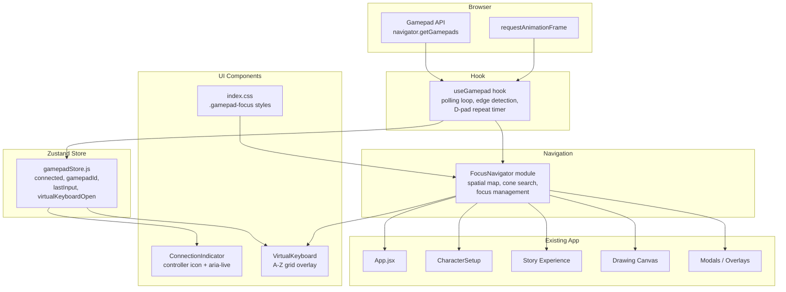

# Design Document: Gamepad Controller Support

## Overview

This feature adds gamepad/controller support to Twin Spark Chronicles as an additive input layer alongside existing keyboard, mouse, and touch inputs. The implementation uses the browser Gamepad API (`navigator.getGamepads()`) and targets standard HID gamepads (SNES-style USB, 8BitDo, generic USB controllers).

The architecture follows the app's existing patterns: a Zustand store for gamepad connection/input state, a custom React hook (`useGamepad`) for the polling loop and event dispatch, a pure-logic `FocusNavigator` module for spatial navigation, a `VirtualKeyboard` React component for on-screen text entry, and a `ConnectionIndicator` component for visual feedback. CSS additions to `index.css` provide the gamepad-focus highlight styles using existing CSS custom properties.

Key design decisions:
- **Polling via `requestAnimationFrame`** — the Gamepad API requires active polling; we start/stop the rAF loop on connect/disconnect to avoid idle CPU usage
- **Spatial navigation with cone-based nearest-neighbor** — a 120-degree directional cone from the focused element's center finds the closest focusable target, matching how children intuitively expect D-pad navigation to work
- **CSS-first highlight** — a `.gamepad-focus` class with `var(--color-gold)` ring and glow, respecting `prefers-reduced-motion`
- **Virtual keyboard as overlay** — a simple A-Z grid with backspace/space/done keys, sized at 48px minimum targets to match the app's child-friendly design

## Architecture



**Data flow:**
1. `useGamepad()` hook listens for `gamepadconnected`/`gamepaddisconnected` events and updates `gamepadStore`
2. When connected, the hook starts a `requestAnimationFrame` polling loop that reads gamepad state each frame
3. The hook performs edge detection (button press transitions) and D-pad repeat logic, then calls `FocusNavigator` methods
4. `FocusNavigator` queries the DOM for focusable elements, computes spatial relationships, and moves native DOM focus
5. The `.gamepad-focus` CSS class is applied/removed by `FocusNavigator` to render the highlight ring
6. `ConnectionIndicator` reads `gamepadStore.connected` to show/hide the controller icon
7. `VirtualKeyboard` opens when a text input receives gamepad confirm, managed via `gamepadStore.virtualKeyboardOpen`

## Components and Interfaces

### 1. `gamepadStore.js` (Zustand Store)

Location: `frontend/src/stores/gamepadStore.js`

```javascript
// State shape
{
  connected: false,          // boolean — is a gamepad currently connected
  gamepadIndex: null,        // number | null — index from navigator.getGamepads()
  gamepadId: '',             // string — gamepad.id for display/debug
  virtualKeyboardOpen: false,// boolean — is the virtual keyboard overlay showing
  virtualKeyboardTarget: null,// string | null — CSS selector or ref ID of the target input
}

// Actions
connect(index, id)           // register gamepad
disconnect()                 // clear gamepad state
openVirtualKeyboard(targetId)// show VK overlay for a specific input
closeVirtualKeyboard()       // hide VK overlay
```

### 2. `useGamepad()` Hook

Location: `frontend/src/shared/hooks/useGamepad.js`

Responsibilities:
- Listen for `gamepadconnected` / `gamepaddisconnected` window events
- Start/stop `requestAnimationFrame` polling loop
- Read `navigator.getGamepads()[index]` each frame
- Normalize D-pad from both `axes[0]/axes[1]` (deadzone 0.5) and buttons 12-15
- Track previous frame button states for edge detection
- Implement D-pad repeat: 400ms initial delay, then 150ms repeat
- Call `FocusNavigator.move(direction)` on D-pad events
- Call `FocusNavigator.confirm()` on A button press edge
- Call `FocusNavigator.cancel()` on B button press edge
- Call `FocusNavigator.menu()` on Start button press edge

```javascript
// Public API
useGamepad()  // no params — call once in App.jsx
// Returns nothing — side-effect only hook
```

### 3. `FocusNavigator` Module

Location: `frontend/src/shared/hooks/FocusNavigator.js`

A stateful singleton (module-level state) that manages spatial focus navigation.

```javascript
// Constants
FOCUSABLE_SELECTOR = 'button:not([disabled]), [role="button"]:not([disabled]), a[href], input:not([disabled]), select:not([disabled]), .wizard-card, .dp-bubble:not([disabled]), [data-gamepad-focusable]'
CONE_ANGLE = 120  // degrees

// Module state
currentFocusedElement = null
previousFocusBeforeModal = null
isGamepadActive = false

// Public API
activate()                    // called on gamepad connect
deactivate()                  // called on gamepad disconnect — removes all .gamepad-focus classes
move(direction)               // 'up' | 'down' | 'left' | 'right' — spatial navigation
confirm()                     // triggers click on focused element, or opens VK if input
cancel()                      // triggers back/close action contextually
menu()                        // toggles parent controls overlay
setInitialFocus()             // scans DOM, focuses first logical element
trapFocus(containerEl)        // restrict navigation to modal container
releaseFocusTrap()            // restore pre-modal focus
syncToElement(el)             // update gamepad focus to match a mouse/touch click target
```

**Spatial search algorithm:**
1. Get bounding rect center `(cx, cy)` of current focused element
2. Query all visible focusable elements
3. For each candidate, compute vector from current center to candidate center
4. Filter candidates within a 120° cone in the pressed direction
5. Select the candidate with the smallest Euclidean distance
6. If no candidate found, keep current focus (no wrapping)

### 4. `VirtualKeyboard` Component

Location: `frontend/src/features/setup/components/VirtualKeyboard.jsx`

```jsx
// Props
{
  targetValue: string,        // current input value
  onCharacter: (char) => void,// append character
  onBackspace: () => void,    // remove last character
  onDone: () => void,         // close and confirm
  onCancel: () => void,       // close without changes
}
```

Layout: 7 columns × 4 rows of A-Z keys + bottom row with ← (backspace), ␣ (space), ✓ (done). Each key is a `<button>` with `min-width: 48px; min-height: 48px`. The grid uses `role="grid"` with `role="row"` and `role="gridcell"` for accessibility. An `aria-label="Virtual keyboard"` is set on the overlay container.

The current typed value is displayed above the grid in a read-only display area.

### 5. `ConnectionIndicator` Component

Location: `frontend/src/shared/components/ConnectionIndicator.jsx`

A small fixed-position icon (bottom-right corner) that shows a gamepad SVG icon when `gamepadStore.connected` is true. Includes an `aria-live="polite"` region that announces "Controller connected" / "Controller disconnected".

```jsx
// No props — reads from gamepadStore directly
```

### 6. CSS Additions to `index.css`

```css
/* Gamepad focus highlight */
.gamepad-focus {
  outline: 3px solid var(--color-gold);
  outline-offset: 3px;
  box-shadow: 0 0 20px rgba(251, 191, 36, 0.5);
  border-radius: 8px;
  animation: gamepad-pulse 1.5s ease-in-out infinite;
}

@keyframes gamepad-pulse {
  0%, 100% { opacity: 1; }
  50%      { opacity: 0.7; }
}

@media (prefers-reduced-motion: reduce) {
  .gamepad-focus {
    animation: none !important;
    opacity: 1;
  }
}
```

## Data Models

### Gamepad Store State

| Field | Type | Default | Description |
|-------|------|---------|-------------|
| `connected` | `boolean` | `false` | Whether a gamepad is currently connected |
| `gamepadIndex` | `number \| null` | `null` | Index in `navigator.getGamepads()` array |
| `gamepadId` | `string` | `''` | The `Gamepad.id` string from the browser |
| `virtualKeyboardOpen` | `boolean` | `false` | Whether the virtual keyboard overlay is showing |
| `virtualKeyboardTarget` | `string \| null` | `null` | Identifier of the input field the VK is editing |

### FocusNavigator Internal State

| Field | Type | Default | Description |
|-------|------|---------|-------------|
| `currentFocusedElement` | `Element \| null` | `null` | The DOM element currently highlighted |
| `previousFocusBeforeModal` | `Element \| null` | `null` | Saved focus for modal trap/restore |
| `isGamepadActive` | `boolean` | `false` | Whether gamepad navigation is active |
| `focusTrapContainer` | `Element \| null` | `null` | Container element for modal focus trapping |

### useGamepad Hook Internal State

| Field | Type | Description |
|-------|------|-------------|
| `prevButtons` | `boolean[]` | Previous frame's button pressed states (length 17) |
| `prevAxes` | `number[]` | Previous frame's axis values |
| `dpadRepeatTimers` | `{ direction: string, startTime: number, lastRepeatTime: number } \| null` | Tracks D-pad hold for repeat logic |
| `rafId` | `number \| null` | `requestAnimationFrame` handle for cleanup |

### Virtual Keyboard Grid Layout

```
Q  W  E  R  T  Y  U
I  O  P  A  S  D  F
G  H  J  K  L  Z  X
C  V  B  N  M  ←  ␣
         ✓ Done
```

Each key: `48px × 48px` minimum, `role="gridcell"`, with `aria-label` for special keys (backspace = "Delete last letter", space = "Space", done = "Done").


## Correctness Properties

*A property is a characteristic or behavior that should hold true across all valid executions of a system — essentially, a formal statement about what the system should do. Properties serve as the bridge between human-readable specifications and machine-verifiable correctness guarantees.*

### Property 1: Connect/disconnect round trip

*For any* gamepad connection event followed by a disconnection event, the gamepadStore state should return to its initial state (`connected: false`, `gamepadIndex: null`, `gamepadId: ''`), and no rAF polling loop should remain active.

**Validates: Requirements 1.1, 1.2**

### Property 2: No polling when disconnected

*For any* state where `gamepadStore.connected` is `false`, the useGamepad hook should not have an active `requestAnimationFrame` callback scheduled (rafId should be null).

**Validates: Requirements 1.5**

### Property 3: D-pad normalization

*For any* gamepad state object, the normalized D-pad direction should be identical whether the direction is expressed via `axes[0]/axes[1]` exceeding the 0.5 deadzone threshold or via digital buttons 12-15 being pressed. Axis values within the deadzone (absolute value ≤ 0.5) should produce no directional output.

**Validates: Requirements 2.2, 2.3**

### Property 4: Button edge detection

*For any* button index and any sequence of two consecutive frame states (previous and current), an event should fire if and only if the button transitions from released (`false`) to pressed (`true`). A button that remains held across frames should not produce additional events.

**Validates: Requirements 2.5, 2.6, 2.7, 2.8**

### Property 5: Cone-based spatial navigation

*For any* set of focusable element positions (as `{x, y}` centers), a current focus position, and a direction (`up`, `down`, `left`, `right`), the selected next-focus element should be: (a) within a 120-degree cone centered on the pressed direction from the current position, and (b) the closest element by Euclidean distance among all candidates in that cone. If no candidates exist in the cone, the current focus position should remain unchanged.

**Validates: Requirements 3.1, 3.2, 3.3**

### Property 6: Focus state invariant

*For any* focus transition while the gamepad is active, exactly one DOM element should have the `gamepad-focus` CSS class, and that element should equal `document.activeElement` (native browser focus is synced with the gamepad highlight).

**Validates: Requirements 3.6, 4.1, 4.3, 12.4**

### Property 7: No gamepad-focus when disconnected

*For any* DOM state while `gamepadStore.connected` is `false`, zero elements in the document should have the `gamepad-focus` CSS class.

**Validates: Requirements 4.5**

### Property 8: Confirm triggers click

*For any* focusable element that currently has gamepad focus, calling `FocusNavigator.confirm()` should dispatch a `click` event on that element (verifiable by a click event listener receiving exactly one call).

**Validates: Requirements 5.1, 6.6, 8.4, 9.2**

### Property 9: Virtual keyboard character round trip

*For any* input value string and any letter character, appending that character via the virtual keyboard's `onCharacter` callback and then immediately invoking `onBackspace` should produce the original input value string.

**Validates: Requirements 7.4, 7.5**

### Property 10: Virtual keyboard opens for input elements

*For any* DOM element that is an `<input>` or `<textarea>` and currently has gamepad focus, calling `FocusNavigator.confirm()` should set `gamepadStore.virtualKeyboardOpen` to `true` instead of dispatching a click event.

**Validates: Requirements 7.1**

### Property 11: B-cancel preserves virtual keyboard input value

*For any* input value string displayed in the virtual keyboard, pressing B (cancel) to close the virtual keyboard should leave the input field's value unchanged from what it was at the moment B was pressed.

**Validates: Requirements 7.7**

### Property 12: Confirm disabled during loading

*For any* story choice button that is in a disabled state (during content generation), calling `FocusNavigator.confirm()` should not dispatch a click event on that button.

**Validates: Requirements 8.5**

### Property 13: Modal focus trap

*For any* sequence of directional navigation events while a modal focus trap is active, the focused element should always be a descendant of the modal container element. Navigation should never escape the modal boundary.

**Validates: Requirements 10.1**

### Property 14: Modal focus restore round trip

*For any* element that has gamepad focus when a modal opens, after the modal is closed, that same element should receive gamepad focus again (provided it is still in the DOM).

**Validates: Requirements 10.4**

### Property 15: Click sync updates gamepad focus

*For any* focusable element that receives a mouse click or touch tap while the gamepad is active and a different element has the `gamepad-focus` class, the `gamepad-focus` class should move to the clicked element and `document.activeElement` should match.

**Validates: Requirements 11.3**

## Error Handling

| Scenario | Handling |
|----------|----------|
| Browser lacks Gamepad API (`navigator.getGamepads` undefined) | `useGamepad` checks for API support on mount; if absent, returns immediately without registering any event listeners or polling. No errors thrown. |
| Gamepad disconnects mid-poll | The rAF callback checks `navigator.getGamepads()[index]` for null/undefined each frame. If the gamepad object is gone, it triggers the disconnect flow (clear store, deactivate FocusNavigator). |
| `navigator.getGamepads()` returns stale/null entries | Each frame, the hook validates the gamepad object exists and has a `buttons` array before reading state. Invalid entries are skipped. |
| FocusNavigator finds zero focusable elements on screen | `setInitialFocus()` gracefully handles empty query results — no focus is set, no error thrown. Navigation events become no-ops until elements appear. |
| Virtual keyboard target input removed from DOM | `closeVirtualKeyboard()` checks if the target element still exists before restoring focus. Falls back to `setInitialFocus()` if the element is gone. |
| Multiple gamepads connected simultaneously | Only the first connected gamepad is tracked. Subsequent `gamepadconnected` events are ignored while `gamepadStore.connected` is already `true`. |
| Focus trap container removed from DOM unexpectedly | `releaseFocusTrap()` validates the saved previous-focus element exists before restoring. Falls back to `setInitialFocus()`. |

## Testing Strategy

### Property-Based Tests

Use **fast-check** (`fc`) as the property-based testing library for JavaScript. Each property test runs with `numRuns: 20` as specified.

Each property from the Correctness Properties section maps to exactly one property-based test. Tests are tagged with comments referencing the design property:

```javascript
// Feature: gamepad-controller-support, Property 3: D-pad normalization
test.prop([fc.float({ min: -1, max: 1 }), fc.float({ min: -1, max: 1 })], { numRuns: 20 })(
  'normalized direction matches for analog and digital inputs',
  (axisX, axisY) => { /* ... */ }
);
```

Property tests focus on:
- Pure logic functions (D-pad normalization, cone-based spatial search, edge detection)
- State transitions (store connect/disconnect, virtual keyboard open/close)
- Invariants (focus state consistency, modal trap boundaries)

### Unit Tests

Unit tests complement property tests for specific examples, edge cases, and integration points:

- **ConnectionIndicator rendering**: renders icon when `connected=true`, hides when `false`
- **VirtualKeyboard layout**: renders all 26 letters + backspace + space + done
- **VirtualKeyboard accessibility**: has `role="grid"`, `aria-label`, correct key `aria-label`s
- **Reduced motion**: `.gamepad-focus` has no animation when `prefers-reduced-motion: reduce`
- **Aria-live announcements**: ConnectionIndicator announces connect/disconnect text
- **D-pad repeat timing**: 400ms initial delay, 150ms repeat (time-mocked)
- **Wizard step initial focus**: name step focuses input, gender step focuses first card
- **Modal B-button dismiss**: pressing B while modal open triggers close callback
- **Canvas focus exclusion**: D-pad events are no-ops when canvas has pointer focus
- **No-API graceful degradation**: useGamepad does nothing when `navigator.getGamepads` is undefined

### Test File Locations

- `frontend/src/stores/__tests__/gamepadStore.test.js` — store state transitions
- `frontend/src/shared/hooks/__tests__/useGamepad.test.js` — hook polling, edge detection, repeat
- `frontend/src/shared/hooks/__tests__/FocusNavigator.test.js` — spatial navigation, focus management
- `frontend/src/features/setup/components/__tests__/VirtualKeyboard.test.js` — VK rendering, interaction
- `frontend/src/shared/components/__tests__/ConnectionIndicator.test.js` — indicator rendering, a11y

### Test Configuration

- Testing framework: Vitest + React Testing Library
- Property-based testing: fast-check with `numRuns: 20`
- Each property-based test tagged: `Feature: gamepad-controller-support, Property {N}: {title}`
- Gamepad API mocked via `Object.defineProperty(navigator, 'getGamepads', ...)`
- `requestAnimationFrame` mocked with manual frame stepping for polling tests
