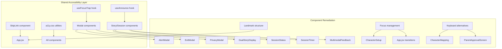

# Design Document: Accessibility Audit

## Overview

This design covers a systematic accessibility remediation of the Twin Spark Chronicles React frontend, targeting WCAG 2.1 AA compliance. The app currently has a dark "night-sky" theme with glassmorphism panels, uses emoji-heavy UI designed for 6-year-olds, and relies on voice, camera, touch, and drag-and-drop interactions. While some `aria-label` attributes exist on buttons and a basic `prefers-reduced-motion` rule is in place, the app lacks semantic landmarks, focus traps on modals, live regions for dynamic content, keyboard alternatives for drag-and-drop, and consistent focus management during screen transitions.

The remediation is entirely frontend — no backend changes required. All work targets the existing React component tree and CSS design system in `frontend/src/`.

### Key Findings from Codebase Research

1. **No semantic landmarks**: `App.jsx` renders a flat `<AppContainer>` div with no `<main>`, `<nav>`, or `<section>` elements. Heading hierarchy is a single `<h1>` with `<h2>` in wizard steps, but no landmark wrapping.
2. **Modals lack dialog semantics**: `AlertModal`, `ExitModal`, and `PrivacyModal` use plain `<div>` overlays with no `role="dialog"`, `aria-modal`, focus trap, or Escape key handling. Background content is not hidden with `aria-hidden`.
3. **No live regions for dynamic content**: `SessionStatus` renders connection state as a styled `<p>` with no `aria-live`. `SessionTimer` warning overlay has no screen reader announcement. Story beat arrivals are not announced.
4. **Drag-and-drop only partially accessible**: `CharacterMapping` has a `handleTapAssign` click handler as a tap alternative, but face chips are not keyboard-focusable (`<div draggable>` without `tabIndex` or `role="button"`), and no live region announces assignment changes.
5. **Parent gate not keyboard-accessible**: `ParentApprovalScreen` uses `onPointerDown`/`onPointerUp` for the 3-second hold. It has `tabIndex={0}` and `role="button"` but no keyboard event handlers for Enter/Space hold.
6. **No skip navigation link**: The DOM starts with settings buttons, not a skip link.
7. **Focus not managed on transitions**: Wizard steps auto-focus the name input, but gender/spirit steps don't receive focus. Screen transitions (setup → story) don't move focus.
8. **Existing `prefers-reduced-motion` rule**: `index.css` already has a `@media (prefers-reduced-motion: reduce)` rule that kills all animations, but it's too aggressive (sets duration to `0.01ms`). Essential transitions should be preserved at ≤200ms.
9. **Focus indicator exists**: A global `*:focus-visible` rule with `3px solid var(--color-gold)` outline is present — good baseline, but contrast against the dark background needs verification.
10. **Touch targets**: The design system defines `--touch-min: 56px` (52px on mobile), which exceeds the 44px WCAG minimum. Most buttons use this, but some inline controls (face name buttons, label save buttons) are smaller.

## Architecture

The remediation follows a layered approach, introducing shared accessibility utilities and hooks that individual components consume. No new top-level components are added — changes are applied within existing components.



### Strategy

1. **Shared hooks**: `useFocusTrap` for modal focus containment, `useAnnounce` for live region announcements.
2. **Landmark injection**: Wrap existing JSX in `<main>`, `<section>`, `<nav>` elements within `App.jsx` and child components.
3. **Component-level fixes**: Each component receives targeted accessibility attributes, keyboard handlers, and ARIA properties.
4. **CSS layer**: A new `a11y.css` file for skip link styles, reduced-motion refinements, focus indicator adjustments, and touch target minimums.

## Components and Interfaces

### New Shared Utilities

#### `useFocusTrap(ref, isActive)` — Custom Hook

**Location**: `frontend/src/shared/hooks/useFocusTrap.js`

Traps Tab/Shift+Tab cycling within a container ref. Handles Escape key to call an `onClose` callback. Moves focus to the first focusable element on activation. Restores focus to the previously focused element on deactivation.

```jsx
function useFocusTrap(containerRef, isActive, onClose) {
  // Returns nothing — side-effect only hook
  // On activate: store document.activeElement, focus first focusable child
  // On keydown Tab: cycle within container
  // On keydown Escape: call onClose
  // On deactivate: restore previously focused element
}
```

#### `useAnnounce()` — Custom Hook

**Location**: `frontend/src/shared/hooks/useAnnounce.js`

Returns an `announce(message, priority)` function that injects text into a global ARIA live region. Priority is `"polite"` or `"assertive"`.

```jsx
function useAnnounce() {
  return { announce: (message, priority = 'polite') => void }
}
```

The hook renders (or reuses) a visually hidden `<div>` with `aria-live` at the document root. Messages are set via textContent and cleared after a short delay to allow re-announcement of identical messages.

#### `SkipLink` — Component

**Location**: `frontend/src/shared/components/SkipLink.jsx`

A visually hidden anchor that becomes visible on focus. Targets `#main-content`.

```jsx
<a href="#main-content" className="skip-link">Skip to main content</a>
```

### Modified Components

#### `App.jsx` Changes
- Add `<SkipLink />` as first child
- Wrap story stage in `<main id="main-content" aria-label="Story experience">`
- Wrap session controls in `<nav aria-label="Session controls">`
- Ensure single `<h1>` and sequential heading levels
- Manage focus on setup → story transition (focus the `<main>` element)
- Set `aria-hidden="true"` on background content when modals are open

#### `AlertModal`, `ExitModal`, `PrivacyModal` Changes
- Add `role="dialog"`, `aria-modal="true"`, `aria-labelledby` (pointing to heading)
- Use `useFocusTrap` hook
- Add Escape key dismissal
- Set `aria-hidden="true"` on sibling content via portal or prop

#### `CharacterSetup.jsx` Changes
- Wrap each wizard step in `<section aria-label="Step: {stepName}">`
- Move focus to heading or first interactive element on step transition
- Add `<label htmlFor>` on name input
- Add `aria-describedby` for validation errors
- Add `aria-invalid="true"` on empty name submission
- Ensure wizard cards (gender, spirit) have `role="button"` and keyboard activation (already `<button>` elements — verified)

#### `DualStoryDisplay.jsx` Changes
- Add `aria-live="polite"` region for story narration text
- Replace generic `alt="Story scene"` with descriptive alt text (use scene description from story beat data if available, fallback to "Story scene illustration")
- Wrap in `<section aria-label="Story experience">`

#### `SessionStatus.jsx` Changes
- Add `aria-live="assertive"` and `role="status"` to the status text element

#### `SessionTimer.jsx` Changes
- Add `aria-live="assertive"` announcement when reaching 5-minute warning
- Add `aria-live="assertive"` announcement when timer reaches zero
- Use `useAnnounce` hook for programmatic announcements

#### `CharacterMapping.jsx` Changes
- Add `tabIndex={0}`, `role="button"`, `aria-label` to each face chip `<div>`
- Add `onKeyDown` handler for Enter/Space to trigger tap-to-assign
- Add `tabIndex={0}`, `role="button"` to role slots for keyboard drop targets
- Use `useAnnounce` to announce assignment changes (e.g., "Dragon assigned to protagonist 1")
- Add `aria-label` describing current slot state

#### `ParentApprovalScreen.jsx` Changes
- Add `onKeyDown` handler for Enter/Space hold (start timer on keydown, clear on keyup)
- Announce hold progress at 1-second intervals via `useAnnounce` ("1 of 3 seconds", etc.)
- Announce "Parent review unlocked" on gate open
- Move focus to first review item or completion message after unlock

#### `MultimodalFeedback.jsx` Changes
- Already has `aria-live` regions — verify `polite` on transcript bubble (confirmed)
- Ensure transcript text is announced (currently uses `role="status"` — good)

#### `CameraPreview.jsx` Changes
- Add descriptive `aria-label` on video element: "Live camera preview showing your face"
- Already has `aria-label="Camera preview"` on container — update to be more descriptive

#### `PhotoUploader.jsx` Changes
- Add `aria-live="polite"` announcement on upload success/failure
- Associate error messages with interactive elements via `aria-describedby`

#### `PhotoGallery.jsx` Changes
- Update photo thumbnail `alt` text to include face count and labeled names
- Add `<label htmlFor>` on face name input
- Associate error messages via `aria-describedby`
- Ensure face bounding boxes use border style variation (dashed vs solid) in addition to color

#### `ContinueScreen.jsx` Changes
- Move focus to greeting heading on mount
- Disable sparkle glow and bounce animations when `prefers-reduced-motion: reduce`

#### `MagicMirror.jsx` Changes
- Ensure gesture prompt text has accessible labeling

### CSS Changes

#### `a11y.css` — New File

**Location**: `frontend/src/a11y.css`

```css
/* Skip link */
.skip-link {
  position: absolute;
  left: -9999px;
  top: auto;
  width: 1px;
  height: 1px;
  overflow: hidden;
  z-index: 10001;
}
.skip-link:focus {
  position: fixed;
  top: 8px;
  left: 8px;
  width: auto;
  height: auto;
  padding: 12px 24px;
  background: var(--color-bg-deep);
  color: var(--color-gold);
  border: 2px solid var(--color-gold);
  border-radius: var(--radius-md);
  font-size: 1rem;
  font-weight: 600;
  z-index: 10001;
}

/* Visually hidden but accessible */
.sr-only {
  position: absolute;
  width: 1px;
  height: 1px;
  padding: 0;
  margin: -1px;
  overflow: hidden;
  clip: rect(0, 0, 0, 0);
  white-space: nowrap;
  border: 0;
}

/* Minimum touch target enforcement */
.touch-target-min {
  min-width: 44px;
  min-height: 44px;
}
```

#### `index.css` Modifications

Refine the `prefers-reduced-motion` rule to preserve essential transitions at ≤200ms:

```css
@media (prefers-reduced-motion: reduce) {
  *, *::before, *::after {
    animation-duration: 0.01ms !important;
    animation-iteration-count: 1 !important;
    transition-duration: 200ms !important;
  }
  /* Kill purely decorative animations */
  .logo-animation,
  body::before,
  body::after,
  .app-container::before {
    animation: none !important;
  }
}
```

## Data Models

No new data models are introduced. The accessibility remediation is purely presentational and behavioral — it modifies how existing data is rendered and interacted with, not the data itself.

The only data-adjacent change is that `DualStoryDisplay` will read an optional `scene_description` field from the story beat object (if provided by the backend) to generate meaningful `alt` text. If absent, a fallback is used. This does not require a schema change — it's an optional field that may already exist in the AI-generated story data.

### Existing Data Structures Referenced

- **Story beat object**: `{ narration, child1_perspective, child2_perspective, scene_image_url, choices, scene_description? }`
- **Photo object**: `{ photo_id, file_path, status, faces: [{ face_id, family_member_name, crop_path, bbox_x, bbox_y, bbox_width, bbox_height }] }`
- **Connection state**: `{ isConnected, connectionState, error }` from `sessionStore`
- **Timer state**: `{ secondsLeft, showWarning }` from `SessionTimer` local state


## Correctness Properties

*A property is a characteristic or behavior that should hold true across all valid executions of a system — essentially, a formal statement about what the system should do. Properties serve as the bridge between human-readable specifications and machine-verifiable correctness guarantees.*

### Property 1: Heading hierarchy invariant

*For any* render state of the application (setup, story, continue screen), the DOM should contain exactly one `<h1>` element, and no heading level should be skipped (e.g., no `<h3>` without a preceding `<h2>` in the same section).

**Validates: Requirements 1.2**

### Property 2: Wizard step section labeling

*For any* wizard step (name, gender, spirit, photos), the rendered output should be wrapped in a `<section>` element whose `aria-label` attribute contains a description of the current step.

**Validates: Requirements 1.3**

### Property 3: Modal dialog attributes

*For any* modal component (AlertModal, ExitModal, PrivacyModal), when rendered in its open/visible state, the dialog container should have `role="dialog"` and `aria-modal="true"`.

**Validates: Requirements 2.1**

### Property 4: Modal focus trap

*For any* open modal with N focusable elements (N ≥ 1), pressing Tab N times from the first focusable element should cycle focus back to the first focusable element, and pressing Shift+Tab from the first element should move focus to the last focusable element.

**Validates: Requirements 2.2, 2.3**

### Property 5: Modal escape restores focus

*For any* modal that was opened by activating a trigger element, pressing Escape should close the modal and return `document.activeElement` to the original trigger element.

**Validates: Requirements 2.4, 9.5**

### Property 6: Modal background aria-hidden

*For any* open modal, all sibling elements of the dialog container in the DOM should have `aria-hidden="true"` set.

**Validates: Requirements 2.5**

### Property 7: Wizard cards keyboard activation

*For any* wizard card (gender options, spirit animal options), the element should be a focusable interactive element that responds to both Enter and Space key presses by triggering the same action as a click.

**Validates: Requirements 3.1**

### Property 8: Character mapping keyboard assign and announce

*For any* face chip in the CharacterMapping component, when the chip is focused and activated via Enter or Space, the face should be assigned to the first available role slot, and a live region should announce the assignment (e.g., containing the face name and role label).

**Validates: Requirements 3.3, 10.1, 10.2, 10.3, 10.5**

### Property 9: Story beat narration announcement

*For any* story beat with narration text, the rendered Story_Stage should contain an `aria-live="polite"` region whose text content includes the narration text.

**Validates: Requirements 4.1**

### Property 10: Connection status live announcement

*For any* connection state value (connected, disconnected, connecting, error), the SessionStatus component should render the status text inside an element with `aria-live="assertive"`.

**Validates: Requirements 4.2**

### Property 11: Upload result announcement

*For any* photo upload outcome (success or failure), the PhotoUploader component should trigger an announcement via an `aria-live="polite"` region containing a result message.

**Validates: Requirements 4.5**

### Property 12: Transcript live region announcement

*For any* speech transcript text, the MultimodalFeedback component should render the text inside an element with `aria-live="polite"`.

**Validates: Requirements 4.6**

### Property 13: Story image descriptive alt text

*For any* story beat with a scene image, the `` element's `alt` attribute should not be a generic string like "Story scene" but should contain descriptive content (either from `scene_description` data or a meaningful fallback).

**Validates: Requirements 5.1**

### Property 14: Photo thumbnail descriptive alt text

*For any* photo object with faces, the thumbnail `` element's `alt` attribute should include the face count and any labeled family member names.

**Validates: Requirements 5.2**

### Property 15: Form error aria-describedby association

*For any* form input that has an associated error message displayed, the input element should have an `aria-describedby` attribute whose value matches the `id` of the error message element.

**Validates: Requirements 6.2, 6.4**

### Property 16: Wizard step focus management

*For any* wizard step transition (name → gender, gender → spirit, spirit → photos, child1 → child2), after the transition completes, `document.activeElement` should be within the new step's content (either the heading or the first interactive element).

**Validates: Requirements 9.1**

### Property 17: Story beat focus management

*For any* story beat that loads and replaces the loading animation, after rendering completes, `document.activeElement` should be the narration text element or within the story content area.

**Validates: Requirements 9.3**

### Property 18: Story choice buttons keyboard activation

*For any* set of story choice buttons rendered in the Story_Stage, each button should be focusable via Tab and activatable via Enter key, triggering the choice handler.

**Validates: Requirements 3.2**

## Error Handling

### Graceful Degradation

- If `useFocusTrap` cannot find any focusable elements inside a modal, it should not throw — it should log a warning and allow normal tab behavior.
- If `useAnnounce` cannot find or create the global live region element, it should fail silently (no user-facing error).
- If `scene_description` is missing from a story beat, fall back to "Illustration for the current story scene" rather than the generic "Story scene".
- If the skip link target (`#main-content`) doesn't exist in the DOM (e.g., during setup before story stage renders), clicking the skip link should not cause an error — the browser will simply not scroll.

### Keyboard Event Conflicts

- The Escape key handler in modals should use `event.stopPropagation()` to prevent conflicts with other Escape handlers (e.g., closing parent controls).
- The Enter/Space hold handler in `ParentApprovalScreen` should prevent default to avoid triggering form submissions or button clicks during the hold.

### Focus Restoration Edge Cases

- If the trigger element that opened a modal has been removed from the DOM by the time the modal closes (e.g., a button in a list that was re-rendered), focus should fall back to the `<main>` element or `document.body`.
- If a wizard step transition occurs while a modal is open, the modal should close first, then focus should move to the new step.

## Testing Strategy

### Property-Based Testing

Use `fast-check` as the property-based testing library with React Testing Library for DOM assertions.

Each property test should:
- Run a minimum of 100 iterations
- Be tagged with a comment referencing the design property
- Generate random but valid component states/props

Example generators needed:
- **Story beat generator**: Random narration text, optional scene_description, random choices array
- **Photo object generator**: Random face count (0–6), random face names, random bbox coordinates
- **Modal type generator**: One of AlertModal, ExitModal, PrivacyModal with appropriate props
- **Wizard step generator**: One of name, gender, spirit, photos
- **Connection state generator**: One of connected, disconnected, connecting, error

### Unit Testing

Unit tests complement property tests for specific examples and edge cases:

- Skip link renders as first focusable element (Req 12.1)
- Skip link activation moves focus to main content (Req 12.3)
- Story stage section has `aria-label="Story experience"` (Req 1.4)
- Session controls use `<nav>` landmark (Req 1.5)
- EmergencyStop, SessionTimer dismiss, ParentControls toggle are keyboard-reachable (Req 3.6)
- Camera video element has descriptive aria-label (Req 5.5)
- MagicMirror gesture prompt is accessibly labeled (Req 5.6)
- Name input has associated `<label>` (Req 6.1)
- Face name input has associated `<label>` (Req 6.3)
- Empty name submission sets `aria-invalid="true"` (Req 6.5)
- Face bounding boxes use border style variation (Req 7.5)
- ContinueScreen focuses greeting on mount (Req 9.4)
- Parent gate keyboard hold unlocks after 3 seconds (Req 13.1)
- Parent gate announces instruction on focus (Req 13.2)
- Parent gate announces progress at 1-second intervals (Req 13.3)
- Parent gate announces "Parent review unlocked" and moves focus (Req 13.4)
- Timer warning at 5 minutes triggers assertive announcement (Req 4.3)
- Timer at zero triggers session-ended announcement (Req 4.4)
- Clear button on assigned role slot is keyboard-accessible (Req 10.4)

### Test Configuration

```js
// Property test tag format:
// Feature: accessibility-audit, Property {N}: {property_text}

// fast-check configuration
fc.assert(
  fc.property(/* arbitraries */, (input) => {
    // assertions
  }),
  { numRuns: 100 }
);
```

### Manual Testing Checklist (Not Automated)

The following requirements need manual verification with assistive technology:
- Color contrast ratios (Req 7.1–7.4) — use axe-core or Lighthouse
- Touch target sizing (Req 8.1–8.5) — use browser dev tools layout inspection
- Reduced motion behavior (Req 11.1–11.3) — use OS settings + visual inspection
- Skip link visibility on focus (Req 12.2) — visual verification
- Tab order logic (Req 3.4) — manual keyboard walkthrough
- Decorative vs meaningful icon labeling (Req 5.3, 5.4) — manual screen reader testing
