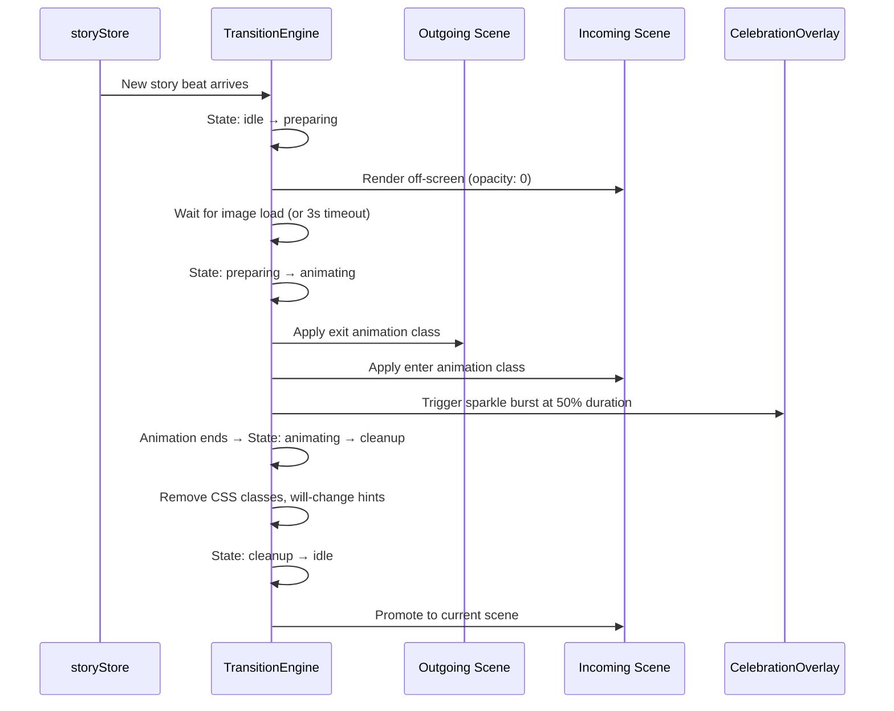
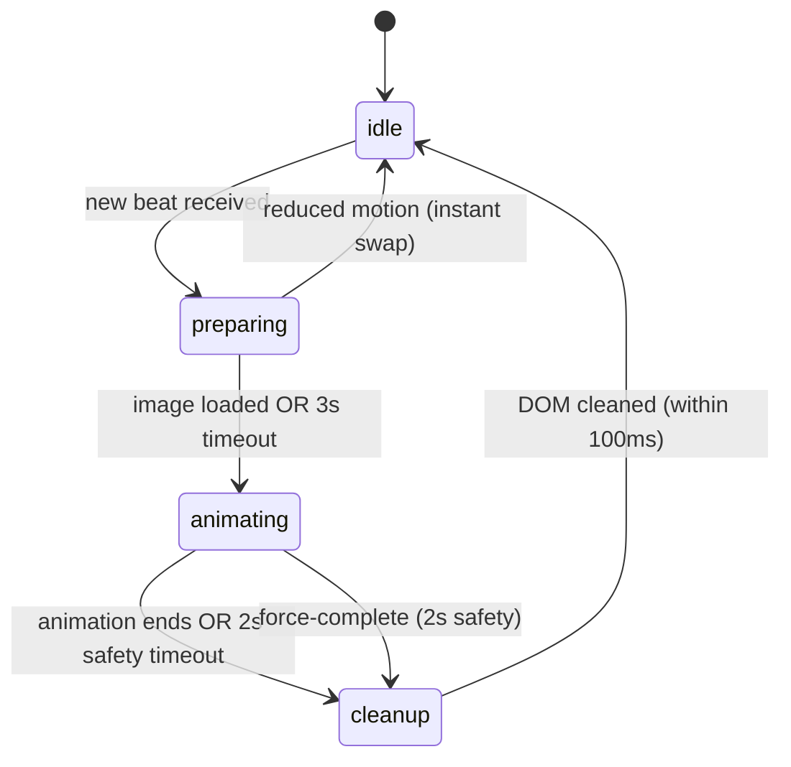

# Design Document: Animated Story Transitions

## Overview

This feature adds cinematic, immersive scene-change animations to TwinSpark Chronicles. When a story choice is made and a new beat arrives, the **TransitionEngine** component orchestrates animated transitions between the outgoing and incoming scenes — page-turn effects, cinematic fades, and sparkle bursts — creating a magical storybook experience for Ale & Sofi.

The implementation is CSS-first: all visual effects use `@keyframes`, `transform`, and `opacity`. No external animation libraries are added. The system integrates as a wrapper around `DualStoryDisplay`, intercepting scene changes from the story store and managing a state machine (`idle → preparing → animating → cleanup`) to coordinate timing, sparkle bursts, and interaction blocking.

### Key Design Decisions

1. **Wrapper component pattern** — `TransitionEngine` wraps `DualStoryDisplay` without modifying its internals. It renders two scene slots (outgoing + incoming) and swaps them via CSS class toggling.
2. **CSS-first animations** — All transitions use `@keyframes` with `transform` and `opacity` only (composite-friendly). No JavaScript-driven frame loops.
3. **State machine** — A simple 4-state FSM (`idle → preparing → animating → cleanup`) prevents race conditions, blocks user interaction during transitions, and ensures deterministic cleanup.
4. **Sparkle burst at midpoint** — Reuses `CelebrationOverlay` with type `"sparkle"` triggered via a `setTimeout` at 50% of the transition duration.
5. **Graceful degradation** — `prefers-reduced-motion` triggers instant crosscut (opacity swap, no animation, no sparkles, ≤200ms).

## Architecture

### High-Level Flow



### State Machine



| State | Duration | Behavior |
|-------|----------|----------|
| `idle` | — | Normal display, interactions enabled |
| `preparing` | 0–3000ms | Incoming scene rendered at opacity 0, waiting for image preload |
| `animating` | 600–1200ms | CSS animations active, interactions blocked, sparkle burst at midpoint |
| `cleanup` | ≤100ms | Remove animation classes, `will-change`, promote incoming scene |

## Components and Interfaces

### TransitionEngine (New Component)

**File:** `frontend/src/features/story/components/TransitionEngine.jsx`
**CSS:** `frontend/src/features/story/components/TransitionEngine.css`

```jsx
// Props interface
TransitionEngine.propTypes = {
  storyBeat: PropTypes.object,       // Current story beat from store
  t: PropTypes.object,               // Translations
  profiles: PropTypes.object,        // Child profiles
  onChoice: PropTypes.func,          // Choice handler (passed through to DualStoryDisplay)
};
```

**Responsibilities:**
- Subscribes to `storyBeat` changes via props (passed from App.jsx)
- Manages two scene slots: `outgoingRef` and `incomingRef`
- Runs the transition state machine
- Selects transition type (cycling: page-turn → cinematic-fade → page-turn → …)
- Applies/removes CSS animation classes
- Triggers `CelebrationOverlay` sparkle burst at midpoint
- Blocks choice interactions during `preparing` and `animating` states
- Detects `prefers-reduced-motion` via `matchMedia` listener
- Cleans up `will-change` and animation classes after transition

**Key internal state:**
```js
const [transitionState, setTransitionState] = useState('idle');
// 'idle' | 'preparing' | 'animating' | 'cleanup'

const [transitionIndex, setTransitionIndex] = useState(0);
// Cycles through TRANSITION_TYPES array

const [showSparkle, setShowSparkle] = useState(false);

const [prefersReducedMotion, setPrefersReducedMotion] = useState(false);
```

### TransitionEngine CSS Module

**File:** `frontend/src/features/story/components/TransitionEngine.css`

Defines:
- `.transition-container` — relative wrapper with `overflow: hidden`
- `.transition-scene` — absolute-positioned scene slot
- `.transition-scene--outgoing` / `.transition-scene--incoming` — z-index layering
- `@keyframes page-turn-out` / `@keyframes page-turn-in` — 3D page turn
- `@keyframes cinematic-fade-out` / `@keyframes cinematic-fade-in` — cross-fade with scale
- `.transition-scene--will-change` — applies `will-change: transform, opacity`
- `.transition-scene--no-interaction` — `pointer-events: none` during animation
- Reduced motion overrides
- Mobile responsive perspective adjustments

### Integration Point: App.jsx

Replace the direct `<DualStoryDisplay>` render with `<TransitionEngine>`:

```jsx
// Before:
<DualStoryDisplay storyBeat={story.currentBeat} t={t} profiles={session.profiles} onChoice={handleChoice} />

// After:
<TransitionEngine storyBeat={story.currentBeat} t={t} profiles={session.profiles} onChoice={handleChoice} />
```

`TransitionEngine` internally renders `DualStoryDisplay` for each scene slot, passing the appropriate beat data.

### useReducedMotion Hook (New)

**File:** `frontend/src/shared/hooks/useReducedMotion.js`

```js
export function useReducedMotion() {
  const [prefersReducedMotion, setPrefersReducedMotion] = useState(
    () => window.matchMedia('(prefers-reduced-motion: reduce)').matches
  );

  useEffect(() => {
    const mql = window.matchMedia('(prefers-reduced-motion: reduce)');
    const handler = (e) => setPrefersReducedMotion(e.matches);
    mql.addEventListener('change', handler);
    return () => mql.removeEventListener('change', handler);
  }, []);

  return prefersReducedMotion;
}
```

### useImagePreloader Hook (New)

**File:** `frontend/src/shared/hooks/useImagePreloader.js`

Preloads the incoming scene image and resolves when loaded or after 3s timeout.

```js
export function useImagePreloader(src, timeout = 3000) {
  // Returns { loaded: boolean, error: boolean }
}
```

### Transition Type Registry

**File:** `frontend/src/features/story/transitions/transitionTypes.js`

```js
export const TRANSITION_TYPES = [
  {
    name: 'page-turn',
    outClass: 'transition-page-turn-out',
    inClass: 'transition-page-turn-in',
    duration: 900,       // ms
    minViewport: 480,    // px — below this, skip to next type
  },
  {
    name: 'cinematic-fade',
    outClass: 'transition-cinematic-fade-out',
    inClass: 'transition-cinematic-fade-in',
    duration: 800,       // ms
    minViewport: 0,      // works on all sizes
  },
];

export function getNextTransition(currentIndex, viewportWidth) {
  // Cycles through types, skipping any whose minViewport > viewportWidth
}
```

This registry pattern allows future transition types to be added by appending to the array — no modification of existing logic needed.

## Data Models

### Transition State

```js
{
  state: 'idle' | 'preparing' | 'animating' | 'cleanup',
  currentBeat: StoryBeat | null,      // The currently displayed beat
  incomingBeat: StoryBeat | null,      // The beat being transitioned in
  transitionType: TransitionType,      // Current transition config object
  transitionIndex: number,             // Index into TRANSITION_TYPES for cycling
  startTime: number | null,            // Performance.now() when animation started
}
```

### TransitionType

```js
{
  name: string,           // 'page-turn' | 'cinematic-fade'
  outClass: string,       // CSS class for outgoing animation
  inClass: string,        // CSS class for incoming animation
  duration: number,       // Animation duration in ms (600–1200)
  minViewport: number,    // Minimum viewport width in px
}
```

### CSS @keyframes Specifications

**Page Turn Out (outgoing scene):**
```css
@keyframes page-turn-out {
  0%   { transform: perspective(1000px) rotateY(0deg); opacity: 1; }
  100% { transform: perspective(1000px) rotateY(-90deg); opacity: 0; }
}
```
- `transform-origin: left center` — hinge on left edge, page turns right-to-left
- Duration: 900ms
- Timing: `ease-in`
- Includes gradient shadow pseudo-element on the turning edge

**Page Turn In (incoming scene):**
```css
@keyframes page-turn-in {
  0%   { transform: perspective(1000px) rotateY(90deg); opacity: 0; }
  100% { transform: perspective(1000px) rotateY(0deg); opacity: 1; }
}
```
- `transform-origin: right center` — reveals from right side
- Duration: 900ms
- Timing: `ease-out`

**Cinematic Fade Out:**
```css
@keyframes cinematic-fade-out {
  0%   { opacity: 1; transform: scale(1.0); }
  100% { opacity: 0; transform: scale(1.04); }
}
```
- Duration: 800ms
- Timing: `ease-in-out`

**Cinematic Fade In:**
```css
@keyframes cinematic-fade-in {
  0%   { opacity: 0; transform: scale(0.97); }
  100% { opacity: 1; transform: scale(1.0); }
}
```
- Duration: 800ms
- Timing: `ease-in-out`


## Correctness Properties

*A property is a characteristic or behavior that should hold true across all valid executions of a system — essentially, a formal statement about what the system should do. Properties serve as the bridge between human-readable specifications and machine-verifiable correctness guarantees.*

### Property 1: State machine follows valid transitions

*For any* sequence of events (new beat arrival, image loaded, animation end, timeout), the transition state machine should only move through valid transitions: `idle → preparing → animating → cleanup → idle`. No state should be skipped, and no invalid transition (e.g., `idle → cleanup`) should occur.

**Validates: Requirements 1.1, 9.2**

### Property 2: Transition durations are within bounds

*For any* registered transition type in the TRANSITION_TYPES registry, its configured duration must be between 600ms and 1200ms inclusive.

**Validates: Requirements 1.2**

### Property 3: Interactions blocked during non-idle states

*For any* transition state that is not `idle`, the interaction-blocking flag must be `true`, preventing choice card taps from being processed.

**Validates: Requirements 1.3**

### Property 4: Image preloader resolves within timeout

*For any* image URL (including URLs that never load), the image preloader must resolve within the configured timeout (3000ms), returning either a loaded or timed-out status.

**Validates: Requirements 1.5**

### Property 5: Consecutive transitions use different types

*For any* sequence of N transitions (N ≥ 2) on a viewport wide enough to support all types, no two consecutive transitions should use the same transition type name.

**Validates: Requirements 4.2**

### Property 6: Sparkle burst timing fits within transition

*For any* transition type with duration D, the sparkle burst should be scheduled at approximately D/2 milliseconds, and the sparkle burst duration should be ≤ D/2, so that the sparkle completes before the transition ends.

**Validates: Requirements 5.1, 5.4**

### Property 7: Reduced motion suppresses all animation and sparkles

*For any* transition triggered while `prefers-reduced-motion: reduce` is active, the transition engine should: (a) not apply any animation CSS classes, (b) not trigger a sparkle burst, and (c) complete the scene swap within 200ms.

**Validates: Requirements 6.1, 6.2, 6.3**

### Property 8: Cleanup completes within 100ms and removes all transition artifacts

*For any* completed transition, the cleanup phase must remove all transition-related CSS classes (including `will-change` hints) from the DOM within 100ms of the animation ending.

**Validates: Requirements 7.4, 8.3**

### Property 9: Safety timeout force-completes stuck transitions

*For any* transition that has been in the `animating` state for more than 2000ms, the engine must force-complete by immediately showing the incoming scene and transitioning to `cleanup`.

**Validates: Requirements 8.4**

### Property 10: Small viewports exclude page-turn effect

*For any* viewport width below 480px, the `getNextTransition` function should never select the `page-turn` transition type, always falling back to `cinematic-fade` or another type with `minViewport ≤ 480`.

**Validates: Requirements 10.2**

## Error Handling

| Scenario | Handling |
|----------|----------|
| **Image fails to load** | `useImagePreloader` resolves with `error: true` after timeout. Transition proceeds — DualStoryDisplay's `SceneImageLoader` shows its own fallback. |
| **Animation never fires `animationend`** | 2000ms safety timeout in `animating` state force-completes the transition (Req 8.4). |
| **Rapid consecutive choices** | State machine rejects new transitions while not in `idle`. The interaction-blocking flag prevents choice taps during `preparing`/`animating`/`cleanup`. |
| **Component unmounts mid-transition** | All `setTimeout` and `matchMedia` listeners are cleaned up in `useEffect` return functions. |
| **`matchMedia` not supported** | `useReducedMotion` defaults to `false` (animations enabled). Graceful fallback. |
| **Zero transition types registered** | `getNextTransition` returns a default instant-swap config (no animation, 0ms duration). |
| **Incoming beat is null** | TransitionEngine skips transition, renders empty state via DualStoryDisplay. |

## Testing Strategy

### Dual Testing Approach

This feature uses both unit tests and property-based tests for comprehensive coverage:

- **Unit tests** — Verify specific examples, edge cases, integration points (e.g., sparkle colors match design system, page-turn class names are correct, reduced motion hook responds to `matchMedia` changes).
- **Property-based tests** — Verify universal properties across randomized inputs using `fast-check`. Each property test runs a minimum of 100 iterations.

### Property-Based Testing Configuration

- **Library:** `fast-check` (already compatible with the Vite + React test setup)
- **Minimum iterations:** 100 per property test
- **Tag format:** Each test includes a comment: `// Feature: animated-story-transitions, Property {N}: {title}`

### Test File Structure

```
frontend/src/features/story/components/__tests__/
  TransitionEngine.test.jsx       — Unit tests (examples, edge cases, integration)
  TransitionEngine.property.test.js — Property-based tests (fast-check)
  transitionTypes.test.js          — Unit + property tests for the registry
  useImagePreloader.test.js        — Unit tests for the preloader hook
  useReducedMotion.test.js         — Unit tests for the reduced motion hook
```

### Property Test Mapping

| Property | Test Tag | What's Generated |
|----------|----------|-----------------|
| 1: State machine transitions | `Feature: animated-story-transitions, Property 1: State machine follows valid transitions` | Random event sequences (beat arrivals, image loads, animation ends, timeouts) |
| 2: Duration bounds | `Feature: animated-story-transitions, Property 2: Transition durations are within bounds` | Random transition type configs |
| 3: Interaction blocking | `Feature: animated-story-transitions, Property 3: Interactions blocked during non-idle states` | Random transition states |
| 4: Image preloader timeout | `Feature: animated-story-transitions, Property 4: Image preloader resolves within timeout` | Random image URLs with simulated load/fail/timeout |
| 5: Consecutive type cycling | `Feature: animated-story-transitions, Property 5: Consecutive transitions use different types` | Random sequences of transition indices and viewport widths |
| 6: Sparkle timing | `Feature: animated-story-transitions, Property 6: Sparkle burst timing fits within transition` | Random transition durations (600–1200ms) |
| 7: Reduced motion | `Feature: animated-story-transitions, Property 7: Reduced motion suppresses all animation and sparkles` | Random transition configs with reduced motion flag |
| 8: Cleanup timing | `Feature: animated-story-transitions, Property 8: Cleanup completes within 100ms` | Random transition completions |
| 9: Safety timeout | `Feature: animated-story-transitions, Property 9: Safety timeout force-completes stuck transitions` | Random stuck animation scenarios |
| 10: Small viewport exclusion | `Feature: animated-story-transitions, Property 10: Small viewports exclude page-turn effect` | Random viewport widths (0–2000px) |

### Unit Test Coverage

- Transition type registry contains both `page-turn` and `cinematic-fade`
- Sparkle burst uses gold/coral/violet colors from design system
- Sparkle particle count is between 15 and 30
- `useReducedMotion` responds to `matchMedia` change events in real time
- Page-turn type applies correct CSS class names
- Cinematic-fade type applies correct CSS class names
- Incoming scene rendered at opacity 0 during `preparing` state
- Focus management preserved after transition completes
- Shimmer sweep still fires on new scene image
