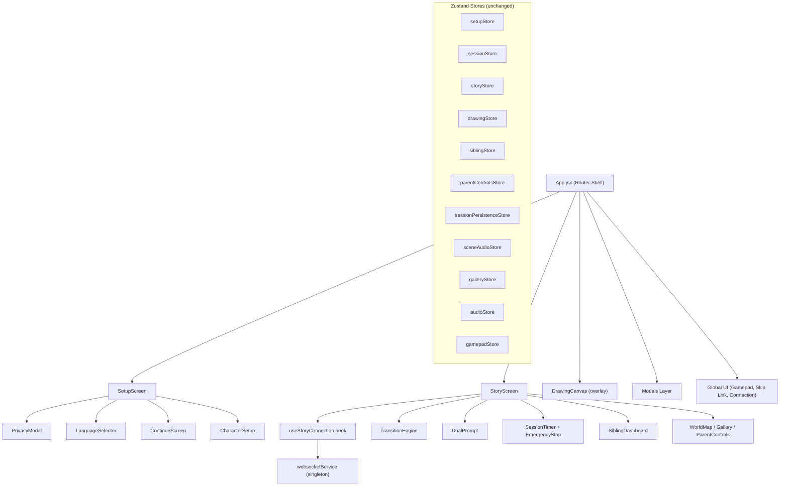
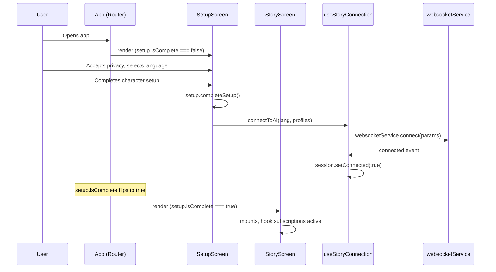
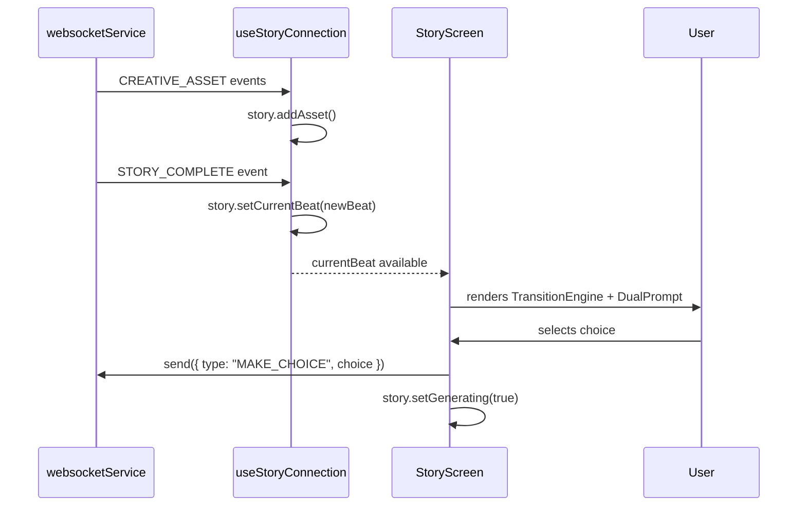

# Design Document: App Component Split

## Overview

App.jsx is a 1127-line god component that imports 15+ Zustand stores, manages ~15 useState calls, wires up all WebSocket subscriptions, and renders every screen (setup, story, drawing, gallery, world map, parent controls). This refactor decomposes it into a thin screen-router App shell plus focused screen container components, each owning their own state subscriptions, event handlers, and WebSocket lifecycle. This is a pure refactor — zero functional changes, zero new dependencies.

The decomposition follows the existing `frontend/src/features/` folder convention. WebSocket connection logic moves into a custom hook (`useStoryConnection`), screen-specific event handlers move into their respective containers, and shared cross-cutting concerns (modals, gamepad, accessibility) remain in the App shell.

## Architecture



## Sequence Diagrams

### Setup → Story Transition



### Story Beat Lifecycle



## Components and Interfaces

### Component 1: App (Router Shell)

**Purpose**: Thin orchestrator that determines which screen to render based on `setupStore.isComplete`. Owns global cross-cutting concerns only.

```jsx
// Responsibilities:
// - Screen switching based on setup.isComplete
// - Global modals (AlertModal, ExitModal, VoiceCommandToast)
// - SkipLink, AppContainer, CelebrationOverlay
// - Gamepad hook + VirtualKeyboard overlay
// - ConnectionIndicator
// - FeedbackComponent
// - Click-sync for gamepad focus
```

**Owns these stores**: `useGamepadStore` (for virtual keyboard)

**Owns these useState**: `alertMessage`, `showExitModal`, `isSaving`, `showSetupCelebration`, `voiceCommandMatch`

**Does NOT own**: WebSocket connection, story state, drawing state, setup flow state

### Component 2: SetupScreen

**Purpose**: Owns the entire setup flow — privacy → language → character setup (or continue screen).

```jsx
// Props: { onSetupComplete, onContinueStory, onNewAdventure, t }
// 
// Responsibilities:
// - Renders LanguageSelector, ContinueScreen, CharacterSetup
// - Owns handleLanguageSelect, handleSetupComplete logic
// - Reads: setupStore, sessionPersistenceStore
// - Writes: setupStore (setLanguage, setChild1, setChild2, completeSetup)
//           sessionStore (setProfiles)
```

**Owns these stores**: `useSetupStore`, `useSessionPersistenceStore`

**Owns these useState**: none (setup state lives in Zustand)

### Component 3: StoryScreen

**Purpose**: Owns the active story experience — WebSocket subscriptions, story rendering, session controls, overlays.

```jsx
// Props: { onExit, onEmergencyExit, t }
//
// Responsibilities:
// - Calls useStoryConnection() hook for WS lifecycle
// - Renders TransitionEngine, DualPrompt, SessionControls
// - Renders overlay toggles: WorldMap, Gallery, ParentControls, SiblingDashboard
// - Owns handleChoice, handleDrawingComplete
// - Manages multimodal capture lifecycle
// - Manages audio unlock prompt
// - Manages focus on mount (accessibility)
```

**Owns these stores**: `useStoryStore`, `useSessionStore`, `useSiblingStore`, `useAudioStore`, `useDrawingStore`, `useSceneAudioStore`, `useParentControlsStore`, `useGalleryStore`

**Owns these useState**: `isListening`, `hasCamera`, `showDashboard`, `showParentControls`, `showWorldMap`, `showGallery`, `showPhotoReview`, `mechanics`, `child1Responded`, `child2Responded`, `audioUnlocked`

### Hook: useStoryConnection

**Purpose**: Encapsulates WebSocket connection, event subscriptions, and reconnection logic. Extracted from the `connectToAI` function in App.jsx.

```jsx
// Signature:
// useStoryConnection({ lang, profiles, onVoiceCommand, onMechanics })
//
// Returns: { connectToAI, disconnect, isConnected }
//
// Responsibilities:
// - websocketService.connect(params) with profile enrichment
// - Subscribe to: connected, disconnected, CREATIVE_ASSET, STORY_COMPLETE,
//   STATUS, MECHANIC_WARNING, error, story_segment, VOICE_COMMAND_MATCH,
//   DRAWING_PROMPT, DRAWING_END
// - Auto-cleanup subscriptions on unmount
// - Reconnection on abnormal disconnect (code 1006)
// - Sync localStorage snapshot on reconnect
// - Flush drawing sync queue on reconnect
```

## Data Models

No new data models. All existing Zustand store shapes remain unchanged. The refactor only changes where stores are consumed, not their structure.

### State Ownership Map

| State | Current Owner | New Owner |
|-------|--------------|-----------|
| `setupStore` | App | SetupScreen |
| `sessionStore` | App | StoryScreen (read), SetupScreen (write profiles) |
| `storyStore` | App | StoryScreen |
| `siblingStore` | App | StoryScreen |
| `drawingStore` | App | StoryScreen |
| `parentControlsStore` | App | StoryScreen |
| `sceneAudioStore` | App | StoryScreen |
| `galleryStore` | App | StoryScreen |
| `audioStore` | App | StoryScreen |
| `gamepadStore` | App | App (global) |
| `sessionPersistenceStore` | App | SetupScreen + StoryScreen |
| ~15 useState calls | App | Distributed to respective screens |

## Key Functions with Formal Specifications

### Function 1: useStoryConnection()

```javascript
function useStoryConnection({ lang, profiles, onVoiceCommand, onMechanics }) {
  // Returns { connectToAI, disconnect, isConnected }
}
```

**Preconditions:**
- `lang` is a valid language code string (e.g., 'en', 'es')
- `profiles` contains all required child profile fields (c1_name, c2_name, etc.)
- `onVoiceCommand` and `onMechanics` are callback functions or undefined

**Postconditions:**
- On mount: no connection initiated (caller must invoke `connectToAI`)
- On unmount: all WebSocket subscriptions are cleaned up via unsubscribe functions
- `connectToAI()` resolves after successful WebSocket handshake
- All 11 event subscriptions are registered exactly once per connection
- Reconnection attempts on code 1006 disconnect (only during story phase)

**Loop Invariants:** N/A

### Function 2: SetupScreen.handleSetupComplete(profiles)

```javascript
function handleSetupComplete(profiles) {
  // Enriches raw profiles → sets stores → triggers connection
}
```

**Preconditions:**
- `profiles` contains at minimum: c1_name, c1_gender, c1_spirit_animal, c2_name, c2_gender, c2_spirit_animal
- `setup.language` is already set
- Privacy has been accepted

**Postconditions:**
- `setupStore.child1` and `setupStore.child2` are populated with enriched data
- `setupStore.isComplete === true`
- `sessionStore.profiles` is set
- `connectToAI` is called with language and enriched profiles
- Setup celebration is triggered

### Function 3: StoryScreen.handleChoice(choiceText)

```javascript
async function handleChoice(choiceText) {
  // Sends choice via WebSocket, manages generating state
}
```

**Preconditions:**
- `websocketService.isConnected() === true`
- `choiceText` is a non-empty string

**Postconditions:**
- `story.currentBeat` is set to null (clears current display)
- `story.isGenerating` is set to true
- WebSocket message `{ type: "MAKE_CHOICE", choice: choiceText }` is sent
- On failure: alert message is set, generating is set to false

## Algorithmic Pseudocode

### Screen Routing Algorithm

```javascript
function App() {
  const isComplete = useSetupStore(s => s.isComplete);
  const privacyAccepted = useSetupStore(s => s.privacyAccepted);

  // ASSERT: exactly one screen renders at a time
  // INVARIANT: setup.isComplete transitions from false→true exactly once per session

  if (!privacyAccepted) {
    return <PrivacyModal />;  // Modal layer only
  }

  if (!isComplete) {
    return <SetupScreen />;   // Setup flow
  }

  return <StoryScreen />;     // Story experience
}
```

### WebSocket Subscription Lifecycle

```javascript
// ALGORITHM: useStoryConnection mount/unmount cycle
// INPUT: lang, profiles
// OUTPUT: { connectToAI, disconnect }

function useStoryConnection({ lang, profiles, onVoiceCommand, onMechanics }) {
  const unsubscribers = useRef([]);

  const connectToAI = useCallback(() => {
    const params = buildConnectionParams(lang, profiles);
    
    websocketService.connect(params).then(() => {
      session.setConnected(true);
    });

    // Register all event handlers — store unsubscribe functions
    unsubscribers.current = [
      websocketService.on('connected', handleConnected),
      websocketService.on('disconnected', handleDisconnected),
      websocketService.on('CREATIVE_ASSET', handleAsset),
      websocketService.on('STORY_COMPLETE', handleStoryComplete),
      websocketService.on('STATUS', handleStatus),
      websocketService.on('MECHANIC_WARNING', onMechanics),
      websocketService.on('error', handleError),
      websocketService.on('story_segment', handleSiblingData),
      websocketService.on('VOICE_COMMAND_MATCH', onVoiceCommand),
      websocketService.on('DRAWING_PROMPT', handleDrawingPrompt),
      websocketService.on('DRAWING_END', handleDrawingEnd),
    ];
  }, [lang, profiles]);

  // Cleanup on unmount
  useEffect(() => {
    return () => {
      unsubscribers.current.forEach(unsub => unsub());
      unsubscribers.current = [];
    };
  }, []);

  return { connectToAI, disconnect: websocketService.disconnect };
}
```

### Save-and-Exit Algorithm

```javascript
// ALGORITHM: handleSaveAndExit
// PRECONDITION: session is active, profiles exist
// POSTCONDITION: all stores reset, WS disconnected, UI back to setup

async function handleSaveAndExit() {
  // Step 1: Save snapshot (fire-and-forget on failure)
  await persistence.saveSnapshot().catch(console.error);

  // Step 2: End sibling session for dynamics score + archival
  if (hasProfiles) {
    const result = await endSiblingSession(sessionId, profiles);
    if (result?.storybook_id) {
      showFeedback('sparkle', 'Saved to gallery ✨');
      await delay(1500);
    }
  }

  // Step 3: Teardown
  websocketService.disconnect();
  stopCapture();
  localStorage.removeItem('twinspark_session_snapshot');

  // Step 4: Reset all stores
  [setup, story, session, sibling, sceneAudio, gallery, drawing].forEach(s => s.reset());
}
```

## Example Usage

### New App.jsx (~80 lines instead of 1127)

```jsx
function App() {
  const isComplete = useSetupStore(s => s.isComplete);
  const privacyAccepted = useSetupStore(s => s.privacyAccepted);
  const language = useSetupStore(s => s.language);
  const t = language ? translations[language] : translations.en;

  useGamepad();

  const [alertMessage, setAlertMessage] = useState(null);
  const [showExitModal, setShowExitModal] = useState(false);
  const [showSetupCelebration, setShowSetupCelebration] = useState(false);
  const [voiceCommandMatch, setVoiceCommandMatch] = useState(null);

  return (
    <AppContainer>
      <SkipLink />

      {!isComplete ? (
        <SetupScreen
          t={t}
          onSetupCelebration={() => setShowSetupCelebration(true)}
        />
      ) : (
        <StoryScreen
          t={t}
          onExit={() => setShowExitModal(true)}
          onAlert={setAlertMessage}
          onVoiceCommand={setVoiceCommandMatch}
        />
      )}

      {/* Global modals layer */}
      {!privacyAccepted && <PrivacyModal onAccept={handlePrivacyAccept} t={t} />}
      <AlertModal message={alertMessage} onClose={() => setAlertMessage(null)} />
      <VoiceCommandToast match={voiceCommandMatch} t={t} />
      {showSetupCelebration && <CelebrationOverlay type="confetti" />}
      <ConnectionIndicator />
      {virtualKeyboardOpen && <VirtualKeyboard ... />}
    </AppContainer>
  );
}
```

### SetupScreen Container

```jsx
function SetupScreen({ t, onSetupCelebration }) {
  const setup = useSetupStore();
  const persistence = useSessionPersistenceStore();
  const { playSuccess } = useAudioFeedback();
  const { connectToAI } = useStoryConnection();

  const handleLanguageSelect = (lang) => {
    setup.setLanguage(lang);
    playSuccess();
  };

  const handleSetupComplete = (profiles) => {
    const enriched = enrichProfiles(profiles);
    setup.setChild1(enriched.child1);
    setup.setChild2(enriched.child2);
    setup.completeSetup();
    useSessionStore.getState().setProfiles(enriched.flat);
    connectToAI(setup.language, enriched.flat);
    onSetupCelebration();
  };

  return (
    <>
      <h1 className="app-title text-gradient logo-animation">TwinSpark Chronicles</h1>
      {setup.currentStep === 'language' && <LanguageSelector onSelect={handleLanguageSelect} />}
      {setup.currentStep === 'characters' && persistence.availableSession && (
        <ContinueScreen ... />
      )}
      {setup.currentStep === 'characters' && !persistence.availableSession && (
        <CharacterSetup onComplete={handleSetupComplete} language={setup.language} t={t} />
      )}
    </>
  );
}
```

### StoryScreen Container

```jsx
function StoryScreen({ t, onExit, onAlert, onVoiceCommand }) {
  const story = useStoryStore();
  const session = useSessionStore();
  const drawingStore = useDrawingStore();
  const mainRef = useRef(null);

  const { connectToAI } = useStoryConnection({
    onVoiceCommand,
    onMechanics: setMechanics,
  });

  // Focus management on mount (accessibility)
  useEffect(() => {
    setTimeout(() => mainRef.current?.focus(), 100);
  }, []);

  // Drawing tick timer
  useEffect(() => { /* same tick logic */ }, [drawingStore.isActive]);

  return (
    <main id="main-content" ref={mainRef} className="story-stage" tabIndex={-1}>
      <SessionControls onEmergencyExit={handleEmergencyExit} />
      {story.currentBeat && <DualPrompt ... />}
      {story.currentBeat ? <TransitionEngine ... /> : <LoadingAnimation ... />}
      {drawingStore.isActive && <DrawingCanvas ... />}
      {/* Overlays: WorldMap, Gallery, ParentControls, SiblingDashboard */}
    </main>
  );
}
```

## Error Handling

### Error Scenario 1: WebSocket Disconnect During Story

**Condition**: WebSocket closes with code 1006 while `setup.currentStep === 'story'`
**Response**: `useStoryConnection` sets `session.reconnecting = true` and retries after 3s
**Recovery**: On reconnect, syncs localStorage snapshot and flushes drawing queue

### Error Scenario 2: Choice Send Failure

**Condition**: `websocketService.send()` returns false or throws
**Response**: StoryScreen sets alert message via `onAlert` callback, resets `isGenerating`
**Recovery**: User can retry the choice; WebSocket reconnection may resolve underlying issue

### Error Scenario 3: Save Snapshot Failure on Exit

**Condition**: `persistence.saveSnapshot()` rejects
**Response**: Error is logged but exit continues (graceful degradation)
**Recovery**: Session data may be lost, but app resets cleanly to setup screen

## Testing Strategy

### Unit Testing Approach

- Test `useStoryConnection` hook in isolation with mocked `websocketService`
- Verify all 11 event subscriptions are registered on connect
- Verify all subscriptions are cleaned up on unmount
- Test `SetupScreen` profile enrichment logic (spiritToPersonality mapping)
- Test `StoryScreen` choice handler with connected/disconnected states
- Test App router renders correct screen based on `setup.isComplete`

### Property-Based Testing Approach

**Property Test Library**: fast-check

- For any valid profile input, `enrichProfiles` always produces complete output with all required fields
- For any sequence of setup steps (privacy → language → characters), the final state always has `isComplete === true`
- For any WebSocket event sequence, the number of registered subscriptions equals the number of cleanup functions

### Integration Testing Approach

- Mount full App → complete setup flow → verify StoryScreen renders
- Verify WebSocket subscriptions fire correctly through screen transitions
- Verify save-and-exit resets all stores and returns to setup screen
- Verify accessibility: focus moves to main content on setup→story transition

## Performance Considerations

- Each screen container only subscribes to the stores it needs, reducing unnecessary re-renders
- `useStoryConnection` uses `useCallback` for stable function references
- Selector-based store access (`useSetupStore(s => s.isComplete)`) in App shell prevents full-store re-renders
- No new dependencies or bundle size increase

## Security Considerations

No changes — this is a pure refactor. All existing security measures (privacy consent, parent controls, session management) remain intact and in the same logical positions.

## Dependencies

No new dependencies. The refactor uses only existing project dependencies:
- React (useState, useEffect, useRef, useCallback)
- Zustand (existing stores, unchanged)
- websocketService (existing singleton, unchanged)
- All existing feature components (unchanged, just re-parented)
