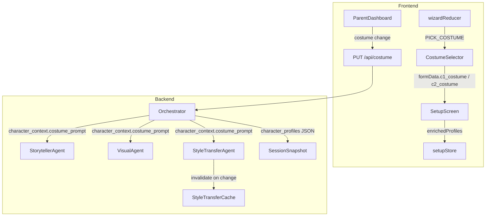

# Design Document: Character Costume Customization

## Overview

This feature adds a costume selection step to the Twin Spark Chronicles character setup wizard, positioned between spirit animal and toy companion (for child 1) or photos (for child 2). A predefined costume catalog provides 8+ age-appropriate outfits, each with an emoji, theme color, and a short prompt fragment (≤20 words). The chosen costume persists in session snapshots and flows through the orchestrator into the storyteller, visual, and style transfer agents — personalizing narration text, scene illustrations, and character portraits. Parents can also swap costumes between sessions via the parent dashboard.

The design follows existing patterns: the wizard reducer gains a `costume` step and `PICK_COSTUME` action, the Zustand setup store adds a `costume` field per child, and the backend character context dictionary carries `costume` and `costume_prompt` keys. No new database tables are needed — costume data lives inside the `character_profiles` JSON column of `session_snapshots`.

## Architecture



The costume data flows through three layers:

1. **UI layer** — `CostumeSelector` renders tappable cards from the catalog; the wizard reducer stores the selection in `formData`; `SetupScreen` maps it into `enrichedProfiles`.
2. **State/transport layer** — Zustand `setupStore` persists the costume field; the WebSocket `start_session` message carries it to the backend; the `session_snapshots.character_profiles` JSON column stores it.
3. **Agent layer** — The orchestrator injects `costume_prompt` into the character context dict consumed by all three agents. Each agent reads the prompt fragment and weaves it into its respective prompt template.

## Components and Interfaces

### 1. Costume Catalog (`frontend/src/features/setup/data/costumeCatalog.js`)

A static array exported as the single source of truth for costume options.

```js
// Each entry in the catalog
{
  id: string,          // e.g. "knight_armor"
  label: string,       // "Knight Armor"
  emoji: string,       // "⚔️"
  color: string,       // "#6366f1" (theme color for card border)
  promptFragment: string // ≤20 words for AI prompt injection
}
```

Minimum 8 entries spanning fantasy, adventure, and everyday themes.

### 2. CostumeSelector Component (`frontend/src/features/setup/components/CostumeSelector.jsx`)

A grid of tappable costume cards, consistent with the existing spirit animal and gender card patterns.

**Props:**
- `childNum: number` — 1 or 2
- `childName: string` — display name for the badge
- `childColor: string` — CSS color for the child badge
- `childEmoji: string` — emoji for the child badge
- `onSelect: (costumeId: string) => void` — callback on selection
- `renderProgress: () => ReactNode` — progress dots renderer
- `transitionClass: string` — animation class

**Behavior:**
- Renders all catalog entries as `<button>` cards with `aria-label` describing the costume name
- Minimum 44×44px tap targets
- On tap: bounce animation via `wizard-card--bounce` class, calls `onSelect` after 350ms
- Keyboard: Enter/Space triggers selection
- Displays child badge (name + emoji) consistent with other wizard steps

### 3. Wizard Reducer Changes (`frontend/src/features/setup/reducers/wizardReducer.js`)

- `STEP_ORDER` becomes `['name', 'gender', 'spirit', 'costume', 'toy', 'photos']`
- New action type: `PICK_COSTUME`
- `initialState.formData` gains `c1_costume: ''` and `c2_costume: ''`
- `PICK_COSTUME` handler sets `formData[prefix + 'costume']`, triggers bounce + sparkle, then transitions to `'toy'` step after 500ms

### 4. CharacterSetup Integration (`frontend/src/features/setup/components/CharacterSetup.jsx`)

- Import `CostumeSelector` and `costumeCatalog`
- Add `stepLabels.costume = 'Costume'`
- Add a `wizardStep === 'costume'` branch that renders `<CostumeSelector>`
- `handleSpiritPick` transitions to `'costume'` instead of `'toy'`
- New `handleCostumePick(val)` dispatches `PICK_COSTUME`, then after 500ms dispatches `GO_TO_STEP` to `'toy'`

### 5. SetupScreen Enrichment (`frontend/src/features/setup/components/SetupScreen.jsx`)

- `handleSetupComplete` maps `profiles.c1_costume` and `profiles.c2_costume` into `enrichedProfiles`
- Looks up the `promptFragment` from the catalog for each costume ID
- Falls back to `"adventure_clothes"` if no costume is selected

### 6. Zustand setupStore Changes (`frontend/src/stores/setupStore.js`)

- `child1` and `child2` objects gain a `costume: ''` field
- `getProfiles()` includes `c1_costume` and `c2_costume`
- `reset()` clears costume fields
- Persisted via the existing `persist` middleware (already partializes child objects)

### 7. Backend Character Context (Orchestrator)

The orchestrator's `_do_generate_rich_story_moment` already receives a `characters` dict. The costume data flows in as:

```python
characters = {
    "child1": {
        "name": "Ale",
        "gender": "girl",
        "spirit_animal": "dragon",
        "toy_name": "Bruno",
        "costume": "knight_armor",
        "costume_prompt": "wearing gleaming silver knight armor with a dragon crest shield"
    },
    ...
}
```

If `costume` is missing, the orchestrator defaults `costume_prompt` to `"wearing adventure clothes"`.

### 8. StorytellerAgent Prompt Injection

In `_build_prompt`, the CHARACTER INFO section becomes:

```
- Ale (girl): Spirit Animal is dragon, loves Bruno, wearing gleaming silver knight armor with a dragon crest shield
```

The costume prompt fragment is appended to each character's line. If missing, falls back to `"wearing adventure clothes"`.

### 9. VisualAgent Prompt Injection

In `_build_visual_prompt`, the hardcoded `"wearing adventure clothes"` / `"wearing explorer outfit"` strings are replaced with `c1.get('costume_prompt', 'wearing adventure clothes')` and `c2.get('costume_prompt', 'wearing explorer outfit')`.

### 10. StyleTransferAgent Prompt Injection

In `generate_portrait`, the prompt gains the costume fragment:

```python
prompt = f"{_STYLE_PROMPT} This character is the {role} in a children's story, {costume_prompt}."
```

### 11. Style Transfer Cache Invalidation

When a costume changes (via parent dashboard or re-setup), the `StyleTransferCache.evict(face_content_hash)` method is called for the affected sibling, forcing a fresh portrait generation on the next request.

### 12. Parent Dashboard Costume Change

- Display current costume (emoji + label) for each sibling
- Tap opens a `CostumeSelector` modal/overlay
- On confirm: `PUT /api/costume/{sibling_pair_id}/{child_num}` with `{ costume: "new_id" }`
- Backend updates `character_profiles` JSON in `session_snapshots` and evicts the cached portrait

### 13. Backend API Endpoint

```
PUT /api/costume/{sibling_pair_id}/{child_num}
Body: { "costume": "knight_armor" }
Response: { "ok": true, "costume": "knight_armor", "costume_prompt": "..." }
```

Validates costume ID against the catalog, updates the snapshot, and evicts the style transfer cache entry.

## Data Models

### Frontend — formData (wizard reducer)

```js
{
  c1_name: '', c1_gender: '', c1_spirit_animal: '', c1_costume: '',
  c1_toy_name: '', c1_toy_type: '', c1_toy_image: '',
  c2_name: '', c2_gender: '', c2_spirit_animal: '', c2_costume: '',
  c2_toy_name: '', c2_toy_type: '', c2_toy_image: '',
}
```

### Frontend — setupStore child object

```js
{
  name: '', gender: '', personality: '', spirit: '',
  costume: '',  // costume ID string
  toy: '', toyType: '', toyImage: ''
}
```

### Frontend — enrichedProfiles (sent to backend)

```js
{
  c1_name, c1_gender, c1_personality, c1_spirit, c1_costume, c1_toy, ...
  c2_name, c2_gender, c2_personality, c2_spirit, c2_costume, c2_toy, ...
}
```

### Backend — character context dict

```python
{
    "child1": {
        "name": str,
        "gender": str,
        "spirit_animal": str,
        "toy_name": str,
        "costume": str,           # costume ID, default "adventure_clothes"
        "costume_prompt": str,    # prompt fragment, default "wearing adventure clothes"
    },
    "child2": { ... }
}
```

### Backend — session_snapshots.character_profiles JSON

The existing `character_profiles` JSON column gains `c1_costume` and `c2_costume` fields. No schema migration needed — it's a JSON blob.

### Costume Catalog Entry (shared constant)

```python
# Backend mirror of the frontend catalog for validation
COSTUME_CATALOG = {
    "knight_armor": {
        "label": "Knight Armor",
        "emoji": "⚔️",
        "prompt_fragment": "wearing gleaming silver knight armor with a dragon crest shield"
    },
    "space_suit": { ... },
    "princess_gown": { ... },
    "pirate_outfit": { ... },
    "superhero_cape": { ... },
    "wizard_robe": { ... },
    "explorer_gear": { ... },
    "fairy_wings": { ... },
}
```

The backend catalog is used for:
1. Validating costume IDs on the `PUT /api/costume` endpoint
2. Looking up `prompt_fragment` when the frontend only sends the costume ID


## Correctness Properties

*A property is a characteristic or behavior that should hold true across all valid executions of a system — essentially, a formal statement about what the system should do. Properties serve as the bridge between human-readable specifications and machine-verifiable correctness guarantees.*

### Property 1: Catalog entries are well-formed

*For any* entry in the costume catalog, it must have a non-empty `id`, `label`, `emoji`, `color`, and `promptFragment`, the `id` must be unique across all entries, and the `promptFragment` must contain 20 words or fewer.

**Validates: Requirements 1.2, 1.4**

### Property 2: ARIA labels match costume names

*For any* costume rendered by the CostumeSelector, the corresponding button element must have an `aria-label` attribute that contains the costume's display label.

**Validates: Requirements 2.5**

### Property 3: Wizard formData includes costume selections

*For any* pair of valid costume IDs selected during the wizard flow, the `formData` object passed to `onComplete` must contain `c1_costume` and `c2_costume` fields matching the selected IDs.

**Validates: Requirements 3.6, 5.1**

### Property 4: Stored costume ID is a valid catalog entry

*For any* costume value stored in a character profile (via wizard or parent dashboard), the value must be a key present in the costume catalog, or the default `"adventure_clothes"`.

**Validates: Requirements 4.2**

### Property 5: Orchestrator injects costume into character context

*For any* character profiles dict passed to the orchestrator, the resulting character context for each child must contain a `costume_prompt` field. If the profile includes a valid costume, the `costume_prompt` must equal the catalog's prompt fragment for that costume. If no costume is set, `costume_prompt` must default to `"wearing adventure clothes"`.

**Validates: Requirements 4.3, 4.4**

### Property 6: Costume persistence round-trip

*For any* valid costume selection, saving a session snapshot with that costume in `character_profiles` and then loading the snapshot must return the same costume value for each sibling.

**Validates: Requirements 5.2, 5.3**

### Property 7: Sibling pair costume isolation

*For any* two distinct sibling pair IDs, updating the costume for one pair must not affect the costume stored for the other pair.

**Validates: Requirements 5.4**

### Property 8: Storyteller prompt contains costume fragment

*For any* character context with a `costume_prompt` value, the prompt string built by `StorytellerAgent._build_prompt` must contain that `costume_prompt` substring in the CHARACTER INFO section.

**Validates: Requirements 6.1, 6.3**

### Property 9: Visual prompt contains both costume fragments

*For any* pair of character contexts each with a `costume_prompt`, the prompt string built by `VisualAgent._build_visual_prompt` must contain both costume prompt substrings.

**Validates: Requirements 7.1, 7.2, 7.3**

### Property 10: Style transfer prompt contains costume fragment

*For any* character context with a `costume_prompt`, the prompt passed to the Imagen 3 model by `StyleTransferAgent.generate_portrait` must contain that `costume_prompt` substring.

**Validates: Requirements 8.1, 8.3**

### Property 11: Cache invalidation on costume change

*For any* cached portrait entry and a subsequent costume change for that sibling, the cache must return `None` for that entry after the change, forcing regeneration.

**Validates: Requirements 8.2, 9.4**

### Property 12: Dashboard costume update persists

*For any* valid costume ID submitted via `PUT /api/costume/{sibling_pair_id}/{child_num}`, the updated `character_profiles` in the session snapshot must reflect the new costume value.

**Validates: Requirements 9.3**

## Error Handling

| Scenario | Handling |
|---|---|
| Costume catalog fails to load (empty/corrupt) | CostumeSelector shows a fallback message and a "Retry" button. Wizard cannot advance past costume step until catalog loads. |
| Invalid costume ID in PUT /api/costume | Backend returns 422 with `{"error": "invalid_costume", "valid_options": [...]}`. Frontend shows inline error. |
| No costume selected (skipped somehow) | Orchestrator defaults to `"adventure_clothes"` / `"wearing adventure clothes"`. All agents use fallback gracefully. |
| Session snapshot missing costume field (legacy data) | On restore, treat missing `c1_costume`/`c2_costume` as `null` → orchestrator applies default. No migration needed. |
| Style transfer cache eviction fails (disk error) | Log warning, continue. Next portrait request will regenerate and attempt to cache again. |
| PUT /api/costume called with non-existent sibling_pair_id | Backend returns 404. Frontend shows "Session not found" feedback. |

## Testing Strategy

### Unit Tests

- **Catalog validation**: Verify catalog has ≥8 entries, all fields present, no duplicate IDs, prompt fragments ≤20 words.
- **Wizard reducer**: Test `PICK_COSTUME` action sets correct formData field, triggers bounce/sparkle state, and `GO_TO_STEP` transitions correctly for both children.
- **Step ordering**: Verify `STEP_ORDER` includes `'costume'` between `'spirit'` and `'toy'`.
- **SetupScreen enrichment**: Test that `handleSetupComplete` maps costume IDs and looks up prompt fragments, with fallback for missing costumes.
- **Orchestrator default**: Test that missing costume in character profiles results in `"adventure_clothes"` default.
- **API endpoint validation**: Test PUT /api/costume rejects invalid costume IDs with 422, accepts valid ones, and returns the prompt fragment.
- **CostumeSelector rendering**: React Testing Library tests for card rendering, ARIA labels, keyboard interaction.

### Property-Based Tests

Property-based tests use **Hypothesis** (Python backend) and **fast-check** (JavaScript frontend) with a minimum of 100 iterations per property.

Each property test is tagged with a comment referencing the design property:
- Format: `Feature: character-costume-customization, Property {N}: {title}`

| Property | Library | Test Description |
|---|---|---|
| 1: Catalog well-formed | fast-check | Generate random subsets of catalog, verify all fields present and prompt ≤20 words |
| 4: Valid catalog entry | Hypothesis | Generate random costume ID strings, verify only catalog IDs pass validation |
| 5: Orchestrator costume injection | Hypothesis | Generate random character profiles with/without costume, verify context dict always has costume_prompt with correct value or default |
| 6: Persistence round-trip | Hypothesis | Generate random costume IDs from catalog, save to snapshot, load back, verify equality |
| 7: Sibling pair isolation | Hypothesis | Generate two random pair IDs and costume selections, save one, verify the other is unchanged |
| 8: Storyteller prompt contains fragment | Hypothesis | Generate random character contexts with costume_prompt, build prompt, verify substring presence |
| 9: Visual prompt contains both fragments | Hypothesis | Generate random pairs of costume_prompts, build visual prompt, verify both substrings present |
| 10: Style transfer prompt contains fragment | Hypothesis | Generate random costume_prompt strings, verify they appear in the generated prompt |
| 11: Cache invalidation | Hypothesis | Put a random portrait in cache, evict by face hash, verify cache miss |
| 12: Dashboard update persists | Hypothesis | Generate random valid costume IDs, call update endpoint, verify snapshot reflects new value |

Frontend property tests (Properties 1–3) use `fast-check` via Vitest. Backend property tests (Properties 4–12) use `Hypothesis` via pytest. All property tests run a minimum of 100 examples.
