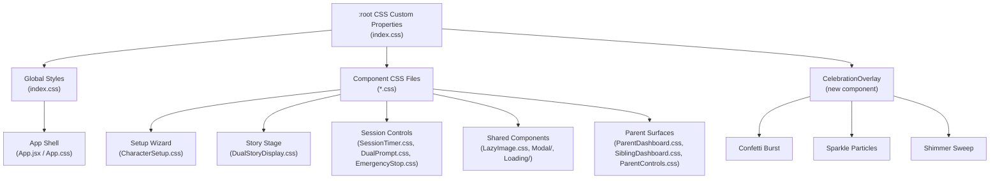

# Design Document: Child-Friendly UI Redesign

## Overview

This design transforms TwinSpark Chronicles from a functional storybook app into a premium, magical experience targeting 6-year-old twins. The redesign is purely frontend — no backend changes. It extends the existing CSS custom property system in `index.css`, adds a lightweight celebration system (confetti/sparkles via pure CSS + minimal JS), enhances the animation engine with `prefers-reduced-motion` support, and applies component-by-component visual upgrades.

The approach is CSS-first: design tokens expand in `:root`, component CSS files receive targeted updates, and a single new `CelebrationOverlay` component handles particle effects. No new Zustand stores, no heavy animation libraries, no structural changes to the React component tree.

### Key Design Decisions

1. **CSS Custom Properties as the single source of truth** — All visual tokens (colors, radii, shadows, spacing, typography) live in `index.css :root`. Components consume tokens, never hardcode values.
2. **No new dependencies** — Confetti and sparkle effects use CSS `@keyframes` + a small JS particle spawner (~100 lines). No framer-motion, no lottie, no GSAP.
3. **Progressive enhancement** — All celebrations degrade gracefully under `prefers-reduced-motion: reduce` to simple opacity fades.
4. **Existing architecture preserved** — Zustand stores, i18n via `locales.js`, component file structure, and all accessibility attributes remain untouched.

## Architecture

### System Layers



### CSS Architecture Strategy

**Global layer** (`index.css`):
- Expanded `:root` tokens (new colors, glow shadows, spacing scale)
- Shared keyframe animations (reusable across components)
- Utility classes (`.celebration-confetti`, `.shimmer-sweep`, etc.)
- `prefers-reduced-motion` overrides

**Component layer** (individual `.css` files):
- Component-specific styling that consumes global tokens
- Scoped animations that only apply to that component
- Responsive breakpoints per component

This two-layer approach avoids CSS specificity wars and keeps the token system centralized.

## Components and Interfaces

### 1. Design System Token Expansion (index.css)

New tokens added to `:root`:

```css
:root {
  /* ── Extended accent palette (light / base / glow) ── */
  --color-pink:        #f472b6;
  --color-pink-light:  #fbcfe8;
  --color-pink-glow:   rgba(244, 114, 182, 0.4);
  
  --color-magenta:     #e879f9;
  --color-magenta-light: #f0abfc;
  --color-magenta-glow: rgba(232, 121, 249, 0.4);
  
  --color-violet-light: #c4b5fd;
  --color-violet-glow:  rgba(167, 139, 250, 0.4);
  
  --color-coral-light: #fda4af;
  --color-coral-glow:  rgba(251, 113, 133, 0.4);
  
  --color-gold-glow:   rgba(251, 191, 36, 0.4);
  
  --color-emerald-light: #6ee7b7;
  --color-emerald-glow:  rgba(52, 211, 153, 0.4);
  
  --color-sky-light:   #7dd3fc;
  --color-sky-glow:    rgba(56, 189, 248, 0.4);
  
  --color-amber-light: #fcd34d;
  --color-amber-glow:  rgba(245, 158, 11, 0.4);

  /* ── Spacing scale ──────────────────────────────── */
  --space-xs:  4px;
  --space-sm:  8px;
  --space-md:  16px;
  --space-lg:  24px;
  --space-xl:  32px;
  --space-2xl: 48px;

  /* ── Touch target minimums ──────────────────────── */
  --touch-min-child:  56px;
  --touch-min-card:   120px;
  --touch-min-choice: 160px;
  --touch-gap:        12px;

  /* ── Typography scale ───────────────────────────── */
  --text-body:    18px;
  --text-heading: 28px;
  --text-hero:    clamp(2.2rem, 6vw, 3.5rem);
  --text-card:    1.1rem;

  /* ── Glow shadows ───────────────────────────────── */
  --shadow-glow-gold:    0 0 24px rgba(251, 191, 36, 0.3);
  --shadow-glow-violet:  0 0 24px rgba(167, 139, 250, 0.3);
  --shadow-glow-pink:    0 0 24px rgba(244, 114, 182, 0.3);
  --shadow-glow-emerald: 0 0 24px rgba(52, 211, 153, 0.3);
  --shadow-glow-coral:   0 0 24px rgba(251, 113, 133, 0.3);
}
```

### 2. CelebrationOverlay Component (New)

A single lightweight React component that renders particle effects as absolutely-positioned DOM elements with CSS animations.

```
frontend/src/shared/components/CelebrationOverlay.jsx
frontend/src/shared/components/CelebrationOverlay.css
```

**Interface:**

```jsx
<CelebrationOverlay
  type="confetti" | "sparkle" | "star-shower" | "shimmer"
  duration={2500}       // ms, auto-cleanup
  particleCount={50}    // number of particles
  origin={{ x, y }}     // optional origin point (defaults to center)
  colors={['#fbbf24', '#f472b6', '#a78bfa']}  // optional color override
/>
```

**Internal architecture:**
- On mount, spawns `particleCount` `<span>` elements with randomized CSS custom properties (`--x`, `--y`, `--delay`, `--rotation`, `--color`)
- Each particle uses a shared `@keyframes` animation (e.g., `confetti-fall`, `sparkle-burst`, `star-fall`)
- Auto-removes from DOM after `duration` ms via `useEffect` cleanup
- Checks `prefers-reduced-motion` via `window.matchMedia` — if active, renders nothing (or a single opacity fade)
- No canvas, no requestAnimationFrame loop — pure CSS animation on DOM elements

**Celebration types:**

| Type | Particles | Duration | Use Case |
|------|-----------|----------|----------|
| `confetti` | 50-80 | 2500ms | Setup complete, story milestones |
| `sparkle` | 8-12 | 800ms | Step transitions, micro-celebrations |
| `star-shower` | 15-20 | 1500ms | Voice recording saved |
| `shimmer` | 1 (sweep) | 800ms | Scene image reveal |

### 3. Component-by-Component Redesign Plan

#### App Shell (App.jsx / App.css)
- Title shimmer: continuous gradient-shift animation on `.app-title` (4-6s loop)
- Floating mic: increase to 80×80px, add pulse rings on active state
- Background particles: enhance existing `::before` pseudo-element with more varied radial gradients

#### Setup Wizard (CharacterSetup.jsx / CharacterSetup.css)
- Progress indicator: new `.wizard-progress` element — row of glowing dots/stars
- Spirit cards: increase emoji to 48px+, add floating animation, glow border on hover using `--spirit-color`
- Name input: increase to 64px height, 24px font
- Review step: slide-in from opposite sides with 200ms stagger

#### Story Stage (DualStoryDisplay.jsx / DualStoryDisplay.css)
- Choice cards: add radial glow layer, increase min-size to 160×140px desktop
- Narration: increase font to 20px, line-height 1.8
- Scene image: shimmer sweep on load via CelebrationOverlay type="shimmer"
- Non-selected cards: fade to opacity 0.3 + scale 0.95 on selection

#### Session Controls
- SessionTimer: pill badge with emoji icon, amber glow on warning (no alarming flash)
- EmergencyStop: increase to 64px diameter, soft red gradient, friendly emoji icon
- DualPrompt: increase bubble to 90×80px min, celebratory checkmark animation
- SessionStatus: animated icon (spinning sparkle / steady glow) instead of text
- ContinueScreen: large illustrated cards (200px+ wide), hover-lift

#### Shared Components
- LoadingAnimation: replace spinner with animated magical object (bouncing star + orbiting sparkles)
- AlertModal: 24px radius, glassmorphism, large emoji header, 56px buttons
- ExitModal: warm gradients, friendly emoji, differentiated Save (green) / Exit (muted) buttons
- LazyImage: update shimmer to use accent colors from design system
- Modal entrance/exit: scale 0.85→1.0 in, 1.0→0.9 out

#### Parent Surfaces
- ParentDashboard: apply glassmorphism card style, design system radii and colors
- ParentControls: same modal animations as child-facing modals
- SiblingDashboard: gradient fills on score bars using accent colors, animated value transitions

### 4. Animation Engine Enhancements

New shared keyframes added to `index.css`:

```css
/* Celebration keyframes */
@keyframes confetti-fall { ... }
@keyframes sparkle-burst { ... }
@keyframes star-fall { ... }
@keyframes shimmer-sweep { ... }

/* Micro-interaction keyframes */
@keyframes tap-ripple { ... }
@keyframes name-sparkle { ... }
@keyframes arrow-thrust { ... }
@keyframes title-shimmer { ... }
@keyframes check-pop { ... }

/* Enhanced existing */
@keyframes pulse-ring-gentle { ... }  /* softer version for warnings */
```

All new animations wrapped in:
```css
@media (prefers-reduced-motion: reduce) {
  /* Replace with opacity-only transitions or disable entirely */
}
```

### 5. Micro-Interaction System

Rather than a separate component, micro-interactions are implemented as CSS classes + minimal JS event handlers:

- **Tap ripple**: CSS `::after` pseudo-element with `tap-ripple` animation, triggered by adding/removing a class
- **Name sparkle**: CSS shimmer on `.wizard-name-input` triggered after successful submit
- **Arrow thrust**: CSS animation on `.wizard-next-btn` on click
- **Title shimmer**: Continuous CSS `background-position` animation on `.app-title`

A small utility hook `useTapFeedback()` can add the ripple class on pointerdown and remove it after animation completes.

## Data Models

This is a purely frontend/CSS feature — no new data models are introduced. The existing data flow remains:

- **Zustand stores** (unchanged): `setupStore`, `storyStore`, `sessionStore`, `audioStore`, `siblingStore`, `parentControlsStore`, `sessionPersistenceStore`
- **i18n** (`locales.js`): No new translation keys required for visual-only changes. If celebration text is added later, keys follow existing `en`/`es` pattern.
- **Component props**: `CelebrationOverlay` accepts the props defined above. No new store integration needed — celebrations are triggered imperatively from event handlers that already exist (e.g., `handleSpiritPick`, `handleChoiceTap`, `handleSetupComplete`).

### CelebrationOverlay Internal State

```typescript
// Internal only — not a store, just component state
interface Particle {
  id: number;
  x: number;      // random 0-100 (vw%)
  y: number;      // random start position
  delay: number;   // staggered start (ms)
  rotation: number; // random 0-360
  color: string;   // picked from colors array
  scale: number;   // random 0.5-1.5
}
```

Particles are generated on mount via `Array.from({ length: particleCount }, ...)` with `Math.random()` values, rendered as `<span>` elements with inline CSS custom properties, and cleaned up on unmount.


## Correctness Properties

*A property is a characteristic or behavior that should hold true across all valid executions of a system — essentially, a formal statement about what the system should do. Properties serve as the bridge between human-readable specifications and machine-verifiable correctness guarantees.*

### Property 1: Touch target minimum dimensions by category

*For any* interactive element rendered in the app, its computed width and height must meet the minimum tappable area specified for its category: general child-facing targets ≥ 56×56px, wizard cards ≥ 120×120px, story choice cards ≥ 160×140px (desktop) or ≥ full-width×80px (mobile ≤767px), EmergencyStop ≥ 64×64px, floating mic ≥ 80×80px, DualPrompt bubbles ≥ 90×80px (desktop) or ≥ 72×64px (mobile), name input height ≥ 64px, parent nav buttons ≥ 48×48px, LanguageSelector cards ≥ 140×140px, ContinueScreen cards ≥ 200px wide, and PrivacyModal/AlertModal/ExitModal action buttons height ≥ 56px.

**Validates: Requirements 2.1, 2.2, 2.3, 2.4, 2.5, 2.7, 5.5, 5.6, 7.1, 7.3, 7.4, 7.6, 8.1, 8.2, 8.3, 11.4**

### Property 2: Adjacent touch target gap enforcement

*For any* pair of adjacent child-facing touch targets within the same container (e.g., wizard card grids, choice card grids, DualPrompt bubble row), the computed gap between their bounding boxes must be ≥ 12px.

**Validates: Requirements 2.6**

### Property 3: Typography minimum sizes by element role

*For any* child-facing text element, its computed font-size must meet the minimum for its role: body text ≥ 18px, headings ≥ 28px, narration text ≥ 20px, name input ≥ 24px, spirit animal emoji ≥ 48px, choice card icons ≥ 48px, flag emoji in LanguageSelector ≥ 56px.

**Validates: Requirements 1.3, 5.1, 6.1, 6.2**

### Property 4: Animation durations fall within specified ranges

*For any* CSS animation class in the system, its `animation-duration` must fall within the range specified for its category: entrance animations 300–600ms, wizard step slide transitions 350ms, hover/focus transitions ≤ 250ms, floating animations 3–4s, Ken Burns effect 20s, tactile press feedback ≤ 250ms, title shimmer loop 4–6s, modal entrance 300ms, modal exit 200ms.

**Validates: Requirements 3.1, 3.4, 3.5, 3.6, 3.7, 8.4, 8.5, 9.6**

### Property 5: Tactile press feedback on all child-facing touch targets

*For any* child-facing interactive element, its `:active` state must apply `transform: scale(0.92)` (or within ±0.02) and its transition duration must be ≤ 250ms, providing consistent tactile feedback across the entire app.

**Validates: Requirements 3.2**

### Property 6: CelebrationOverlay renders correct particle count

*For any* positive integer N passed as `particleCount` to the CelebrationOverlay component, the component must render exactly N particle `<span>` elements in the DOM when `prefers-reduced-motion` is not active. When `prefers-reduced-motion` is active, the component must render zero particle elements regardless of the requested count.

**Validates: Requirements 4.2, 4.7, 12.2**

### Property 7: Non-selected choice cards fade out on selection

*For any* set of story choice cards where one card is selected (index `i`), all cards at indices `j ≠ i` must have their opacity reduced to ≤ 0.3 and scale reduced to ≤ 0.95, while the selected card at index `i` must have the `story-choice-card--selected` class applied.

**Validates: Requirements 6.6**

### Property 8: Responsive layout adaptation at mobile breakpoint

*For any* viewport width ≤ 767px: story choice cards must use a vertical stack layout (`flex-direction: column`), perspective cards must use a single-column grid (`grid-template-columns: 1fr`), wizard cards must maintain minimum dimensions of 100×100px with emoji ≥ 36px, and DualPrompt bubbles must maintain minimum dimensions of 72×64px.

**Validates: Requirements 10.1, 10.2, 10.3, 10.5**

### Property 9: Celebration overlay does not trap focus or block interaction

*For any* active CelebrationOverlay instance, the overlay container element must have `pointer-events: none` and must contain zero focusable elements (no elements with `tabindex >= 0`, no `<button>`, no `<a>`, no `<input>`), ensuring keyboard navigation and interaction with underlying content is never blocked.

**Validates: Requirements 12.5**

### Property 10: Decorative emoji elements have aria-hidden

*For any* element in the rendered DOM that contains a single emoji character and is marked as decorative (i.e., not part of interactive text content), it must have the `aria-hidden="true"` attribute set.

**Validates: Requirements 12.6**

### Property 11: Wizard progress indicator reflects current step

*For any* wizard step index `k` out of total `T` steps, the progress indicator must render exactly `T` dot/star elements, where exactly `k` elements are marked as completed (with a completed visual class) and exactly 1 element is marked as current (with a glowing/active visual class).

**Validates: Requirements 5.4**

### Property 12: Wizard card interaction states (hover glow and selection bounce)

*For any* wizard selection card (spirit, tool, outfit, toy, place), hovering or focusing must apply a `transform: scale()` between 1.05 and 1.08 with a colored glow border, and selecting must apply a bounce animation class and a persistent glow border in the selection's theme color.

**Validates: Requirements 3.7, 5.2**

### Property 13: Reduced motion disables all transform and particle animations

*For any* CSS animation or transition defined in the system, when the `prefers-reduced-motion: reduce` media query is active, the effective `animation-duration` must be ≤ 1ms (effectively disabled) or the animation must be replaced with a simple opacity transition. This applies to all decorative animations on `body::before`, `body::after`, `.app-container::before`, `.logo-animation`, and all CelebrationOverlay particles.

**Validates: Requirements 4.7, 12.2**

### Property 14: Color contrast ratio for text content

*For any* text element rendered in the app with a defined foreground color and background color, the computed contrast ratio between the two must be ≥ 4.5:1 as defined by WCAG 2.1 AA. This applies to all body text, headings, button labels, narration text, and card labels.

**Validates: Requirements 12.1**

## Error Handling

Since this is a purely visual/CSS feature, error handling is minimal and focused on graceful degradation:

1. **CelebrationOverlay cleanup**: If the component unmounts before the animation duration completes (e.g., user navigates away), the `useEffect` cleanup removes all spawned particle elements. No orphaned DOM nodes.

2. **Font loading failure**: The design system specifies `'Fredoka', sans-serif` and `'Quicksand', sans-serif` — the `sans-serif` fallback ensures text remains readable if Google Fonts CDN is unavailable. The `display=swap` parameter in the font import prevents invisible text during loading.

3. **prefers-reduced-motion detection failure**: If `window.matchMedia` is unavailable (very old browsers), the CelebrationOverlay defaults to rendering particles normally. The CSS `@media (prefers-reduced-motion: reduce)` block still applies independently at the stylesheet level.

4. **CSS custom property fallback**: All `var()` usages in component CSS should include fallback values for critical properties (e.g., `var(--radius-lg, 28px)`) — this is already the pattern in existing code like `SessionTimer.css`.

5. **Particle spawn overflow**: CelebrationOverlay caps `particleCount` at 100 to prevent DOM thrashing. Values above 100 are clamped silently.

## Testing Strategy

### Dual Testing Approach

Both unit tests and property-based tests are required for comprehensive coverage.

**Unit tests** cover:
- Specific examples: CelebrationOverlay renders with type="confetti", specific CSS token values exist in `:root`
- Edge cases: CelebrationOverlay with particleCount=0, unmount during animation, missing origin prop
- Integration: Modal open/close animation classes are applied correctly, wizard step transitions trigger correct CSS classes
- Snapshot: Key components render without regression after CSS changes

**Property-based tests** cover:
- Universal properties across all inputs: touch target sizing, typography minimums, animation durations, responsive behavior, accessibility attributes
- Each property from the Correctness Properties section above

### Property-Based Testing Configuration

- **Library**: `fast-check` (already available in the JS/Vite ecosystem, lightweight, no heavy dependencies)
- **Minimum iterations**: 100 per property test (using `fc.assert` with `{ numRuns: 100 }`)
- **Tag format**: Each test tagged with a comment: `// Feature: child-friendly-ui-redesign, Property {N}: {title}`
- **Each correctness property is implemented by a SINGLE property-based test**

### Test File Structure

```
frontend/src/__tests__/
  child-friendly-ui-redesign/
    design-system.property.test.js    — Properties 1, 2, 3, 4, 14
    celebration-overlay.property.test.js — Properties 6, 9
    animation-engine.property.test.js  — Properties 5, 13
    story-stage.property.test.js       — Properties 7, 8
    setup-wizard.property.test.js      — Properties 11, 12
    accessibility.property.test.js     — Property 10
```

### Test Approach Details

For CSS-focused property tests, the strategy is:
1. **Generate random element configurations** (e.g., random element categories, random viewport widths, random celebration types)
2. **Render components with JSDOM/happy-dom** via Vitest
3. **Query computed styles** to verify token values, dimensions, and animation properties
4. **Assert invariants** hold across all generated inputs

For the CelebrationOverlay component specifically:
1. Generate random `particleCount` (1–100), random `type`, random `duration`
2. Render the component
3. Assert DOM contains exactly `particleCount` particle elements
4. Assert cleanup after duration
5. Assert zero particles when reduced-motion is simulated
