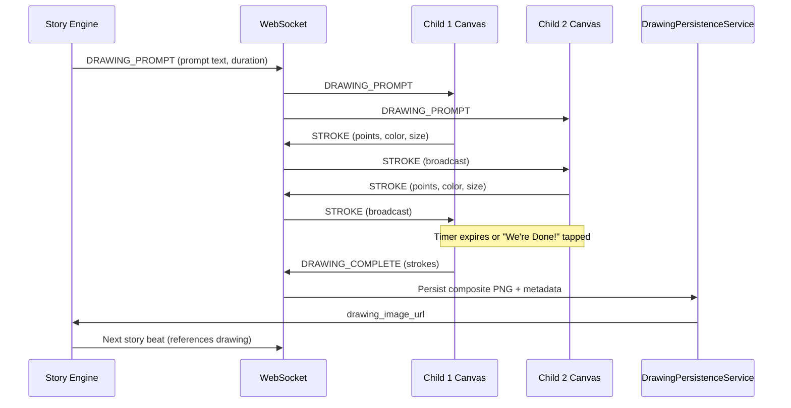
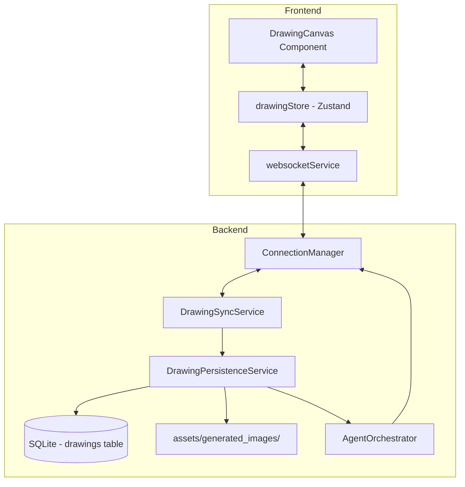

# Design Document: Collaborative Drawing

## Overview

Collaborative Drawing adds a shared HTML5 Canvas experience to Twin Spark Chronicles, allowing both siblings to draw together during story moments. The Story Engine triggers drawing sessions at narrative beats, presenting a prompt (e.g., "Draw the magic door you want to open!"). Both children draw simultaneously on a shared canvas with real-time stroke synchronization via the existing WebSocket connection. When the session ends, the drawing is composited into a PNG, persisted to the database, and the AI weaves a narrative acknowledgment into the next story beat.

The feature integrates tightly with the existing architecture: the backend orchestrator triggers drawing prompts, the `ConnectionManager` WebSocket routes stroke messages, a new `DrawingPersistenceService` saves composites, and a new `drawingStore` (Zustand) manages canvas state on the frontend. No new heavy dependencies are introduced — the canvas uses native HTML5 Canvas API, and stroke sync piggybacks on the existing WebSocket transport.



## Architecture

The feature follows the existing layered architecture:

**Frontend Layer:**
- `DrawingCanvas` component — HTML5 Canvas with touch/mouse input, color palette, brush sizes, stamps, undo, eraser
- `drawingStore` (Zustand) — manages strokes, undo stacks per sibling, sync queue, session state
- Stroke messages sent/received via the existing `websocketService` singleton

**Backend Layer:**
- `DrawingSyncService` — validates and broadcasts stroke JSON messages between siblings via `ConnectionManager`
- `DrawingPersistenceService` — renders strokes to PNG using Pillow, saves to `assets/generated_images/`, stores metadata in SQLite
- Orchestrator integration — the `AgentOrchestrator` triggers `DRAWING_PROMPT` messages and incorporates drawing context into the next story beat

**Data Layer:**
- New `drawings` table in SQLite for drawing metadata
- New migration file `007_collaborative_drawing.sql`
- Composite PNGs stored on disk at `assets/generated_images/drawing_{timestamp}.png`



## Components and Interfaces

### Frontend Components

#### `DrawingCanvas` (`frontend/src/features/drawing/components/DrawingCanvas.jsx`)

The main canvas component. Renders when a drawing session is active.

```jsx
// Props
{
  prompt: string,           // Drawing prompt text from story engine
  duration: number,         // Session duration in seconds (30-120)
  siblingId: string,        // "child1" or "child2"
  profiles: object,         // Child profiles for name display
  onComplete: (strokes) => void  // Called when session ends
}
```

Key behaviors:
- Full-width canvas, min 300×300 CSS px
- Multi-touch support via `PointerEvent` API (coalesced events for smoothness)
- Color palette (8 colors), brush sizes (3), eraser, undo, stamp mode
- Animated entrance/exit transitions (CSS keyframes)
- Visual countdown timer
- "We're Done!" button
- Responsive: tools stack below canvas on viewports < 768px
- ARIA live regions for tool changes and session state

#### `DrawingToolbar` (`frontend/src/features/drawing/components/DrawingToolbar.jsx`)

Extracted toolbar for color, brush, eraser, undo, stamp selection. Keyboard navigable (arrow keys + Enter).

#### `DrawingCountdown` (`frontend/src/features/drawing/components/DrawingCountdown.jsx`)

Visual countdown ring/bar showing remaining drawing time.

### Frontend Store

#### `drawingStore` (`frontend/src/stores/drawingStore.js`)

```javascript
{
  // State
  isActive: false,
  prompt: '',
  duration: 60,
  remainingTime: 60,
  strokes: [],                    // All strokes (local + remote)
  undoStacks: { child1: [], child2: [] },
  selectedColor: '#FF6B6B',
  selectedBrushSize: 'medium',
  selectedTool: 'brush',          // 'brush' | 'eraser' | 'stamp'
  selectedStamp: null,
  syncQueue: [],                  // Queued strokes during disconnect
  syncStatus: 'connected',

  // Actions
  startSession(prompt, duration),
  endSession(),
  addStroke(stroke),
  addRemoteStroke(stroke),
  undoLastStroke(siblingId),
  setColor(color),
  setBrushSize(size),
  setTool(tool),
  setStamp(stamp),
  queueStroke(stroke),
  flushSyncQueue(),
  tick(),                         // Decrement remainingTime
  reset(),
}
```

### Backend Services

#### `DrawingSyncService` (`backend/app/services/drawing_sync_service.py`)

```python
class DrawingSyncService:
    def validate_stroke(self, data: dict) -> StrokeMessage | None:
        """Validate incoming stroke JSON. Returns parsed StrokeMessage or None."""

    def serialize_stroke(self, stroke: StrokeMessage) -> str:
        """Serialize StrokeMessage to JSON string."""

    def deserialize_stroke(self, json_str: str) -> StrokeMessage | None:
        """Deserialize JSON string to StrokeMessage. Returns None on failure."""
```

#### `DrawingPersistenceService` (`backend/app/services/drawing_persistence_service.py`)

```python
class DrawingPersistenceService:
    def __init__(self, db: DatabaseConnection):
        self._db = db

    async def save_drawing(
        self,
        session_id: str,
        sibling_pair_id: str,
        strokes: list[dict],
        prompt: str,
        duration_seconds: int,
        beat_index: int,
    ) -> DrawingRecord:
        """Render strokes to PNG, save to disk, store metadata in DB."""

    def render_composite(self, strokes: list[dict], width: int, height: int) -> bytes:
        """Render stroke data into a PNG image using Pillow. Returns PNG bytes."""

    async def get_drawing(self, drawing_id: str) -> DrawingRecord | None:
        """Retrieve drawing metadata by ID."""

    async def get_drawings_for_session(self, session_id: str) -> list[DrawingRecord]:
        """List all drawings for a story session."""
```

#### Orchestrator Integration

The existing `AgentOrchestrator` gains:
- A method to decide when to inject a `DRAWING_PROMPT` into the story flow (based on storyteller output containing a `drawing_prompt` field)
- Post-drawing narrative generation that references the drawing activity and both siblings by name
- Drawing session duration adjustment based on remaining session time (Req 9.3)

### WebSocket Message Types

New message types added to the existing WebSocket protocol:

```
Server → Client:
  DRAWING_PROMPT    { type, prompt, duration, session_id }
  DRAWING_STROKE    { type, stroke: StrokeMessage }
  DRAWING_END       { type, reason: "timeout"|"manual"|"session_expired" }

Client → Server:
  DRAWING_STROKE    { type, stroke: StrokeMessage }
  DRAWING_COMPLETE  { type, strokes: StrokeMessage[], session_id }
  DRAWING_EARLY_END { type, session_id }
```

## Data Models

### StrokeMessage (shared JSON schema)

```json
{
  "session_id": "string",
  "sibling_id": "child1 | child2",
  "points": [{ "x": 0.0, "y": 0.0 }],
  "color": "#FF6B6B",
  "brush_size": 4,
  "timestamp": "2025-01-15T10:30:00.000Z",
  "tool": "brush | eraser | stamp",
  "stamp_shape": "star | heart | circle | lightning"
}
```

Coordinates are normalized to 0.0–1.0 range (fraction of canvas dimensions) so they render correctly across different screen sizes.

### Python Dataclass

```python
@dataclass
class StrokeMessage:
    session_id: str
    sibling_id: str          # "child1" or "child2"
    points: list[dict]       # [{"x": float, "y": float}, ...]
    color: str               # hex color string
    brush_size: int           # pixel width
    timestamp: str            # ISO 8601
    tool: str = "brush"       # "brush", "eraser", "stamp"
    stamp_shape: str | None = None

REQUIRED_FIELDS = {"session_id", "sibling_id", "points", "color", "brush_size", "timestamp"}
```

### DrawingRecord (database model)

```python
@dataclass
class DrawingRecord:
    drawing_id: str
    session_id: str
    sibling_pair_id: str
    prompt: str
    stroke_count: int
    duration_seconds: int
    image_path: str          # e.g. "assets/generated_images/drawing_1737000000.png"
    beat_index: int
    created_at: str          # ISO 8601
```

### Database Migration (`007_collaborative_drawing.sql`)

```sql
CREATE TABLE IF NOT EXISTS drawings (
    drawing_id      TEXT PRIMARY KEY,
    session_id      TEXT NOT NULL,
    sibling_pair_id TEXT NOT NULL,
    prompt          TEXT NOT NULL,
    stroke_count    INTEGER NOT NULL DEFAULT 0,
    duration_seconds INTEGER NOT NULL DEFAULT 0,
    image_path      TEXT NOT NULL,
    beat_index      INTEGER NOT NULL DEFAULT 0,
    created_at      TEXT NOT NULL
);

CREATE INDEX IF NOT EXISTS idx_drawings_session
    ON drawings(session_id);

CREATE INDEX IF NOT EXISTS idx_drawings_pair
    ON drawings(sibling_pair_id, created_at DESC);
```


## Correctness Properties

*A property is a characteristic or behavior that should hold true across all valid executions of a system — essentially, a formal statement about what the system should do. Properties serve as the bridge between human-readable specifications and machine-verifiable correctness guarantees.*

### Property 1: Distinct default colors per sibling

*For any* two sibling identifiers ("child1" and "child2"), the default color assigned to child1 strokes SHALL differ from the default color assigned to child2 strokes.

**Validates: Requirements 1.5**

### Property 2: Remote stroke preserves attributes

*For any* stroke received from a remote sibling, when added to the local drawing store, the rendered stroke SHALL retain the original sibling's color and brush size unchanged.

**Validates: Requirements 2.3**

### Property 3: Queue-and-replay preserves stroke order

*For any* sequence of strokes queued during a WebSocket disconnect, flushing the sync queue SHALL produce the same strokes in the same order as they were queued.

**Validates: Requirements 2.4**

### Property 4: Stroke validation rejects incomplete data

*For any* stroke message missing one or more required fields (session_id, sibling_id, points, color, brush_size, timestamp) or containing an empty points array, the `validate_stroke` function SHALL return None (rejection) without raising an exception.

**Validates: Requirements 2.5, 7.4**

### Property 5: Drawing duration clamped to valid range

*For any* requested drawing session duration, the effective duration SHALL be clamped to the range [30, 120] seconds. Values below 30 become 30, values above 120 become 120.

**Validates: Requirements 3.2**

### Property 6: Session ends when drawing timer expires

*For any* active drawing session, when the remaining time reaches zero, the session's `isActive` state SHALL become false and no further strokes SHALL be accepted.

**Validates: Requirements 3.4**

### Property 7: Stroke serialization round-trip

*For any* valid StrokeMessage object, serializing it to JSON and then deserializing back and serializing again SHALL produce an identical JSON string.

**Validates: Requirements 7.1, 7.2, 7.3**

### Property 8: Render produces valid PNG for any strokes

*For any* non-empty list of valid strokes with normalized coordinates in [0.0, 1.0], the `render_composite` function SHALL produce a byte sequence whose first 8 bytes match the PNG magic number (`\x89PNG\r\n\x1a\n`).

**Validates: Requirements 4.1**

### Property 9: Persistence stores all required metadata with correct filename

*For any* completed drawing session, the saved `DrawingRecord` SHALL contain non-empty session_id, sibling_pair_id, prompt, and image_path fields, a stroke_count ≥ 0, a duration_seconds ≥ 0, and the image_path SHALL match the pattern `assets/generated_images/drawing_{digits}.png`.

**Validates: Requirements 4.2, 4.3**

### Property 10: Undo removes exactly the last stroke of the active sibling

*For any* drawing store state where a sibling has at least one stroke, calling undo for that sibling SHALL reduce that sibling's stroke count by exactly one and the removed stroke SHALL be the most recently added stroke by that sibling.

**Validates: Requirements 6.1, 6.2**

### Property 11: Eraser strokes use canvas background color

*For any* stroke created while the eraser tool is selected, the stroke's color SHALL equal the canvas background color (white, `#FFFFFF`).

**Validates: Requirements 6.3**

### Property 12: Undo isolation between siblings

*For any* interleaved sequence of strokes from child1 and child2, calling undo for child1 SHALL not change the count or content of child2's strokes, and vice versa.

**Validates: Requirements 6.4**

### Property 13: Palette colors meet contrast ratio against canvas background

*For all* colors in the drawing palette, the WCAG contrast ratio between that color and the canvas background color (#FFFFFF) SHALL be at least 3.0:1.

**Validates: Requirements 8.3**

### Property 14: Session time continues during drawing

*For any* active drawing session, the `SessionTimeEnforcer` SHALL not pause elapsed time counting — the effective elapsed time after a drawing session of duration D seconds SHALL increase by at least D seconds (minus any generation pauses unrelated to drawing).

**Validates: Requirements 9.1**

### Property 15: Drawing duration reduced to fit remaining session time

*For any* remaining session time R and requested drawing duration D where R < D, the effective drawing session duration SHALL equal R (clamped to remaining time).

**Validates: Requirements 9.3**

## Error Handling

| Scenario | Handling |
|---|---|
| WebSocket disconnects during drawing | `drawingStore` queues outgoing strokes in `syncQueue`. On reconnect, `flushSyncQueue()` replays them in order. Remote strokes missed during disconnect are not recoverable (acceptable — drawing is ephemeral). |
| Composite PNG rendering fails (Pillow error) | `DrawingPersistenceService.save_drawing` catches the exception, logs a warning, and returns a `DrawingRecord` with `image_path=""`. The story continues without the drawing image. (Req 4.4) |
| Invalid stroke message received | `DrawingSyncService.validate_stroke` returns `None`. The message is discarded and a warning is logged. The drawing session continues uninterrupted. (Req 7.4) |
| Session time expires during drawing | The backend sends a `DRAWING_END` message with `reason: "session_expired"`. The frontend immediately ends the drawing session, persists whatever strokes exist, and triggers the standard session-end flow. (Req 9.2) |
| Canvas too small (viewport < 300px) | The canvas renders at the minimum 300×300 CSS px with horizontal scroll if needed. Tools stack below. |
| Undo on empty stack | The undo button is visually disabled. Calling `undoLastStroke` on an empty stack is a no-op. (Req 6.5) |
| Drawing session requested with duration > remaining session time | The orchestrator clamps the drawing duration to the remaining session time before sending `DRAWING_PROMPT`. (Req 9.3) |

## Testing Strategy

### Property-Based Tests (Backend — Python / Hypothesis)

Each correctness property is implemented as a single Hypothesis property test with `max_examples=20`. Tests live in `backend/tests/test_drawing_properties.py`.

| Property | Test Function | Tag |
|---|---|---|
| P1: Distinct default colors | `test_distinct_default_colors` | Feature: collaborative-drawing, Property 1: Distinct default colors per sibling |
| P4: Stroke validation rejects incomplete data | `test_stroke_validation_rejects_incomplete` | Feature: collaborative-drawing, Property 4: Stroke validation rejects incomplete data |
| P5: Duration clamped to valid range | `test_duration_clamped` | Feature: collaborative-drawing, Property 5: Drawing duration clamped to valid range |
| P7: Stroke serialization round-trip | `test_stroke_serialization_round_trip` | Feature: collaborative-drawing, Property 7: Stroke serialization round-trip |
| P8: Render produces valid PNG | `test_render_produces_valid_png` | Feature: collaborative-drawing, Property 8: Render produces valid PNG for any strokes |
| P9: Persistence metadata correctness | `test_persistence_metadata` | Feature: collaborative-drawing, Property 9: Persistence stores all required metadata with correct filename |
| P13: Palette contrast ratio | `test_palette_contrast_ratio` | Feature: collaborative-drawing, Property 13: Palette colors meet contrast ratio against canvas background |
| P15: Duration reduced to remaining time | `test_duration_reduced_to_remaining` | Feature: collaborative-drawing, Property 15: Drawing duration reduced to fit remaining session time |

### Property-Based Tests (Frontend — JavaScript / fast-check)

Frontend property tests live in `frontend/src/features/drawing/__tests__/drawing.property.test.js` using `fast-check`.

| Property | Test Function | Tag |
|---|---|---|
| P2: Remote stroke preserves attributes | `test_remote_stroke_preserves_attributes` | Feature: collaborative-drawing, Property 2 |
| P3: Queue-and-replay preserves order | `test_queue_replay_preserves_order` | Feature: collaborative-drawing, Property 3 |
| P6: Session ends when timer expires | `test_session_ends_on_timer` | Feature: collaborative-drawing, Property 6 |
| P10: Undo removes last stroke | `test_undo_removes_last_stroke` | Feature: collaborative-drawing, Property 10 |
| P11: Eraser uses background color | `test_eraser_uses_background_color` | Feature: collaborative-drawing, Property 11 |
| P12: Undo isolation between siblings | `test_undo_isolation` | Feature: collaborative-drawing, Property 12 |

### Unit Tests

Unit tests complement property tests by covering specific examples, edge cases, and integration points:

**Backend** (`backend/tests/test_drawing_sync_service.py`, `backend/tests/test_drawing_persistence_service.py`):
- Validate a well-formed stroke message (example)
- Reject stroke with missing `session_id` (edge case)
- Reject stroke with empty `points` array (edge case)
- Render composite with zero strokes returns minimal valid PNG (edge case)
- Save drawing writes file to correct path (example)
- Filename pattern matches `drawing_{digits}.png` (example)

**Frontend** (`frontend/src/features/drawing/__tests__/drawingStore.test.js`):
- `startSession` sets `isActive` to true with correct prompt and duration
- `endSession` sets `isActive` to false
- `addStroke` appends to strokes array
- `addRemoteStroke` appends without adding to local undo stack
- `undoLastStroke` with empty stack is a no-op
- `tick` decrements `remainingTime` by 1
- `tick` at 0 does not go negative
- `reset` clears all state
- Color palette has exactly 8 colors
- Brush sizes include thin, medium, thick
- Stamp shapes include star, heart, circle, lightning
