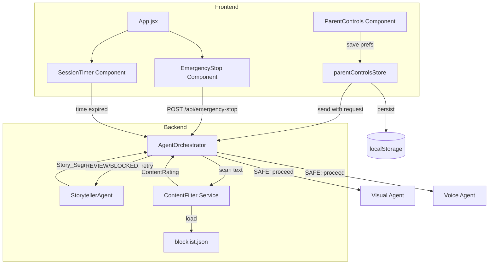

# Design Document: Content Safety System

## Overview

The Content Safety System adds a multi-layered defense to Twin Spark Chronicles ensuring all AI-generated content is strictly age-appropriate for children aged 4–8. It operates at three levels:

1. **Pre-generation**: Tightened Gemini API safety settings (`BLOCK_LOW_AND_ABOVE`) prevent the model from producing harmful content in the first place.
2. **Post-generation**: A `ContentFilter` service scans every story segment against a keyword blocklist and theme rules, assigning a `ContentRating` (SAFE / REVIEW / BLOCKED) before content reaches the frontend.
3. **Runtime controls**: Frontend components give parents session time limits, an always-visible emergency stop, and configurable content preferences (themes, complexity, custom restricted words).

The system integrates into the existing `AgentOrchestrator.generate_rich_story_moment` pipeline — content filtering happens between story text generation (Step 2) and image/voice generation (Step 3), so no downstream work is wasted on unsafe content.

## Architecture



### Key Design Decisions

1. **Filter before image/voice generation**: Placing the `ContentFilter` call immediately after story text generation avoids wasting Imagen 3 and TTS API calls on content that will be discarded. This saves cost and latency.

2. **Blocklist as external JSON**: Storing the blocklist in `backend/app/config/blocklist.json` allows content moderation updates without code deployments. The file is loaded once at startup and can be reloaded via a signal or endpoint.

3. **Parent controls in frontend store**: Content preferences (themes, complexity, custom words) live in a Zustand store persisted to localStorage, matching the existing pattern used by `setupStore` and `sessionStore`. Preferences are sent to the backend with each story request.

4. **Emergency stop as dedicated endpoint**: Rather than overloading the WebSocket protocol, the emergency stop uses a dedicated REST endpoint (`POST /api/emergency-stop/{session_id}`) for reliability — it works even if the WebSocket connection is degraded.

5. **Session timer is frontend-only**: The timer runs entirely in the browser. When time expires, the frontend sends a wrap-up request through the existing WebSocket. No backend timer is needed.

## Components and Interfaces

### Backend Components

#### 1. ContentFilter (`backend/app/services/content_filter.py`)

The core filtering service. Stateless — receives text and config, returns a rating.

```python
from enum import Enum
from dataclasses import dataclass

class ContentRating(str, Enum):
    SAFE = "SAFE"
    REVIEW = "REVIEW"
    BLOCKED = "BLOCKED"

@dataclass
class FilterResult:
    rating: ContentRating
    reason: str
    matched_terms: list[str]

class ContentFilter:
    def __init__(self, blocklist_path: str = "app/config/blocklist.json"):
        """Load blocklist from external JSON file."""

    def reload_blocklist(self) -> None:
        """Reload blocklist from disk (for hot-reload)."""

    def scan(
        self,
        text: str,
        allowed_themes: list[str] | None = None,
        custom_blocked_words: list[str] | None = None,
    ) -> FilterResult:
        """
        Scan text and return a FilterResult.
        1. Check against blocklist + custom_blocked_words (case-insensitive) → BLOCKED
        2. Check against allowed_themes (if provided) → REVIEW
        3. Otherwise → SAFE
        """
```

#### 2. Updated StorytellerAgent (`backend/app/agents/storyteller_agent.py`)

Changes to existing class:
- Update safety settings from `BLOCK_MEDIUM_AND_ABOVE` → `BLOCK_LOW_AND_ABOVE` for all four harm categories.
- Catch `google.generativeai.types.StopCandidateException` (or blocked response) specifically and return a child-friendly fallback instead of a generic error.

```python
# In __init__, updated safety_settings:
safety_settings = [
    {"category": "HARM_CATEGORY_HARASSMENT", "threshold": "BLOCK_LOW_AND_ABOVE"},
    {"category": "HARM_CATEGORY_HATE_SPEECH", "threshold": "BLOCK_LOW_AND_ABOVE"},
    {"category": "HARM_CATEGORY_SEXUALLY_EXPLICIT", "threshold": "BLOCK_LOW_AND_ABOVE"},
    {"category": "HARM_CATEGORY_DANGEROUS_CONTENT", "threshold": "BLOCK_LOW_AND_ABOVE"},
]
```

#### 3. Updated AgentOrchestrator (`backend/app/agents/orchestrator.py`)

New behavior in `generate_rich_story_moment`:
- After Step 2 (story generation), call `ContentFilter.scan()`.
- If SAFE → proceed to Step 3 (image generation).
- If REVIEW or BLOCKED → discard and retry story generation (max 3 retries).
- After 3 failed retries → return a pre-written safe fallback.
- New method: `cancel_session(session_id)` to support emergency stop.

```python
# New constant
MAX_CONTENT_RETRIES = 3

# In generate_rich_story_moment, between Step 2 and Step 3:
async def _generate_safe_story_segment(self, story_context, user_input, parent_prefs):
    """Generate story with content filtering and retry logic."""
    for attempt in range(MAX_CONTENT_RETRIES):
        segment = await self.storyteller.generate_story_segment(
            context=story_context, user_input=user_input
        )
        result = self.content_filter.scan(
            text=segment["text"],
            allowed_themes=parent_prefs.get("allowed_themes"),
            custom_blocked_words=parent_prefs.get("custom_blocked_words"),
        )
        logger.info(
            "Content filter: session=%s attempt=%d rating=%s reason=%s",
            story_context["session_id"], attempt + 1, result.rating, result.reason,
        )
        if result.rating == ContentRating.SAFE:
            return segment
    # All retries exhausted
    return self.storyteller._fallback_story(story_context)

async def cancel_session(self, session_id: str) -> dict:
    """Cancel all in-flight work for a session (emergency stop)."""
```

#### 4. Emergency Stop Endpoint (`backend/app/main.py`)

```python
@app.post("/api/emergency-stop/{session_id}")
async def emergency_stop(session_id: str):
    """Immediately halt all generation for a session."""
```

### Frontend Components

#### 5. ParentControls Component (`frontend/src/components/ParentControls.jsx`)

A settings panel (accessible from a gear icon) where parents can:
- Select allowed themes from a checkbox list.
- Set story complexity (simple / moderate / advanced).
- Add custom restricted words.
- Set session time limit (15 / 30 / 45 / 60 min).

#### 6. parentControlsStore (`frontend/src/stores/parentControlsStore.js`)

Zustand store persisted to localStorage:

```javascript
{
  allowedThemes: ['friendship', 'nature', 'space', 'animals', 'problem-solving'],
  complexityLevel: 'simple',
  customBlockedWords: [],
  sessionTimeLimitMinutes: 30,
}
```

#### 7. SessionTimer Component (`frontend/src/components/SessionTimer.jsx`)

- Displays remaining time in `MM:SS` format with a child-friendly icon.
- Shows a warning overlay when ≤ 5 minutes remain.
- Triggers a wrap-up sequence when time reaches 0.

#### 8. EmergencyStop Component (`frontend/src/components/EmergencyStop.jsx`)

- A fixed-position red button always visible during active sessions.
- On click: calls `POST /api/emergency-stop/{session_id}`, saves session state, navigates to a safe landing screen.


## Data Models

### ContentRating Enum (Backend)

```python
class ContentRating(str, Enum):
    SAFE = "SAFE"        # Content passes all checks, deliver to frontend
    REVIEW = "REVIEW"    # Content has theme issues, regenerate
    BLOCKED = "BLOCKED"  # Content has blocklist matches, regenerate
```

### FilterResult (Backend)

```python
@dataclass
class FilterResult:
    rating: ContentRating
    reason: str                # Human-readable explanation (e.g., "Blocklist match: 'violence'")
    matched_terms: list[str]   # Terms that triggered the rating (empty for SAFE)
```

### Blocklist File Format (`backend/app/config/blocklist.json`)

```json
{
  "version": "1.0",
  "keywords": [
    "violence",
    "blood",
    "kill",
    "death",
    "weapon",
    "gun",
    "knife",
    "drug",
    "alcohol",
    "hate"
  ],
  "phrases": [
    "run away from home",
    "no one loves you",
    "you are stupid"
  ]
}
```

### Parent Controls State (Frontend)

```typescript
interface ParentControlsState {
  allowedThemes: string[];           // e.g., ['friendship', 'nature', 'animals']
  complexityLevel: 'simple' | 'moderate' | 'advanced';
  customBlockedWords: string[];      // Parent-added restricted words
  sessionTimeLimitMinutes: 15 | 30 | 45 | 60;
}
```

### Available Themes (Shared Constant)

```python
AVAILABLE_THEMES = [
    "friendship",
    "nature",
    "space",
    "animals",
    "problem-solving",
    "creativity",
    "kindness",
    "teamwork",
]
```

### Content Filter Log Entry

```python
@dataclass
class ContentFilterLog:
    session_id: str
    timestamp: str          # ISO 8601
    rating: ContentRating
    reason: str
    text_snippet: str       # First 100 chars of scanned text (for debugging)
```

### Emergency Stop Request/Response

```python
# POST /api/emergency-stop/{session_id}
# Response:
{
    "status": "stopped",
    "session_id": "abc-123",
    "session_saved": true
}
```

### Story Request with Parent Preferences

The existing `StoryRequest` model in `main.py` will be extended:

```python
class StoryRequest(BaseModel):
    profiles: dict
    user_input: str | None = None
    # New fields:
    allowed_themes: list[str] | None = None
    complexity_level: str | None = None
    custom_blocked_words: list[str] | None = None
```


## Correctness Properties

*A property is a characteristic or behavior that should hold true across all valid executions of a system — essentially, a formal statement about what the system should do. Properties serve as the bridge between human-readable specifications and machine-verifiable correctness guarantees.*

### Property 1: Filter rating completeness

*For any* string input (including empty strings, unicode, and arbitrary text), the `ContentFilter.scan()` method SHALL return a `FilterResult` whose `rating` field is exactly one of `ContentRating.SAFE`, `ContentRating.REVIEW`, or `ContentRating.BLOCKED`.

**Validates: Requirements 2.2, 4.1**

### Property 2: Blocklist detection is case-insensitive and includes custom words

*For any* word or phrase present in the default blocklist or the parent-provided custom blocked words list, and *for any* case variation of that word (upper, lower, mixed), if that variation appears in the input text, then `ContentFilter.scan()` SHALL return a `FilterResult` with `rating == ContentRating.BLOCKED`.

**Validates: Requirements 3.2, 3.4, 4.2, 7.3**

### Property 3: Disallowed theme triggers REVIEW

*For any* input text that contains a theme keyword not present in the `allowed_themes` list, and that does not contain any blocklist matches, `ContentFilter.scan()` SHALL return a `FilterResult` with `rating == ContentRating.REVIEW`.

**Validates: Requirements 4.3**

### Property 4: Clean text is rated SAFE

*For any* input text that contains no blocklist matches (default or custom) and no disallowed theme keywords, `ContentFilter.scan()` SHALL return a `FilterResult` with `rating == ContentRating.SAFE`.

**Validates: Requirements 4.4**

### Property 5: Session time display format

*For any* non-negative integer representing remaining seconds, the session timer display function SHALL produce a string matching the `MM:SS` format where MM is zero-padded minutes and SS is zero-padded seconds.

**Validates: Requirements 5.5**

### Property 6: Parent preferences persistence round-trip

*For any* valid `ParentControlsState` object (with `allowedThemes` drawn from the predefined list, `complexityLevel` from {simple, moderate, advanced}, `customBlockedWords` as an array of strings, and `sessionTimeLimitMinutes` from {15, 30, 45, 60}), serializing to localStorage and then deserializing SHALL produce an object equal to the original.

**Validates: Requirements 7.5**

### Property 7: Content filter performance bound

*For any* input text up to 10,000 characters in length, `ContentFilter.scan()` SHALL complete execution within 500 milliseconds.

**Validates: Requirements 8.4**

## Error Handling

### Backend Error Scenarios

| Scenario | Handler | Behavior |
|---|---|---|
| Gemini API blocks response (safety filter) | `StorytellerAgent.generate_story_segment` | Catch the blocked-response exception, return `_fallback_story()` result |
| Gemini API network/timeout error | `StorytellerAgent.generate_story_segment` | Existing `except Exception` handler already returns `_fallback_story()` |
| ContentFilter raises exception | `AgentOrchestrator._generate_safe_story_segment` | Catch exception, log error, return `_fallback_story()` — never deliver unfiltered content (Req 8.3) |
| All 3 content filter retries exhausted | `AgentOrchestrator._generate_safe_story_segment` | Return `_fallback_story()` (Req 2.5) |
| Blocklist file missing or malformed | `ContentFilter.__init__` | Log error, initialize with a hardcoded minimal blocklist so the filter is never empty |
| Emergency stop called for unknown session | `emergency_stop` endpoint | Return 404 with descriptive message |
| Emergency stop called when no tasks in-flight | `AgentOrchestrator.cancel_session` | No-op, return success (idempotent) |

### Frontend Error Scenarios

| Scenario | Handler | Behavior |
|---|---|---|
| Emergency stop API call fails | `EmergencyStop` component | Still navigate to safe landing screen; log error; retry API call once in background |
| localStorage unavailable | `parentControlsStore` | Fall back to in-memory defaults; warn parent that preferences won't persist |
| WebSocket disconnects during session | `SessionTimer` | Timer continues locally; reconnection logic in existing `sessionStore` handles reconnect |
| Session timer reaches 0 during active generation | `SessionTimer` | Send wrap-up request via WebSocket; if no response in 5s, force-navigate to landing screen |

### Fallback Content Strategy

The system maintains a set of pre-written, human-reviewed safe story segments in `StorytellerAgent._fallback_story()`. The existing fallback already produces a child-friendly story with character names and an interactive element. This fallback is used whenever:
- Gemini blocks a response
- Content filter rejects 3 consecutive generations
- Content filter service itself errors

## Testing Strategy

### Property-Based Testing

Library: **Hypothesis** (Python) for backend, **fast-check** (JavaScript) for frontend.

Each property test must:
- Run a minimum of 100 iterations
- Be tagged with a comment referencing the design property
- Tag format: `Feature: content-safety-system, Property {number}: {property_text}`

| Property | Test Location | Generator Strategy |
|---|---|---|
| P1: Filter rating completeness | `tests/test_content_filter_properties.py` | Generate arbitrary unicode strings (including empty, whitespace-only, very long) |
| P2: Blocklist case-insensitive detection | `tests/test_content_filter_properties.py` | Pick random blocklist/custom word, apply random case transformation, embed in random surrounding text |
| P3: Disallowed theme → REVIEW | `tests/test_content_filter_properties.py` | Generate text containing a theme keyword not in allowed list, ensure no blocklist words present |
| P4: Clean text → SAFE | `tests/test_content_filter_properties.py` | Generate random alphabetic strings that avoid all blocklist words and theme keywords |
| P5: Session time display format | `frontend/src/__tests__/sessionTimer.property.test.js` | Generate random non-negative integers (0–7200), verify MM:SS regex |
| P6: Preferences round-trip | `frontend/src/__tests__/parentControls.property.test.js` | Generate random valid ParentControlsState objects, serialize/deserialize |
| P7: Filter performance bound | `tests/test_content_filter_properties.py` | Generate random strings up to 10,000 chars, time the scan call |

### Unit Testing

Unit tests cover specific examples, edge cases, and integration points:

**Backend unit tests** (`tests/test_content_filter.py`):
- Blocklist loading from JSON file
- Empty text input returns SAFE
- Text with exact blocklist word returns BLOCKED
- Text with blocklist phrase returns BLOCKED
- Theme check with no allowed_themes config (should skip theme check)
- Logging of filter results with session ID
- Retry logic: mock filter to return BLOCKED 3 times, verify fallback is used (Req 2.5)
- ContentFilter unavailable: mock filter to raise exception, verify fallback (Req 8.3)

**Backend unit tests** (`tests/test_storyteller_safety.py`):
- Safety settings are BLOCK_LOW_AND_ABOVE for all 4 categories
- Blocked Gemini response returns fallback story (not an exception)

**Backend unit tests** (`tests/test_emergency_stop.py`):
- Emergency stop cancels in-flight tasks
- Emergency stop returns session state
- Emergency stop for unknown session returns 404

**Frontend unit tests** (`frontend/src/__tests__/SessionTimer.test.jsx`):
- Default timer is 30 minutes
- Warning appears at 5 minutes remaining
- Wrap-up triggers at 0 minutes
- Timer displays correctly for various values

**Frontend unit tests** (`frontend/src/__tests__/EmergencyStop.test.jsx`):
- Button is visible during active session
- Click triggers API call and navigation
- Handles API failure gracefully

**Frontend unit tests** (`frontend/src/__tests__/ParentControls.test.jsx`):
- Theme selection updates store
- Complexity level selection works
- Custom blocked words can be added/removed
- Preferences persist to localStorage
- Live update without restart (Req 7.4)
