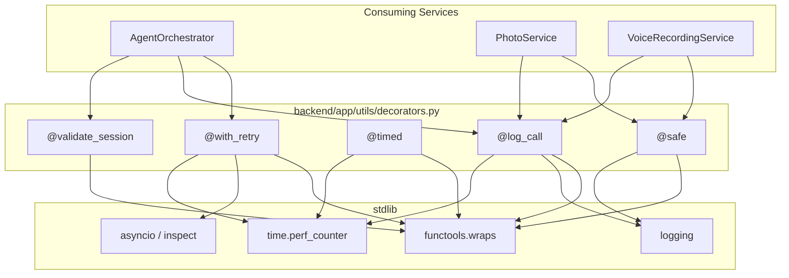
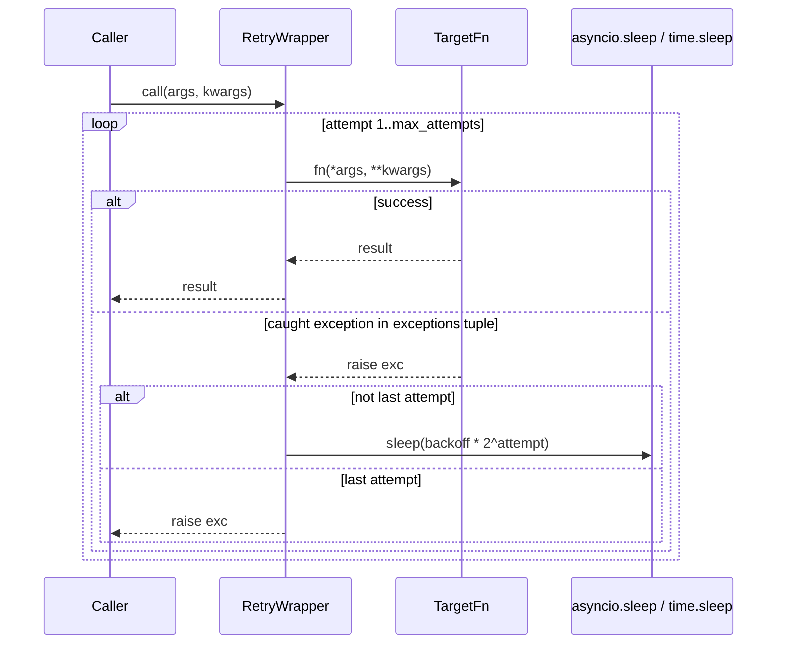
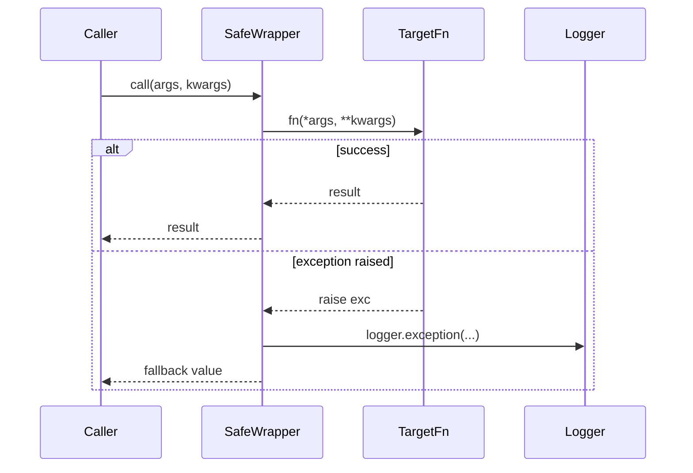
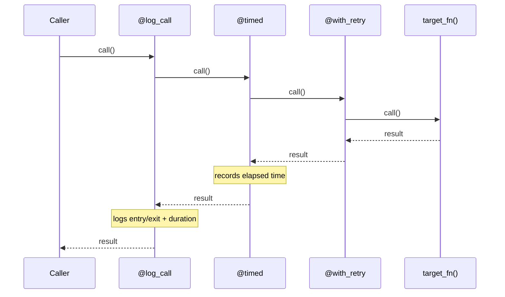

# Design Document: Cross-Cutting Decorators

## Overview

The backend codebase has retry logic, structured logging, timing instrumentation, and error handling duplicated across services. The orchestrator has manual retry loops for content generation. PhotoService and VoiceRecordingService wrap every method in try/except blocks. This creates inconsistency and maintenance burden.

This feature introduces a single module (`backend/app/utils/decorators.py`) containing five composable decorators — `@with_retry`, `@log_call`, `@timed`, `@safe`, and `@validate_session` — that encapsulate these cross-cutting concerns. All decorators work with both sync and async functions, preserve signatures via `functools.wraps`, and use only the Python standard library.

## Architecture



## Sequence Diagrams

### @with_retry — Retry with Exponential Backoff



### @safe — Error Suppression with Fallback



### Decorator Composition (Stacking)



## Components and Interfaces

### Component: Decorator Module (`backend/app/utils/decorators.py`)

**Purpose**: Single module housing all cross-cutting decorators. No classes — just decorator factory functions.

**Interface**:

```python
from typing import Callable, Tuple, Type, Any, Optional
import logging

def with_retry(
    max_attempts: int = 3,
    backoff: float = 1.0,
    exceptions: Tuple[Type[BaseException], ...] = (Exception,),
) -> Callable:
    """Retry with exponential backoff. Works with sync and async functions."""
    ...

def log_call(
    logger: Optional[logging.Logger] = None,
    level: str = "info",
) -> Callable:
    """Log function entry/exit with args, result summary, and elapsed time."""
    ...

def timed(
    metric_name: Optional[str] = None,
    metrics: Optional[dict] = None,
) -> Callable:
    """Measure execution time. Log it and optionally store in a metrics dict."""
    ...

def safe(
    fallback: Any = None,
    logger: Optional[logging.Logger] = None,
) -> Callable:
    """Catch all exceptions, log them, return fallback value."""
    ...

def validate_session(
    enforcer_attr: str = "session_time_enforcer",
) -> Callable:
    """Check session time before executing. Return early dict if expired."""
    ...
```

**Responsibilities**:
- Detect sync vs async at decoration time using `asyncio.iscoroutinefunction`
- Preserve `__name__`, `__doc__`, `__module__` via `functools.wraps`
- Each decorator returns the appropriate sync or async wrapper
- No external dependencies — stdlib only

## Data Models

### Retry Configuration (implicit via parameters)

```python
# No formal data class needed — parameters are simple scalars
# max_attempts: int >= 1
# backoff: float >= 0.0 (seconds, base for exponential: backoff * 2^attempt)
# exceptions: tuple of exception types to catch and retry on
```

### Metrics Dict (for @timed)

```python
# Optional mutable dict passed by reference
# After decoration: metrics[metric_name] = elapsed_seconds (float)
# If metric_name is None, uses f"{module}.{qualname}"
```

### Session Expiry Return Value (for @validate_session)

```python
# When session is expired, returns:
{
    "text": "",
    "image": None,
    "audio": {"narration": None, "character_voices": []},
    "interactive": {},
    "timestamp": None,
    "memories_used": 0,
    "voice_recordings": [],
    "agents_used": {
        "storyteller": False,
        "visual": False,
        "voice": False,
        "memory": False,
    },
    "session_time_expired": True,
}
```


## Key Functions with Formal Specifications

### Function 1: `with_retry(max_attempts, backoff, exceptions)`

```python
def with_retry(
    max_attempts: int = 3,
    backoff: float = 1.0,
    exceptions: Tuple[Type[BaseException], ...] = (Exception,),
) -> Callable:
    def decorator(fn: Callable) -> Callable:
        @functools.wraps(fn)
        async def async_wrapper(*args, **kwargs):
            for attempt in range(max_attempts):
                try:
                    return await fn(*args, **kwargs)
                except exceptions as e:
                    if attempt == max_attempts - 1:
                        raise
                    await asyncio.sleep(backoff * (2 ** attempt))

        @functools.wraps(fn)
        def sync_wrapper(*args, **kwargs):
            for attempt in range(max_attempts):
                try:
                    return fn(*args, **kwargs)
                except exceptions as e:
                    if attempt == max_attempts - 1:
                        raise
                    time.sleep(backoff * (2 ** attempt))

        return async_wrapper if asyncio.iscoroutinefunction(fn) else sync_wrapper
    return decorator
```

**Preconditions:**
- `max_attempts >= 1`
- `backoff >= 0.0`
- `exceptions` is a non-empty tuple of exception types

**Postconditions:**
- If the function succeeds on any attempt, returns its result
- If all attempts fail with a caught exception, re-raises the last exception
- Exceptions NOT in the `exceptions` tuple propagate immediately (no retry)
- Total sleep time before final attempt: `sum(backoff * 2^i for i in range(max_attempts - 1))`

**Loop Invariants:**
- `attempt` ranges from 0 to `max_attempts - 1`
- Sleep only occurs after a failed attempt that is not the last

### Function 2: `log_call(logger, level)`

```python
def log_call(
    logger: Optional[logging.Logger] = None,
    level: str = "info",
) -> Callable:
    def decorator(fn: Callable) -> Callable:
        nonlocal logger
        if logger is None:
            logger = logging.getLogger(fn.__module__)
        log_fn = getattr(logger, level)

        @functools.wraps(fn)
        async def async_wrapper(*args, **kwargs):
            log_fn("Calling %s(args=%s, kwargs=%s)", fn.__qualname__, args, kwargs)
            start = time.perf_counter()
            try:
                result = await fn(*args, **kwargs)
                elapsed = time.perf_counter() - start
                log_fn("Finished %s -> %.3fs", fn.__qualname__, elapsed)
                return result
            except Exception as e:
                elapsed = time.perf_counter() - start
                logger.exception("Failed %s -> %.3fs: %s", fn.__qualname__, elapsed, e)
                raise

        @functools.wraps(fn)
        def sync_wrapper(*args, **kwargs):
            log_fn("Calling %s(args=%s, kwargs=%s)", fn.__qualname__, args, kwargs)
            start = time.perf_counter()
            try:
                result = fn(*args, **kwargs)
                elapsed = time.perf_counter() - start
                log_fn("Finished %s -> %.3fs", fn.__qualname__, elapsed)
                return result
            except Exception as e:
                elapsed = time.perf_counter() - start
                logger.exception("Failed %s -> %.3fs: %s", fn.__qualname__, elapsed, e)
                raise

        return async_wrapper if asyncio.iscoroutinefunction(fn) else sync_wrapper
    return decorator
```

**Preconditions:**
- `level` is a valid logging level name ("debug", "info", "warning", "error")
- If `logger` is None, a module-level logger is created from `fn.__module__`

**Postconditions:**
- Entry log message emitted before function executes
- Exit log message emitted with elapsed time on success
- On exception: logs at `exception` level with traceback, then re-raises
- Function return value is unchanged

### Function 3: `timed(metric_name, metrics)`

```python
def timed(
    metric_name: Optional[str] = None,
    metrics: Optional[dict] = None,
) -> Callable:
    def decorator(fn: Callable) -> Callable:
        name = metric_name or f"{fn.__module__}.{fn.__qualname__}"
        _logger = logging.getLogger(fn.__module__)

        @functools.wraps(fn)
        async def async_wrapper(*args, **kwargs):
            start = time.perf_counter()
            try:
                return await fn(*args, **kwargs)
            finally:
                elapsed = time.perf_counter() - start
                _logger.info("TIMER %s: %.4fs", name, elapsed)
                if metrics is not None:
                    metrics[name] = elapsed

        @functools.wraps(fn)
        def sync_wrapper(*args, **kwargs):
            start = time.perf_counter()
            try:
                return fn(*args, **kwargs)
            finally:
                elapsed = time.perf_counter() - start
                _logger.info("TIMER %s: %.4fs", name, elapsed)
                if metrics is not None:
                    metrics[name] = elapsed

        return async_wrapper if asyncio.iscoroutinefunction(fn) else sync_wrapper
    return decorator
```

**Preconditions:**
- `metrics`, if provided, is a mutable dict
- `metric_name`, if None, defaults to `"{module}.{qualname}"`

**Postconditions:**
- Elapsed time is always logged (even if function raises)
- If `metrics` dict provided, `metrics[name]` is set to elapsed seconds
- Function return value and exceptions are unchanged

### Function 4: `safe(fallback, logger)`

```python
def safe(
    fallback: Any = None,
    logger: Optional[logging.Logger] = None,
) -> Callable:
    def decorator(fn: Callable) -> Callable:
        _logger = logger or logging.getLogger(fn.__module__)

        @functools.wraps(fn)
        async def async_wrapper(*args, **kwargs):
            try:
                return await fn(*args, **kwargs)
            except Exception as e:
                _logger.exception("Error in %s: %s — returning fallback", fn.__qualname__, e)
                return fallback

        @functools.wraps(fn)
        def sync_wrapper(*args, **kwargs):
            try:
                return fn(*args, **kwargs)
            except Exception as e:
                _logger.exception("Error in %s: %s — returning fallback", fn.__qualname__, e)
                return fallback

        return async_wrapper if asyncio.iscoroutinefunction(fn) else sync_wrapper
    return decorator
```

**Preconditions:**
- `fallback` can be any value (including None, callable results, dicts, etc.)

**Postconditions:**
- On success: returns the function's actual result
- On any `Exception`: logs with traceback, returns `fallback`
- `BaseException` subclasses (KeyboardInterrupt, SystemExit) are NOT caught

### Function 5: `validate_session(enforcer_attr)`

```python
def validate_session(
    enforcer_attr: str = "session_time_enforcer",
) -> Callable:
    def decorator(fn: Callable) -> Callable:
        @functools.wraps(fn)
        async def async_wrapper(self, session_id: str, *args, **kwargs):
            enforcer = getattr(self, enforcer_attr, None)
            if enforcer is not None:
                time_check = enforcer.check_time(session_id)
                if time_check.is_expired:
                    return _expired_response()
            return await fn(self, session_id, *args, **kwargs)

        @functools.wraps(fn)
        def sync_wrapper(self, session_id: str, *args, **kwargs):
            enforcer = getattr(self, enforcer_attr, None)
            if enforcer is not None:
                time_check = enforcer.check_time(session_id)
                if time_check.is_expired:
                    return _expired_response()
            return fn(self, session_id, *args, **kwargs)

        return async_wrapper if asyncio.iscoroutinefunction(fn) else sync_wrapper
    return decorator
```

**Preconditions:**
- Decorated function must be a method on an object with `self` as first arg
- Second positional arg must be `session_id: str`
- `self` must have an attribute named `enforcer_attr` (or None to skip check)

**Postconditions:**
- If enforcer is None or session is not expired: delegates to original function
- If session is expired: returns the standard expired response dict without calling the function

## Algorithmic Pseudocode

### Sync/Async Detection Algorithm

```python
# Applied at decoration time (not at call time)
# This means the wrapper type is fixed when the decorator is applied

def choose_wrapper(fn, async_wrapper, sync_wrapper):
    """Select wrapper based on whether fn is a coroutine function."""
    if asyncio.iscoroutinefunction(fn):
        return async_wrapper
    return sync_wrapper

# IMPORTANT: This check uses asyncio.iscoroutinefunction which correctly
# handles functions already wrapped with functools.wraps — it checks
# the __wrapped__ chain.
```

### Exponential Backoff Calculation

```python
# For with_retry(max_attempts=N, backoff=B):
# Attempt 0: no sleep (first try)
# Attempt 1: sleep B * 2^0 = B seconds
# Attempt 2: sleep B * 2^1 = 2B seconds
# Attempt k: sleep B * 2^(k-1) seconds
#
# Total max sleep = B * (2^(N-1) - 1)
# Example: max_attempts=3, backoff=1.0
#   Attempt 0: immediate
#   Attempt 1: sleep 1.0s
#   Attempt 2: sleep 2.0s
#   Total max sleep: 3.0s
```

### Decorator Stacking Order

```python
# Decorators execute outside-in. Recommended stacking:
#
# @log_call(...)        # outermost: logs the entire operation including retries
# @timed(...)           # measures total wall time including retries
# @with_retry(...)      # retries on transient failures
# @safe(...)            # innermost: catches errors from single attempt
# def my_function():
#     ...
#
# This means: log → time → retry → (safe → fn)
# Each retry attempt goes through @safe, but the overall timing
# and logging wraps all retries.
```

## Example Usage

```python
from app.utils.decorators import with_retry, log_call, timed, safe, validate_session
import logging

logger = logging.getLogger(__name__)

# --- Basic retry for API calls ---
@with_retry(max_attempts=3, backoff=0.5, exceptions=(ConnectionError, TimeoutError))
async def call_external_api(url: str) -> dict:
    ...

# --- Logging + timing on a service method ---
@log_call(logger=logger, level="debug")
@timed(metric_name="photo.upload")
async def upload_photo(self, image_bytes: bytes) -> dict:
    ...

# --- Safe fallback for non-critical operations ---
@safe(fallback=[], logger=logger)
async def recall_memories(session_id: str) -> list:
    ...

# --- Session validation on orchestrator methods ---
@validate_session(enforcer_attr="session_time_enforcer")
async def generate_rich_story_moment(self, session_id: str, characters: dict, **kwargs) -> dict:
    ...

# --- Full stack: log + time + retry ---
@log_call(logger=logger)
@timed()
@with_retry(max_attempts=3, backoff=1.0, exceptions=(ConnectionError,))
async def generate_story_segment(context: dict) -> dict:
    ...
```

## Correctness Properties

*A property is a characteristic or behavior that should hold true across all valid executions of a system — essentially, a formal statement about what the system should do. Properties serve as the bridge between human-readable specifications and machine-verifiable correctness guarantees.*

### Property 1: Sync/Async Preservation

*For any* decorator in the module and *for any* function (sync or async), the decorated function preserves the sync/async nature of the original: `asyncio.iscoroutinefunction(decorated) == asyncio.iscoroutinefunction(original)`. This holds even when multiple decorators are stacked.

**Validates: Requirements 1.1, 1.2, 8.2**

### Property 2: Metadata Preservation

*For any* decorator in the module and *for any* function with a name, docstring, module, and qualname, the decorated function's `__name__`, `__doc__`, `__module__`, and `__qualname__` match the original function's values.

**Validates: Requirements 2.1, 2.2**

### Property 3: Retry Call Count and Result

*For any* `max_attempts` N >= 1 and *for any* function that fails K times (0 <= K < N) with a caught exception then succeeds, `@with_retry` calls the function exactly K+1 times and returns the successful result. If K == N (all attempts fail), the last exception is re-raised.

**Validates: Requirements 3.1, 3.2, 3.6**

### Property 4: Uncaught Exception Passthrough

*For any* function decorated with `@with_retry(exceptions=E)` that raises an exception NOT in E, the exception propagates immediately and the function is called exactly once.

**Validates: Requirement 3.3**

### Property 5: Timing Always Recorded

*For any* function decorated with `@timed` and *for any* provided metrics dict, after execution (whether the function succeeds or raises), `metrics[metric_name]` contains a non-negative float representing elapsed seconds.

**Validates: Requirements 5.1, 5.2, 5.4**

### Property 6: Safe Return Value

*For any* function decorated with `@safe(fallback=X)`, if the function succeeds the decorator returns the actual result unchanged; if the function raises any `Exception` subclass, the decorator returns X.

**Validates: Requirements 6.1, 6.3**

### Property 7: Session Gate

*For any* method decorated with `@validate_session` on an object with a session enforcer, if the session is expired the decorator returns the expired response dict without calling the method; if the session is valid the decorator delegates to the method and returns its result.

**Validates: Requirements 7.1, 7.2**

### Property 8: Composability

*For any* combination of decorators stacked on a function, the innermost function's successful return value is preserved through the entire decorator chain (no decorator alters the return value on the success path).

**Validates: Requirement 8.1**

## Error Handling

### Scenario 1: Retry Exhaustion

**Condition**: All `max_attempts` attempts raise an exception in the `exceptions` tuple
**Response**: The last exception is re-raised to the caller
**Recovery**: Caller handles the exception as if no retry decorator existed

### Scenario 2: Uncaught Exception in Retry

**Condition**: Function raises an exception NOT in the `exceptions` tuple
**Response**: Exception propagates immediately, no further retries
**Recovery**: Caller handles the unexpected exception

### Scenario 3: Safe Decorator Catches Error

**Condition**: Decorated function raises any `Exception`
**Response**: Error is logged with full traceback, fallback value returned
**Recovery**: Caller receives fallback and can check for sentinel values

### Scenario 4: Logger Not Available

**Condition**: `logger=None` passed to `@log_call` or `@safe`
**Response**: A module-level logger is created from `fn.__module__`
**Recovery**: Automatic — no action needed

### Scenario 5: Session Enforcer Not Set

**Condition**: `self.session_time_enforcer` is None when `@validate_session` runs
**Response**: Session check is skipped, function executes normally
**Recovery**: Automatic — decorator is a no-op when enforcer is absent

## Testing Strategy

### Unit Testing Approach

Each decorator gets dedicated unit tests covering:
- Sync function decoration
- Async function decoration
- Parameter variations (custom logger, custom exceptions, etc.)
- Edge cases (max_attempts=1, backoff=0, empty fallback)

Tests use `pytest` + `pytest-asyncio` for async tests. No mocking of stdlib — tests use real functions that raise/return controlled values.

### Property-Based Testing Approach

**Property Test Library**: Hypothesis (max_examples=20)

Properties to test:
- `@with_retry`: For any max_attempts N and function that fails K < N times then succeeds, the result is the success value and the function was called K+1 times.
- `@safe`: For any function and any exception, the decorated version never raises and returns the fallback.
- `@timed`: For any function, the metrics dict always contains the metric key after execution.
- Signature preservation: For any decorated function, `__name__` and `__doc__` match the original.

### Integration Testing Approach

Optional integration tests apply decorators to existing service methods and verify that behavior is preserved. These run as part of the existing 610+ test suite to ensure no regressions.

## Dependencies

- `functools` (stdlib) — `wraps` for signature preservation
- `asyncio` (stdlib) — `iscoroutinefunction` for sync/async detection, `sleep` for async backoff
- `time` (stdlib) — `perf_counter` for timing, `sleep` for sync backoff
- `logging` (stdlib) — structured log output
- `inspect` (stdlib) — optional, for additional introspection if needed

No new external dependencies required.
