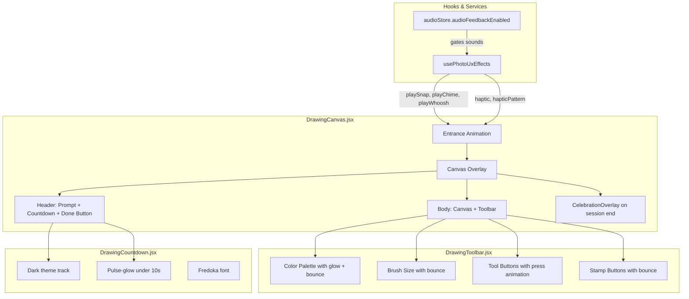

# Design Document: Drawing UX Polish

## Overview

This design brings the collaborative drawing feature into visual and interactive parity with the "Living Storybook" design system used throughout Twin Spark Chronicles. The current drawing UI uses a light gray toolbar, white canvas box, no micro-interactions, no sound/haptic feedback, and no celebration moments — making it the most visually disconnected feature in the app.

The polish pass is entirely frontend (React/JSX, CSS, Zustand). No new heavy dependencies are introduced. All animations are CSS-only, all sounds use the existing `audioFeedbackService` via `usePhotoUxEffects`, and all haptics use the existing Vibration API wrapper. The existing `CelebrationOverlay` component handles drawing-completion celebrations. Every change respects `prefers-reduced-motion` and maintains 56px minimum touch targets for the 6-year-old target users.

### Key Design Decisions

1. **CSS-only animations**: All bounce, glow-pulse, and entrance animations use CSS `@keyframes` + custom properties. No JS animation libraries.
2. **Existing hook reuse**: `usePhotoUxEffects` already provides `haptic()`, `hapticPattern()`, `playSnap()`, `playChime()`, `playWhoosh()` — we wire these into drawing interactions rather than creating new audio infrastructure.
3. **Existing celebration reuse**: `CelebrationOverlay` already handles confetti/star-shower with `prefers-reduced-motion` support. We render it conditionally on session end.
4. **Design system tokens**: All colors, shadows, fonts, radii, and easings reference `index.css` custom properties (`--color-bg-surface`, `--shadow-glow-violet`, `--font-display`, `--ease-bounce`, etc.).
5. **No store changes**: The `drawingStore` state shape is unchanged. The new `showCelebration` flag is local React state in `DrawingCanvas`.

## Architecture

The polish is applied across four existing component files and their CSS modules. No new components are created (except potentially a thin wrapper for the "We're Done!" button styling, which can be done inline).



### File Change Map

| File | Changes |
|------|---------|
| `DrawingToolbar.css` | Dark theme background, glassmorphism, glow selected states, bounce animations, 56px touch targets, reduced-motion overrides |
| `DrawingToolbar.jsx` | Wire `usePhotoUxEffects` for snap/whoosh sounds and haptic on tool selection |
| `DrawingCanvas.css` | Dark overlay scrim, dark layout bg, glow border, magical entrance animation (scale+fade+glow), btn-magic styling for Done button, canvas container decorative border |
| `DrawingCanvas.jsx` | Import `usePhotoUxEffects` + `CelebrationOverlay`, add sound/haptic calls on color select/stamp place/eraser toggle/entrance/done, render `CelebrationOverlay` on session end, local `showCelebration` state |
| `DrawingCountdown.css` | Dark track stroke, Fredoka font, pulse-glow animation for <10s, reduced-motion override |
| `DrawingCountdown.jsx` | Add `className` for urgent state when `remainingTime < 10` |

## Components and Interfaces

### DrawingToolbar (Modified)

**CSS Changes:**
- `.drawing-toolbar` background: `var(--color-glass)` with `backdrop-filter: blur(16px)`, border: `1px solid var(--color-glass-border)`
- `.drawing-toolbar__label` color: `rgba(255, 255, 255, 0.7)`, font-family: `var(--font-body)`
- `.drawing-toolbar__color-swatch--selected` box-shadow: `var(--shadow-glow-violet)` instead of `#333` border
- `.drawing-toolbar__color-swatch:hover` box-shadow uses the swatch's own color as glow (via inline `--swatch-color` custom property)
- `.drawing-toolbar__brush-btn`, `.drawing-toolbar__tool-btn`, `.drawing-toolbar__stamp-btn` backgrounds: `var(--color-glass)` / `var(--color-glass-hover)` on hover
- All interactive elements: `min-width: 56px; min-height: 56px` (was 44px)
- New `@keyframes bounce-select` animation applied on `--selected` classes
- `.drawing-toolbar__tool-btn:active` scale-down press: `transform: scale(0.88)`
- `.drawing-toolbar__tool-text` color: `rgba(255, 255, 255, 0.6)`
- Responsive `@media (max-width: 767px)` border-top uses `var(--color-glass-border)`

**New CSS Keyframes:**
```css
@keyframes bounce-select {
  0%   { transform: scale(1); }
  40%  { transform: scale(1.25); }
  70%  { transform: scale(0.92); }
  100% { transform: scale(1.1); }
}
```

**JSX Changes:**
- Import `usePhotoUxEffects` hook
- On color swatch click: call `playSnap()` + `haptic(30)`
- On eraser toggle: call `playWhoosh()`
- On stamp shape click: call `playSnap()` + `haptic(30)`
- Pass `style={{ '--swatch-color': color }}` to each color swatch for hover glow

### DrawingCanvas (Modified)

**CSS Changes:**
- `.drawing-canvas-overlay` background: `rgba(7, 11, 26, 0.85)` (derived from `--color-bg-deep`)
- `.drawing-canvas-layout` background: `var(--color-bg-mid)`, box-shadow: `var(--shadow-glow-violet)`
- `.drawing-canvas-layout` border-radius: `var(--radius-lg)` (keeps 28px from design system)
- `.drawing-canvas-header` gradient: `linear-gradient(135deg, var(--color-violet) 0%, var(--color-coral) 100%)`
- `.drawing-canvas-done-btn` styled as `btn-magic`: gradient background, Fredoka font, bounce hover, scale-down active, min 56px touch target
- `.drawing-canvas-container` border: `1px solid var(--color-glass-border)`, border-radius: `var(--radius-md)`, box-shadow: `var(--shadow-glow-violet), var(--shadow-glow-gold)`, inner canvas remains `#FFFFFF`
- New entrance animation `@keyframes magicalEntrance` (scale 0.85→1.0, opacity 0→1, glow pulse)
- `.drawing-canvas--entering` uses `magicalEntrance 600ms var(--ease-bounce) forwards`
- Reduced-motion: all animations suppressed

**New CSS Keyframes:**
```css
@keyframes magicalEntrance {
  0%   { transform: scale(0.85); opacity: 0; box-shadow: 0 0 60px rgba(167, 139, 250, 0.6); }
  60%  { transform: scale(1.02); opacity: 1; box-shadow: 0 0 40px rgba(251, 191, 36, 0.4); }
  100% { transform: scale(1); opacity: 1; box-shadow: var(--shadow-glow-violet); }
}
```

**JSX Changes:**
- Import `usePhotoUxEffects` and `CelebrationOverlay`
- Add local state: `const [showCelebration, setShowCelebration] = useState(false)`
- On entrance (`phase === 'entering'`): call `playWhoosh()`
- On `handleDone`: call `playChime()`, `hapticPattern([50, 30, 80])`, set `showCelebration = true`
- On `DRAWING_END` WebSocket event: call `playChime()`, `hapticPattern([50, 30, 80])`, set `showCelebration = true`
- Render `{showCelebration && <CelebrationOverlay type="star-shower" duration={2500} particleCount={60} colors={['var(--color-gold)', 'var(--color-coral)', 'var(--color-violet)', 'var(--color-pink)']} />}`
- Pass sound/haptic callbacks down or call them directly in event handlers

### DrawingCountdown (Modified)

**CSS Changes:**
- `.drawing-countdown-track` stroke: `rgba(255, 255, 255, 0.15)` (was `rgba(0, 0, 0, 0.1)`)
- `.drawing-countdown-text` font-family: `var(--font-display)` (Fredoka)
- New `.drawing-countdown--urgent` class: applies `pulse-glow-ring` animation, slightly larger font-weight/scale
- Reduced-motion: `.drawing-countdown--urgent` animation suppressed, static color change only

**New CSS Keyframes:**
```css
@keyframes pulse-glow-ring {
  0%, 100% { filter: drop-shadow(0 0 4px rgba(229, 57, 53, 0.3)); }
  50%      { filter: drop-shadow(0 0 12px rgba(229, 57, 53, 0.7)); }
}
```

**JSX Changes:**
- Add `className` toggle: when `remainingTime < 10 && remainingTime > 0`, add `drawing-countdown--urgent` class
- The urgent class triggers the CSS pulse-glow animation and a slight scale bump on the text

### CelebrationOverlay (Unchanged)

The existing component already:
- Accepts `type`, `duration`, `particleCount`, `colors` props
- Respects `prefers-reduced-motion` (returns `null`)
- Plays `celebration` SFX via `sceneAudioStore`
- Auto-hides after `duration` ms

We pass Design System accent colors (`gold`, `coral`, `violet`, `pink`) as the `colors` prop.

## Data Models

No data model changes. The `drawingStore` state shape is unchanged. All new state is local React state:

```javascript
// In DrawingCanvas.jsx — local state only
const [showCelebration, setShowCelebration] = useState(false);
```

The `usePhotoUxEffects` hook reads `audioStore.audioFeedbackEnabled` to gate sound playback. Haptic calls are independent of the mute setting (existing behavior).


## Correctness Properties

*A property is a characteristic or behavior that should hold true across all valid executions of a system — essentially, a formal statement about what the system should do. Properties serve as the bridge between human-readable specifications and machine-verifiable correctness guarantees.*

### Property 1: Bounce animation on selectable toolbar items

*For any* selectable toolbar item (color swatch, brush size button, or stamp shape button), when that item is selected, the corresponding DOM element should have the bounce-select animation class applied.

**Validates: Requirements 3.1, 3.2, 3.3**

### Property 2: Color selection triggers snap sound and haptic

*For any* color swatch in the palette, when it is selected, the `playSnap()` method should be called exactly once and `haptic(30)` should be called exactly once.

**Validates: Requirements 4.1, 5.1**

### Property 3: Stamp placement triggers chime sound and haptic

*For any* stamp placement on the canvas (any stamp shape, any position), the `playChime()` method should be called exactly once and `haptic(50)` should be called exactly once.

**Validates: Requirements 4.2, 5.2**

### Property 4: Audio suppression when feedback is disabled

*For any* drawing interaction that would normally trigger a sound (color select, stamp place, eraser toggle, entrance, session end), if `audioStore.audioFeedbackEnabled` is `false`, then no sound method (`playSnap`, `playChime`, `playWhoosh`) should produce audible output.

**Validates: Requirements 4.5**

### Property 5: Session end triggers celebration, chime, and haptic

*For any* session end trigger (timer expiry via `DRAWING_END` WebSocket event, or "We're Done!" button press), the `CelebrationOverlay` component should be rendered, `playChime()` should be called, and `hapticPattern()` should be called.

**Validates: Requirements 6.1, 6.2, 6.3**

### Property 6: Countdown urgent state under 10 seconds

*For any* `remainingTime` value where `0 < remainingTime < 10`, the `DrawingCountdown` component should render with the `drawing-countdown--urgent` CSS class. *For any* `remainingTime >= 10`, the urgent class should not be present.

**Validates: Requirements 8.3, 8.4**

### Property 7: Canvas painting surface remains white

*For any* rendering of the `DrawingCanvas` component (regardless of theme, tool selection, or session state), the HTML5 canvas element's painting surface background fill color should be `#FFFFFF`.

**Validates: Requirements 10.4**

### Property 8: All interactive elements meet 56px minimum touch target

*For any* interactive element in the drawing UI (color swatches, brush size buttons, tool buttons, stamp shape buttons, "We're Done!" button), the element's CSS `min-width` and `min-height` should be at least 56px.

**Validates: Requirements 7.5, 11.1, 11.2, 11.3, 11.4, 11.5**

### Property 9: Selected swatch glow contrast ratio

*For any* of the 8 palette colors, when that color's swatch is in the selected state, the glow shadow indicator should achieve a minimum 3:1 contrast ratio against the dark toolbar background (`var(--color-glass)` ≈ `rgba(255, 255, 255, 0.05)` over `--color-bg-surface` ≈ `#151d35`).

**Validates: Requirements 11.6**

### Property 10: Reduced motion suppresses all decorative animations

*For any* user interaction (tool selection, entrance, session end) when `prefers-reduced-motion: reduce` is active, no element in the drawing UI should have a CSS animation-name set to any decorative animation (`bounce-select`, `magicalEntrance`, `pulse-glow-ring`). Static visual states (color changes, class toggles) should still apply.

**Validates: Requirements 3.6, 8.5, 11.8**

### Property 11: ARIA live region announces tool changes

*For any* tool change action (selecting a color, switching to eraser, selecting a stamp, changing brush size), the ARIA live region element should update its text content to reflect the new tool state.

**Validates: Requirements 11.9**

## Error Handling

| Scenario | Handling |
|----------|----------|
| `navigator.vibrate` undefined (desktop browsers) | `usePhotoUxEffects.haptic()` already guards with `if (navigator.vibrate)` — no-op, no error thrown |
| `audioFeedbackService.init()` fails (no AudioContext) | `usePhotoUxEffects` catches internally via `ensureAudioInit()` — sounds silently skip |
| `audioFeedbackEnabled` is false | All `playSnap/playChime/playWhoosh` calls return early — no sound produced |
| `CelebrationOverlay` with `prefers-reduced-motion` | Component returns `null` — no particles rendered, no performance cost |
| CSS custom properties not loaded (edge case) | Fallback values in CSS: `background: var(--color-glass, rgba(255,255,255,0.05))` pattern |
| Canvas resize during entrance animation | `resizeCanvas()` already handles via resize event listener — redraws after resize |
| WebSocket `DRAWING_END` fires during exit animation | Phase guard (`if (phase !== 'active')`) prevents double-end; celebration still shows |

## Testing Strategy

### Unit Tests (specific examples and edge cases)

- Verify dark theme CSS classes are applied to toolbar (snapshot or class-presence checks)
- Verify "We're Done!" button has `btn-magic`-derived styles and Fredoka font
- Verify countdown renders with Fredoka font class
- Verify countdown track uses light stroke color
- Verify entrance animation uses `magicalEntrance` keyframe (not `slideUp`)
- Verify canvas container has decorative glow border classes
- Verify canvas inner background remains `#FFFFFF`
- Verify `CelebrationOverlay` receives Design System accent colors as props
- Verify eraser toggle calls `playWhoosh()` once
- Verify entrance phase calls `playWhoosh()` once
- Verify "We're Done!" button press calls `hapticPattern()`
- Verify `CelebrationOverlay` returns null when `prefers-reduced-motion` is active

### Property-Based Tests (universal properties across generated inputs)

Each property test should use `fast-check` (the JavaScript property-based testing library) with a minimum of 100 iterations. Each test must be tagged with a comment referencing the design property.

- **Feature: drawing-ux-polish, Property 1: Bounce animation on selectable toolbar items** — Generate random selections from color palette / brush sizes / stamp shapes, verify bounce class is applied.
- **Feature: drawing-ux-polish, Property 2: Color selection triggers snap sound and haptic** — Generate random color from PALETTE_COLORS, simulate selection, verify playSnap + haptic(30) called.
- **Feature: drawing-ux-polish, Property 3: Stamp placement triggers chime sound and haptic** — Generate random stamp shape + random canvas position, simulate placement, verify playChime + haptic(50) called.
- **Feature: drawing-ux-polish, Property 4: Audio suppression when feedback is disabled** — Generate random interaction type, set audioFeedbackEnabled=false, verify no sound methods produce output.
- **Feature: drawing-ux-polish, Property 5: Session end triggers celebration, chime, and haptic** — Generate random end trigger (timer vs button), verify CelebrationOverlay rendered + playChime + hapticPattern called.
- **Feature: drawing-ux-polish, Property 6: Countdown urgent state under 10 seconds** — Generate random remainingTime (0-120), verify urgent class presence matches `0 < time < 10`.
- **Feature: drawing-ux-polish, Property 7: Canvas painting surface remains white** — Generate random tool/color/session states, verify canvas fill is #FFFFFF.
- **Feature: drawing-ux-polish, Property 8: All interactive elements meet 56px minimum touch target** — Generate random toolbar configurations (stamp mode on/off), verify all interactive elements have min-width/min-height >= 56px.
- **Feature: drawing-ux-polish, Property 9: Selected swatch glow contrast ratio** — For each of the 8 PALETTE_COLORS, compute luminance contrast of the glow against the dark background, verify >= 3:1.
- **Feature: drawing-ux-polish, Property 10: Reduced motion suppresses all decorative animations** — Generate random interactions with prefers-reduced-motion active, verify no decorative animation-name is applied.
- **Feature: drawing-ux-polish, Property 11: ARIA live region announces tool changes** — Generate random tool change sequences, verify ARIA live region text updates after each change.

### Testing Library

- **Property-based testing**: `fast-check` (JavaScript PBT library)
- **Component testing**: React Testing Library + Vitest
- **Minimum iterations**: 100 per property test
- **Tag format**: `// Feature: drawing-ux-polish, Property {N}: {title}`
