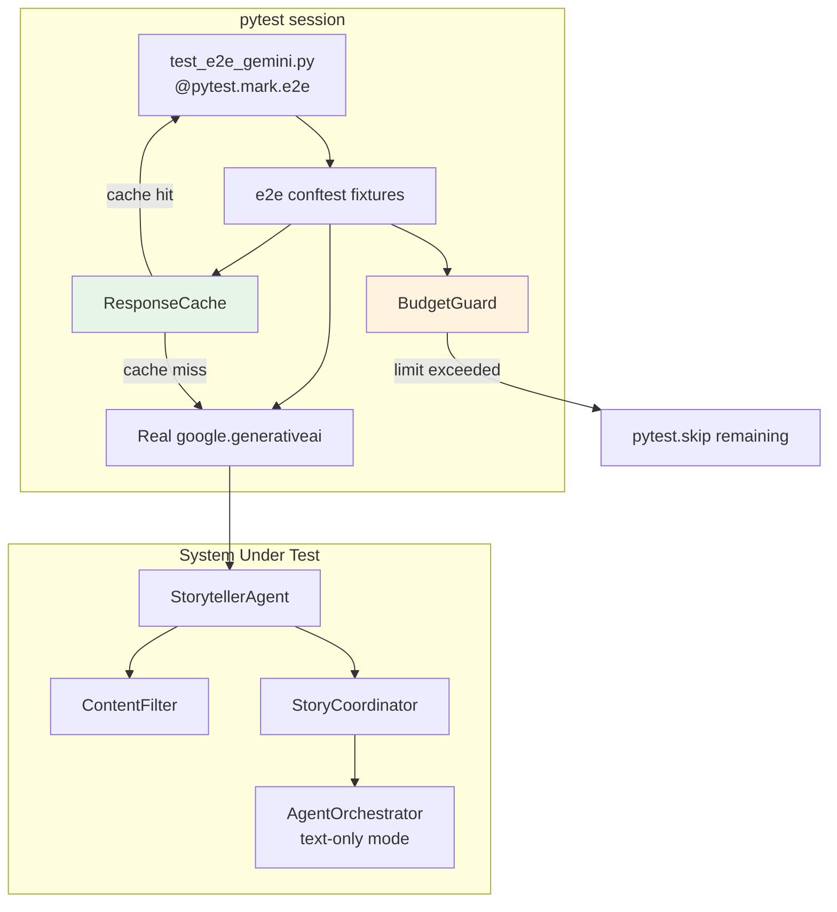

# Design Document: E2E Gemini Testing

## Overview

This design adds a real-API end-to-end test suite for the backend's Gemini integration. The tests exercise `StorytellerAgent`, `ContentFilter`, `StoryCoordinator`, and the text-only `AgentOrchestrator` flow against the live `gemini-2.0-flash-exp` model. Because the project has a very limited API budget, the design centers on three cost-control mechanisms: a file-based **ResponseCache** that replays previous API responses by prompt hash, a **BudgetGuard** that hard-caps the number of live calls per session, and aggressive **token minimization** (256 max output tokens, short prompts, session-scoped agent reuse).

All e2e tests live in `backend/tests/e2e/test_e2e_gemini.py`, are decorated with `@pytest.mark.e2e`, and are skipped automatically when `GOOGLE_API_KEY` is unset. The existing `conftest.py` patches `sys.modules` with mocks for `google.generativeai` and related packages; e2e tests bypass this by restoring the real modules before importing the agent.

## Architecture



### Key Design Decisions

1. **Separate e2e conftest** — A dedicated `backend/tests/e2e/conftest.py` restores real `google.generativeai` modules by popping the mocks from `sys.modules` before any e2e import. This avoids touching the root `conftest.py` that the 809+ existing unit tests depend on.

2. **File-based response cache** — Responses are stored as JSON files under `backend/tests/e2e_cache/` keyed by SHA-256 of the prompt string. This is simpler and more debuggable than an in-memory or SQLite cache, and the files can be committed to the repo for fully offline replay.

3. **BudgetGuard as session-scoped fixture** — Implemented as a simple counter in a session-scoped pytest fixture rather than a full pytest plugin. This keeps the implementation minimal while still aborting the session when the call limit is hit.

4. **Token minimization via fixture override** — A session-scoped `e2e_storyteller` fixture creates a single `StorytellerAgent` instance with `max_output_tokens=256` instead of the production 2048. All e2e tests share this instance.

5. **Image generation disabled** — The orchestrator e2e test sets `visual_agent.enabled = False` on the `MediaCoordinator`'s visual agent, avoiding any Imagen 3 / Vertex AI calls.

## Components and Interfaces

### 1. E2E Test Module (`backend/tests/e2e/test_e2e_gemini.py`)

Test functions decorated with `@pytest.mark.e2e`. Each test receives the shared `e2e_storyteller` fixture and the `response_cache` / `budget_guard` fixtures.

### 2. E2E Conftest (`backend/tests/e2e/conftest.py`)

Fixtures:

| Fixture | Scope | Purpose |
|---|---|---|
| `_restore_real_genai` | session | Pops mock entries from `sys.modules`, imports real `google.generativeai` |
| `e2e_storyteller` | session | Creates a `StorytellerAgent` with `max_output_tokens=256` |
| `response_cache` | session | `ResponseCache` instance pointed at `backend/tests/e2e_cache/` |
| `budget_guard` | session | `BudgetGuard` counter, default limit 20 |
| `e2e_content_filter` | session | Real `ContentFilter` instance |
| `e2e_story_coordinator` | session | `StoryCoordinator` wired with real storyteller + content filter, mock memory/voice |
| `minimal_story_context` | session | Minimal two-character context dict with only required fields |

### 3. ResponseCache (`backend/tests/e2e/response_cache.py`)

```python
class ResponseCache:
    def __init__(self, cache_dir: Path, ttl_days: int = 7):
        ...

    def get(self, prompt: str) -> Optional[dict]:
        """Return cached response JSON or None."""

    def put(self, prompt: str, response: dict) -> None:
        """Store response JSON keyed by SHA-256(prompt)."""

    def clear_stale(self) -> int:
        """Remove entries older than TTL. Returns count removed."""
```

### 4. BudgetGuard (`backend/tests/e2e/budget_guard.py`)

```python
class BudgetGuard:
    def __init__(self, max_calls: int = 20):
        ...

    def record_call(self) -> None:
        """Increment counter; raise BudgetExceededError if over limit."""

    @property
    def calls_made(self) -> int: ...

    @property
    def calls_remaining(self) -> int: ...
```

### 5. Pytest Configuration

- Register `e2e` marker in root `conftest.py` or `pytest.ini` (via `pytest_configure` hook)
- Add `--e2e-no-cache` and `--e2e-max-calls` CLI options via `conftest.py` `pytest_addoption`
- Default `pytest` invocation (`pytest tests/`) collects but auto-skips e2e tests (no `-m e2e` flag means the `GOOGLE_API_KEY` skipif triggers, and they live in a subfolder that can be deselected)

## Data Models

### Cached Response File Format

Each cache file is `{sha256_hex}.json`:

```json
{
  "prompt_hash": "abc123...",
  "timestamp": "2025-01-15T10:30:00Z",
  "response": {
    "text": "Once upon a time...",
    "timestamp": "2025-01-15T10:30:00Z",
    "characters": { ... },
    "interactive": {
      "type": "question",
      "text": "What should they do?",
      "expects_response": true
    }
  }
}
```

### Minimal Story Context (Test Fixture)

```python
{
    "characters": {
        "child1": {"name": "Mia", "gender": "girl", "spirit_animal": "dolphin"},
        "child2": {"name": "Leo", "gender": "boy", "spirit_animal": "eagle"},
    },
    "session_id": "e2e-test-session",
    "language": "en",
}
```

### BudgetGuard State

Simple in-memory counter:

```python
{
    "max_calls": 20,
    "calls_made": 0,
}
```


## Correctness Properties

*A property is a characteristic or behavior that should hold true across all valid executions of a system — essentially, a formal statement about what the system should do. Properties serve as the bridge between human-readable specifications and machine-verifiable correctness guarantees.*

### Property 1: Response Structure Invariant

*For any* valid minimal story context with two named characters, calling `StorytellerAgent.generate_story_segment()` should return a dict containing: a non-empty `text` string, a `timestamp` string parseable as ISO 8601, and an `interactive` dict with keys `type`, `text`, and `expects_response`.

**Validates: Requirements 3.2, 3.3, 3.4**

### Property 2: Character Name Presence

*For any* story context with two character names, the `text` field of the generated story segment should mention at least one of the two character names (case-insensitive).

**Validates: Requirements 3.5**

### Property 3: Prompt Quality Invariant

*For any* generated story segment text, the text should: contain at least one question mark, have a length between 50 and 5000 characters, and contain none of the terms from the ContentFilter blocklist.

**Validates: Requirements 4.1, 4.2, 4.3**

### Property 4: Content Filter Accepts Real Output

*For any* subset of `AVAILABLE_THEMES` used as `allowed_themes`, passing a real Gemini-generated story segment through `ContentFilter.scan()` should return a rating that is not `BLOCKED`.

**Validates: Requirements 5.1, 5.2**

### Property 5: Fallback Story Correctness

*For any* story context with two character names, the fallback story returned by `StorytellerAgent._fallback_story()` should contain both character names in the `text` field, have a non-empty `text`, and include an `interactive` dict with keys `type`, `text`, and `expects_response`.

**Validates: Requirements 6.2, 6.3**

### Property 6: Cache Round Trip

*For any* prompt string and valid response dict, storing the response via `ResponseCache.put(prompt, response)` and then retrieving via `ResponseCache.get(prompt)` should return a dict equal to the original response.

**Validates: Requirements 7.1, 7.2**

### Property 7: Cache TTL Invalidation

*For any* set of cached entries with varying timestamps, calling `ResponseCache.clear_stale()` should remove exactly those entries whose age exceeds the configured TTL and preserve all others.

**Validates: Requirements 7.6**

### Property 8: Budget Guard Enforcement

*For any* positive integer `max_calls`, a `BudgetGuard(max_calls)` should allow exactly `max_calls` invocations of `record_call()` without error, and the `(max_calls + 1)`-th call should raise `BudgetExceededError`.

**Validates: Requirements 8.1, 8.2**

### Property 9: Text-Only Orchestrator Output

*For any* valid story context run through the orchestrator with `visual_agent.enabled = False`, the result should contain a non-empty `text` field, `agents_used["storyteller"]` should be `True`, `agents_used["visual"]` should be `False`, and `image` should be `None`.

**Validates: Requirements 10.2, 10.3**

## Error Handling

| Scenario | Behavior |
|---|---|
| `GOOGLE_API_KEY` not set or empty | All e2e tests skip with descriptive message |
| Gemini returns `StopCandidateException` / `BlockedPromptException` | `StorytellerAgent` returns fallback story with both character names |
| Gemini returns unexpected error | `StorytellerAgent` returns fallback story |
| `BudgetGuard` limit exceeded | Raises `BudgetExceededError`; remaining e2e tests skip |
| Cache file corrupted / invalid JSON | `ResponseCache.get()` returns `None` (cache miss), logs warning |
| Cache directory does not exist | `ResponseCache.__init__` creates it via `mkdir(parents=True)` |
| Network timeout on Gemini call | Caught by `StorytellerAgent`'s generic `except Exception`, returns fallback |
| `ContentFilter` scan raises exception | `StoryCoordinator` catches it and returns fallback story |

## Testing Strategy

### Unit Tests

Unit tests cover the cost-control components that don't require a real API key:

- **ResponseCache**: round-trip put/get, stale entry cleanup, corrupted file handling, directory creation
- **BudgetGuard**: counter increment, limit enforcement, custom limit values
- **Fallback story**: structure validation, character name inclusion

These use standard `pytest` assertions with `tmp_path` for cache directory isolation.

### Property-Based Tests

Property-based tests use **Hypothesis** (already in the project's test dependencies) with a minimum of 100 examples per property.

Each property test is tagged with a comment:
```
# Feature: e2e-gemini-testing, Property {N}: {title}
```

| Property | PBT Strategy |
|---|---|
| Property 5: Fallback Story Correctness | Generate random character name pairs via `st.text(min_size=1, max_size=20, alphabet=st.characters(whitelist_categories=('L',)))`, build context, call `_fallback_story()`, assert structure + both names present |
| Property 6: Cache Round Trip | Generate random prompt strings and response dicts via `st.text()` and `st.fixed_dictionaries({"text": st.text(), "timestamp": st.text()})`, put then get, assert equality |
| Property 7: Cache TTL Invalidation | Generate lists of `(prompt, age_in_days)` tuples, write cache files with backdated timestamps, call `clear_stale()`, assert only fresh entries remain |
| Property 8: Budget Guard Enforcement | Generate random `max_calls` via `st.integers(min_value=1, max_value=100)`, call `record_call()` exactly `max_calls` times (no error), then once more (error) |

Properties 1–4 and 9 involve real Gemini API calls and are validated as e2e integration tests (not PBT), since we cannot generate hundreds of random API calls within budget. These are covered by the e2e test functions with deterministic minimal contexts.

### E2E Integration Tests

These run only with `-m e2e` and a valid `GOOGLE_API_KEY`:

- `test_story_segment_structure` — validates Properties 1, 2, 3 against a single real API call
- `test_content_filter_on_real_output` — validates Property 4 with real Gemini text
- `test_safety_settings_configured` — verifies `BLOCK_LOW_AND_ABOVE` on all harm categories
- `test_story_coordinator_safe_generation` — validates StoryCoordinator end-to-end
- `test_orchestrator_text_only` — validates Property 9 with visual agent disabled

### Test Configuration

- PBT library: **Hypothesis** (`hypothesis` package, `@given` decorator)
- PBT iterations: `@settings(max_examples=100)` minimum per property
- E2E marker: `@pytest.mark.e2e` registered via `pytest_configure` hook
- CLI flags: `--e2e-no-cache` (bypass cache), `--e2e-max-calls N` (override budget limit)
- Each correctness property is implemented by a single test function
- Each PBT test includes a tag comment: `# Feature: e2e-gemini-testing, Property {N}: {title}`
