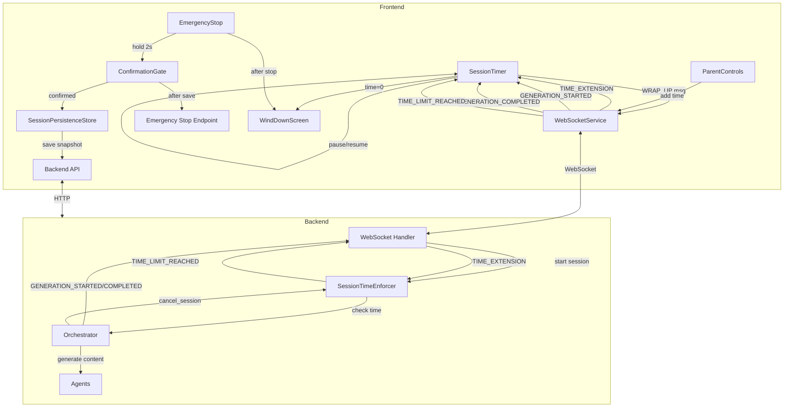

# Design Document: Emergency Stop & Session Limits

## Overview

This design hardens Twin Spark Chronicles' session time management by moving enforcement to the backend, adding graceful wind-down experiences, making the emergency stop safe from accidental child taps, tracking real session duration, supporting parent-initiated time extensions, and pausing the timer during AI generation. The goal is safety and parental control that still feels like part of the adventure for 6-year-old twins Ale and Sofi.

The system introduces a `SessionTimeEnforcer` module on the backend that tracks per-session elapsed time using server-side wall-clock time, independent of the frontend. The frontend `SessionTimer` is enhanced to respond to backend messages (`GENERATION_STARTED`, `GENERATION_COMPLETED`, `TIME_EXTENSION`, `TIME_LIMIT_REACHED`) and pause/resume accordingly. The `EmergencyStop` component gains a confirmation gate (press-and-hold) to prevent accidental activation, and triggers a snapshot save before stopping. A `WindDownScreen` overlay provides a magical goodbye when sessions end.

All animations use CSS-only approaches following the existing `CelebrationOverlay` pattern. No new heavy dependencies are introduced.

## Architecture



### Key Design Decisions

1. **Server-side time enforcement**: The `SessionTimeEnforcer` is the single source of truth for session time. The frontend timer is a display-only mirror. This prevents bypass via browser refresh or DevTools manipulation.

2. **Generation pause tracking on both sides**: The backend tracks generation pause durations to exclude them from elapsed time checks. The frontend pauses its countdown display in sync via WebSocket messages. A 60-second safety timeout on the frontend prevents indefinite pausing if a `GENERATION_COMPLETED` message is lost.

3. **Confirmation gate as press-and-hold**: A swipe gesture is unreliable on desktop and complex to implement without a gesture library. A 2-second press-and-hold with a visual progress ring is universally accessible, works on touch and mouse, and uses only CSS transitions + pointer events.

4. **Snapshot-before-stop**: The emergency stop saves a snapshot before calling the backend cancel endpoint. This ensures story progress is never lost, even on abrupt exits. A localStorage fallback handles network failures.

5. **WindDownScreen reuses CelebrationOverlay pattern**: Star-trail particles + fade-to-dark, all CSS keyframes, no canvas or requestAnimationFrame.

## Components and Interfaces

### Backend: SessionTimeEnforcer

New module: `backend/app/services/session_time_enforcer.py`

```python
class SessionTimeEnforcer:
    """Tracks per-session elapsed time and enforces time limits server-side."""

    def start_session(self, session_id: str, time_limit_minutes: int) -> None:
        """Record session start timestamp and configured time limit."""

    def check_time(self, session_id: str) -> TimeCheckResult:
        """Check if session has exceeded its time limit (excluding generation pauses).
        Returns TimeCheckResult with is_expired, elapsed_seconds, remaining_seconds."""

    def extend_time(self, session_id: str, additional_minutes: int) -> int:
        """Add minutes to session time limit. Returns new total limit in minutes."""

    def start_generation_pause(self, session_id: str) -> None:
        """Record start of a generation pause period."""

    def end_generation_pause(self, session_id: str) -> None:
        """Record end of a generation pause period."""

    def get_session_duration(self, session_id: str) -> float:
        """Compute total wall-clock duration in seconds (start to now/end)."""

    def end_session(self, session_id: str) -> float:
        """Mark session ended, return total duration in seconds."""

    def resume_session(self, session_id: str, previous_duration_seconds: float) -> None:
        """Resume tracking from a previously recorded duration (snapshot restore)."""

    def remove_session(self, session_id: str) -> None:
        """Clean up tracking data for a session."""
```

```python
@dataclass
class TimeCheckResult:
    is_expired: bool
    elapsed_seconds: float      # wall-clock minus generation pauses
    remaining_seconds: float
    total_limit_seconds: float
```

Internal state per session (in-memory dict, no DB needed):
```python
@dataclass
class _SessionTimeState:
    start_time: float                    # time.monotonic()
    time_limit_seconds: float
    generation_pause_start: float | None # monotonic timestamp when current pause began
    total_paused_seconds: float          # accumulated pause duration
    ended: bool
    end_time: float | None
    previous_duration_seconds: float     # from snapshot restore
```

### Backend: Orchestrator Changes

Modify `backend/app/agents/orchestrator.py`:

- In `generate_rich_story_moment`: Send `GENERATION_STARTED` message at the start, `GENERATION_COMPLETED` at the end (success or failure). Call `session_time_enforcer.start_generation_pause()` / `end_generation_pause()`.
- In `cancel_session`: Call `session_time_enforcer.end_session()` to record duration before cancelling tasks.
- Add time check before generation: if `session_time_enforcer.check_time()` returns expired, send `SESSION_TIME_EXPIRED` over WebSocket and skip generation.

### Backend: WebSocket Handler Changes

Modify `backend/app/main.py` WebSocket handler:

- On connection: extract `time_limit_minutes` from query params, call `session_time_enforcer.start_session()`.
- Handle incoming `TIME_EXTENSION` message: call `session_time_enforcer.extend_time()`, send confirmation back.
- Handle incoming `WRAP_UP` message: forward to orchestrator for story conclusion.
- Periodic check (or check before each generation): if time expired, send `TIME_LIMIT_REACHED`.

### Frontend: SessionTimer Enhancements

Modify `frontend/src/components/SessionTimer.jsx`:

- Add `isPaused` state, toggled by `GENERATION_STARTED` / `GENERATION_COMPLETED` WebSocket messages.
- Add 60-second safety timeout: if no `GENERATION_COMPLETED` received within 60s, auto-resume.
- Add `TIME_EXTENSION` handler: increase `secondsLeft`, reset warning state if above threshold, trigger sparkle animation.
- Add `TIME_LIMIT_REACHED` handler from backend: force timer to 0 if not already.
- Send `WRAP_UP` at 5 minutes remaining (already partially implemented, needs WebSocket message format alignment).
- Add pulsing opacity CSS class when paused.
- Add sparkle animation CSS class for time extension feedback.
- Trigger browser notification on session end via time limit.
- Store `session_ended` event to localStorage.

### Frontend: EmergencyStop Enhancements

Modify `frontend/src/components/EmergencyStop.jsx`:

- Replace single-tap with press-and-hold confirmation gate (2-second hold).
- Show animated progress ring during hold (CSS `conic-gradient` transition).
- Show pulsing arrow indicator during hold (CSS animation, no text).
- On release before 2s: reset to initial state.
- On hold complete: save snapshot via `SessionPersistenceStore`, then call emergency stop endpoint, then show `WindDownScreen`.
- 10-second total timeout for the full sequence.

### Frontend: WindDownScreen

New component: `frontend/src/shared/components/WindDownScreen.jsx` + `.css`

- Full-screen overlay (z-index above everything).
- Displays goodbye message with children's names and adventure summary.
- Star-trail particle animation (reuses CelebrationOverlay's star particle pattern).
- Gentle fade-to-dark over 8 seconds (normal end) or 4 seconds (emergency stop).
- Blocks all story interaction controls while active.
- Navigates to landing screen after animation completes.
- Respects `prefers-reduced-motion`.

### Frontend: ParentControls Enhancements

Modify `frontend/src/components/ParentControls.jsx`:

- Add "Add Time" section (visible only during active session).
- Three buttons: +10 min, +15 min, +30 min.
- Sends `TIME_EXTENSION` message via WebSocketService.
- Display most recent session end event (reason + timestamp) from localStorage.

### Frontend: parentControlsStore Enhancements

Modify `frontend/src/stores/parentControlsStore.js`:

- Add `sendTimeExtension(minutes)` action that sends WebSocket message.
- Add `lastSessionEndEvent` state (loaded from localStorage on init).
- Add `recordSessionEnd(reason, childNames)` action.

### Frontend: sessionPersistenceStore Enhancements

Modify `frontend/src/stores/sessionPersistenceStore.js`:

- Include `session_duration_seconds` from backend in snapshot metadata.
- On restore, pass `previous_duration_seconds` to backend via WebSocket so `SessionTimeEnforcer` can resume tracking.

## Data Models

### WebSocket Message Types (New)

```
// Backend → Frontend
{ type: "GENERATION_STARTED", session_id: string }
{ type: "GENERATION_COMPLETED", session_id: string }
{ type: "TIME_LIMIT_REACHED", session_id: string, elapsed_seconds: number }
{ type: "SESSION_TIME_EXPIRED", session_id: string }  // sent when generation rejected
{ type: "TIME_EXTENSION_CONFIRMED", session_id: string, new_limit_minutes: number, added_minutes: number }

// Frontend → Backend
{ type: "WRAP_UP", reason: "session_time_limit" }
{ type: "TIME_EXTENSION", additional_minutes: number }
```

### SessionTimeState (Backend In-Memory)

```python
@dataclass
class SessionTimeState:
    session_id: str
    start_time: float                     # time.monotonic()
    time_limit_seconds: float
    generation_pause_start: float | None  # None when not paused
    total_paused_seconds: float           # accumulated
    ended: bool
    end_time: float | None
    previous_duration_seconds: float      # from snapshot restore
```

### Session Metadata (Extended)

The existing `session_metadata` field in snapshots gains:

```json
{
  "language": "en",
  "story_beat_count": 5,
  "last_choice_made": "explore the cave",
  "session_duration_seconds": 847.3
}
```

`session_duration_seconds` is now populated with the real value from `SessionTimeEnforcer.get_session_duration()` instead of the current hardcoded `0`.

### localStorage: Session End Event

```json
{
  "key": "twinspark_last_session_end",
  "value": {
    "reason": "time_limit",
    "timestamp": "2024-01-15T18:30:00.000Z",
    "child_names": ["Ale", "Sofi"]
  }
}
```


## Correctness Properties

*A property is a characteristic or behavior that should hold true across all valid executions of a system — essentially, a formal statement about what the system should do. Properties serve as the bridge between human-readable specifications and machine-verifiable correctness guarantees.*

### Property 1: Session initialization records correct state

*For any* valid time limit in minutes (1–120), after calling `start_session(session_id, time_limit_minutes)`, the enforcer's internal state for that session should have `time_limit_seconds == time_limit_minutes * 60`, `total_paused_seconds == 0`, `ended == False`, and `get_session_duration()` should return a value >= 0.

**Validates: Requirements 1.1, 2.1**

### Property 2: Time expiry detection is correct

*For any* session with a configured time limit and *for any* elapsed time value (simulated by adjusting start_time), `check_time()` should return `is_expired == True` if and only if `elapsed_seconds >= total_limit_seconds`. The `remaining_seconds` should equal `max(0, total_limit_seconds - elapsed_seconds)`.

**Validates: Requirements 1.2, 1.3, 1.4**

### Property 3: Time extension increases limit

*For any* session with an initial time limit and *for any* positive extension amount in minutes, after calling `extend_time(session_id, additional_minutes)`, the new `time_limit_seconds` should equal the original limit plus `additional_minutes * 60`.

**Validates: Requirements 1.6, 6.4**

### Property 4: Session duration equals wall-clock minus pauses

*For any* session with a start time, an end time, and a list of non-overlapping generation pause intervals, `get_session_duration()` should equal `(end_time - start_time) - total_paused_seconds`. The `total_paused_seconds` should equal the sum of all pause interval durations.

**Validates: Requirements 2.2, 7.7**

### Property 5: Duration resume from snapshot is additive

*For any* previous duration value (>= 0) and *for any* additional elapsed time after resume, after calling `resume_session(session_id, previous_duration_seconds)` and then `end_session()`, the reported duration should be >= `previous_duration_seconds`.

**Validates: Requirements 2.5**

### Property 6: Generation pause exclusion from elapsed time

*For any* session with a time limit and *for any* generation pause duration, the effective elapsed time reported by `check_time()` should exclude the paused duration. Specifically, if wall-clock elapsed is `W` and total paused is `P`, then `elapsed_seconds == W - P`.

**Validates: Requirements 7.7**

### Property 7: Confirmation gate rejects holds shorter than threshold

*For any* hold duration less than 2000 milliseconds, the emergency stop action should NOT be triggered, and the component state should reset to initial (not stopping, progress at 0).

**Validates: Requirements 4.1, 4.3**

### Property 8: Confirmation gate accepts holds at or above threshold

*For any* hold duration >= 2000 milliseconds, the emergency stop action should be triggered (the `onStop` callback should be invoked).

**Validates: Requirements 4.4**

### Property 9: Time extension increases timer and conditionally resets warning

*For any* current `secondsLeft` value and *for any* extension amount in minutes, after applying the extension: the new `secondsLeft` should equal `old_secondsLeft + extension * 60`. If the new `secondsLeft > WARNING_THRESHOLD` (300 seconds), the warning state should be `false`.

**Validates: Requirements 6.5**

### Property 10: Session end event round-trip to localStorage

*For any* session end reason and *for any* pair of child names, after calling `recordSessionEnd(reason, childNames)`, reading `twinspark_last_session_end` from localStorage and parsing it should yield an object with the same `reason` and `child_names`.

**Validates: Requirements 8.3**

### Property 11: Snapshot metadata includes session duration

*For any* assembled snapshot, the `session_metadata` object should contain a `session_duration_seconds` field that is a number >= 0.

**Validates: Requirements 2.3**

### Property 12: formatTime produces valid MM:SS strings

*For any* non-negative integer of seconds, `formatTime(seconds)` should produce a string matching the pattern `\d{2}:\d{2}` where the minutes and seconds components correctly represent the input value.

**Validates: Requirements 2.2** (display correctness)

## Error Handling

| Scenario | Handling |
|---|---|
| WebSocket disconnects during session | Frontend timer continues locally. On reconnect, backend state is authoritative — frontend syncs via `TIME_LIMIT_REACHED` or resumed messages. |
| Snapshot save fails on emergency stop | Retry once (2s delay). If retry fails, save to localStorage as fallback. Proceed with stop regardless. |
| Emergency stop API call fails | Frontend navigates to landing after 3-second timeout. Background retry once after 1s (existing pattern). |
| `GENERATION_COMPLETED` never received | Frontend auto-resumes timer after 60 seconds. Backend `end_generation_pause` is called in `finally` block of generation methods. |
| Time extension sent while session expired | Backend rejects — session already ended. Frontend shows no change. |
| Browser Notifications API denied | Skip notification silently. No error displayed. |
| Session restored with stale duration | Backend `resume_session` adds previous duration to new tracking. If previous duration exceeds new time limit, session immediately expires. |
| Multiple rapid emergency stop taps | Confirmation gate's `stopping` state prevents re-entry. Only one stop sequence can run. |
| Backend SessionTimeEnforcer has no record for session | `check_time` returns a safe default (not expired) and logs a warning. This handles race conditions during startup. |

## Testing Strategy

### Property-Based Tests (Hypothesis, max_examples=20)

Each correctness property maps to a single Hypothesis test. Tests are in `backend/tests/test_session_time_enforcer.py` and `frontend/src/components/__tests__/` (using fast-check for JS).

**Backend (Hypothesis)**:
- Property 1: `test_session_initialization` — generate random time limits, verify state
- Property 2: `test_time_expiry_detection` — generate random limits and elapsed times, verify is_expired
- Property 3: `test_time_extension_increases_limit` — generate random limits and extensions
- Property 4: `test_duration_equals_wallclock_minus_pauses` — generate random pause intervals
- Property 5: `test_duration_resume_additive` — generate random previous durations
- Property 6: `test_generation_pause_exclusion` — generate random pause durations, verify elapsed excludes them

Each test tagged: `# Feature: emergency-stop-session-limits, Property N: <title>`

**Frontend (fast-check)**:
- Property 7: `test_confirmation_gate_rejects_short_holds` — generate random durations < 2000ms
- Property 8: `test_confirmation_gate_accepts_long_holds` — generate random durations >= 2000ms
- Property 9: `test_time_extension_increases_timer` — generate random secondsLeft and extension amounts
- Property 10: `test_session_end_event_roundtrip` — generate random reasons and child names
- Property 11: `test_snapshot_includes_duration` — generate random snapshot states
- Property 12: `test_formatTime_valid_output` — generate random non-negative integers

Each test tagged: `// Feature: emergency-stop-session-limits, Property N: <title>`

### Unit Tests

- Emergency stop full sequence: snapshot save → API call → wind-down (integration)
- WRAP_UP message sent at exactly 5 minutes remaining
- Wind-down screen blocks interaction controls
- Browser notification content includes correct child names
- Time extension WebSocket message format
- Orchestrator sends GENERATION_STARTED/COMPLETED around generation calls
- cancel_session waits for pending snapshot save

### Configuration

- Hypothesis: `max_examples=20` (per project convention)
- fast-check: `numRuns: 100`
- All property tests reference their design document property number in comments
