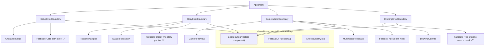
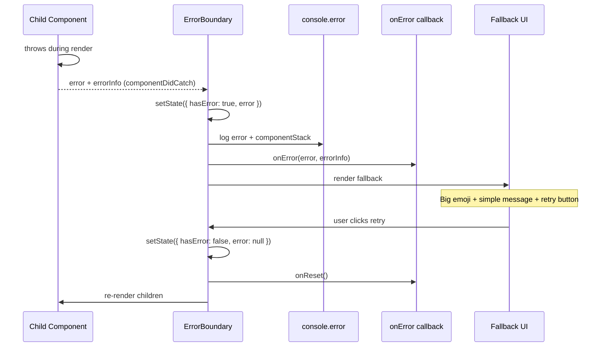
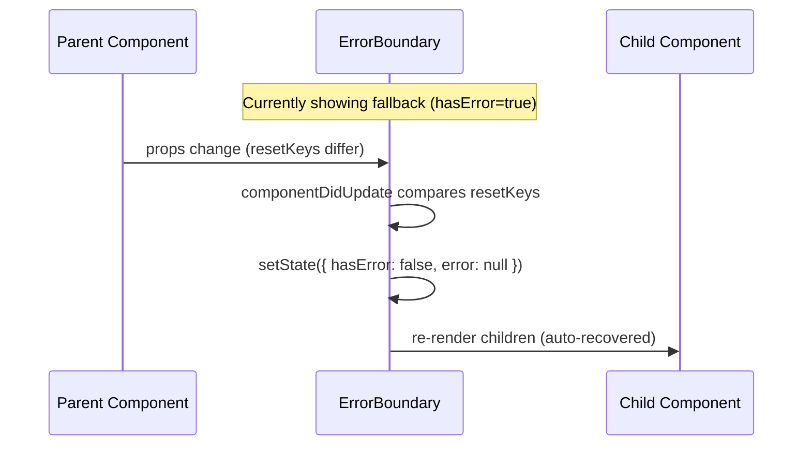

# Design Document: Error Boundaries

## Overview

Twin Spark Chronicles currently has zero error boundaries — any unhandled exception in the story renderer, drawing canvas, camera, or setup wizard crashes the entire app to a white screen. For 6-7 year old users who cannot troubleshoot, this is a critical UX failure.

This feature introduces a reusable `ErrorBoundary` class component (React requires class components for `componentDidCatch`) and four domain-specific boundary wrappers. Each boundary provides a child-friendly fallback UI with large emojis, simple messages, colorful CSS-only styling, and retry/reset actions. The camera boundary silently hides since camera is optional.

## Architecture



## Sequence Diagrams

### Error Capture & Fallback Flow



### Auto-Reset via resetKeys



## Components and Interfaces

### Component 1: ErrorBoundary (Class Component)

**Purpose**: Core reusable error boundary that catches render errors in its subtree and displays a fallback.

**Interface**:
```jsx
// Props
interface ErrorBoundaryProps {
  children: ReactNode;
  fallback?: ReactNode | ((error: Error, reset: () => void) => ReactNode);
  onError?: (error: Error, errorInfo: React.ErrorInfo) => void;
  onReset?: () => void;
  resetKeys?: any[];
}

// State
interface ErrorBoundaryState {
  hasError: boolean;
  error: Error | null;
}
```

**Responsibilities**:
- Catch JavaScript errors in child component tree via `componentDidCatch`
- Display fallback UI when an error is caught
- Support both static ReactNode and render-function fallbacks
- Auto-reset when `resetKeys` values change
- Provide manual reset via retry/reset buttons
- Log errors with component stack to console

### Component 2: FallbackUI (Functional Component)

**Purpose**: Default child-friendly fallback with emoji, message, and action button.

**Interface**:
```jsx
interface FallbackUIProps {
  emoji: string;          // e.g. "📖"
  message: string;        // e.g. "Oops! The story got lost"
  buttonLabel: string;    // e.g. "Try Again"
  buttonEmoji?: string;   // e.g. "🔄"
  onAction: () => void;   // retry/reset handler
  variant?: 'story' | 'drawing' | 'setup' | 'default';
}
```

**Responsibilities**:
- Render large emoji (64px+) as visual anchor for non-readers
- Display simple message in large, friendly font
- Render colorful action button with emoji icon
- CSS-only animations (gentle bounce on emoji, pulse on button)
- Variant-based color theming (purple for story, green for drawing, gold for setup)

### Component 3: Domain-Specific Boundary Wrappers

**Purpose**: Thin wrappers around ErrorBoundary with pre-configured fallbacks for each feature area.

```jsx
// StoryErrorBoundary — wraps TransitionEngine/DualStoryDisplay
function StoryErrorBoundary({ children, onReset }) {
  return (
    <ErrorBoundary
      fallback={(error, reset) => (
        <FallbackUI
          emoji="📖"
          message="Oops! The story got lost"
          buttonLabel="Try Again"
          buttonEmoji="🔄"
          onAction={reset}
          variant="story"
        />
      )}
      onError={(error, info) => console.error('[StoryError]', error, info.componentStack)}
      onReset={onReset}
    >
      {children}
    </ErrorBoundary>
  );
}

// DrawingErrorBoundary — wraps DrawingCanvas
function DrawingErrorBoundary({ children, onReset }) {
  return (
    <ErrorBoundary
      fallback={(error, reset) => (
        <FallbackUI
          emoji="🖍️"
          message="The crayons need a break"
          buttonLabel="Try Again"
          buttonEmoji="🎨"
          onAction={reset}
          variant="drawing"
        />
      )}
      onError={(error, info) => console.error('[DrawingError]', error, info.componentStack)}
      onReset={onReset}
    >
      {children}
    </ErrorBoundary>
  );
}

// CameraErrorBoundary — wraps CameraPreview/MultimodalFeedback (silent hide)
function CameraErrorBoundary({ children }) {
  return (
    <ErrorBoundary
      fallback={null}
      onError={(error, info) => console.error('[CameraError]', error, info.componentStack)}
    >
      {children}
    </ErrorBoundary>
  );
}

// SetupErrorBoundary — wraps CharacterSetup
function SetupErrorBoundary({ children, onReset }) {
  return (
    <ErrorBoundary
      fallback={(error, reset) => (
        <FallbackUI
          emoji="🌟"
          message="Let's start over!"
          buttonLabel="Start Fresh"
          buttonEmoji="✨"
          onAction={() => { reset(); onReset?.(); }}
          variant="setup"
        />
      )}
      onError={(error, info) => console.error('[SetupError]', error, info.componentStack)}
      onReset={onReset}
    >
      {children}
    </ErrorBoundary>
  );
}
```

## Data Models

### ErrorBoundary State

```jsx
// Internal state managed by the class component
{
  hasError: false,   // boolean — whether an error has been caught
  error: null        // Error | null — the caught error object
}
```

No external data models or store changes required. Error boundaries are self-contained React component state.

## Key Functions with Formal Specifications

### Function 1: getDerivedStateFromError(error)

```jsx
static getDerivedStateFromError(error) {
  return { hasError: true, error };
}
```

**Preconditions:**
- `error` is a JavaScript Error thrown during render of a descendant

**Postconditions:**
- Returns state update with `hasError: true` and the error object
- Component will re-render with fallback UI on next render cycle

### Function 2: componentDidCatch(error, errorInfo)

```jsx
componentDidCatch(error, errorInfo) {
  console.error('[ErrorBoundary]', error, errorInfo.componentStack);
  this.props.onError?.(error, errorInfo);
}
```

**Preconditions:**
- Called after `getDerivedStateFromError` has set error state
- `errorInfo.componentStack` contains the React component stack trace

**Postconditions:**
- Error and component stack are logged to console
- `onError` callback is invoked if provided
- No state mutation (state already set by getDerivedStateFromError)

### Function 3: resetErrorBoundary()

```jsx
resetErrorBoundary = () => {
  this.props.onReset?.();
  this.setState({ hasError: false, error: null });
}
```

**Preconditions:**
- Component is currently in error state (`hasError === true`)

**Postconditions:**
- `onReset` callback is invoked if provided
- State is cleared: `hasError` becomes `false`, `error` becomes `null`
- Children are re-rendered (attempted recovery)

### Function 4: componentDidUpdate(prevProps)

```jsx
componentDidUpdate(prevProps) {
  if (this.state.hasError && this.props.resetKeys) {
    const changed = this.props.resetKeys.some(
      (key, i) => key !== prevProps.resetKeys?.[i]
    );
    if (changed) {
      this.resetErrorBoundary();
    }
  }
}
```

**Preconditions:**
- Component has re-rendered due to prop changes
- `resetKeys` is an array of values to watch

**Postconditions:**
- If any value in `resetKeys` differs from previous render AND component is in error state, auto-resets
- If `resetKeys` unchanged or component not in error state, no-op

**Loop Invariants:**
- Comparison iterates over `resetKeys` array; all previously compared keys matched when loop continues

## Example Usage

### In App.jsx — Wrapping Feature Areas

```jsx
import { 
  StoryErrorBoundary, 
  DrawingErrorBoundary, 
  CameraErrorBoundary, 
  SetupErrorBoundary 
} from './shared/components';

// In the render:

{/* Setup phase */}
{setup.currentStep === 'characters' && !persistence.availableSession && (
  <SetupErrorBoundary onReset={() => setup.reset()}>
    <CharacterSetup
      onComplete={handleSetupComplete}
      language={setup.language}
      t={t}
    />
  </SetupErrorBoundary>
)}

{/* Story experience */}
{story.currentBeat && (
  <StoryErrorBoundary>
    <TransitionEngine
      storyBeat={story.currentBeat}
      t={t}
      profiles={session.profiles}
      onChoice={handleChoice}
    />
  </StoryErrorBoundary>
)}

{/* Camera — silent hide on error */}
<CameraErrorBoundary>
  <CameraPreview />
  <MultimodalFeedback />
</CameraErrorBoundary>

{/* Drawing canvas */}
{drawingStore.isActive && (
  <DrawingErrorBoundary>
    <DrawingCanvas
      prompt={drawingStore.prompt}
      duration={drawingStore.duration}
      siblingId="child1"
      profiles={session.profiles}
      onComplete={handleDrawingComplete}
    />
  </DrawingErrorBoundary>
)}
```

## Correctness Properties

1. **Isolation**: An error thrown inside a boundary's subtree MUST NOT propagate to sibling boundaries or the root App component.
2. **Fallback rendering**: When `hasError === true`, the boundary MUST render the fallback and MUST NOT render children.
3. **Recovery**: After `resetErrorBoundary()` is called, `hasError` MUST be `false` and children MUST be re-rendered.
4. **Auto-reset**: When `resetKeys` change while in error state, the boundary MUST auto-reset without user interaction.
5. **Silent hide**: CameraErrorBoundary with `fallback={null}` MUST render nothing (not even a container div) when in error state.
6. **Logging**: Every caught error MUST be logged to console with the component stack trace.
7. **No side effects on success**: When no error occurs, ErrorBoundary MUST render children identically as if the boundary were not present.
8. **Render function fallback**: When `fallback` is a function, it MUST receive `(error, resetFn)` as arguments.

## Error Handling

### Scenario 1: Story Renderer Crash

**Condition**: TransitionEngine or DualStoryDisplay throws during render (e.g., undefined property access on storyBeat)
**Response**: StoryErrorBoundary catches error, shows "Oops! The story got lost 📖" with retry button
**Recovery**: User taps retry → boundary resets → TransitionEngine re-renders. If storyBeat data was the issue, the next WebSocket beat will provide fresh data.

### Scenario 2: Drawing Canvas Crash

**Condition**: DrawingCanvas throws (e.g., canvas API error, stroke processing failure)
**Response**: DrawingErrorBoundary catches error, shows "The crayons need a break 🖍️" with retry button
**Recovery**: User taps retry → canvas re-initializes. Drawing session state in drawingStore remains intact.

### Scenario 3: Camera/Multimodal Crash

**Condition**: CameraPreview or MultimodalFeedback throws (e.g., getUserMedia failure, WebRTC error)
**Response**: CameraErrorBoundary catches error, renders `null` — camera UI silently disappears
**Recovery**: Camera is optional; story continues without it. No user action needed.

### Scenario 4: Setup Wizard Crash

**Condition**: CharacterSetup throws (e.g., form state corruption, photo upload error)
**Response**: SetupErrorBoundary catches error, shows "Let's start over! 🌟" with reset button
**Recovery**: User taps reset → `setup.reset()` is called → wizard returns to initial state.

### Scenario 5: Error During Fallback Render

**Condition**: The fallback component itself throws
**Response**: Error propagates to the next parent boundary (or root). This is a React limitation.
**Mitigation**: Fallback UIs are intentionally simple (static emoji + text + button) to minimize this risk.

## Testing Strategy

### Unit Testing Approach

- Test ErrorBoundary with a `ThrowingComponent` that conditionally throws
- Verify fallback renders when child throws
- Verify children render when no error
- Verify `resetErrorBoundary` clears error state
- Verify `onError` callback receives error and errorInfo
- Verify `onReset` callback fires on reset
- Verify `resetKeys` auto-reset behavior
- Verify `fallback={null}` renders nothing

### Property-Based Testing Approach

**Property Test Library**: fast-check

- Generate random sequences of error/reset/resetKey-change events and verify the boundary always reaches a consistent state
- Generate random `resetKeys` arrays and verify auto-reset triggers correctly on any value change

### Integration Testing Approach

- Wrap real feature components in boundaries and trigger known error conditions
- Verify the rest of the app remains functional when one boundary catches an error
- Verify retry/reset buttons restore normal operation

## Performance Considerations

- ErrorBoundary adds zero overhead on the happy path — `getDerivedStateFromError` and `componentDidCatch` are only called when errors occur
- No additional re-renders introduced; boundary is a pass-through wrapper when no error
- CSS-only animations in fallback UIs — no JavaScript animation libraries
- `resetKeys` comparison is O(n) where n is the array length (typically 1-3 items)

## Security Considerations

- Error details (stack traces, component stacks) are logged to console only — never displayed to the user
- Fallback UIs show generic child-friendly messages, never technical error details
- No error data is sent to external services (future: could add error reporting service)

## Dependencies

- React (existing) — `Component`, `componentDidCatch`, `getDerivedStateFromError`
- No new external dependencies
- CSS-only styling (no animation libraries)
