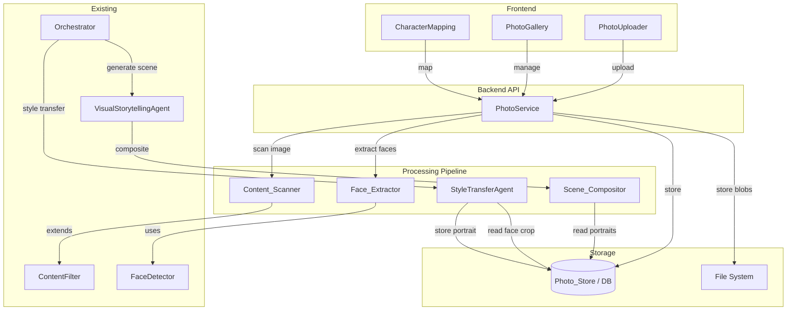
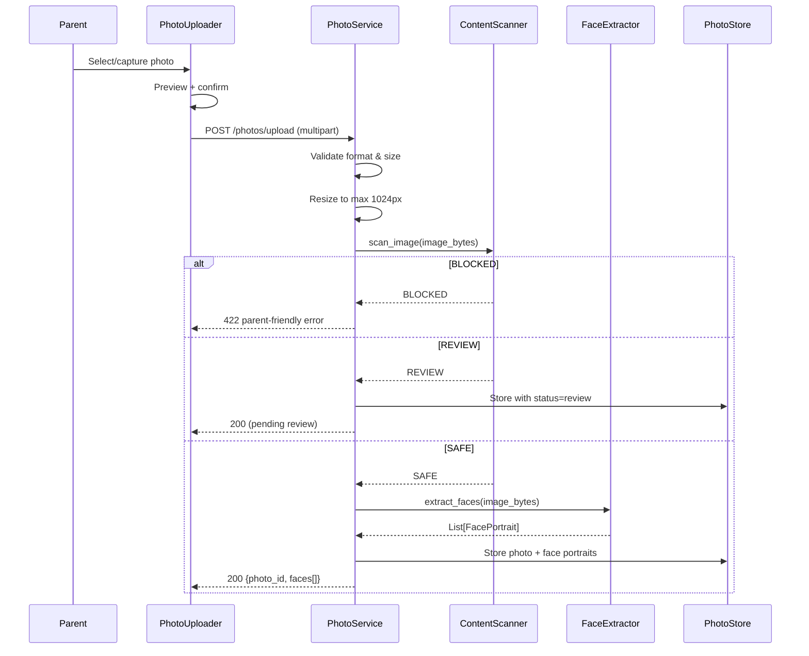
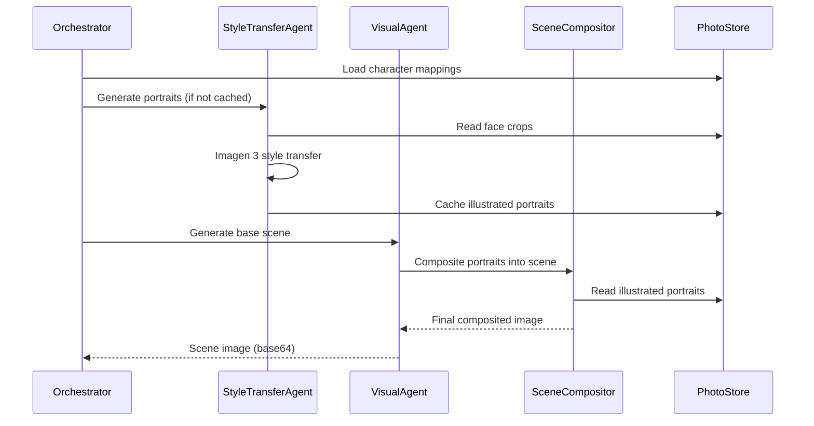

# Design Document: Family Photo Integration

## Overview

Family Photo Integration transforms Twin Spark Chronicles from a generic illustrated story app into a deeply personal experience by weaving real family photos into AI-generated story scenes. The pipeline flows: **upload → safety scan → face extraction → labeling → style transfer → scene compositing**. Each stage is a discrete backend service/agent, connected through the existing orchestrator and persisted via the DatabaseConnection abstraction.

The feature extends three existing systems:
- **ContentFilter** gains an image scanning path (`Content_Scanner`)
- **FaceDetector** gains a cropping/extraction layer (`Face_Extractor`)
- **VisualStorytellingAgent** gains a compositing step (`Scene_Compositor`)

Two new components are introduced:
- **PhotoService** — FastAPI service handling upload, validation, resize, and CRUD
- **StyleTransferAgent** — Imagen 3 agent that converts cropped face photos into Pixar/Disney-style illustrated portraits

On the frontend, two new React components are added to the setup flow:
- **PhotoUploader** — camera/gallery capture with drag-and-drop
- **PhotoGallery** — face card labeling, character mapping, and photo management

All photo data is scoped to a `sibling_pair_id`, ensuring family isolation on shared devices.

## Architecture



### Request Flow — Photo Upload



### Request Flow — Story Scene with Photo Integration



## Components and Interfaces

### Backend Components

#### 1. PhotoService (`backend/app/services/photo_service.py`)

Central service coordinating the photo lifecycle. Stateless — all state lives in Photo_Store.

```python
class PhotoService:
    def __init__(self, db: DatabaseConnection, content_scanner: ContentScanner,
                 face_extractor: FaceExtractor):
        ...

    async def upload_photo(self, sibling_pair_id: str, image_bytes: bytes,
                           filename: str) -> PhotoUploadResult:
        """Validate → resize → scan → extract faces → store. Returns photo_id + faces."""

    async def get_photos(self, sibling_pair_id: str) -> list[PhotoRecord]:
        """List all photos for a sibling pair, ordered by upload date."""

    async def get_photo(self, photo_id: str) -> PhotoRecord | None:
        """Retrieve a single photo record with face portraits."""

    async def delete_photo(self, photo_id: str) -> DeleteResult:
        """Delete photo, all face portraits, style-transferred images, and invalidate mappings."""

    async def approve_photo(self, photo_id: str) -> PhotoRecord:
        """Parent approves a photo flagged as REVIEW."""

    async def save_family_member(self, face_portrait_id: str, name: str) -> FamilyMember:
        """Label a face portrait with a family member name."""

    async def save_character_mapping(self, sibling_pair_id: str,
                                     mappings: list[CharacterMappingInput]) -> list[CharacterMapping]:
        """Persist character-to-family-member assignments."""

    async def get_character_mappings(self, sibling_pair_id: str) -> list[CharacterMapping]:
        """Load all character mappings for a sibling pair."""

    async def get_storage_stats(self, sibling_pair_id: str) -> StorageStats:
        """Return photo count and total storage usage for a sibling pair."""

    def validate_image(self, image_bytes: bytes, filename: str) -> None:
        """Check format (JPEG/PNG) and size (≤10 MB). Raises ValidationError."""

    def resize_image(self, image_bytes: bytes, max_dimension: int = 1024) -> bytes:
        """Resize preserving aspect ratio. Returns resized JPEG bytes."""
```

#### 2. ContentScanner (`backend/app/services/content_scanner.py`)

Extends the existing `ContentFilter` with image safety scanning. Uses Google Cloud Vision SafeSearch or Imagen safety filters.

```python
class ImageSafetyRating(str, Enum):
    SAFE = "SAFE"
    REVIEW = "REVIEW"
    BLOCKED = "BLOCKED"

@dataclass
class ImageScanResult:
    rating: ImageSafetyRating
    reason: str

class ContentScanner:
    def __init__(self, content_filter: ContentFilter):
        self._text_filter = content_filter

    async def scan_image(self, image_bytes: bytes) -> ImageScanResult:
        """Scan image for inappropriate content. Returns rating + reason."""

    def scan_text(self, text: str, **kwargs) -> FilterResult:
        """Delegate to existing ContentFilter for text scanning."""
```

#### 3. FaceExtractor (`backend/app/services/face_extractor.py`)

Wraps the existing `FaceDetector` and adds cropping with consistent padding.

```python
@dataclass
class ExtractedFace:
    face_index: int
    crop_bytes: bytes          # JPEG bytes of the cropped face
    bbox: FaceBBox             # Original bounding box
    crop_width: int
    crop_height: int

class FaceExtractor:
    def __init__(self, face_detector: FaceDetector):
        self._detector = face_detector

    def extract_faces(self, image_bytes: bytes, margin: float = 0.2) -> list[ExtractedFace]:
        """Detect faces and crop each with `margin` padding (default 20%).
        Returns up to 10 face crops. Raises NoFacesFoundError if none detected."""
```

#### 4. StyleTransferAgent (`backend/app/agents/style_transfer_agent.py`)

Uses Imagen 3 to transform a cropped face photo into a Pixar/Disney-style illustrated portrait.

```python
class StyleTransferAgent:
    def __init__(self):
        self._model = ImageGenerationModel.from_pretrained("imagen-3.0-generate-001")
        self._enabled: bool  # False if GOOGLE_PROJECT_ID not set

    async def generate_portrait(self, face_crop_bytes: bytes,
                                character_context: dict) -> bytes | None:
        """Style-transfer a face crop into an illustrated portrait.
        Returns PNG bytes or None on failure."""

    async def generate_portraits_for_session(
        self, sibling_pair_id: str, session_id: str,
        mappings: list[CharacterMapping], db: DatabaseConnection
    ) -> dict[str, str]:
        """Generate (or load cached) illustrated portraits for all mapped characters.
        Returns {character_role: base64_portrait}. Falls back to default avatar on failure."""
```

#### 5. SceneCompositor (`backend/app/services/scene_compositor.py`)

Composites style-transferred portraits into generated scene images using Pillow.

```python
class SceneCompositor:
    def composite(self, base_scene_bytes: bytes,
                  portraits: dict[str, bytes],
                  character_positions: dict[str, CharacterPosition]) -> bytes:
        """Overlay portraits onto the base scene at specified positions.
        Applies scaling, color grading, and shadow blending.
        Returns final composited PNG bytes."""
```

#### 6. FastAPI Endpoints (`backend/app/main.py` — new routes)

```python
# Photo upload & management
POST   /photos/upload                  # Multipart upload
GET    /photos/{sibling_pair_id}       # List photos
DELETE /photos/{photo_id}              # Delete photo + cascade
POST   /photos/{photo_id}/approve      # Parent approves REVIEW photo

# Face labeling
PUT    /photos/faces/{face_id}/label   # Set family member name

# Character mapping
GET    /photos/mappings/{sibling_pair_id}       # Get mappings
POST   /photos/mappings/{sibling_pair_id}       # Save mappings

# Storage stats
GET    /photos/stats/{sibling_pair_id}          # Photo count + usage
```

### Frontend Components

#### 7. PhotoUploader (`frontend/src/features/setup/components/PhotoUploader.jsx`)

- Camera capture via `navigator.mediaDevices.getUserMedia()` or `<input type="file" accept="image/*" capture="environment">`
- Gallery picker via `<input type="file" accept="image/jpeg,image/png">`
- Drag-and-drop zone for desktop browsers
- Preview with confirm/retake controls
- Large touch targets (min 48×48 CSS px), colorful icons, no text labels
- Voice prompts via Google Cloud TTS at each step
- Max 3 action choices visible at any time
- Celebratory animation + sound on successful face detection

#### 8. PhotoGallery (`frontend/src/features/setup/components/PhotoGallery.jsx`)

- Grid of uploaded photos sorted by upload date
- Tap a photo to see full image with face bounding boxes highlighted
- Face cards with editable name labels
- Swipe gesture support for touch browsing
- Delete button with confirmation
- Storage count + usage indicator

#### 9. CharacterMapping (`frontend/src/features/setup/components/CharacterMapping.jsx`)

- List of story character roles with drag-to-assign family member faces
- Minimum 2 sibling protagonists must be mapped before starting
- Unmapped roles show default AI avatar with "use default" label
- Persists mapping via `POST /photos/mappings/{sibling_pair_id}`


## Data Models

### Pydantic Models (`backend/app/models/photo.py`)

```python
from pydantic import BaseModel, Field
from enum import Enum
from datetime import datetime

class PhotoStatus(str, Enum):
    SAFE = "safe"
    REVIEW = "review"
    BLOCKED = "blocked"

class PhotoRecord(BaseModel):
    photo_id: str
    sibling_pair_id: str
    filename: str
    file_path: str
    file_size_bytes: int
    width: int
    height: int
    status: PhotoStatus
    uploaded_at: datetime
    faces: list["FacePortraitRecord"] = []

class FacePortraitRecord(BaseModel):
    face_id: str
    photo_id: str
    face_index: int
    crop_path: str
    bbox_x: float
    bbox_y: float
    bbox_width: float
    bbox_height: float
    family_member_name: str | None = None

class FamilyMember(BaseModel):
    face_id: str
    name: str
    crop_path: str
    sibling_pair_id: str

class CharacterMappingInput(BaseModel):
    character_role: str
    face_id: str | None = None  # None means use default avatar

class CharacterMapping(BaseModel):
    mapping_id: str
    sibling_pair_id: str
    character_role: str
    face_id: str | None
    family_member_name: str | None
    style_transferred_path: str | None = None
    created_at: datetime

class PhotoUploadResult(BaseModel):
    photo_id: str
    status: PhotoStatus
    faces: list[FacePortraitRecord] = []
    message: str

class DeleteResult(BaseModel):
    deleted_photo_id: str
    deleted_face_count: int
    invalidated_mapping_count: int
    affected_character_roles: list[str]

class StorageStats(BaseModel):
    photo_count: int
    face_count: int
    total_size_bytes: int

class CharacterPosition(BaseModel):
    x: float = Field(ge=0.0, le=1.0, description="Normalized X position in scene")
    y: float = Field(ge=0.0, le=1.0, description="Normalized Y position in scene")
    scale: float = Field(gt=0.0, le=2.0, description="Scale factor relative to scene")
    z_order: int = Field(default=0, description="Layer ordering")
```

### Database Schema (Migration `002_family_photos.sql`)

```sql
-- Photo uploads
CREATE TABLE IF NOT EXISTS photos (
    photo_id TEXT PRIMARY KEY,
    sibling_pair_id TEXT NOT NULL,
    filename TEXT NOT NULL,
    file_path TEXT NOT NULL,
    file_size_bytes INTEGER NOT NULL,
    width INTEGER NOT NULL,
    height INTEGER NOT NULL,
    status TEXT NOT NULL DEFAULT 'safe',  -- safe | review | blocked
    uploaded_at TEXT NOT NULL
);

CREATE INDEX IF NOT EXISTS idx_photos_sibling_pair ON photos(sibling_pair_id);

-- Extracted face portraits
CREATE TABLE IF NOT EXISTS face_portraits (
    face_id TEXT PRIMARY KEY,
    photo_id TEXT NOT NULL,
    face_index INTEGER NOT NULL,
    crop_path TEXT NOT NULL,
    bbox_x REAL NOT NULL,
    bbox_y REAL NOT NULL,
    bbox_width REAL NOT NULL,
    bbox_height REAL NOT NULL,
    family_member_name TEXT,
    FOREIGN KEY (photo_id) REFERENCES photos(photo_id) ON DELETE CASCADE
);

CREATE INDEX IF NOT EXISTS idx_face_portraits_photo ON face_portraits(photo_id);

-- Character-to-family-member mappings
CREATE TABLE IF NOT EXISTS character_mappings (
    mapping_id TEXT PRIMARY KEY,
    sibling_pair_id TEXT NOT NULL,
    character_role TEXT NOT NULL,
    face_id TEXT,
    created_at TEXT NOT NULL,
    FOREIGN KEY (face_id) REFERENCES face_portraits(face_id) ON DELETE SET NULL,
    UNIQUE(sibling_pair_id, character_role)
);

CREATE INDEX IF NOT EXISTS idx_character_mappings_sibling ON character_mappings(sibling_pair_id);

-- Cached style-transferred portraits
CREATE TABLE IF NOT EXISTS style_transferred_portraits (
    portrait_id TEXT PRIMARY KEY,
    face_id TEXT NOT NULL,
    session_id TEXT NOT NULL,
    file_path TEXT NOT NULL,
    generated_at TEXT NOT NULL,
    FOREIGN KEY (face_id) REFERENCES face_portraits(face_id) ON DELETE CASCADE
);

CREATE INDEX IF NOT EXISTS idx_style_portraits_face ON style_transferred_portraits(face_id);
```

### File System Layout

```
backend/
  photo_storage/
    {sibling_pair_id}/
      originals/
        {photo_id}.jpg
      faces/
        {face_id}.jpg
      portraits/
        {portrait_id}.png
```

Photo binary data is stored on the file system (not in the database) to keep the DB lean. The database holds metadata and file paths. The `photo_storage/` directory is created at startup and is gitignored.


## Correctness Properties

*A property is a characteristic or behavior that should hold true across all valid executions of a system — essentially, a formal statement about what the system should do. Properties serve as the bridge between human-readable specifications and machine-verifiable correctness guarantees.*

### Property 1: Image validation accepts if and only if format and size are valid

*For any* file submitted to `PhotoService.validate_image`, the validation passes if and only if the file is in JPEG or PNG format AND the file size is ≤ 10 MB. Invalid files must be rejected with an error message that identifies which constraint was violated.

**Validates: Requirements 1.3, 1.4**

### Property 2: Resize preserves aspect ratio and enforces max dimension

*For any* image with arbitrary width and height, after `PhotoService.resize_image` is applied, the longest side shall be ≤ 1024 pixels, and the ratio `width / height` of the output shall equal the ratio `width / height` of the input (within floating-point tolerance).

**Validates: Requirements 1.5**

### Property 3: Content scan rating determines photo processing path

*For any* uploaded image and its `ImageScanResult`, if the rating is BLOCKED then no photo record shall exist in the Photo_Store after the upload call returns; if the rating is REVIEW then the stored photo record shall have `status = "review"`; if the rating is SAFE then the stored photo record shall have `status = "safe"` and face extraction shall have been performed.

**Validates: Requirements 2.2, 2.3, 2.4**

### Property 4: Face crop includes consistent margin padding

*For any* face bounding box `(x, y, w, h)` within an image of dimensions `(img_w, img_h)`, the crop produced by `FaceExtractor` shall have dimensions equal to the bounding box expanded by 20% margin on each side, clamped to the image boundaries. Specifically: `crop_x = max(0, x - 0.2*w)`, `crop_y = max(0, y - 0.2*h)`, `crop_w = min(img_w, x + 1.2*w) - crop_x`, `crop_h = min(img_h, y + 1.2*h) - crop_y`.

**Validates: Requirements 3.2**

### Property 5: Photo integration requires minimum two sibling protagonist mappings

*For any* set of character mappings submitted for a story session with photo integration enabled, if fewer than 2 sibling protagonist roles have a non-null `face_id`, the session shall not start with photo integration and a validation error shall be returned.

**Validates: Requirements 4.4**

### Property 6: Unmapped characters use default avatar

*For any* character role in a story session where the corresponding `CharacterMapping` has `face_id = None`, the scene compositor shall use the default AI-generated avatar for that character, and the style transfer agent shall not attempt to generate a portrait for that role.

**Validates: Requirements 4.5, 6.4**

### Property 7: Style transfer produces one portrait per mapped family member

*For any* set of finalized character mappings where N family members have non-null `face_id` values, `StyleTransferAgent.generate_portraits_for_session` shall return exactly N portrait entries (one per mapped face_id), each stored in the Photo_Store linked to the correct face_id and session_id.

**Validates: Requirements 5.1, 5.5**

### Property 8: Style transfer failure falls back to default avatar

*For any* family member whose style transfer generation fails (raises an exception or returns None), the `StyleTransferAgent` shall return the default AI-generated avatar for that character role instead of propagating the error, and shall log the failure.

**Validates: Requirements 5.6**

### Property 9: Scene compositor includes all mapped portraits

*For any* base scene image and set of mapped character portraits, the `SceneCompositor.composite` output shall be a valid image (decodable PNG) whose dimensions match the base scene, and the compositor shall have processed every portrait in the input dictionary.

**Validates: Requirements 6.1**

### Property 10: Cascade delete removes all derived data and invalidates mappings

*For any* photo that is deleted via `PhotoService.delete_photo`, after deletion: (a) querying for the photo by `photo_id` returns None, (b) querying for face portraits by that `photo_id` returns an empty list, (c) querying for style-transferred portraits linked to those face_ids returns an empty list, and (d) any character mappings that referenced those face_ids have `face_id` set to NULL.

**Validates: Requirements 7.3, 7.4**

### Property 11: Photo record storage round-trip

*For any* valid `PhotoRecord` (with associated face portraits, family member names, and character mappings), storing the record via `PhotoService` and then loading it back shall produce an equivalent record — same photo_id, filename, dimensions, status, face count, face bounding boxes, family member names, and mapping associations.

**Validates: Requirements 1.6, 3.4, 4.2, 4.6, 8.1, 8.2, 8.4**

### Property 12: Sibling pair photo isolation

*For any* two distinct `sibling_pair_id` values A and B, photos stored under A shall never appear in query results for B, and vice versa. Specifically, `PhotoService.get_photos(A)` shall return only photos with `sibling_pair_id = A`, and the intersection with `PhotoService.get_photos(B)` shall be empty.

**Validates: Requirements 8.3**

## Error Handling

| Error Scenario | Component | Behavior |
|---|---|---|
| File too large (>10 MB) | PhotoService | Return 422 with message: "Photo must be under 10 MB" |
| Invalid format (not JPEG/PNG) | PhotoService | Return 422 with message: "Please upload a JPEG or PNG photo" |
| Content blocked | ContentScanner → PhotoService | Return 422 with parent-friendly message (no explicit details). Delete temp files. |
| No faces detected | FaceExtractor → PhotoService | Return 200 with `faces: []` and message: "No faces found — try a clearer photo!" |
| Face extraction failure | FaceExtractor | Log error, return empty face list, photo still stored |
| Style transfer failure | StyleTransferAgent | Log error, fall back to default AI avatar for that character |
| Scene compositing failure | SceneCompositor | Log error, return base scene without composited portraits |
| Database write failure | PhotoService | Return 500, roll back transaction, no partial data persisted |
| File system write failure | PhotoService | Return 500, roll back DB transaction, clean up any written files |
| Photo not found on delete | PhotoService | Return 404 with message: "Photo not found" |
| Imagen 3 unavailable | StyleTransferAgent | `enabled = False`, all calls return default avatar |
| Google Vision unavailable | ContentScanner | Fall back to `REVIEW` rating (conservative), log warning |

All error messages shown to children use simple, encouraging language. Technical details are logged server-side only.

## Testing Strategy

### Property-Based Testing

Library: **Hypothesis** (Python) — `pip install hypothesis`

Each correctness property maps to a single Hypothesis test. Tests run with a minimum of 100 examples per property.

Each test is tagged with a comment referencing its design property:
```python
# Feature: family-photo-integration, Property 1: Image validation accepts iff format and size are valid
```

Property tests focus on:
- `PhotoService.validate_image` — generate random bytes with random extensions and sizes
- `PhotoService.resize_image` — generate random image dimensions
- Content scan routing — mock scanner ratings, verify stored status
- `FaceExtractor` crop math — generate random bounding boxes and image sizes
- Character mapping validation — generate random mapping sets
- Cascade delete — generate random photo trees, delete, verify cleanup
- Round-trip persistence — generate random PhotoRecords, store/load
- Sibling pair isolation — generate two random IDs, store under each, cross-query

Hypothesis strategies will generate:
- Random image bytes (valid JPEG/PNG via `PIL.Image` + random pixels)
- Random filenames with various extensions
- Random file sizes (including boundary: 10 MB ± 1 byte)
- Random bounding boxes within `[0,1]` normalized coordinates
- Random family member names (unicode strings)
- Random sibling_pair_id values (UUIDs)

### Unit Testing

Unit tests (pytest) cover specific examples and edge cases:
- Upload a known 5 MB JPEG → succeeds
- Upload a 15 MB file → rejected with correct error
- Upload a `.gif` file → rejected
- Content scanner returns BLOCKED → photo not in DB
- Photo with 0 faces → appropriate message returned
- Photo with exactly 10 faces → all extracted
- Delete photo with 3 mapped faces → all 3 mappings invalidated
- Style transfer timeout → fallback avatar used
- Empty sibling_pair_id query → empty list returned

### Integration Testing

- Full upload pipeline: upload → scan → extract → store → retrieve
- Story session with photo integration: mapping → style transfer → scene composite
- Cross-session persistence: upload in session 1, verify available in session 2

### Frontend Testing

- React Testing Library for PhotoUploader, PhotoGallery, CharacterMapping components
- Verify touch target sizes meet 48×48 minimum
- Verify max 3 action choices rendered at any time
- Verify drag-and-drop zone renders on desktop viewport
