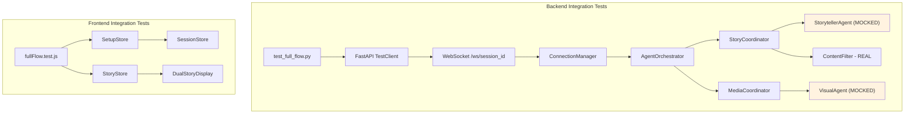

# Design Document: Full-Flow Integration Testing

## Overview

This design adds integration tests that validate the complete Twin Spark Chronicles pipeline: setup wizard → WebSocket connection → story generation → scene display. The tests span both backend (pytest) and frontend (vitest), using "Ale" and "Sofi" as the canonical sibling pair. All Gemini/Vertex/TTS agents are mocked at the boundary so the suite runs with zero API calls, focusing purely on integration correctness.

The existing test infrastructure already provides 809+ backend unit tests and 65 frontend tests. The `e2e-gemini-testing` spec covers real Gemini API calls (backend only). This spec fills the gap: verifying that all layers work together — stores, WebSocket transport, orchestrator delegation, and rendering — without touching external services.

### Key Design Decisions

1. **Shared Ale & Sofi fixture** — A single canonical fixture provides character profiles, WebSocket query params, and sibling_pair_id for both backend and frontend tests. Backend uses a pytest fixture; frontend uses a plain JS helper module.

2. **Mock at the agent boundary** — `StorytellerAgent.generate_story_segment`, `visual_agent`, `voice_agent`, and `memory_agent` are patched to return predetermined responses. The orchestrator, coordinators, content filter, and WebSocket handler run with real code.

3. **FastAPI TestClient for WebSocket** — Backend integration tests use `starlette.testclient.TestClient` with `with client.websocket_connect(...)` to exercise the real WebSocket endpoint without starting a server.

4. **Frontend store-level testing** — Frontend tests exercise Zustand stores directly (no DOM rendering needed for store tests) and use `@testing-library/react` for DualStoryDisplay rendering tests.

5. **No new test infrastructure** — Tests live alongside existing tests: `backend/tests/test_full_flow.py` and `frontend/src/__tests__/fullFlow.test.js`. No new pytest plugins or vitest plugins needed.

## Architecture



### Test File Layout

```
backend/tests/test_full_flow.py          # All backend integration tests
backend/tests/conftest.py                # Existing — already mocks google.generativeai
frontend/src/__tests__/fullFlow.test.js  # All frontend integration tests
frontend/src/__tests__/testFixtures.js   # Ale & Sofi fixture helper
```

## Components and Interfaces

### 1. Ale & Sofi Backend Fixture (`backend/tests/test_full_flow.py`)

A pytest fixture providing:

```python
@pytest.fixture
def ale_sofi_profiles():
    """Canonical Ale & Sofi character profiles for full-flow tests."""
    return {
        "child1": {
            "name": "Ale",
            "gender": "girl",
            "spirit_animal": "Dragon",
            "toy_name": "Bruno",
            "costume": "adventure_clothes",
            "costume_prompt": "wearing adventure clothes",
        },
        "child2": {
            "name": "Sofi",
            "gender": "boy",
            "spirit_animal": "Owl",
            "toy_name": "Book",
            "costume": "adventure_clothes",
            "costume_prompt": "wearing adventure clothes",
        },
    }

@pytest.fixture
def ale_sofi_ws_params():
    """WebSocket query parameters matching the format expected by the handler."""
    return {
        "lang": "en",
        "c1_name": "Ale", "c1_gender": "girl", "c1_personality": "brave",
        "c1_spirit": "Dragon", "c1_toy": "Bruno",
        "c2_name": "Sofi", "c2_gender": "boy", "c2_personality": "wise",
        "c2_spirit": "Owl", "c2_toy": "Book",
    }
```

Sibling pair ID: `"Ale:Sofi"` (alphabetically sorted).

### 2. Ale & Sofi Frontend Fixture (`frontend/src/__tests__/testFixtures.js`)

```javascript
export const ALE_SOFI_PROFILES = {
  c1_name: 'Ale', c1_gender: 'girl', c1_personality: 'brave',
  c1_spirit: 'Dragon', c1_costume: 'adventure_clothes',
  c1_costume_prompt: 'wearing adventure clothes',
  c1_toy: 'Bruno', c1_toy_type: 'preset', c1_toy_image: '',
  c2_name: 'Sofi', c2_gender: 'boy', c2_personality: 'wise',
  c2_spirit: 'Owl', c2_costume: 'adventure_clothes',
  c2_costume_prompt: 'wearing adventure clothes',
  c2_toy: 'Book', c2_toy_type: 'preset', c2_toy_image: '',
};

export const MOCK_STORY_BEAT = {
  narration: 'Ale and Sofi discovered a magical forest...',
  child1_perspective: 'Ale sees a glowing dragon egg!',
  child2_perspective: 'Sofi notices ancient owl runes on a tree.',
  scene_image_url: '/assets/generated_images/test_scene.png',
  choices: ['Follow the dragon egg', 'Read the owl runes', 'Explore together'],
};
```

### 3. Mock Story Response (shared across backend tests)

```python
MOCK_STORY_SEGMENT = {
    "text": "Ale and Sofi discovered a magical forest filled with glowing mushrooms! 🍄 "
            "A friendly dragon appeared and asked them a riddle. "
            "What should they do? Should they answer the riddle or ask the dragon for a clue?",
    "timestamp": "2025-01-15T10:00:00",
    "characters": {..},  # populated from fixture
    "interactive": {
        "type": "question",
        "text": "Should they answer the riddle or ask the dragon for a clue?",
        "expects_response": True,
    },
}
```

### 4. Backend Test Functions

| Test | What it validates |
|---|---|
| `test_ws_connect_and_input_status` | WebSocket accepts connection, sends `input_status` message with `type`, `camera`, `mic` |
| `test_ws_session_registered` | Session appears in `ConnectionManager.active_connections` after connect |
| `test_ws_story_generation` | Sending context message returns `story_segment` with expected structure |
| `test_ws_story_fallback_on_error` | When storyteller raises, fallback story contains "Ale" and "Sofi" |
| `test_ws_disconnect_cleanup` | After disconnect, session removed from `active_connections`, tasks cancelled |
| `test_orchestrator_rich_story` | `generate_rich_story_moment` returns complete result with all expected keys |
| `test_orchestrator_visual_disabled` | With visual disabled, `agents_used.visual` is False and `image` is None |
| `test_orchestrator_memory_count` | Memory mock returns memories, `memories_used` reflects count |
| `test_ws_message_protocol_input_status` | `input_status` message has `type`, `camera`, `mic` |
| `test_ws_message_protocol_story_segment` | `story_segment` message has `type` and `data.text` |
| `test_session_time_enforcer_tracking` | After connect, `SessionTimeEnforcer` has active entry |

### 5. Frontend Test Functions

| Test | What it validates |
|---|---|
| `test_setup_store_ale_sofi` | SetupStore sets child1.name="Ale", child2.name="Sofi", isComplete=true |
| `test_spirit_to_personality_mapping` | Dragon→"brave", Owl→"wise" |
| `test_session_store_receives_profiles` | SessionStore.profiles populated after setup |
| `test_story_store_asset_accumulation` | addAsset accumulates narration, perspectives, image, choices |
| `test_story_store_beat_assembly` | After assets + setCurrentBeat, currentBeat has all fields |
| `test_dual_story_display_narration` | Renders narration text in `.story-narration__text` |
| `test_dual_story_display_names` | Renders "Ale" and "Sofi" in avatar area |
| `test_dual_story_display_choices` | Renders correct number of `.story-choice-card` buttons |
| `test_dual_story_display_choice_callback` | Clicking choice calls `onChoice` with choice text |
| `test_dual_story_display_scene_image` | Renders SceneImageLoader when scene_image_url present |

## Data Models

### Ale & Sofi Character Profiles (Backend)

```python
{
    "child1": {
        "name": "Ale",
        "gender": "girl",
        "spirit_animal": "Dragon",
        "toy_name": "Bruno",
        "costume": "adventure_clothes",
        "costume_prompt": "wearing adventure clothes",
    },
    "child2": {
        "name": "Sofi",
        "gender": "boy",
        "spirit_animal": "Owl",
        "toy_name": "Book",
        "costume": "adventure_clothes",
        "costume_prompt": "wearing adventure clothes",
    },
}
```

### WebSocket Query Parameters

```
/ws/{session_id}?lang=en&c1_name=Ale&c1_gender=girl&c1_personality=brave&c1_spirit=Dragon&c1_toy=Bruno&c2_name=Sofi&c2_gender=boy&c2_personality=wise&c2_spirit=Owl&c2_toy=Book
```

### Mock Rich Story Moment (Orchestrator Output)

```python
{
    "text": "Ale and Sofi discovered a magical forest...",
    "image": None,  # visual disabled
    "audio": {"narration": None, "character_voices": []},
    "interactive": {
        "type": "question",
        "text": "Should they answer the riddle or ask the dragon for a clue?",
        "expects_response": True,
    },
    "timestamp": "2025-01-15T10:00:00",
    "memories_used": 2,
    "voice_recordings": [],
    "agents_used": {
        "storyteller": True,
        "visual": False,
        "voice": False,
        "memory": True,
    },
}
```

### Frontend StoryBeat Shape

```javascript
{
  narration: "Ale and Sofi discovered a magical forest...",
  child1_perspective: "Ale sees a glowing dragon egg!",
  child2_perspective: "Sofi notices ancient owl runes on a tree.",
  scene_image_url: "/assets/generated_images/test_scene.png",
  choices: ["Follow the dragon egg", "Read the owl runes", "Explore together"],
  voice_recordings: null,
}
```

### WebSocket Message Protocol Shapes

```json
// input_status
{"type": "input_status", "camera": false, "mic": false}

// story_segment
{"type": "story_segment", "data": {"text": "...", "timestamp": "...", "characters": {}, "interactive": {}}}

// emotion_feedback
{"type": "emotion_feedback", "emotions": [{"face_id": 0, "emotion": "happy", "confidence": 0.9}]}

// transcript_feedback
{"type": "transcript_feedback", "text": "hello", "confidence": 0.85}
```


## Correctness Properties

*A property is a characteristic or behavior that should hold true across all valid executions of a system — essentially, a formal statement about what the system should do. Properties serve as the bridge between human-readable specifications and machine-verifiable correctness guarantees.*

### Property 1: Sibling Pair ID Derivation

*For any* two non-empty child names, the derived `sibling_pair_id` should equal the two names sorted alphabetically and joined with a colon separator. The result should always have exactly one colon and the left name should be lexicographically ≤ the right name.

**Validates: Requirements 1.3**

### Property 2: Story Segment Structure Invariant

*For any* valid story context containing two characters with names, genders, and spirit animals, calling `StorytellerAgent.generate_story_segment()` (or its fallback) should return a dict containing the keys `text` (non-empty string), `timestamp` (string), `characters` (dict), and `interactive` (dict with keys `type`, `text`, `expects_response`).

**Validates: Requirements 3.3, 10.2**

### Property 3: Orchestrator Output Completeness

*For any* valid character profiles dict with child1 and child2, calling `generate_rich_story_moment()` with mocked agents should return a dict containing all required keys: `text`, `image`, `audio`, `interactive`, `timestamp`, `memories_used`, `voice_recordings`, and `agents_used`.

**Validates: Requirements 4.1**

### Property 4: Memory Count Consistency

*For any* list of N mock memories returned by the MemoryAgent, the orchestrator's result `memories_used` field should equal N.

**Validates: Requirements 4.4**

### Property 5: Spirit Animal to Personality Mapping

*For any* spirit animal in the set {dragon, unicorn, owl, dolphin, phoenix, tiger}, the `spiritToPersonality` mapping should produce a non-empty personality string, and the mapping should be deterministic (same input always yields same output).

**Validates: Requirements 5.4**

### Property 6: Choice Card Count Matches Choices Array

*For any* non-empty array of choice strings passed to DualStoryDisplay, the number of rendered `.story-choice-card` buttons should equal the length of the choices array.

**Validates: Requirements 7.3**

## Error Handling

| Scenario | Behavior |
|---|---|
| WebSocket connection with invalid session_id | ConnectionManager accepts (no validation on ID format), handler proceeds normally |
| StorytellerAgent.generate_story_segment raises Exception | WebSocket handler catches it, returns fallback story with both character names |
| ContentFilter.scan raises Exception | StoryCoordinator catches it, returns fallback story |
| WebSocket client disconnects mid-generation | `_cleanup_session` cancels pending tasks, removes from `active_connections`, ends time tracking |
| StoryStore receives incomplete assets before STORY_COMPLETE | Beat assembly uses defaults ("The adventure begins..." for missing narration) |
| DualStoryDisplay receives null storyBeat | Renders "Preparing your magical adventure…" placeholder |
| Mock agent returns unexpected shape | Tests fail with clear assertion errors indicating contract violation |

## Testing Strategy

### Unit Tests

The full-flow integration tests are primarily integration-level, but they include unit-level checks for:

- **Fixture correctness**: Ale & Sofi profiles contain expected fields and values
- **Sibling pair ID derivation**: Alphabetical sort + colon join
- **Spirit-to-personality mapping**: All 6 spirit animals map correctly
- **WebSocket message shapes**: Each message type has required fields

### Property-Based Tests

Property-based tests use **Hypothesis** (backend, already in dependencies) and **fast-check** (frontend, already in dependencies) with a minimum of 100 iterations per property.

Each property test is tagged with a comment:
```
# Feature: full-flow-integration-testing, Property {N}: {title}
```

| Property | PBT Strategy | Library |
|---|---|---|
| Property 1: Sibling Pair ID Derivation | Generate random pairs of non-empty alphabetic strings, derive pair ID, verify sorted order and colon separator | Hypothesis |
| Property 2: Story Segment Structure Invariant | Generate random character name/gender/spirit combos, call `_fallback_story()`, verify all required keys present | Hypothesis |
| Property 3: Orchestrator Output Completeness | Generate random character profiles, call `generate_rich_story_moment()` with mocked agents, verify all keys | Hypothesis |
| Property 4: Memory Count Consistency | Generate random-length lists of mock memories, run orchestrator, verify `memories_used` matches list length | Hypothesis |
| Property 5: Spirit Animal to Personality Mapping | Generate random spirit animals from the valid set, apply mapping, verify non-empty deterministic result | fast-check |
| Property 6: Choice Card Count | Generate random arrays of 1-6 choice strings, render DualStoryDisplay, count `.story-choice-card` elements | fast-check |

### Integration Tests

Backend integration tests use `starlette.testclient.TestClient` with `client.websocket_connect()`:

- **WebSocket connection handshake**: Connect, verify `input_status` message
- **Session registration**: Verify `ConnectionManager.active_connections` contains session
- **Story generation flow**: Send context, verify `story_segment` response structure
- **Fallback on error**: Mock storyteller to raise, verify fallback contains both names
- **Disconnect cleanup**: Disconnect, verify session removed and tasks cancelled
- **Orchestrator rich story**: Call `generate_rich_story_moment` directly with mocked agents
- **Session time tracking**: Verify `SessionTimeEnforcer` tracks session after connect

Frontend integration tests use vitest + @testing-library/react:

- **Setup store flow**: Call store actions, verify state transitions
- **Story store accumulation**: Add assets, verify `currentAssets` state
- **DualStoryDisplay rendering**: Render with mock beat, verify DOM elements

### Test Configuration

- Backend PBT library: **Hypothesis** (`@given` decorator, `@settings(max_examples=100)`)
- Frontend PBT library: **fast-check** (`fc.assert(fc.property(...))`, `{ numRuns: 100 }`)
- Backend test file: `backend/tests/test_full_flow.py`
- Frontend test file: `frontend/src/__tests__/fullFlow.test.js`
- Frontend fixture file: `frontend/src/__tests__/testFixtures.js`
- Backend run: `source venv/bin/activate && python3 -m pytest tests/test_full_flow.py -x -q --tb=short` from `backend/`
- Frontend run: `npm run test` from `frontend/` (vitest --run)
- After pytest: `pkill -f "python.*pytest"` (CacheManager cleanup loop causes hang)
- Each correctness property is implemented by a single test function
- Each PBT test includes a tag comment: `# Feature: full-flow-integration-testing, Property {N}: {title}`
- Optional (`*`) tasks are property-based tests — skip unless asked
