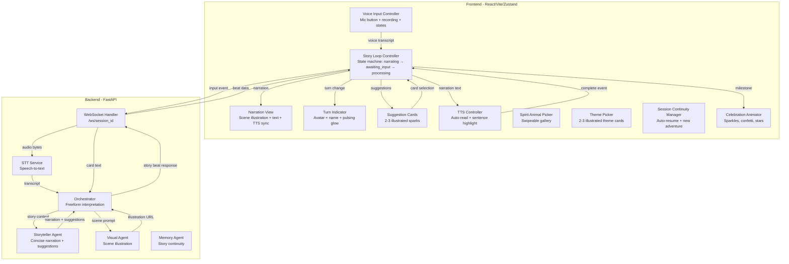
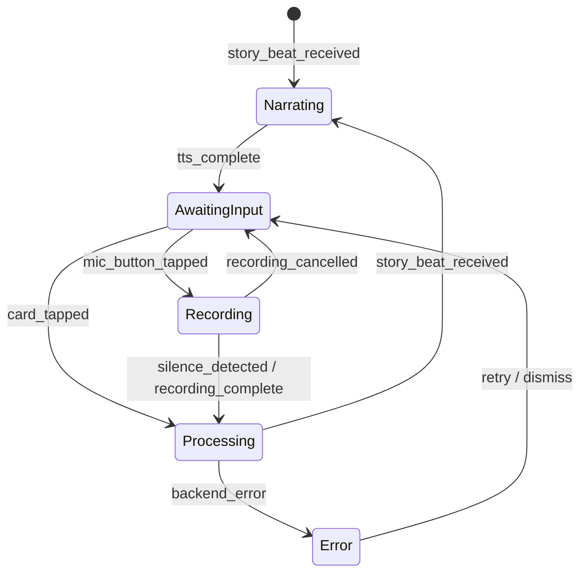
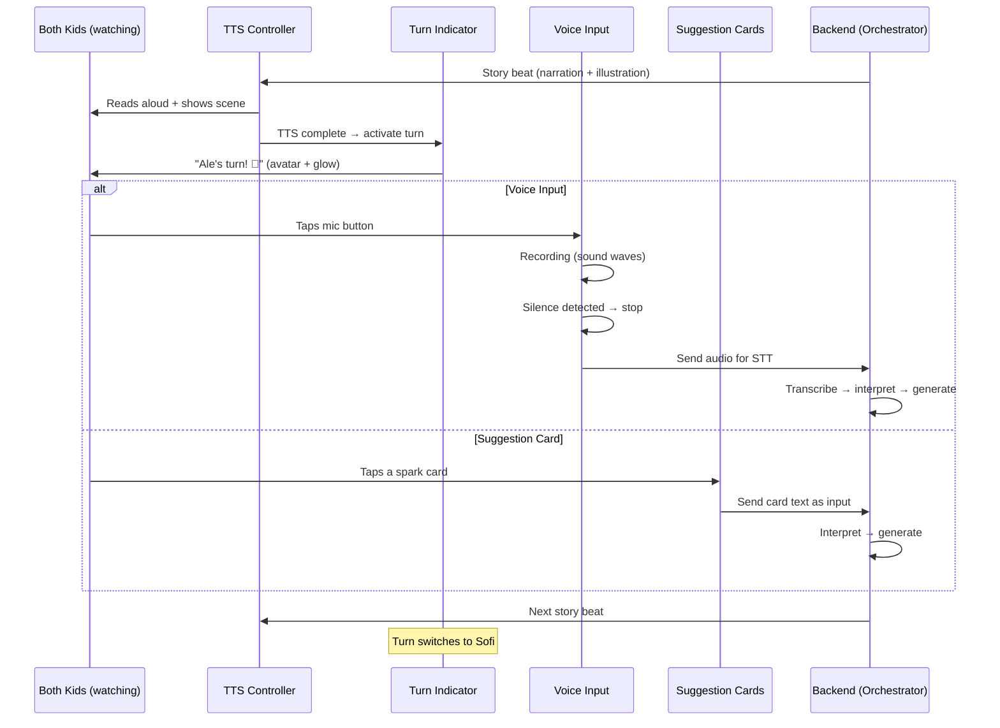

# Design Document: Interaction Model Redesign

## Overview

The Interaction Model Redesign transforms TwinSpark Chronicles from a text-heavy, dual-perspective, gamepad-driven experience into a voice-first, turn-based, single-narrative storytelling engine optimized for 6-8 year old twins sharing a single iPad in portrait mode. The core loop is: AI narrates (TTS + illustration) → turn indicator shows whose turn it is → child speaks freely into mic OR taps an illustrated suggestion card → AI weaves input into the next beat → turn switches.

Voice is the primary creative channel. Suggestion cards (called "Sparks") are training wheels — illustrated inspiration that children can ignore once comfortable. The AI interprets any input without rejection, creating a freeform imagination engine with no dead ends. TTS reads everything aloud automatically; text is secondary reinforcement for emerging readers.

### Key Design Decisions

1. **Voice-first, cards-as-fallback** — The mic button is the primary input. Suggestion cards exist for shy moments or mic failures, not as the default interaction. Both paths produce identical input events to the backend.
2. **Single narrative view replaces dual-perspective** — One big illustration + concise text (max 3 sentences) replaces the split-screen. Turn-taking creates shared ownership without visual complexity.
3. **Explicit turn-taking state machine** — A deterministic state machine manages the story loop phases (narrating → awaiting_input → processing → narrating). No ambiguous states.
4. **Backend generates suggestions alongside beats** — Each story beat response includes 2-3 contextual suggestion texts + illustration prompts, eliminating a separate API call.
5. **No rejection of input** — The backend prompt engineering ensures any child input (however fantastical) produces a valid next beat. The AI is instructed to "yes-and" everything.
6. **Gamepad system fully removed** — Not deprecated, not hidden — removed from the codebase. The interaction model is fundamentally incompatible with gamepad navigation.

## Architecture



### Story Loop State Machine



### Core Loop Sequence



## Components and Interfaces

### Frontend Components

#### Story Loop Controller (`frontend/src/features/story/hooks/useStoryLoop.js`)

Central state machine that orchestrates the entire interaction cycle.

```typescript
interface StoryLoopState {
  phase: 'narrating' | 'awaiting_input' | 'recording' | 'processing' | 'error'
  activeTwin: 'twin1' | 'twin2'  // alternates each turn
  currentBeat: StoryBeat | null
  suggestions: SuggestionCard[]  // 2-3 items
  error: string | null
}

interface StoryBeat {
  narration: string          // max 3 sentences
  illustrationUrl: string    // scene image
  suggestions: SuggestionCard[]
  perspective: string        // which twin's POV
}

interface SuggestionCard {
  id: string
  label: string              // max 4 words
  illustrationUrl: string    // card illustration
  storyDirection: string     // full text sent to backend
}

interface UseStoryLoop {
  state: StoryLoopState
  
  // Actions
  submitVoiceInput(transcript: string): void
  submitCardSelection(cardId: string): void
  onTTSComplete(): void
  startRecording(): void
  cancelRecording(): void
  retry(): void
}
```

#### Voice Input Controller (`frontend/src/features/story/components/VoiceInputController.jsx`)

Manages the mic button UI and recording lifecycle.

```typescript
interface VoiceInputControllerProps {
  isActive: boolean          // only enabled during awaiting_input phase
  activeTwinColor: string    // mic button accent color
  onTranscript: (text: string) => void
  onRecordingStart: () => void
  onRecordingEnd: () => void
}

// Internal states: idle | listening | processing | error
// Visual states:
//   idle: large pulsing mic icon
//   listening: animated sound waves + twin avatar "listening"
//   processing: sparkle animation
//   error: gentle retry prompt
```

#### Suggestion Cards (`frontend/src/features/story/components/SuggestionCards.jsx`)

Displays 2-3 illustrated spark cards as optional inspiration.

```typescript
interface SuggestionCardsProps {
  cards: SuggestionCard[]    // 2-3 items from backend
  isActive: boolean          // only tappable during awaiting_input phase
  onCardTap: (cardId: string) => void
  onCardLongPress: (cardId: string) => void  // triggers TTS read
}

// Each card: min 72px touch target, illustration + short label
// Layout: horizontal row below mic button
```

#### Turn Indicator (`frontend/src/features/story/components/TurnIndicator.jsx`)

Shows whose turn it is with avatar, name, and animated glow.

```typescript
interface TurnIndicatorProps {
  activeTwin: TwinConfig
  isVisible: boolean         // shown during awaiting_input + recording
}

// TwinConfig: { name, avatar, color }
// Animation: pulsing glow border in twin's color
// Position: top of screen, visible to both children
```

#### Narration View (`frontend/src/features/story/components/NarrationView.jsx`)

Single-narrative display with scene illustration and text.

```typescript
interface NarrationViewProps {
  beat: StoryBeat
  highlightedSentence: number  // index of sentence being read by TTS
  activeTwinAvatar: string     // small overlay on scene
}

// Layout (portrait):
//   Top 50-60%: scene illustration (crossfade transitions)
//   Middle 15-20%: narration text (large rounded font, 22px)
//   Bottom 25-30%: interaction controls (managed by parent)
```

#### Spirit Animal Picker (`frontend/src/features/setup/components/SpiritAnimalPicker.jsx`)

Swipeable gallery for children to pick their spirit animal.

```typescript
interface SpiritAnimalPickerProps {
  childName: string
  onSelect: (animalId: string) => void
}

// Cards: min 200px tall, horizontally swipeable
// No reading required: TTS speaks animal name on focus
// Selection: tap confirms + celebration animation
// Minimum 6 animal options
```

#### Theme Picker (`frontend/src/features/story/components/ThemePicker.jsx`)

Adventure theme selection for new stories.

```typescript
interface ThemePickerProps {
  onSelect: (themeId: string) => void
}

// 2-3 illustrated theme cards (forest, space, ocean, etc.)
// Min 120px height touch targets
// TTS reads theme name on focus
// Tap triggers launch celebration
```

### Backend Components

#### Story Beat Response (extended Orchestrator output)

```python
class StoryBeatResponse(BaseModel):
    narration: str  # max 3 sentences, optimized for TTS
    illustration_prompt: str  # for Visual Agent
    illustration_url: str | None  # populated after generation
    suggestions: list[SuggestionData]  # 2-3 items
    perspective: str  # which twin's POV this beat is from
    is_milestone: bool  # triggers celebration animation

class SuggestionData(BaseModel):
    id: str
    label: str  # max 4 words
    illustration_prompt: str  # for generating card illustration
    illustration_url: str | None
    story_direction: str  # full text used as input if selected
```

#### Freeform Input Handler (extended Orchestrator)

```python
class FreeformInputHandler:
    """Ensures any child input produces a valid story beat."""
    
    async def interpret_input(
        self,
        input_text: str,
        session_id: str,
        active_twin: str,
        story_context: dict
    ) -> StoryBeatResponse:
        """
        Interprets freeform voice input or card selection.
        NEVER returns an error/rejection for creative input.
        Always produces a valid next story beat.
        """
        ...
    
    def build_storyteller_prompt(
        self,
        input_text: str,
        active_twin: str,
        story_context: dict
    ) -> str:
        """
        Builds the prompt for the storyteller agent.
        Includes 'yes-and' instruction: accept any input,
        weave it into the narrative creatively.
        Generates 2-3 contextual suggestions for next turn.
        Limits narration to 3 sentences max.
        """
        ...
```

#### WebSocket Message Types (Updated)

Frontend → Backend:
```json
{"type": "voice_input", "audio_data": "<base64 PCM>", "active_twin": "twin1", "session_id": "..."}
{"type": "card_selection", "card_id": "spark_1", "story_direction": "The dragon flies to the moon", "active_twin": "twin1", "session_id": "..."}
```

Backend → Frontend:
```json
{
  "type": "story_beat",
  "narration": "The dragon spread its wings and soared toward the glowing moon!",
  "illustration_url": "/assets/generated_images/scene_xxx.png",
  "suggestions": [
    {"id": "spark_1", "label": "Moon castle", "illustration_url": "...", "story_direction": "They find a castle on the moon"},
    {"id": "spark_2", "label": "Star friends", "illustration_url": "...", "story_direction": "Friendly stars come to play"},
    {"id": "spark_3", "label": "Go home", "illustration_url": "...", "story_direction": "The dragon wants to fly back home"}
  ],
  "perspective": "ale",
  "is_milestone": false
}
```

```json
{"type": "transcript_result", "text": "I want the dragon to fly to the moon", "confidence": 0.91}
{"type": "transcript_error", "message": "I didn't catch that — try again or tap a spark!"}
```

### Frontend State Management

#### Story Loop Store (`frontend/src/stores/storyLoopStore.js`)

```javascript
// Zustand store shape
{
  // Story loop state machine
  phase: 'narrating',  // narrating | awaiting_input | recording | processing | error
  activeTwin: 'twin1', // twin1 | twin2 — alternates each turn
  
  // Current beat data
  currentBeat: null,    // { narration, illustrationUrl, suggestions, perspective, isMilestone }
  suggestions: [],      // 2-3 SuggestionCard objects
  
  // TTS state
  ttsPlaying: false,
  highlightedSentence: 0,
  
  // Voice input state
  isRecording: false,
  lastTranscript: null,
  transcriptConfidence: 0,
  
  // Error state
  error: null,
  
  // Session
  turnCount: 0,         // total turns taken this session
  
  // Actions
  submitVoiceInput: (transcript) => {},
  submitCardSelection: (cardId) => {},
  onTTSComplete: () => {},
  startRecording: () => {},
  cancelRecording: () => {},
  switchTurn: () => {},
  retry: () => {},
}
```

#### Session Store Updates (`frontend/src/stores/setupStore.js` — extended)

```javascript
// Additional fields for interaction model
{
  // Existing fields...
  
  // Twin configuration (enhanced)
  twins: [
    { id: 'twin1', name: 'Ale', spiritAnimal: 'dragon', color: '#FF6B6B', avatar: '...' },
    { id: 'twin2', name: 'Sofi', spiritAnimal: 'unicorn', color: '#6B9FFF', avatar: '...' }
  ],
  
  // Session continuity
  hasActiveSession: false,
  lastBeatId: null,
  lastActiveTwin: 'twin1',
}
```

## Data Models

### Story Beat (shared between frontend and backend)

```python
# Backend: backend/app/models/story_beat.py
from pydantic import BaseModel, Field, field_validator
from typing import Optional

class SuggestionData(BaseModel):
    id: str
    label: str = Field(max_length=30)  # ~4 words max
    illustration_prompt: str
    illustration_url: Optional[str] = None
    story_direction: str
    
    @field_validator('label')
    @classmethod
    def label_max_words(cls, v):
        if len(v.split()) > 4:
            raise ValueError('Label must be 4 words or fewer')
        return v

class StoryBeatResponse(BaseModel):
    narration: str
    illustration_prompt: str
    illustration_url: Optional[str] = None
    suggestions: list[SuggestionData] = Field(min_length=2, max_length=3)
    perspective: str
    is_milestone: bool = False
    
    @field_validator('narration')
    @classmethod
    def narration_max_sentences(cls, v):
        # Simple sentence count (period, exclamation, question mark)
        import re
        sentences = re.split(r'[.!?]+', v.strip())
        sentences = [s for s in sentences if s.strip()]
        if len(sentences) > 3:
            raise ValueError('Narration must be 3 sentences or fewer')
        return v
    
    @field_validator('suggestions')
    @classmethod
    def suggestions_count(cls, v):
        if len(v) < 2 or len(v) > 3:
            raise ValueError('Must have 2-3 suggestions')
        return v
```

### Input Event (unified format for voice and card input)

```python
# Backend: backend/app/models/input_event.py
from pydantic import BaseModel
from typing import Optional
from enum import Enum

class InputType(str, Enum):
    VOICE = "voice"
    CARD = "card"

class StoryInputEvent(BaseModel):
    session_id: str
    active_twin: str  # 'twin1' or 'twin2'
    input_type: InputType
    text: str  # transcript for voice, story_direction for card
    card_id: Optional[str] = None  # only for card input
    timestamp: str  # ISO 8601 UTC
```

### Session State (persisted for continuity)

```python
# Backend: backend/app/models/session_state.py
from pydantic import BaseModel
from typing import Optional

class SessionState(BaseModel):
    session_id: str
    active_twin: str  # 'twin1' or 'twin2'
    turn_count: int = 0
    last_beat_id: Optional[str] = None
    theme: Optional[str] = None
    story_context: dict = {}  # for memory agent
    
    def switch_turn(self) -> None:
        self.active_twin = 'twin2' if self.active_twin == 'twin1' else 'twin1'
        self.turn_count += 1
```

## Correctness Properties

### Property 1: Turn alternation invariant

*For any* sequence of N successful input submissions, the `active_twin` value SHALL alternate between `'twin1'` and `'twin2'` on every submission. After an even number of submissions from the initial state, the active twin SHALL equal the starting twin.

**Validates: Requirements 1.2, 1.3**

### Property 2: Session state round-trip

*For any* valid `SessionState` object, serializing it to JSON and deserializing back SHALL produce an equivalent object. The `active_twin`, `turn_count`, and `last_beat_id` fields SHALL be preserved exactly.

**Validates: Requirements 1.6, 7.1**

### Property 3: Voice input state machine validity

*For any* sequence of events (mic_tap, speech_detected, silence_detected, cancel, error, tts_complete), the story loop state machine SHALL always be in one of the valid phases: `narrating`, `awaiting_input`, `recording`, `processing`, or `error`. No invalid state transitions SHALL occur.

**Validates: Requirements 1.5, 2.2, 2.3, 2.4**

### Property 4: Input event normalization

*For any* story input — whether originating from voice transcription or suggestion card tap — the `StoryInputEvent` sent to the backend SHALL contain a non-empty `text` field and a valid `active_twin` value. The backend SHALL process both input types identically in terms of story generation.

**Validates: Requirements 2.6, 3.4**

### Property 5: Suggestion count invariant

*For any* `StoryBeatResponse` produced by the backend, the `suggestions` list SHALL contain exactly 2 or 3 items. No beat SHALL be produced with 0, 1, or more than 3 suggestions.

**Validates: Requirements 3.1, 9.5**

### Property 6: Narration sentence count limit

*For any* `StoryBeatResponse` produced by the backend, the `narration` field SHALL contain at most 3 sentences (delimited by `.`, `!`, or `?`). This ensures narration is concise enough for young children's attention spans.

**Validates: Requirements 4.6, 5.5, 9.6**

### Property 7: Suggestion label brevity

*For any* `SuggestionData` in a `StoryBeatResponse`, the `label` field SHALL contain at most 4 words. This ensures labels are accessible to emerging readers and fit within card UI constraints.

**Validates: Requirements 3.2**

### Property 8: No input rejection (freeform acceptance)

*For any* non-empty string input submitted as `text` in a `StoryInputEvent`, the backend SHALL produce a valid `StoryBeatResponse` (not an error, not a rejection message, not an "I don't understand" response). The narration SHALL incorporate or acknowledge the input creatively.

**Validates: Requirements 9.1, 9.2, 9.3**

### Property 9: Story beat response completeness

*For any* valid `StoryInputEvent` processed by the backend, the resulting `StoryBeatResponse` SHALL contain: a non-empty `narration`, a non-empty `illustration_prompt`, 2-3 `suggestions` each with non-empty `label` and `story_direction`, and a valid `perspective` matching one of the configured twin names.

**Validates: Requirements 5.1, 5.5, 9.5**

### Property 10: Turn state persistence across serialization

*For any* `SessionState` with `active_twin` set to either `'twin1'` or `'twin2'`, after calling `switch_turn()` and then serializing/deserializing, the `active_twin` SHALL be the opposite of the original value and `turn_count` SHALL be incremented by exactly 1.

**Validates: Requirements 1.6**

### Property 11: Low-confidence transcript triggers retry

*For any* speech transcription result with confidence below the threshold (0.4), the system SHALL NOT submit the transcript as story input. Instead, it SHALL signal a retry state to the frontend. Conversely, any transcript with confidence >= 0.4 SHALL be accepted as valid input.

**Validates: Requirements 2.8**

### Property 12: StoryBeatResponse serialization round-trip

*For any* valid `StoryBeatResponse` object, serializing to JSON and deserializing back SHALL produce an equivalent object. All fields including nested `SuggestionData` objects SHALL be preserved.

**Validates: Requirements 7.1**

## Error Handling

### Frontend Error Handling

| Error Condition | Action | User Feedback |
|---|---|---|
| Mic permission denied | Hide mic button, show cards only | No error message — cards become primary input |
| Mic stream lost mid-recording | Cancel recording, return to awaiting_input | Gentle "oops" animation, mic button reappears |
| Low-confidence transcript | Don't submit, stay in awaiting_input | "I didn't catch that — try again or tap a spark!" with retry animation |
| Empty transcript (silence only) | Don't submit, stay in awaiting_input | Mic button pulses again invitingly |
| Backend timeout (>10s) | Show error state | Fun "thinking hard" animation → retry button |
| WebSocket disconnect | Buffer input, attempt reconnect | Subtle connection indicator (not alarming) |
| TTS fails to play | Skip TTS, show text, proceed to input phase | Text remains visible, no error shown to child |
| Illustration fails to load | Show placeholder illustration | Colorful placeholder with story-relevant icon |

### Backend Error Handling

| Error Condition | Action | Fallback |
|---|---|---|
| STT service unreachable | Return transcript_error to frontend | Child uses suggestion cards instead |
| Storyteller agent timeout | Retry once, then return cached/generic beat | Generic "The adventure continues..." beat with fresh suggestions |
| Visual agent failure | Return beat without illustration_url | Frontend shows placeholder |
| Invalid input_type | Log error, treat as voice input | Process text field normally |
| Session not found | Create new session | Seamless — child doesn't notice |
| Memory agent failure | Log error, continue without context | Story may lose some continuity but doesn't break |

### Graceful Degradation

```
Full experience (voice + cards + TTS + illustrations)
    ↓ mic unavailable
Cards-only input (cards + TTS + illustrations) — still fully playable
    ↓ TTS fails
Cards-only + text display (cards + illustrations) — readable by parent
    ↓ illustrations fail
Cards-only + text + placeholders — minimal but functional
```

## Testing Strategy

### Property-Based Testing

Library: **Hypothesis** (Python) for backend, **fast-check** (JavaScript) for frontend.

Each property test must:
- Run a minimum of 100 iterations
- Reference its design property with a comment tag
- Tag format: `Feature: interaction-model-redesign, Property {N}: {title}`

| Property | Component Under Test | Generator Strategy |
|---|---|---|
| 1: Turn alternation | `SessionState.switch_turn()` | Generate random starting twin + N switch operations |
| 2: Session state round-trip | `SessionState` serialization | Generate random valid SessionState objects |
| 3: State machine validity | `StoryLoopStore` transitions | Generate random sequences of valid events |
| 4: Input event normalization | `StoryInputEvent` creation | Generate random voice/card inputs |
| 5: Suggestion count | `StoryBeatResponse` validation | Generate responses with varying suggestion counts |
| 6: Narration sentence count | `StoryBeatResponse` validation | Generate narrations with varying sentence counts |
| 7: Suggestion label brevity | `SuggestionData` validation | Generate labels with varying word counts |
| 8: No input rejection | `FreeformInputHandler` | Generate arbitrary strings (gibberish, fantastical, off-topic) |
| 9: Beat response completeness | `StoryBeatResponse` validation | Generate random valid input events |
| 10: Turn persistence | `SessionState` switch + serialize | Generate states, switch, serialize/deserialize |
| 11: Low-confidence filtering | Transcript confidence check | Generate confidence values [0.0, 1.0] |
| 12: Beat response round-trip | `StoryBeatResponse` serialization | Generate random valid beat responses |

### Unit Testing

- Story loop state machine: all valid transitions
- Story loop state machine: invalid transitions rejected
- Turn indicator: correct twin displayed after each switch
- Voice input controller: idle → listening → processing → idle cycle
- Voice input controller: cancel during recording returns to idle
- Suggestion cards: tap submits correct story_direction text
- Suggestion cards: long-press triggers TTS for card label
- TTS controller: auto-plays on new beat arrival
- TTS controller: sentence highlighting advances correctly
- TTS controller: completion fires onTTSComplete callback
- Narration view: crossfade animation on beat change
- Spirit animal picker: swipe navigation works
- Spirit animal picker: TTS reads animal name on focus
- Theme picker: tap triggers session creation
- Session continuity: auto-resume loads last beat
- Session continuity: new session shows theme picker
- Celebration animator: triggers on milestone beats
- Portrait layout: controls in bottom third
- Safe-area insets: applied to container
- Reduced motion: animations replaced with opacity transitions
- High contrast: border widths increased

### Integration Testing

- End-to-end: voice input → STT → orchestrator → story beat → TTS → next turn
- End-to-end: card tap → orchestrator → story beat → TTS → next turn
- Session lifecycle: new session → multiple turns → background → resume
- Graceful degradation: mic failure mid-session → cards-only mode
- Turn alternation: 10+ turns verify correct alternation
- Backend freeform: various creative inputs produce valid beats
- Setup flow: parent config → spirit animal pick → story start
