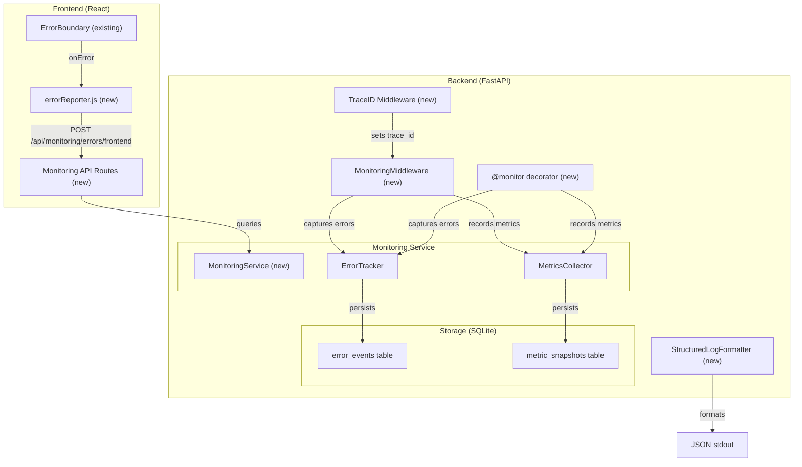
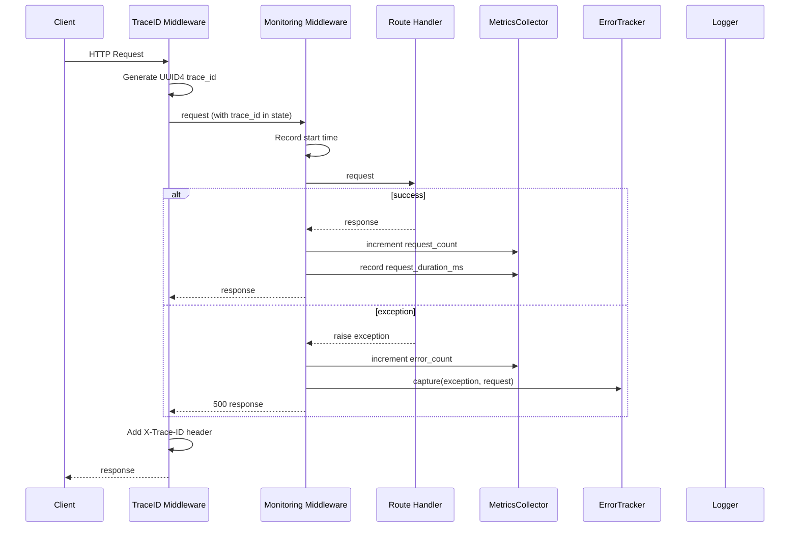
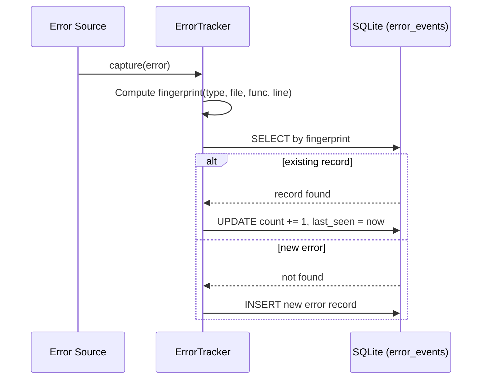
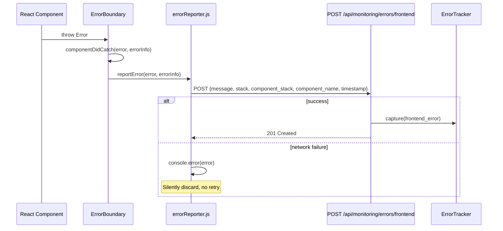

# Design Document: Monitoring & Error Tracking

## Overview

Twin Spark Chronicles currently uses unstructured `logging.getLogger(__name__)` across 30+ backend modules, has React error boundaries that log to `console.error`, and a basic `/api/health` endpoint. There is no structured logging, no metrics collection, no error aggregation, and no way to see what's happening across the system at a glance.

This feature introduces a lightweight, self-hosted monitoring pipeline that:
1. Replaces unstructured logging with JSON-formatted structured logs
2. Captures and deduplicates errors from both backend and frontend
3. Collects request metrics (counts, durations, error rates) via middleware
4. Provides a `@monitor` decorator that builds on the existing decorator infrastructure
5. Exposes health/metrics/errors via dashboard API endpoints
6. Persists everything to SQLite with automatic retention cleanup

All components are local-only, use no external services, and add no new dependencies beyond the existing `aiosqlite`.

## Architecture



## Sequence Diagrams

### Request Lifecycle with Monitoring



### Error Deduplication Flow



### Frontend Error Reporting



## Components and Interfaces

### Component: StructuredLogFormatter (`backend/app/monitoring/log_formatter.py`)

**Purpose**: JSON log formatter that replaces the default text formatter on all handlers.

**Interface**:

```python
import logging

class StructuredLogFormatter(logging.Formatter):
    def format(self, record: logging.LogRecord) -> str:
        """Format a log record as a single JSON line."""
        ...
```

**Output schema**:
```json
{
    "timestamp": "2024-01-15T10:30:45.123",
    "level": "INFO",
    "logger": "app.services.photo_service",
    "module": "photo_service",
    "func": "upload_photo",
    "message": "Photo uploaded successfully",
    "trace_id": "a1b2c3d4-...",
    "exception": "Traceback (most recent call last):\n..."
}
```

### Component: MetricsCollector (`backend/app/monitoring/metrics_collector.py`)

**Purpose**: In-memory metrics store with periodic SQLite persistence.

**Interface**:

```python
from dataclasses import dataclass, field

@dataclass
class HistogramStats:
    count: int
    total: float
    min_val: float
    max_val: float
    values: list[float]  # kept for p95 calculation, bounded

class MetricsCollector:
    def __init__(self, db_path: str = "monitoring.db", flush_interval: int = 60):
        ...

    def increment(self, name: str, value: int = 1) -> None:
        """Increment a counter metric."""
        ...

    def set_gauge(self, name: str, value: float) -> None:
        """Set a gauge metric to a specific value."""
        ...

    def record(self, name: str, value: float) -> None:
        """Record a value in a histogram metric."""
        ...

    def get_all(self) -> dict:
        """Return all current metrics grouped by type."""
        ...

    async def flush(self) -> None:
        """Persist current metric snapshot to SQLite."""
        ...

    async def start_flush_loop(self) -> None:
        """Start periodic flush task."""
        ...

    async def stop_flush_loop(self) -> None:
        """Stop periodic flush and do a final flush."""
        ...
```

### Component: ErrorTracker (`backend/app/monitoring/error_tracker.py`)

**Purpose**: Captures, fingerprints, deduplicates, and stores error events.

**Interface**:

```python
@dataclass
class ErrorRecord:
    fingerprint: str
    error_type: str
    message: str
    traceback: str
    source: str          # "backend" or "frontend"
    location: str        # file:func:line or component_name
    request_path: str | None
    trace_id: str | None
    first_seen: str      # ISO 8601
    last_seen: str       # ISO 8601
    count: int

class ErrorTracker:
    def __init__(self, db_path: str = "monitoring.db"):
        ...

    def compute_fingerprint(self, error_type: str, location: str) -> str:
        """SHA256 hash of error_type + location, truncated to 16 hex chars."""
        ...

    async def capture(
        self,
        error_type: str,
        message: str,
        traceback: str,
        source: str = "backend",
        location: str = "",
        request_path: str | None = None,
        trace_id: str | None = None,
    ) -> None:
        """Capture an error event, deduplicating by fingerprint."""
        ...

    async def get_recent(self, limit: int = 50) -> list[dict]:
        """Return recent error groups sorted by last_seen desc."""
        ...

    async def get_by_fingerprint(self, fingerprint: str) -> dict | None:
        """Return full details for a single error group."""
        ...
```

### Component: MonitoringService (`backend/app/monitoring/service.py`)

**Purpose**: Facade that owns MetricsCollector, ErrorTracker, and cleanup logic.

**Interface**:

```python
class MonitoringService:
    def __init__(
        self,
        db_path: str = "monitoring.db",
        retention_days: int = 7,
        flush_interval: int = 60,
        cleanup_interval: int = 3600,
    ):
        self.metrics = MetricsCollector(db_path, flush_interval)
        self.errors = ErrorTracker(db_path)
        ...

    async def start(self) -> None:
        """Initialize DB tables, start flush and cleanup loops."""
        ...

    async def stop(self) -> None:
        """Stop loops, flush pending data."""
        ...

    async def cleanup(self) -> None:
        """Delete records older than retention_days."""
        ...

    def health(self) -> dict:
        """Return system health summary."""
        ...
```

### Component: MonitoringMiddleware (`backend/app/monitoring/middleware.py`)

**Purpose**: FastAPI middleware that records request metrics and captures unhandled errors.

**Interface**:

```python
from starlette.middleware.base import BaseHTTPMiddleware
from starlette.requests import Request
from starlette.responses import Response

class TraceIDMiddleware(BaseHTTPMiddleware):
    async def dispatch(self, request: Request, call_next) -> Response:
        """Attach UUID4 trace_id to request.state, add X-Trace-ID to response."""
        ...

class MonitoringMiddleware(BaseHTTPMiddleware):
    def __init__(self, app, monitoring_service: MonitoringService):
        ...

    async def dispatch(self, request: Request, call_next) -> Response:
        """Record request_count, request_duration_ms, error_count."""
        ...
```

### Component: Monitor Decorator (`backend/app/utils/decorators.py` — addition)

**Purpose**: Single decorator combining call counting, error counting, and duration recording.

**Interface**:

```python
def monitor(
    metrics_collector: MetricsCollector | None = None,
) -> Callable:
    """Track call count, error count, and duration for a function.
    
    If metrics_collector is None, uses the global monitoring service instance.
    """
    ...
```

### Component: Monitoring API Routes (`backend/app/monitoring/routes.py`)

**Purpose**: FastAPI router exposing health, metrics, and error endpoints.

**Interface**:

```python
from fastapi import APIRouter

router = APIRouter(prefix="/api/monitoring", tags=["monitoring"])

# GET /api/monitoring/health
# GET /api/monitoring/metrics?since=<iso8601>
# GET /api/monitoring/errors?limit=50
# GET /api/monitoring/errors/{fingerprint}
# POST /api/monitoring/errors/frontend
```

### Component: Frontend Error Reporter (`frontend/src/shared/utils/errorReporter.js`)

**Purpose**: Sends error reports from React error boundaries to the backend.

**Interface**:

```javascript
/**
 * Report a caught error to the monitoring backend.
 * Fails silently — never throws.
 */
export async function reportError(error, errorInfo, componentName = 'unknown') { ... }
```

## Data Models

### SQLite Schema: error_events

```sql
CREATE TABLE IF NOT EXISTS error_events (
    fingerprint TEXT PRIMARY KEY,
    error_type  TEXT NOT NULL,
    message     TEXT NOT NULL,
    traceback   TEXT NOT NULL DEFAULT '',
    source      TEXT NOT NULL DEFAULT 'backend',
    location    TEXT NOT NULL DEFAULT '',
    request_path TEXT,
    trace_id    TEXT,
    first_seen  TEXT NOT NULL,
    last_seen   TEXT NOT NULL,
    count       INTEGER NOT NULL DEFAULT 1
);

CREATE INDEX IF NOT EXISTS idx_error_events_last_seen ON error_events(last_seen);
CREATE INDEX IF NOT EXISTS idx_error_events_source ON error_events(source);
```

### SQLite Schema: metric_snapshots

```sql
CREATE TABLE IF NOT EXISTS metric_snapshots (
    id         INTEGER PRIMARY KEY AUTOINCREMENT,
    timestamp  TEXT NOT NULL,
    name       TEXT NOT NULL,
    type       TEXT NOT NULL,
    value      TEXT NOT NULL  -- JSON-encoded value
);

CREATE INDEX IF NOT EXISTS idx_metric_snapshots_timestamp ON metric_snapshots(timestamp);
CREATE INDEX IF NOT EXISTS idx_metric_snapshots_name ON metric_snapshots(name);
```

### Error Fingerprint Algorithm

```python
import hashlib

def compute_fingerprint(error_type: str, location: str) -> str:
    """Deterministic fingerprint from error type + source location.
    
    Precondition: error_type and location are non-empty strings.
    Postcondition: Returns a 16-char hex string. Same inputs always produce same output.
    """
    raw = f"{error_type}:{location}"
    return hashlib.sha256(raw.encode()).hexdigest()[:16]
```

### HistogramStats

```python
@dataclass
class HistogramStats:
    count: int = 0
    total: float = 0.0
    min_val: float = float('inf')
    max_val: float = float('-inf')
    values: list[float] = field(default_factory=list)
    max_values: int = 1000  # bounded to prevent memory growth

    @property
    def mean(self) -> float:
        return self.total / self.count if self.count > 0 else 0.0

    @property
    def p95(self) -> float:
        if not self.values:
            return 0.0
        sorted_vals = sorted(self.values)
        idx = int(len(sorted_vals) * 0.95)
        return sorted_vals[min(idx, len(sorted_vals) - 1)]
```

## Key Functions with Formal Specifications

### Function 1: `StructuredLogFormatter.format(record)`

```python
def format(self, record: logging.LogRecord) -> str:
    entry = {
        "timestamp": datetime.fromtimestamp(record.created).isoformat(timespec="milliseconds"),
        "level": record.levelname,
        "logger": record.name,
        "module": record.module,
        "func": record.funcName,
        "message": record.getMessage(),
    }
    # Merge trace_id from contextvars if available
    trace_id = _trace_id_var.get(None)
    if trace_id:
        entry["trace_id"] = trace_id
    # Merge extra fields
    for key, val in getattr(record, "__dict__", {}).items():
        if key not in _RESERVED_ATTRS and key not in entry:
            entry[key] = val
    # Include exception traceback
    if record.exc_info and record.exc_info[0] is not None:
        entry["exception"] = self.formatException(record.exc_info)
    return json.dumps(entry, default=str)
```

**Preconditions:**
- `record` is a valid `logging.LogRecord`

**Postconditions:**
- Returns a single-line JSON string
- Always contains: `timestamp`, `level`, `logger`, `module`, `func`, `message`
- `timestamp` is ISO 8601 with millisecond precision
- If `exc_info` is set, `exception` field contains formatted traceback
- Extra dict keys are merged into top-level JSON

### Function 2: `ErrorTracker.capture(...)`

```python
async def capture(self, error_type, message, traceback, source, location, request_path, trace_id):
    fingerprint = self.compute_fingerprint(error_type, location)
    now = datetime.utcnow().isoformat(timespec="milliseconds")
    try:
        existing = await self._db_fetch_one(
            "SELECT count FROM error_events WHERE fingerprint = ?",
            (fingerprint,)
        )
        if existing:
            await self._db_execute(
                "UPDATE error_events SET count = count + 1, last_seen = ?, trace_id = ? WHERE fingerprint = ?",
                (now, trace_id, fingerprint)
            )
        else:
            await self._db_execute(
                "INSERT INTO error_events (fingerprint, error_type, message, traceback, source, location, request_path, trace_id, first_seen, last_seen, count) VALUES (?, ?, ?, ?, ?, ?, ?, ?, ?, ?, 1)",
                (fingerprint, error_type, message, traceback, source, location, request_path, trace_id, now, now)
            )
    except Exception as e:
        logger.error("Failed to persist error record: %s", e)
```

**Preconditions:**
- `error_type` is a non-empty string
- `source` is `"backend"` or `"frontend"`

**Postconditions:**
- If fingerprint exists: count incremented, last_seen updated
- If fingerprint is new: new row inserted with count=1
- If DB write fails: error is logged, no exception propagated

**Invariant:**
- `count >= 1` for all records
- `first_seen <= last_seen` for all records

### Function 3: `MetricsCollector.record(name, value)`

```python
def record(self, name: str, value: float) -> None:
    if name not in self._histograms:
        self._histograms[name] = HistogramStats()
    h = self._histograms[name]
    h.count += 1
    h.total += value
    h.min_val = min(h.min_val, value)
    h.max_val = max(h.max_val, value)
    if len(h.values) < h.max_values:
        h.values.append(value)
```

**Preconditions:**
- `name` is a non-empty string
- `value` is a finite float

**Postconditions:**
- `h.count` incremented by 1
- `h.total` increased by `value`
- `h.min_val <= value` and `h.max_val >= value`
- `len(h.values) <= h.max_values`

**Invariant:**
- `h.count >= len(h.values)` (values list is bounded)
- `h.min_val <= h.mean <= h.max_val` when count > 0

### Function 4: `monitor` decorator

```python
def monitor(metrics_collector=None):
    def decorator(fn):
        name = f"{fn.__module__}.{fn.__qualname__}"
        
        @functools.wraps(fn)
        async def async_wrapper(*args, **kwargs):
            mc = metrics_collector or _get_global_metrics()
            mc.increment(f"{name}.calls")
            start = time.perf_counter()
            try:
                result = await fn(*args, **kwargs)
                return result
            except Exception:
                mc.increment(f"{name}.errors")
                raise
            finally:
                elapsed_ms = (time.perf_counter() - start) * 1000
                mc.record(f"{name}.duration_ms", elapsed_ms)

        @functools.wraps(fn)
        def sync_wrapper(*args, **kwargs):
            mc = metrics_collector or _get_global_metrics()
            mc.increment(f"{name}.calls")
            start = time.perf_counter()
            try:
                result = fn(*args, **kwargs)
                return result
            except Exception:
                mc.increment(f"{name}.errors")
                raise
            finally:
                elapsed_ms = (time.perf_counter() - start) * 1000
                mc.record(f"{name}.duration_ms", elapsed_ms)

        return async_wrapper if asyncio.iscoroutinefunction(fn) else sync_wrapper
    return decorator
```

**Preconditions:**
- `fn` is a callable (sync or async)

**Postconditions:**
- After each call: `{name}.calls` counter incremented by 1
- After each call: `{name}.duration_ms` histogram has one more entry
- On exception: `{name}.errors` counter incremented by 1, exception re-raised
- On success: return value is unchanged
- `__name__`, `__doc__`, `__module__`, `__qualname__` preserved

### Function 5: `compute_fingerprint(error_type, location)`

**Preconditions:**
- `error_type` and `location` are strings

**Postconditions:**
- Returns a 16-character hex string
- Deterministic: same inputs always produce same output
- Different inputs produce different outputs (with high probability)

## Correctness Properties

### Property 1: Structured Log Round-Trip

*For any* valid log record with arbitrary message, level, and module, formatting the record with StructuredLogFormatter and parsing the output with `json.loads` produces a dict containing all required keys (`timestamp`, `level`, `logger`, `module`, `func`, `message`), and the `message` value matches the original log message.

**Validates: Requirements 1.1, 1.3**

### Property 2: Fingerprint Determinism

*For any* error_type string and location string, `compute_fingerprint(error_type, location)` always returns the same 16-character hex string. Additionally, *for any* two distinct (error_type, location) pairs, the fingerprints differ (with overwhelming probability).

**Validates: Requirements 2.2, 3.4**

### Property 3: Error Deduplication Invariant

*For any* sequence of N error captures with the same fingerprint, the Error_Store contains exactly one record with `count == N` and `first_seen <= last_seen`.

**Validates: Requirements 2.2, 2.3**

### Property 4: Counter Monotonicity

*For any* counter metric, after N calls to `increment(name)`, the counter value equals N. Counters are monotonically non-decreasing — they never decrease.

**Validates: Requirements 4.1, 5.1, 5.2**

### Property 5: Histogram Bounds Invariant

*For any* sequence of values recorded in a histogram, `min_val <= mean <= max_val` and `count >= 1`. The count equals the number of `record()` calls.

**Validates: Requirements 4.1, 5.3**

### Property 6: Monitor Decorator Sync/Async Preservation

*For any* function (sync or async) decorated with `@monitor`, `asyncio.iscoroutinefunction(decorated) == asyncio.iscoroutinefunction(original)`, and `decorated.__name__ == original.__name__`.

**Validates: Requirements 5.4, 5.5**

### Property 7: Monitor Decorator Error Transparency

*For any* function decorated with `@monitor` that raises an exception, the decorator re-raises the same exception (type and message preserved) and the `{name}.errors` counter is incremented. The decorator never swallows exceptions.

**Validates: Requirement 5.2**

### Property 8: Trace ID Uniqueness

*For any* two requests processed by TraceIDMiddleware, the generated trace IDs are distinct UUID4 strings.

**Validates: Requirement 8.1**

### Property 9: Retention Cleanup Completeness

*For any* set of error records and metric snapshots, after cleanup with retention_days=D, no records with `last_seen` (or `timestamp`) older than D days remain in the database.

**Validates: Requirements 7.1, 7.2**

## Error Handling

### Scenario 1: SQLite Write Failure in ErrorTracker

**Condition**: Database is locked, disk full, or connection lost during error capture
**Response**: ErrorTracker logs the failure via stdlib logger and returns without raising
**Recovery**: Next capture attempt will retry the DB write; no data loss for in-memory metrics

### Scenario 2: Frontend Error Report Network Failure

**Condition**: Backend is unreachable when React error boundary fires
**Response**: `errorReporter.js` catches the fetch error, logs to `console.error`, and discards
**Recovery**: Error is visible in browser console; backend will capture future occurrences

### Scenario 3: Metrics Flush Failure

**Condition**: SQLite write fails during periodic flush
**Response**: MetricsCollector logs the error and retains in-memory data for next flush attempt
**Recovery**: Next flush cycle will persist accumulated metrics

### Scenario 4: Cleanup Failure

**Condition**: DELETE query fails during retention cleanup
**Response**: MonitoringService logs the failure
**Recovery**: Next cleanup interval will retry; stale data remains until successful cleanup

### Scenario 5: Middleware Exception in Monitoring Code

**Condition**: MonitoringMiddleware itself raises during metric recording
**Response**: Exception is caught within the middleware; the original request/response is not affected
**Recovery**: Request proceeds normally; monitoring data for that request is lost

## Testing Strategy

### Unit Testing Approach

- `StructuredLogFormatter`: Create LogRecords with various fields, verify JSON output structure
- `ErrorTracker`: Test capture, deduplication, fingerprint computation with in-memory SQLite
- `MetricsCollector`: Test increment, set_gauge, record, get_all with in-memory state
- `@monitor` decorator: Test call counting, error counting, duration recording for sync/async
- API routes: Use FastAPI TestClient to verify response shapes and status codes

### Property-Based Testing Approach

**Library**: Hypothesis (max_examples=20)

- Property 1 (Log Round-Trip): Generate arbitrary log messages and levels, verify JSON parse produces required keys
- Property 2 (Fingerprint Determinism): Generate arbitrary string pairs, verify same input → same output and different inputs → different outputs
- Property 4 (Counter Monotonicity): Generate random increment sequences, verify final count matches sequence length
- Property 5 (Histogram Bounds): Generate random value sequences, verify min/max/mean invariants
- Property 6 (Sync/Async Preservation): Generate sync/async functions, verify decorator preserves type
- Property 7 (Error Transparency): Generate exceptions, verify decorator re-raises same type

### Integration Testing Approach

- Full request lifecycle: Make HTTP requests via TestClient, verify metrics are recorded and trace IDs appear in response headers
- Error capture pipeline: Trigger exceptions in test endpoints, verify errors appear in `/api/monitoring/errors`
- Frontend error reporting: POST to `/api/monitoring/errors/frontend`, verify storage and retrieval

## Dependencies

**Backend (no new packages)**:
- `logging`, `json`, `time`, `uuid`, `hashlib`, `asyncio`, `collections`, `dataclasses`, `datetime`, `contextvars` (stdlib)
- `aiosqlite` (existing dependency)
- `starlette` (included with FastAPI)

**Frontend (no new packages)**:
- `fetch` API (browser built-in)
