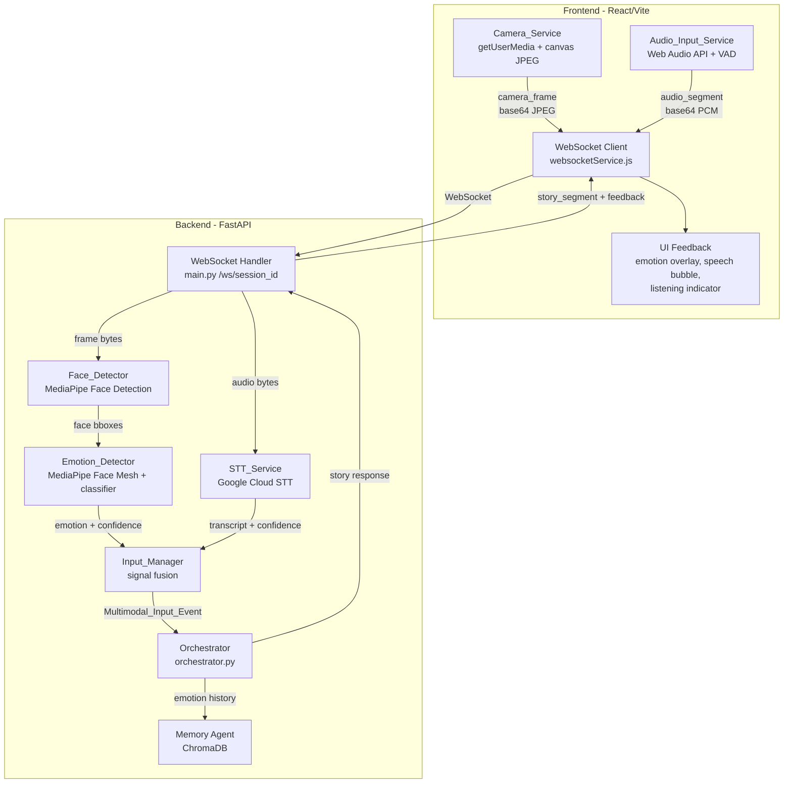
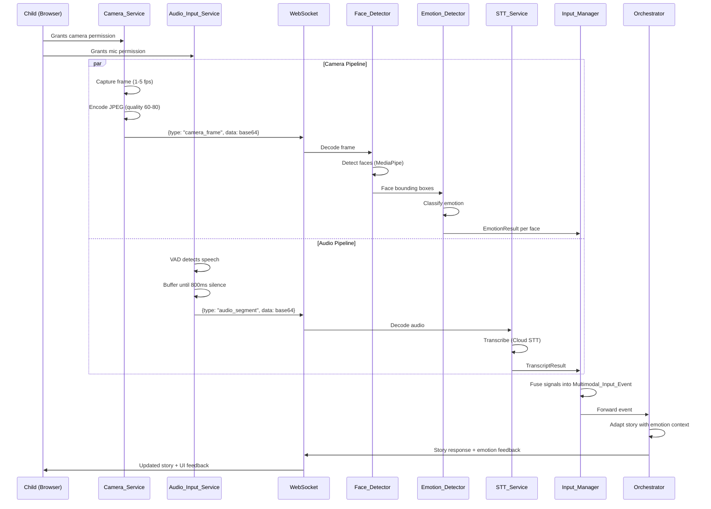

# Design Document: Multimodal Input Pipeline

## Overview

The Multimodal Input Pipeline adds camera, audio capture, face detection, emotion recognition, and speech-to-text capabilities to TwinSpark Chronicles. It captures video frames and voice from two children (Ale & Sofi), processes them through face detection (MediaPipe), emotion classification, and speech-to-text (Google Cloud STT), then fuses the results into a single `Multimodal_Input_Event` that the existing `AgentOrchestrator` uses to adapt story generation.

All data flows through the existing WebSocket at `/ws/{session_id}`. The pipeline degrades gracefully — if camera or mic is unavailable, the system continues with whatever modality remains. No raw media is persisted; only derived text and emotion labels are stored.

### Key Design Decisions

1. **Client-side VAD, server-side STT/vision** — VAD runs in the browser to minimize bandwidth (only speech segments are sent). Face detection and emotion classification run on the backend to keep the frontend lightweight and avoid loading ML models in the browser.
2. **Reuse existing WebSocket** — No new transport channels. New message types (`camera_frame`, `audio_segment`) are added to the existing connection.
3. **MediaPipe for face detection** — Lightweight, well-supported, optimized for short-range (< 2m) which matches children sitting at a screen.
4. **Async concurrent processing** — Camera frames and audio segments are processed concurrently on the backend using `asyncio.create_task` so they don't block story generation.

## Architecture



### Data Flow Sequence



## Components and Interfaces

### Frontend Components

#### Camera_Service (`frontend/src/features/camera/services/cameraService.js`)

Manages webcam access, frame capture, and JPEG encoding.

```typescript
interface CameraService {
  // Start camera with 640x480 constraint, mirrored preview
  start(): Promise<MediaStream>
  
  // Stop camera and release resources
  stop(): void
  
  // Capture a single JPEG frame (quality 60-80), returns base64
  captureFrame(): string | null
  
  // Set capture rate (1-5 fps)
  setCaptureRate(fps: number): void
  
  // Event emitters
  onUnavailable(callback: () => void): () => void
  onLost(callback: () => void): () => void
  onReconnected(callback: () => void): () => void
  
  // State
  isActive: boolean
  stream: MediaStream | null
}
```

#### Audio_Input_Service (`frontend/src/features/camera/services/audioInputService.js`)

Captures microphone audio with VAD. Lives alongside camera service since both are input modalities.

```typescript
interface AudioInputService {
  // Start mic capture at 16kHz mono
  start(): Promise<MediaStream>
  
  // Stop mic and release resources
  stop(): void
  
  // VAD state
  isSpeechDetected: boolean
  
  // Event emitters
  onSpeechSegment(callback: (base64Audio: string) => void): () => void
  onUnavailable(callback: () => void): () => void
  onLost(callback: () => void): () => void
  
  // State
  isActive: boolean
}
```

#### useMultimodalInput Hook (`frontend/src/features/camera/hooks/useMultimodalInput.js`)

Coordinates Camera_Service and Audio_Input_Service, sends data over WebSocket, and manages UI state.

```typescript
interface UseMultimodalInput {
  // Start both camera and audio capture
  startCapture(privacyConsented: boolean): Promise<void>
  
  // Stop all capture
  stopCapture(): void
  
  // State
  cameraActive: boolean
  micActive: boolean
  currentEmotion: EmotionCategory | null
  lastTranscript: string | null
  isSpeaking: boolean
  
  // Error states
  cameraError: string | null
  micError: string | null
}
```

### Backend Components

#### STT_Service (`backend/app/services/stt_service.py`)

```python
class STTService:
    async def transcribe(
        self,
        audio_bytes: bytes,
        language: str = "en-US"  # or "es-ES"
    ) -> TranscriptResult:
        """Transcribe audio using Google Cloud STT.
        Returns empty result if confidence < 0.4.
        Timeout: 3 seconds."""
        ...
    
    @property
    def enabled(self) -> bool: ...
```

#### Face_Detector (`backend/app/services/face_detector.py`)

```python
class FaceDetector:
    def __init__(self, min_confidence: float = 0.5):
        """Initialize MediaPipe Face Detection (short-range model)."""
        ...
    
    def detect(self, frame_bytes: bytes) -> list[FaceBBox]:
        """Detect faces in a JPEG frame.
        Returns list of FaceBBox with confidence scores.
        Must complete within 200ms for 640x480."""
        ...
```

#### Emotion_Detector (`backend/app/services/emotion_detector.py`)

```python
class EmotionDetector:
    def classify(self, frame_bytes: bytes, bbox: FaceBBox) -> EmotionResult:
        """Classify emotion from face region.
        Returns 'neutral' if confidence < 0.3.
        Must complete within 100ms.
        Categories: happy, sad, surprised, angry, scared, neutral."""
        ...
```

#### Input_Manager (`backend/app/services/input_manager.py`)

```python
class InputManager:
    def __init__(self, session_id: str):
        self._last_speech_id: str | None = None  # dedup tracking
    
    def fuse(
        self,
        transcript: TranscriptResult | None,
        emotions: list[EmotionResult],
        faces_detected: bool,
        timestamp: str  # ISO 8601 UTC
    ) -> MultimodalInputEvent:
        """Combine signals into a single event.
        Must produce event within 500ms of last signal."""
        ...
    
    def is_duplicate_speech(self, speech_id: str) -> bool:
        """Prevent duplicate events for the same speech segment."""
        ...
```

### WebSocket Message Types (New)

Frontend → Backend:
```json
{"type": "camera_frame", "data": "<base64 JPEG>", "timestamp": "2024-01-01T00:00:00Z"}
{"type": "audio_segment", "data": "<base64 PCM 16kHz mono>", "timestamp": "2024-01-01T00:00:00Z"}
```

Backend → Frontend:
```json
{"type": "emotion_feedback", "emotions": [{"face_id": 0, "emotion": "happy", "confidence": 0.85}]}
{"type": "transcript_feedback", "text": "I want to fight the dragon", "confidence": 0.92}
{"type": "input_status", "camera": true, "mic": true}
```

## Data Models

### Backend Pydantic Models (`backend/app/models/multimodal.py`)

```python
from pydantic import BaseModel, Field
from typing import Optional
from enum import Enum
from datetime import datetime

class EmotionCategory(str, Enum):
    HAPPY = "happy"
    SAD = "sad"
    SURPRISED = "surprised"
    ANGRY = "angry"
    SCARED = "scared"
    NEUTRAL = "neutral"

class FaceBBox(BaseModel):
    x: float = Field(ge=0.0, le=1.0, description="Normalized x coordinate")
    y: float = Field(ge=0.0, le=1.0, description="Normalized y coordinate")
    width: float = Field(gt=0.0, le=1.0)
    height: float = Field(gt=0.0, le=1.0)
    confidence: float = Field(ge=0.0, le=1.0)

class EmotionResult(BaseModel):
    face_id: int
    emotion: EmotionCategory
    confidence: float = Field(ge=0.0, le=1.0)

class TranscriptResult(BaseModel):
    text: str = ""
    confidence: float = Field(ge=0.0, le=1.0, default=0.0)
    language: str = "en-US"
    is_empty: bool = True

class MultimodalInputEvent(BaseModel):
    session_id: str
    timestamp: str = Field(description="ISO 8601 UTC")
    transcript: TranscriptResult = Field(default_factory=TranscriptResult)
    emotions: list[EmotionResult] = Field(default_factory=list)
    face_detected: bool = False
    speech_id: Optional[str] = None

    def to_orchestrator_context(self) -> dict:
        """Convert to the format expected by AgentOrchestrator.generate_rich_story_moment"""
        primary_emotion = self._get_primary_emotion()
        return {
            "user_input": self.transcript.text if not self.transcript.is_empty else None,
            "emotion": primary_emotion.emotion.value if primary_emotion else "neutral",
            "emotion_confidence": primary_emotion.confidence if primary_emotion else 0.0,
            "face_detected": self.face_detected,
            "timestamp": self.timestamp
        }
    
    def _get_primary_emotion(self) -> Optional[EmotionResult]:
        """Get highest-confidence emotion from detected faces."""
        if not self.emotions:
            return None
        return max(self.emotions, key=lambda e: e.confidence)
```

### Frontend State (`frontend/src/stores/multimodalStore.js`)

```javascript
// Zustand store shape
{
  cameraActive: false,
  micActive: false,
  currentEmotions: [],        // [{face_id, emotion, confidence}]
  lastTranscript: null,       // {text, confidence}
  transcriptVisible: false,   // controls 3-second speech bubble
  isSpeaking: false,          // VAD speech detection active
  cameraError: null,          // 'camera_unavailable' | 'camera_lost' | null
  micError: null,             // 'mic_unavailable' | 'mic_lost' | null
  allInputsUnavailable: false,
  privacyConsented: false,
  inputBuffer: [],            // buffered messages during disconnect (max 5s)
}
```


## Correctness Properties

*A property is a characteristic or behavior that should hold true across all valid executions of a system — essentially, a formal statement about what the system should do. Properties serve as the bridge between human-readable specifications and machine-verifiable correctness guarantees.*

### Property 1: Serialization round-trip

*For any* valid `MultimodalInputEvent` object, serializing it to JSON and then deserializing the JSON back into a `MultimodalInputEvent` shall produce an object equivalent to the original.

**Validates: Requirements 7.1, 7.2, 7.3**

### Property 2: Malformed JSON resilience

*For any* arbitrary string that is not valid JSON (or valid JSON that does not conform to the `MultimodalInputEvent` schema), the `Input_Manager` deserialization shall return an error result without raising an unhandled exception.

**Validates: Requirements 7.4**

### Property 3: Low-confidence transcript filtering

*For any* `TranscriptResult` with a `confidence` value below 0.4, the `STT_Service` shall return an empty result (i.e., `is_empty=True` and `text=""`). Conversely, for any `TranscriptResult` with confidence >= 0.4, the text shall be preserved.

**Validates: Requirements 3.4**

### Property 4: Face detection confidence threshold

*For any* face returned by the `Face_Detector`, its `confidence` score shall be greater than or equal to 0.5. No face with confidence below 0.5 shall appear in the output list.

**Validates: Requirements 4.6**

### Property 5: Low-confidence emotion defaults to neutral

*For any* emotion classification where the raw confidence score is below 0.3, the `Emotion_Detector` shall return `EmotionCategory.NEUTRAL` regardless of the raw classification result.

**Validates: Requirements 5.3**

### Property 6: Face-to-emotion count preservation

*For any* list of N detected face bounding boxes passed to the `Emotion_Detector`, the detector shall return exactly N `EmotionResult` objects, one per face.

**Validates: Requirements 5.6**

### Property 7: Emotion category validity

*For any* `EmotionResult` returned by the `Emotion_Detector`, the `emotion` field shall be one of the six valid `EmotionCategory` values: happy, sad, surprised, angry, scared, or neutral.

**Validates: Requirements 5.1**

### Property 8: Fusion completeness

*For any* combination of a `TranscriptResult`, a list of `EmotionResult` objects, and a `face_detected` boolean, the `Input_Manager.fuse()` method shall produce a `MultimodalInputEvent` that contains all provided signals and a valid ISO 8601 UTC timestamp.

**Validates: Requirements 6.1, 6.6**

### Property 9: Audio-only degradation

*For any* `MultimodalInputEvent` produced when the camera is unavailable, the `emotions` list shall be empty, `face_detected` shall be `False`, and the `transcript` field shall carry the speech data unchanged.

**Validates: Requirements 1.3, 6.3**

### Property 10: Camera-only degradation

*For any* `MultimodalInputEvent` produced when the microphone is unavailable, the `transcript.text` shall be an empty string, `transcript.is_empty` shall be `True`, and the `emotions` and `face_detected` fields shall carry the camera data unchanged.

**Validates: Requirements 2.5, 6.4**

### Property 11: No duplicate events for same speech segment

*For any* speech segment identified by a `speech_id`, calling `Input_Manager.fuse()` multiple times with the same `speech_id` shall produce at most one `MultimodalInputEvent`. Subsequent calls with the same `speech_id` shall be rejected.

**Validates: Requirements 6.7**

### Property 12: Orchestrator context mapping

*For any* `MultimodalInputEvent`, calling `to_orchestrator_context()` shall produce a dict where `user_input` equals the transcript text (or `None` if transcript is empty), and `emotion` equals the highest-confidence detected emotion (or `"neutral"` if no emotions are present).

**Validates: Requirements 9.1, 9.2**

### Property 13: Emotion stored in memory

*For any* `MultimodalInputEvent` with a non-empty emotion list processed by the Orchestrator, the detected `EmotionCategory` shall be included in the moment data passed to `memory_agent.store_story_moment()`.

**Validates: Requirements 9.4**

### Property 14: Backend retains only derived data

*For any* processed video frame or audio segment, after the `Input_Manager` produces a `MultimodalInputEvent`, the raw frame bytes and audio bytes shall not be referenced by any persistent storage. Only the derived `EmotionCategory` and transcript text shall be retained in the memory agent.

**Validates: Requirements 11.3, 11.4**

## Error Handling

### Frontend Error Handling

| Error Condition | Action | User Feedback |
|---|---|---|
| Camera permission denied | Emit `camera_unavailable`, continue audio-only | Friendly camera-off icon |
| Camera stream lost | Emit `camera_lost`, retry once after 3s, then audio-only | Friendly camera-off icon |
| Mic permission denied | Emit `mic_unavailable`, continue camera-only | Friendly mic-off icon |
| Mic stream lost | Emit `mic_lost`, retry once after 3s | Friendly mic-off icon |
| Both inputs unavailable | Emit `all_inputs_unavailable` | "Ask a parent for help" message with large help icon |
| WebSocket disconnect during capture | Buffer up to 5s of input data, retransmit on reconnect | Existing reconnection UI |

### Backend Error Handling

| Error Condition | Action | Fallback |
|---|---|---|
| Google Cloud STT unreachable | Return `stt_unavailable` error event | Input_Manager continues with camera-only |
| MediaPipe face detection failure | Log error, return empty face list | Input_Manager continues with audio-only |
| Emotion classification failure | Log error, return `neutral` | Story continues without emotion adaptation |
| Malformed JSON from WebSocket | Log error, discard message | No crash, no event produced |
| Frame processing exceeds 200ms | Log warning, skip frame | Next frame processed normally |
| Session cleanup failure | Log error, force-clear buffers | Buffers cleared on next GC cycle |

### Graceful Degradation Hierarchy

```
Full multimodal (camera + mic) → Best experience
    ↓ camera fails
Audio-only (mic only) → Story reacts to voice, emotion=neutral
    ↓ mic fails  
Camera-only (camera only) → Story reacts to emotions, no voice input
    ↓ both fail
All unavailable → "Ask a parent for help" prompt
```

## Testing Strategy

### Property-Based Testing

Library: **Hypothesis** (Python) for backend, **fast-check** (JavaScript) for frontend.

Each property test must:
- Run a minimum of 100 iterations
- Reference its design property with a comment tag
- Tag format: `Feature: multimodal-input-pipeline, Property {N}: {title}`

| Property | Component Under Test | Generator Strategy |
|---|---|---|
| 1: Serialization round-trip | `MultimodalInputEvent` | Generate random events with valid fields |
| 2: Malformed JSON resilience | `Input_Manager` deserialization | Generate arbitrary strings and invalid JSON |
| 3: Low-confidence transcript filtering | `STT_Service` | Generate `TranscriptResult` with random confidence [0.0, 1.0] |
| 4: Face detection confidence threshold | `Face_Detector` output filter | Generate `FaceBBox` with random confidence [0.0, 1.0] |
| 5: Low-confidence emotion defaults | `Emotion_Detector` | Generate raw classifications with random confidence [0.0, 1.0] |
| 6: Face-to-emotion count | `Emotion_Detector` | Generate lists of 0-5 `FaceBBox` objects |
| 7: Emotion category validity | `Emotion_Detector` | Generate random face inputs |
| 8: Fusion completeness | `Input_Manager.fuse()` | Generate random transcripts, emotions, face booleans |
| 9: Audio-only degradation | `Input_Manager.fuse()` | Generate random transcripts with no camera data |
| 10: Camera-only degradation | `Input_Manager.fuse()` | Generate random emotions with no mic data |
| 11: No duplicate events | `Input_Manager.fuse()` | Generate events with repeated `speech_id` values |
| 12: Orchestrator context mapping | `MultimodalInputEvent.to_orchestrator_context()` | Generate random events |
| 13: Emotion stored in memory | `Orchestrator` integration | Generate events with various emotions |
| 14: Backend retains only derived data | Processing pipeline | Generate frames/audio, verify cleanup |

### Unit Testing

Unit tests complement property tests by covering specific examples and edge cases:

- Camera permission grant/deny flow
- Mic permission grant/deny flow
- Camera reconnection after 3-second timeout
- VAD silence detection at exactly 800ms boundary
- STT language selection (en-US vs es-ES)
- STT child vocabulary speech context configuration
- Face detection with 0 faces, 1 face, 2 faces
- Emotion classification for each of the 6 categories
- WebSocket message format for `camera_frame` and `audio_segment`
- Orchestrator "scared" emotion → reduced intensity instruction
- Orchestrator two-face perspective matching
- Session cleanup within 5 seconds
- Privacy consent gate for camera activation
- Input buffer (5-second max) during WebSocket disconnect
- Transcript speech bubble 3-second display timer

### Integration Testing

- End-to-end: camera frame → face detection → emotion → fusion → orchestrator
- End-to-end: audio segment → STT → fusion → orchestrator
- WebSocket concurrent processing of camera and audio messages
- Graceful degradation chain: full → audio-only → camera-only → unavailable
- Session lifecycle: start → capture → process → cleanup
