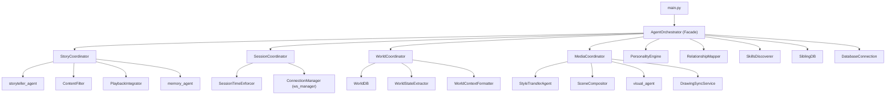
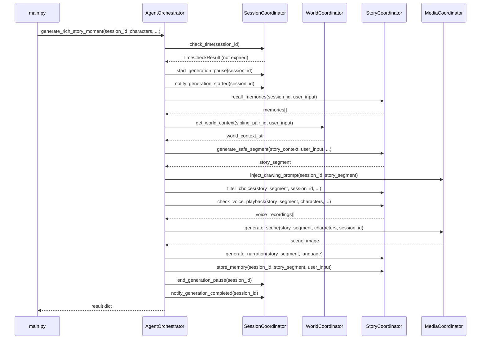
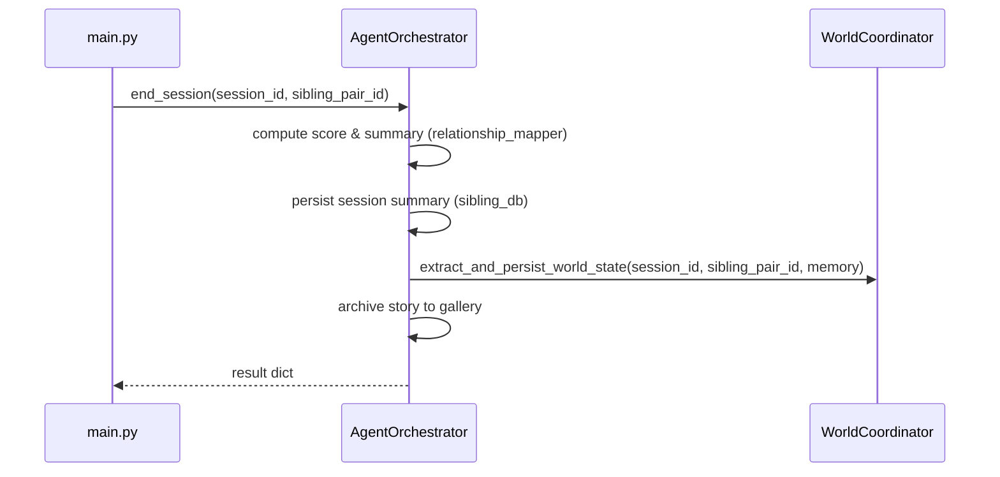
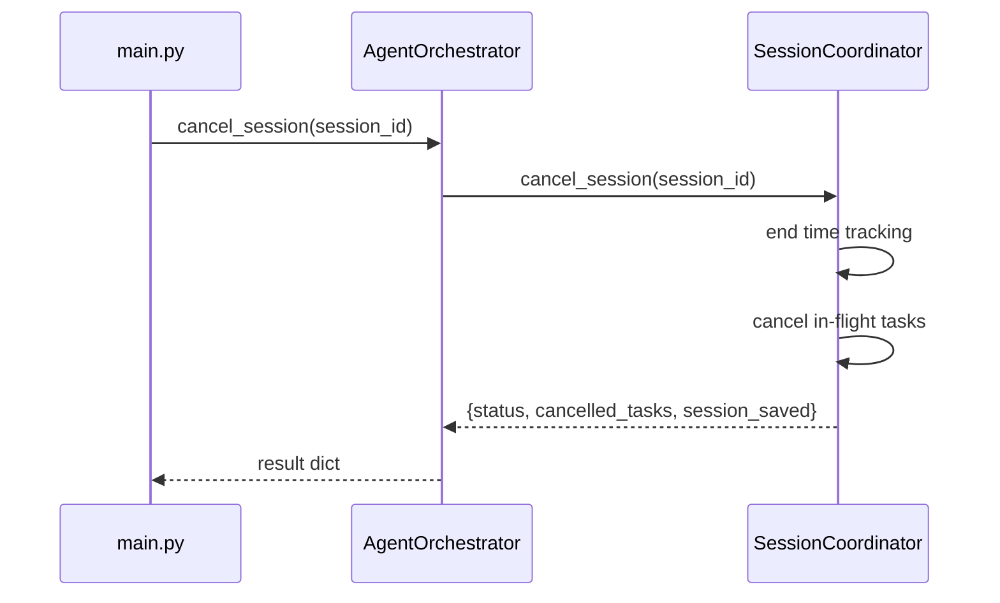

# Design Document: Orchestrator Decomposition

## Overview

The `AgentOrchestrator` class in `backend/app/agents/orchestrator.py` is a 1267-line god class that handles story generation, session lifecycle, world state management, media pipelines, voice recording playback, drawing prompt injection, sibling dynamics, and multimodal event processing. It initializes 12+ services in `__init__` and mixes unrelated concerns into a single class.

This refactor decomposes the monolith into four focused coordinator classes — `StoryCoordinator`, `SessionCoordinator`, `WorldCoordinator`, and `MediaCoordinator` — while `AgentOrchestrator` becomes a thin facade that delegates to them. This is a pure refactor: all existing functionality and public API signatures are preserved, all 610+ tests must continue to pass, and no new dependencies are introduced.

The key insight is that the orchestrator's responsibilities cluster into four natural domains with minimal cross-cutting: story generation (with content filtering and voice playback triggers), session lifecycle (cancel, time enforcement, generation pause), world state (load, cache, format, extract-on-end), and media (photo pipeline, scene compositing, drawing prompts). The facade pattern lets `main.py` and tests continue importing and using `orchestrator` identically.

## Architecture



## Sequence Diagrams

### Rich Story Moment Generation (Primary Flow)



### Session End Flow



### Emergency Stop Flow



## Components and Interfaces

### Component 1: StoryCoordinator

**Purpose**: Owns the story generation pipeline — safe generation with content filtering and retry logic, choice filtering, voice recording playback trigger detection, memory recall/storage, and narration audio generation.

**Interface**:
```python
class StoryCoordinator:
    def __init__(
        self,
        storyteller,           # storyteller_agent
        content_filter: ContentFilter,
        memory_agent,          # memory_agent
        voice_agent,           # voice_agent
        playback_integrator: PlaybackIntegrator | None = None,
    ) -> None: ...

    async def generate_safe_story_segment(
        self,
        story_context: dict,
        user_input: str | None,
        allowed_themes: list[str] | None = None,
        custom_blocked_words: list[str] | None = None,
    ) -> dict: ...

    def filter_text(
        self,
        text: str,
        session_id: str,
        allowed_themes: list[str] | None = None,
        custom_blocked_words: list[str] | None = None,
    ) -> str | None: ...

    def filter_choices(
        self,
        story_segment: dict,
        session_id: str,
        allowed_themes: list[str] | None = None,
        custom_blocked_words: list[str] | None = None,
    ) -> dict: ...

    async def check_voice_playback(
        self,
        story_segment: dict,
        characters: dict,
        user_input: str | None,
        language: str,
    ) -> list[dict]: ...

    async def recall_memories(
        self, session_id: str, query: str
    ) -> list: ...

    async def store_memory(
        self, session_id: str, story_text: str, user_input: str | None
    ) -> None: ...

    async def generate_narration(
        self, text: str, language: str
    ) -> str | None: ...

    async def generate_character_voices(
        self, text: str, characters: dict, language: str
    ) -> list[dict]: ...

    # Text extraction helpers (moved from orchestrator)
    def extract_dialogues(self, text: str) -> list[dict]: ...
    def extract_lesson(self, text: str) -> str: ...
```

**Responsibilities**:
- Content-filtered story generation with retry logic (MAX_CONTENT_RETRIES)
- Choice text and individual choice filtering
- Voice recording playback trigger detection (intro, encouragement, sound effects)
- Memory recall and storage via memory_agent
- Narration and character voice generation via voice_agent
- Text extraction helpers (_extract_dialogues, _extract_lesson)

### Component 2: SessionCoordinator

**Purpose**: Manages session lifecycle — emergency stop (cancel all in-flight tasks), time enforcement checks, generation pause signaling, and WebSocket notification dispatch.

**Interface**:
```python
class SessionCoordinator:
    def __init__(self) -> None:
        self.session_time_enforcer: SessionTimeEnforcer | None = None
        self.ws_manager = None  # ConnectionManager
        self._session_tasks: dict[str, set[asyncio.Task]] = {}

    async def cancel_session(self, session_id: str) -> dict: ...

    def check_time(self, session_id: str) -> TimeCheckResult | None: ...

    def is_expired(self, session_id: str) -> bool: ...

    def start_generation_pause(self, session_id: str) -> None: ...

    def end_generation_pause(self, session_id: str) -> None: ...

    async def notify_generation_started(self, session_id: str) -> None: ...

    async def notify_generation_completed(self, session_id: str) -> None: ...

    async def notify_session_expired(self, session_id: str) -> None: ...

    def track_task(self, session_id: str, task: asyncio.Task) -> None: ...
```

**Responsibilities**:
- Cancel all in-flight asyncio tasks for a session (emergency stop)
- Check session time via SessionTimeEnforcer
- Signal generation pause start/end to the time enforcer
- Send GENERATION_STARTED / GENERATION_COMPLETED / SESSION_TIME_EXPIRED via ws_manager
- Track per-session asyncio tasks

### Component 3: WorldCoordinator

**Purpose**: Manages persistent world state — loading from DB, caching in memory, formatting context for the storyteller, and extracting/persisting new world state after session end.

**Interface**:
```python
class WorldCoordinator:
    def __init__(
        self,
        world_db: WorldDB,
        world_extractor: WorldStateExtractor,
        world_context_formatter: WorldContextFormatter,
    ) -> None:
        self._world_state_cache: dict[str, dict] = {}

    async def get_world_context(
        self,
        sibling_pair_id: str,
        user_input: str,
        db_initializer: Callable,  # callback to ensure DB is ready
    ) -> str: ...

    async def extract_and_persist_world_state(
        self,
        session_id: str,
        sibling_pair_id: str,
        memory_agent,
    ) -> None: ...

    def invalidate_cache(self, sibling_pair_id: str) -> None: ...

    # Expose world_db for main.py endpoint access
    @property
    def world_db(self) -> WorldDB: ...
```

**Responsibilities**:
- Load world state from WorldDB with in-memory caching
- Format world context string for storyteller injection
- Extract new locations, NPCs, items from session moments at end_session
- Persist world state changes (new entities + updates)
- Invalidate cache after session end

### Component 4: MediaCoordinator

**Purpose**: Owns the visual/media pipeline — photo portrait style transfer, scene image generation and compositing, and drawing prompt injection with time-aware duration clamping.

**Interface**:
```python
class MediaCoordinator:
    def __init__(
        self,
        visual_agent,
        style_transfer: StyleTransferAgent,
        scene_compositor: SceneCompositor,
    ) -> None: ...

    async def generate_scene(
        self,
        story_segment: dict,
        characters: dict,
        session_id: str,
        sibling_pair_id: str,
        db_conn: DatabaseConnection,
    ) -> str | None: ...

    async def inject_drawing_prompt(
        self,
        session_id: str,
        story_segment: dict,
        session_coordinator: SessionCoordinator,
    ) -> None: ...

    async def drawing_time_watchdog(
        self, session_id: str, duration: int,
        session_coordinator: SessionCoordinator,
    ) -> None: ...

    # Text extraction helpers (moved from orchestrator)
    def extract_setting(self, text: str) -> str: ...
    def extract_key_objects(self, text: str) -> str: ...
```

**Responsibilities**:
- Load character mappings and generate style-transferred portraits
- Generate scene images via visual_agent
- Composite photo portraits into scene images
- Inject DRAWING_PROMPT messages with duration clamped to remaining session time
- Run drawing time watchdog background task
- Text extraction helpers (_extract_setting, _extract_key_objects)

### Component 5: AgentOrchestrator (Facade)

**Purpose**: Thin facade that initializes all coordinators and delegates to them. Preserves the existing public API so `main.py`, WebSocket handlers, and all tests continue working without changes.

**Interface**:
```python
class AgentOrchestrator:
    def __init__(self) -> None:
        # Initialize coordinators
        self.story: StoryCoordinator
        self.session: SessionCoordinator
        self.world: WorldCoordinator
        self.media: MediaCoordinator

        # Sibling dynamics services remain on facade (cross-cutting)
        self.personality_engine: PersonalityEngine
        self.relationship_mapper: RelationshipMapper
        self.skills_discoverer: ComplementarySkillsDiscoverer

        # DB connection remains on facade (shared resource)
        self._db_conn: DatabaseConnection
        self._sibling_db: SiblingDB

    # ── Preserved public API (delegates to coordinators) ──

    async def generate_rich_story_moment(
        self, session_id: str, characters: dict,
        user_input: str | None = None, language: str = "en", **kwargs
    ) -> dict: ...

    async def cancel_session(self, session_id: str) -> dict: ...

    async def process_multimodal_event(
        self, event: MultimodalInputEvent, characters: dict, language: str = "en"
    ) -> dict: ...

    async def process_sibling_event(
        self, event: MultimodalInputEvent, child1_id: str, child2_id: str,
        characters: dict, language: str = "en"
    ) -> dict: ...

    async def end_session(self, session_id: str, sibling_pair_id: str) -> dict: ...

    async def _ensure_db_initialized(self) -> None: ...

    # ── Backward-compatible property accessors ──

    @property
    def session_time_enforcer(self): return self.session.session_time_enforcer
    @session_time_enforcer.setter
    def session_time_enforcer(self, value): self.session.session_time_enforcer = value

    @property
    def ws_manager(self): return self.session.ws_manager
    @ws_manager.setter
    def ws_manager(self, value): self.session.ws_manager = value

    @property
    def _session_tasks(self): return self.session._session_tasks

    @property
    def _world_db(self): return self.world.world_db

    @property
    def _playback_integrator(self): return self.story.playback_integrator
    @_playback_integrator.setter
    def _playback_integrator(self, value): self.story.playback_integrator = value

    @property
    def content_filter(self): return self.story.content_filter
    @content_filter.setter
    def content_filter(self, value): self.story.content_filter = value
```

**Responsibilities**:
- Initialize all four coordinators with their dependencies
- Delegate every public method to the appropriate coordinator(s)
- Expose backward-compatible property accessors for attributes that `main.py` and tests access directly (e.g., `orchestrator._session_tasks`, `orchestrator.ws_manager`, `orchestrator._world_db`, `orchestrator.content_filter`)
- Keep sibling dynamics pipeline (Layers 1-4) on the facade since it cross-cuts story + personality + relationship + skills
- Keep `_ensure_db_initialized` on the facade since it's a shared concern

## Data Models

No new data models are introduced. All existing models (`MultimodalInputEvent`, `PersonalityProfile`, `RelationshipModel`, `ContentRating`, `TimeCheckResult`, `PlaybackResult`, etc.) are preserved unchanged.

### Shared State

```python
# Shared across coordinators via the facade:
_db_conn: DatabaseConnection          # owned by facade, passed to coordinators
_db_initialized: bool                 # owned by facade
_sibling_db: SiblingDB               # owned by facade
_protagonist_history: list[str]       # owned by facade (sibling pipeline state)
```

**Validation Rules**:
- Coordinators never own the DatabaseConnection — they receive it from the facade
- `_db_initialized` is only set by the facade's `_ensure_db_initialized`
- World state cache is owned by WorldCoordinator, not the facade

## Key Functions with Formal Specifications

### Function 1: AgentOrchestrator.generate_rich_story_moment()

```python
async def generate_rich_story_moment(
    self, session_id: str, characters: dict,
    user_input: str | None = None, language: str = "en", **kwargs
) -> dict:
```

**Preconditions:**
- `session_id` is a non-empty string
- `characters` is a dict (may be empty)
- `self.session`, `self.story`, `self.world`, `self.media` are initialized

**Postconditions:**
- Returns a dict with keys: `text`, `image`, `audio`, `interactive`, `timestamp`, `memories_used`, `voice_recordings`, `agents_used`
- If session is expired, returns dict with `session_time_expired: True` and empty content
- Generation pause is always ended (even on error) via try/finally
- All coordinator calls are wrapped in try/except for resilience

**Loop Invariants:** N/A

### Function 2: SessionCoordinator.cancel_session()

```python
async def cancel_session(self, session_id: str) -> dict:
```

**Preconditions:**
- `session_id` is a non-empty string

**Postconditions:**
- All tasks in `_session_tasks[session_id]` have been cancelled
- `_session_tasks[session_id]` has been removed
- Session time tracking has been ended (if enforcer is set)
- Returns `{"session_id": str, "cancelled_tasks": int, "session_saved": True, "status": "stopped"}`
- Waits at most 2 seconds for tasks to wrap up

### Function 3: StoryCoordinator.generate_safe_story_segment()

```python
async def generate_safe_story_segment(
    self, story_context: dict, user_input: str | None,
    allowed_themes: list[str] | None = None,
    custom_blocked_words: list[str] | None = None,
) -> dict:
```

**Preconditions:**
- `story_context` contains at minimum `session_id` key
- `self.storyteller` and `self.content_filter` are initialized

**Postconditions:**
- Returns a story segment dict with at minimum a `text` key
- If content filter rates segment as SAFE, returns that segment
- If all `MAX_CONTENT_RETRIES` attempts produce REVIEW/BLOCKED content, returns fallback story
- If content filter itself raises an exception, returns fallback story
- Never raises an exception to the caller

### Function 4: WorldCoordinator.extract_and_persist_world_state()

```python
async def extract_and_persist_world_state(
    self, session_id: str, sibling_pair_id: str, memory_agent
) -> None:
```

**Preconditions:**
- DB is initialized (caller ensures via `_ensure_db_initialized`)
- `sibling_pair_id` is a valid pair ID string

**Postconditions:**
- New locations, NPCs, and items from session moments are persisted to WorldDB
- Location state updates and NPC relationship updates are applied
- World state cache for `sibling_pair_id` is invalidated
- If memory_agent has no moments for the session, no changes are made
- Never raises — all errors are logged and swallowed

### Function 5: MediaCoordinator.generate_scene()

```python
async def generate_scene(
    self, story_segment: dict, characters: dict,
    session_id: str, sibling_pair_id: str, db_conn: DatabaseConnection,
) -> str | None:
```

**Preconditions:**
- `story_segment` has a `text` key
- `db_conn` is connected

**Postconditions:**
- Returns base64-encoded scene image string, or None if visual_agent is disabled or fails
- If photo portraits exist, scene is composited with portraits overlaid
- If compositing fails, returns the base (non-composited) scene image
- Never raises — all errors are logged and None is returned

## Algorithmic Pseudocode

### Main Orchestration Algorithm (generate_rich_story_moment)

```python
async def generate_rich_story_moment(self, session_id, characters, user_input=None, language="en", **kwargs):
    # STEP 0: Session time check (delegates to SessionCoordinator)
    if self.session.is_expired(session_id):
        await self.session.notify_session_expired(session_id)
        return EXPIRED_RESULT

    # STEP 0b: Signal generation pause
    self.session.start_generation_pause(session_id)
    await self.session.notify_generation_started(session_id)

    try:
        return await self._do_generate(session_id, characters, user_input, language, **kwargs)
    finally:
        self.session.end_generation_pause(session_id)
        await self.session.notify_generation_completed(session_id)

async def _do_generate(self, session_id, characters, user_input, language, **kwargs):
    # Extract kwargs
    allowed_themes = kwargs.pop("allowed_themes", None)
    custom_blocked_words = kwargs.pop("custom_blocked_words", None)
    drawing_context = kwargs.pop("drawing_context", None)

    # STEP 1: Memory recall (StoryCoordinator)
    memories = await self.story.recall_memories(session_id, user_input or "story beginning")

    # STEP 1b: World context (WorldCoordinator)
    sibling_pair_id = derive_sibling_pair_id(characters)
    world_context = await self.world.get_world_context(
        sibling_pair_id, user_input or "", self._ensure_db_initialized
    )

    # STEP 2: Build story_context and generate (StoryCoordinator)
    story_context = build_story_context(characters, session_id, language, memories, kwargs,
                                         world_context, drawing_context)
    story_segment = await self.story.generate_safe_segment(story_context, user_input, ...)

    # STEP 2a: Drawing prompt injection (MediaCoordinator)
    await self.media.inject_drawing_prompt(session_id, story_segment, self.session)

    # STEP 2b: Filter choices (StoryCoordinator)
    story_segment = self.story.filter_choices(story_segment, session_id, ...)

    # STEP 2c: Voice playback triggers (StoryCoordinator)
    voice_recordings = await self.story.check_voice_playback(story_segment, characters, user_input, language)

    # STEP 3: Scene generation (MediaCoordinator)
    scene_image = await self.media.generate_scene(story_segment, characters, session_id, sibling_pair_id, self._db_conn)

    # STEP 4-5: Narration + character voices (StoryCoordinator)
    narration = await self.story.generate_narration(story_segment["text"], language)
    voices = await self.story.generate_character_voices(story_segment["text"], characters, language)

    # STEP 6: Store memory (StoryCoordinator)
    await self.story.store_memory(session_id, story_segment["text"], user_input)

    # STEP 7: Assemble and return result
    return assemble_result(story_segment, scene_image, narration, voices, memories, voice_recordings, drawing_context)
```

## Example Usage

```python
# main.py — no changes needed to imports or wiring
from app.agents.orchestrator import orchestrator

# Existing code continues to work:
orchestrator.session_time_enforcer = session_time_enforcer
orchestrator.ws_manager = manager

# API endpoint — unchanged:
result = await orchestrator.generate_rich_story_moment(
    session_id=request.session_id,
    characters=request.characters,
    user_input=request.user_input,
    language=request.language,
)

# Emergency stop — unchanged:
result = await orchestrator.cancel_session(session_id)

# Direct attribute access from main.py — still works via property accessors:
orchestrator._session_tasks  # → delegates to session._session_tasks
orchestrator._world_db       # → delegates to world.world_db
orchestrator._db_conn        # → still on facade
orchestrator.content_filter  # → delegates to story.content_filter

# Tests — existing patterns still work:
orch = AgentOrchestrator()
orch.storyteller = MagicMock()          # still on facade, forwarded to story
orch.content_filter = MagicMock()       # property setter → story.content_filter
orch._playback_integrator = MagicMock() # property setter → story.playback_integrator
orch._db_initialized = True             # still on facade
```

## Correctness Properties

1. **Behavioral equivalence**: For any valid input to `generate_rich_story_moment`, `cancel_session`, `process_multimodal_event`, `process_sibling_event`, or `end_session`, the decomposed orchestrator produces the same output dict as the monolithic version.

2. **Backward-compatible attribute access**: All attribute paths used in `main.py` and test files (`orchestrator._session_tasks`, `orchestrator.ws_manager`, `orchestrator._world_db`, `orchestrator.content_filter`, `orchestrator._playback_integrator`, `orchestrator.session_time_enforcer`, `orchestrator._db_conn`, `orchestrator._sibling_db`, `orchestrator.personality_engine`, `orchestrator.relationship_mapper`, `orchestrator.skills_discoverer`, `orchestrator.storyteller`, `orchestrator.visual`, `orchestrator.voice`, `orchestrator.memory`) resolve to the same objects as before.

3. **Generation pause invariant**: For every call to `start_generation_pause`, there is exactly one corresponding `end_generation_pause`, guaranteed by try/finally.

4. **Cancel completeness**: After `cancel_session(sid)` returns, `_session_tasks[sid]` is empty or removed, and all previously tracked tasks have been cancelled.

5. **World cache consistency**: After `extract_and_persist_world_state` completes, the in-memory cache for that `sibling_pair_id` is invalidated, ensuring the next session loads fresh state.

6. **Content filter safety**: `generate_safe_story_segment` never returns a segment rated REVIEW or BLOCKED — it either returns a SAFE segment or the fallback story.

7. **No new dependencies**: The decomposed code imports only modules already imported by the monolithic orchestrator.

8. **Coordinator isolation**: Each coordinator can be instantiated and tested independently with mocked dependencies, without requiring the other coordinators.

## Error Handling

### Error Scenario 1: Coordinator initialization failure

**Condition**: A service import fails during `__init__` (e.g., missing module)
**Response**: Same as current behavior — exception propagates from `AgentOrchestrator.__init__`
**Recovery**: Fix the import; no change from current behavior

### Error Scenario 2: Story generation failure in StoryCoordinator

**Condition**: `storyteller.generate_story_segment` raises an exception
**Response**: StoryCoordinator retries up to MAX_CONTENT_RETRIES, then returns fallback story
**Recovery**: Automatic — identical to current retry logic

### Error Scenario 3: World state extraction failure

**Condition**: WorldStateExtractor or WorldDB raises during `end_session`
**Response**: Error is logged, world state changes are skipped, session summary is still saved
**Recovery**: Automatic — identical to current try/except wrapping

### Error Scenario 4: Media pipeline failure

**Condition**: StyleTransferAgent, visual_agent, or SceneCompositor raises
**Response**: MediaCoordinator catches the exception, logs it, returns None for scene_image
**Recovery**: Automatic — story is delivered without illustration

### Error Scenario 5: Session time enforcer not set

**Condition**: `session_time_enforcer` is None (not wired from main.py)
**Response**: SessionCoordinator's `check_time` returns None, `is_expired` returns False — generation proceeds normally
**Recovery**: N/A — graceful degradation, same as current behavior

## Testing Strategy

### Unit Testing Approach

Each coordinator is tested in isolation by mocking its dependencies:
- `StoryCoordinator`: mock storyteller, content_filter, memory_agent, voice_agent, playback_integrator
- `SessionCoordinator`: mock session_time_enforcer, ws_manager
- `WorldCoordinator`: mock world_db, world_extractor, world_context_formatter
- `MediaCoordinator`: mock visual_agent, style_transfer, scene_compositor

The facade (`AgentOrchestrator`) is tested by verifying delegation — mock the coordinators and assert the correct coordinator method is called with the right arguments.

### Existing Test Compatibility

All existing orchestrator tests (`test_orchestrator_voice_integration.py`, `test_orchestrator_drawing_integration.py`, `test_orchestrator_sibling.py`) must pass without modification. This is achieved by:
1. Preserving all public method signatures on `AgentOrchestrator`
2. Exposing backward-compatible property accessors for directly-accessed attributes
3. Keeping the global `orchestrator = AgentOrchestrator()` singleton

### Property-Based Testing Approach

**Property Test Library**: Hypothesis (max_examples=20)

Property tests verify structural invariants of the decomposition:
- Coordinator isolation: constructing any coordinator with mocked deps never raises
- Attribute forwarding: all property accessors on the facade resolve correctly
- Cancel completeness: after cancel_session, no tasks remain tracked

## File Structure

```
backend/app/agents/
├── orchestrator.py              # Thin facade (AgentOrchestrator)
├── coordinators/
│   ├── __init__.py
│   ├── story_coordinator.py     # StoryCoordinator
│   ├── session_coordinator.py   # SessionCoordinator
│   ├── world_coordinator.py     # WorldCoordinator
│   └── media_coordinator.py     # MediaCoordinator
├── storyteller_agent.py         # unchanged
├── visual_agent.py              # unchanged
├── voice_agent.py               # unchanged
├── memory_agent.py              # unchanged
└── style_transfer_agent.py      # unchanged
```

## Dependencies

No new external dependencies. All imports are from existing project modules:
- `app.services.content_filter` (ContentFilter, ContentRating)
- `app.services.session_time_enforcer` (SessionTimeEnforcer, TimeCheckResult)
- `app.services.world_db` (WorldDB)
- `app.services.world_state_extractor` (WorldStateExtractor)
- `app.services.world_context_formatter` (WorldContextFormatter)
- `app.agents.style_transfer_agent` (StyleTransferAgent)
- `app.services.scene_compositor` (SceneCompositor)
- `app.services.drawing_sync_service` (DrawingSyncService)
- `app.services.playback_integrator` (PlaybackIntegrator)
- `app.db.connection` (DatabaseConnection)
