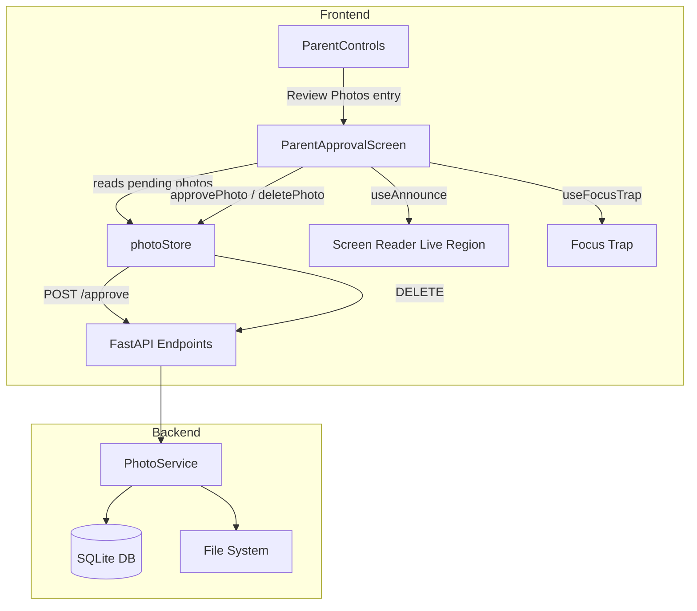

# Design Document: Parent Approval Flow

## Overview

This feature enhances the existing `ParentApprovalScreen` component and integrates it with the `ParentControls` panel to deliver a polished, accessible photo review experience for parents. The current implementation has a working parent gate (3-second hold-to-unlock) and basic approve/reject buttons, but lacks: pending review notifications, confirmation prompts before rejection, error handling with retry, loading/disabled states during API calls, image load failure placeholders, screen reader announcements, and a "Review Photos" entry point in ParentControls.

The design extends the existing architecture rather than replacing it. The `ParentApprovalScreen` component gains new internal state for per-photo loading, error messages, and a rejection confirmation dialog. The `photoStore` gets error-reporting capabilities on its `approvePhoto` and `deletePhoto` actions. The `ParentControls` panel gets a new section that reads pending review count from the photo store and navigates to the approval flow.

### Key Design Decisions

1. **Enhance in-place**: Extend `ParentApprovalScreen.jsx` and `photoStore.js` rather than creating new components/stores. The existing code already handles the gate, optimistic updates, and basic approve/delete — we add the missing UX layers on top.
2. **Optimistic updates with revert + error surfacing**: The store already does optimistic updates. We add error state that the UI can read to show inline messages and a retry path.
3. **Confirmation dialog for reject only**: Approve is low-risk (reversible via re-upload). Reject is destructive (cascade deletes faces, portraits, mappings), so it gets a confirmation prompt.
4. **No new backend endpoints**: The existing `POST /api/photos/{photo_id}/approve` and `DELETE /api/photos/{photo_id}` endpoints are sufficient. The frontend changes are purely UI/state enhancements.

## Architecture



The flow is:
1. Parent opens `ParentControls` → sees "Review Photos" with pending count badge
2. Taps "Review Photos" → navigates to `ParentApprovalScreen`
3. Completes 3-second hold → gate unlocks → review list appears
4. For each photo: approve (immediate) or reject (confirmation prompt → delete)
5. When queue empties → completion view → "Done" button → `onComplete` callback

## Components and Interfaces

### 1. ParentControls Enhancement

Add a "Review Photos" section to the existing `ParentControls.jsx` component.

```jsx
// New section added to ParentControls.jsx
// Reads from photoStore to get pending count
<section className="pc-section">
  <h3 className="pc-label">Photo Review</h3>
  <button
    className="pc-review-btn"
    onClick={onReviewPhotos}
    aria-label={pendingCount > 0
      ? `Review ${pendingCount} pending photo${pendingCount > 1 ? 's' : ''}`
      : 'No photos to review'}
  >
    <span>Review Photos</span>
    {pendingCount > 0
      ? <span className="pc-review-badge">{pendingCount}</span>
      : <span className="pc-review-secondary">No photos to review</span>}
  </button>
</section>
```

**Props change**: `ParentControls` receives a new `onReviewPhotos: () => void` callback prop.

### 2. ParentApprovalScreen Enhancement

Extend the existing component with these new capabilities:

**New internal state:**
- `actionInProgress: Record<string, 'approving' | 'rejecting'>` — tracks per-photo API call status
- `photoErrors: Record<string, string>` — tracks per-photo error messages
- `rejectConfirmId: string | null` — photo ID currently showing rejection confirmation
- `loadError: boolean` — whether the initial photo load failed
- `imageLoadErrors: Set<string>` — photo IDs whose images failed to load

**Updated photo card rendering:**
- Shows filename and upload date below the image
- Shows placeholder on image load error
- Disables approve/reject buttons while `actionInProgress[photoId]` is set
- Shows inline error message from `photoErrors[photoId]`
- Shows rejection confirmation dialog when `rejectConfirmId === photoId`

**Accessibility enhancements:**
- `useFocusTrap` on the review area after gate unlock
- `useAnnounce` for approve/reject outcomes
- `aria-label` on all interactive elements
- `aria-busy` on photo cards during API calls
- Keyboard navigation: Tab through cards, Enter/Space to activate buttons, Escape to dismiss confirmation

### 3. photoStore Enhancement

Extend `approvePhoto` and `deletePhoto` to return success/failure so the UI can react:

```js
approvePhoto: async (photoId) => {
  const prevPhotos = get().photos;
  set({ photos: prevPhotos.map(p =>
    p.photo_id === photoId ? { ...p, status: 'safe' } : p
  )});
  try {
    const resp = await fetch(`${API_BASE}/api/photos/${photoId}/approve`, { method: 'POST' });
    if (!resp.ok) {
      set({ photos: prevPhotos });
      return { success: false, error: 'server' };
    }
    return { success: true };
  } catch (err) {
    set({ photos: prevPhotos });
    return { success: false, error: 'network' };
  }
},
```

Same pattern for `deletePhoto`. The return value `{ success, error }` lets the component set `photoErrors` and announce results.

### 4. Rejection Confirmation Dialog

An inline confirmation within the photo card (not a modal overlay), keeping context visible:

```jsx
{rejectConfirmId === photo.photo_id && (
  <div className="approval-confirm" role="alertdialog" aria-label="Confirm photo rejection">
    <p>Remove this photo permanently?</p>
    <div className="approval-confirm-actions">
      <button onClick={handleConfirmReject} aria-label="Confirm removal">Remove</button>
      <button onClick={() => setRejectConfirmId(null)} aria-label="Cancel removal">Cancel</button>
    </div>
  </div>
)}
```

## Data Models

### Frontend State (photoStore)

No new store slices needed. The existing `photos` array with `status` field is sufficient. Per-photo action state (`actionInProgress`, `photoErrors`) lives as component-local state in `ParentApprovalScreen` since it's purely UI concern.

**Photo object shape (from API, already exists):**
```ts
interface Photo {
  photo_id: string;
  sibling_pair_id: string;
  filename: string;
  file_path: string;
  file_size_bytes: number;
  width: number;
  height: number;
  status: 'safe' | 'review' | 'blocked';
  uploaded_at: string; // ISO datetime
  faces: FacePortrait[];
}
```

**Action result (new return type from store actions):**
```ts
interface ActionResult {
  success: boolean;
  error?: 'server' | 'network';
}
```

### Backend Models (no changes)

The existing `PhotoStatus` enum (`safe`, `review`, `blocked`), `PhotoRecord`, and `DeleteResult` models in `backend/app/models/photo.py` are unchanged. The existing API endpoints are sufficient:

| Endpoint | Method | Purpose |
|---|---|---|
| `/api/photos/{sibling_pair_id}` | GET | List photos (filtered client-side for `review` status) |
| `/api/photos/{photo_id}/approve` | POST | Transition photo from `review` → `safe` |
| `/api/photos/{photo_id}` | DELETE | Cascade delete photo + faces + mappings |


## Correctness Properties

*A property is a characteristic or behavior that should hold true across all valid executions of a system — essentially, a formal statement about what the system should do. Properties serve as the bridge between human-readable specifications and machine-verifiable correctness guarantees.*

### Property 1: Pending review count accuracy

*For any* array of photos with arbitrary statuses (`safe`, `review`, `blocked`), the computed pending review count SHALL equal the number of photos whose status is `review`.

**Validates: Requirements 1.1, 9.3**

### Property 2: Photo card displays required metadata

*For any* photo record with a filename and upload date, the rendered photo card SHALL contain both the filename and a formatted upload date string.

**Validates: Requirements 3.1**

### Property 3: Heading reflects queue size

*For any* non-empty list of pending review photos, the review heading text SHALL contain the count of photos in the list.

**Validates: Requirements 3.2**

### Property 4: Photos ordered by upload date ascending

*For any* list of photos with distinct upload dates, the displayed order SHALL be sorted by upload date ascending (oldest first).

**Validates: Requirements 3.4**

### Property 5: Approve success transitions status

*For any* photo with status `review` in the store, when `approvePhoto` succeeds, the photo's status in the store SHALL be `safe`.

**Validates: Requirements 4.2**

### Property 6: Approve failure reverts status

*For any* photo with status `review` in the store, when `approvePhoto` fails (server or network error), the photo's status in the store SHALL remain `review`.

**Validates: Requirements 4.3**

### Property 7: Delete success removes photo

*For any* photo in the store, when `deletePhoto` succeeds, the photo SHALL no longer be present in the store's photos array.

**Validates: Requirements 5.3**

### Property 8: Delete failure restores photo

*For any* photo in the store, when `deletePhoto` fails (server or network error), the photo SHALL still be present in the store's photos array with its original data.

**Validates: Requirements 5.4**

### Property 9: Empty queue shows completion

*For any* sequence of approve/reject actions that results in zero photos with status `review`, the approval flow SHALL render the completion view (not the review list).

**Validates: Requirements 6.1**

### Property 10: Interactive elements have aria-labels

*For any* rendered photo card in the review queue, the approve and reject buttons SHALL each have a non-empty `aria-label` attribute.

**Validates: Requirements 7.2**

### Property 11: Touch targets meet minimum size

*For any* approve or reject button rendered in the approval flow, the element SHALL have `minWidth` and `minHeight` of at least 48 CSS pixels.

**Validates: Requirements 7.5**

### Property 12: API failure displays error and retains photo

*For any* photo where an approve or reject API call fails (server error or network error), the approval flow SHALL display an inline error message on that photo's card AND the photo SHALL remain in the review queue.

**Validates: Requirements 8.2, 8.3**

## Error Handling

| Scenario | Behavior | Recovery |
|---|---|---|
| Photo list fails to load | Show error message with "Retry" button | Retry calls `loadPhotos` again |
| Approve API returns 4xx/5xx | Revert photo status to `review`, show inline error on card | User can tap approve again |
| Delete API returns 4xx/5xx | Restore photo in store, show inline error on card | User can tap reject again |
| Network error on approve/reject | Same as server error, but message says "Connection issue" | User can retry when online |
| Image fails to load | Hide broken ``, show placeholder icon | No retry needed — cosmetic |
| Gate hold interrupted | Reset progress to zero, no error shown | User can try holding again |

Error messages are displayed inline on the affected photo card (not as toasts or modals) to maintain context. Messages auto-clear when the user retries the action.

## Testing Strategy

### Property-Based Testing

Use `fast-check` as the property-based testing library (already available in the JS ecosystem, works with Vitest).

Each correctness property maps to a single property-based test with a minimum of 100 iterations. Tests are tagged with the format:

```
Feature: parent-approval-flow, Property {N}: {title}
```

**Key generators needed:**
- `arbitraryPhoto()`: generates a photo object with random `photo_id`, `filename`, `status` (one of `safe`/`review`/`blocked`), `uploaded_at` (random ISO date), and optional `faces` array
- `arbitraryPhotoList(minLen, maxLen)`: generates an array of photos with mixed statuses
- `arbitraryWhitespaceString()`: for edge cases

**Property test focus areas:**
- Properties 1, 3, 4: Pure functions over photo arrays (count, sort, display)
- Properties 5, 6, 7, 8, 12: Store action behavior with mocked fetch (success/failure paths)
- Properties 9: State-driven rendering (empty queue → completion view)
- Properties 10, 11: Rendered component attribute checks

### Unit Testing

Unit tests complement property tests for specific examples and edge cases:

- Gate unlock after exactly 3 seconds (Req 2.1)
- Gate reset on early release (Req 2.2)
- Gate keyboard activation with Enter and Space (Req 2.4)
- Image placeholder on load error (Req 3.3)
- Reject confirmation prompt appears on reject tap (Req 5.1)
- Reject confirmation cancel dismisses prompt (Req 5.5)
- Done button calls `onComplete` (Req 6.3)
- Focus moves to heading after gate unlock (Req 7.1)
- Screen reader announcement after approve/reject (Req 7.3)
- Load error shows retry button (Req 8.1)
- "Review Photos" entry point visible in ParentControls (Req 9.1)
- "No photos to review" text when count is zero (Req 9.2)

### Test Configuration

- Runner: Vitest with `--run` flag (no watch mode)
- Property library: `fast-check`
- Minimum iterations per property: 100
- Component rendering: `@testing-library/react` for DOM assertions
- Store testing: Direct Zustand store manipulation with mocked `fetch`
