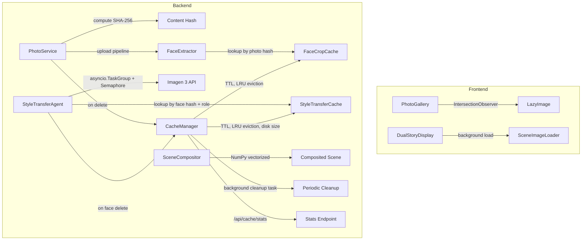
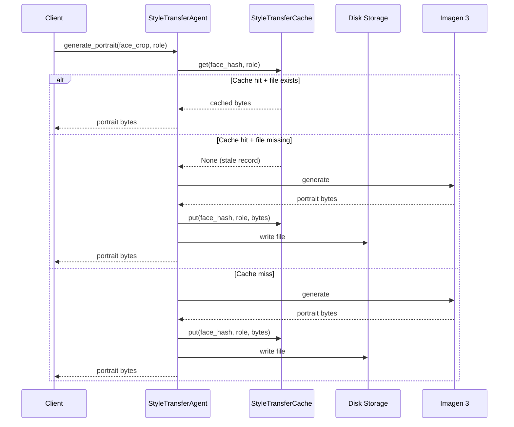
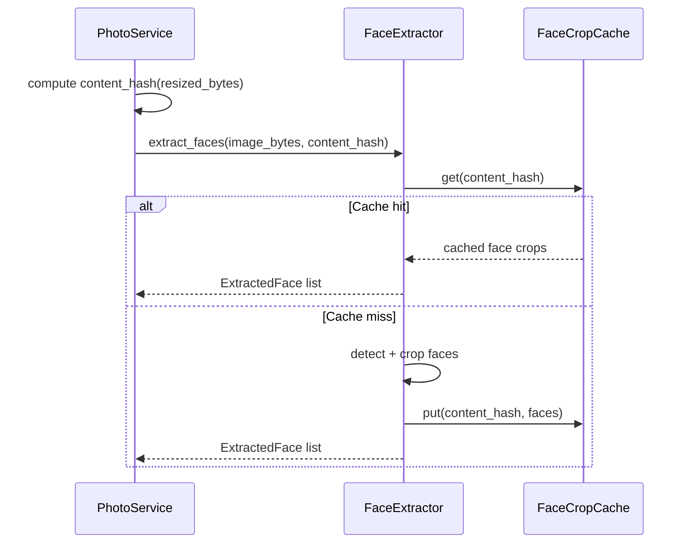

# Design Document: Performance Tuning

## Overview

This design introduces a multi-layer caching system, frontend lazy loading, parallel processing, and compositor optimization to the Twin Spark Chronicles pipeline. The goal is to eliminate redundant AI model calls (Imagen 3 for style transfer, face detection), reduce perceived load times on the frontend, and speed up scene compositing through vectorized NumPy operations.

The changes span three areas:

1. **Backend caching** — A `CacheManager` coordinates two caches: a disk-backed `StyleTransferCache` keyed by `(face_content_hash, character_role)` and an in-memory `FaceCropCache` keyed by `photo_content_hash`. Content hashes (SHA-256) are computed during the upload pipeline and stored in the DB, providing stable keys that survive ID changes.

2. **Frontend lazy loading** — The `PhotoGallery` uses Intersection Observer + `loading="lazy"` to defer thumbnail loading, with skeleton placeholders and fade-in transitions. `DualStoryDisplay` loads scene images in the background while showing narration text immediately, with crossfade transitions and a 10-second timeout fallback.

3. **Backend processing optimizations** — Portrait generation runs concurrently via `asyncio.TaskGroup` with a configurable semaphore (default 3). The `SceneCompositor` replaces per-pixel Python loops with NumPy array operations for color grading and shadow generation.

## Architecture



### Cache Flow — Style Transfer



### Cache Flow — Face Crop



## Components and Interfaces

### 1. CacheManager (`backend/app/services/cache_manager.py`)

Central coordinator for all caches. Manages TTL enforcement, size-based eviction, and exposes stats.

```python
class CacheManager:
    def __init__(
        self,
        style_transfer_cache: StyleTransferCache,
        face_crop_cache: FaceCropCache,
        cleanup_interval_minutes: int = 60,
    ) -> None: ...

    async def start_cleanup_loop(self) -> None:
        """Start background asyncio task for periodic expired entry cleanup."""

    async def stop_cleanup_loop(self) -> None:
        """Cancel the background cleanup task."""

    async def cleanup_expired(self) -> dict[str, int]:
        """Remove expired entries from all caches. Returns eviction counts."""

    def get_stats(self) -> CacheStats:
        """Return current sizes, hit/miss rates, eviction counts."""

    async def invalidate_photo(self, photo_content_hash: str, face_content_hashes: list[str]) -> None:
        """Cascade invalidation: evict face crop cache + all style transfer entries for the photo's faces."""

    async def invalidate_face(self, face_content_hash: str) -> None:
        """Evict all style transfer cache entries for a specific face."""
```

### 2. StyleTransferCache (`backend/app/services/style_transfer_cache.py`)

Disk-backed cache for style-transferred portrait images.

```python
class StyleTransferCache:
    def __init__(
        self,
        storage_root: str,
        max_disk_bytes: int = 500 * 1024 * 1024,  # 500 MB
        ttl_seconds: int = 7 * 24 * 3600,          # 7 days
    ) -> None: ...

    def get(self, face_content_hash: str, role: str) -> bytes | None:
        """Return cached portrait bytes or None. Updates access time on hit."""

    def put(self, face_content_hash: str, role: str, portrait_bytes: bytes) -> None:
        """Store portrait bytes on disk. Triggers LRU eviction if over size limit."""

    def evict(self, face_content_hash: str, role: str | None = None) -> int:
        """Evict entries. If role is None, evict all entries for the face hash. Returns count evicted."""

    def cleanup_expired(self) -> int:
        """Remove entries older than TTL. Returns count removed."""

    @property
    def stats(self) -> dict: ...
```

### 3. FaceCropCache (`backend/app/services/face_crop_cache.py`)

In-memory LRU cache for face extraction results.

```python
class FaceCropCache:
    def __init__(self, max_entries: int = 200) -> None: ...

    def get(self, photo_content_hash: str) -> list[CachedFaceCrop] | None:
        """Return cached face crops or None. Updates access time on hit."""

    def put(self, photo_content_hash: str, faces: list[CachedFaceCrop]) -> None:
        """Store face crops. Triggers LRU eviction if over entry limit."""

    def evict(self, photo_content_hash: str) -> bool:
        """Evict entry for the given hash. Returns True if found."""

    @property
    def stats(self) -> dict: ...
```

### 4. Modified PhotoService (`backend/app/services/photo_service.py`)

Changes to `upload_photo`:
- Compute SHA-256 content hash of `resized_bytes` after resize, before face extraction.
- Store `content_hash` in the `photos` table.
- Pass `content_hash` to `FaceExtractor` for cache lookup.

Changes to `delete_photo`:
- Look up `content_hash` from the photo record.
- Collect `content_hash` values for all face crops belonging to the photo.
- Call `CacheManager.invalidate_photo(photo_content_hash, face_content_hashes)`.

### 5. Modified FaceExtractor (`backend/app/services/face_extractor.py`)

Changes to `extract_faces`:
- Accept optional `content_hash` parameter.
- When provided, check `FaceCropCache` first.
- On cache miss, run detection as before, then store results in cache.
- Compute per-face content hash (SHA-256 of crop bytes) and attach to `ExtractedFace`.

### 6. Modified StyleTransferAgent (`backend/app/agents/style_transfer_agent.py`)

Changes to `generate_portrait`:
- Accept `face_content_hash` parameter.
- Check `StyleTransferCache` before calling Imagen 3.
- On cache miss, generate and store in cache.

Changes to `generate_portraits_for_session`:
- Use `asyncio.TaskGroup` to process all mappings concurrently.
- Use `asyncio.Semaphore(max_concurrent)` to limit concurrent Imagen 3 calls (default 3).
- On per-character failure, use default avatar and continue.

### 7. Modified SceneCompositor (`backend/app/services/scene_compositor.py`)

Changes to `_apply_color_grading`:
- Replace per-pixel loop with NumPy array operations.
- Convert image to NumPy array, apply vectorized blend, convert back.

Changes to `_create_shadow`:
- Replace per-pixel loop with NumPy array operations.
- Extract alpha channel as array, clip to opacity, reassemble.

New `_batch_scale_portraits` method:
- Pre-scale all portraits in one pass before the compositing loop.

### 8. LazyImage Component (`frontend/src/shared/components/LazyImage.jsx`)

Reusable lazy-loading image component using Intersection Observer.

```jsx
function LazyImage({ src, alt, width, height, className, rootMargin = "200px", fadeDuration = 200 }) {
  // Uses IntersectionObserver to detect when image enters viewport
  // Shows skeleton placeholder until loaded
  // Fades in over fadeDuration ms
  // Falls back to loading="lazy" attribute
}
```

### 9. SceneImageLoader Component (`frontend/src/features/story/components/SceneImageLoader.jsx`)

Handles background loading of story scene images with placeholder and timeout.

```jsx
function SceneImageLoader({ src, alt, timeout = 10000, fadeDuration = 300 }) {
  // Begins loading immediately in background
  // Shows blurred skeleton placeholder while loading
  // Crossfades to full image on load
  // Shows fallback illustration after timeout
}
```

### 10. Cache Stats Endpoint (`backend/app/main.py`)

New route: `GET /api/cache/stats`

Returns JSON with current cache sizes, hit rates, and eviction counts for both caches.

## Data Models

### Database Schema Change

Add `content_hash` column to the `photos` table:

```sql
ALTER TABLE photos ADD COLUMN content_hash TEXT;
```

Add `content_hash` column to the `face_portraits` table:

```sql
ALTER TABLE face_portraits ADD COLUMN content_hash TEXT;
```

### New Data Classes

```python
@dataclass
class CachedFaceCrop:
    """In-memory representation of a cached face extraction result."""
    face_index: int
    crop_bytes: bytes
    bbox: FaceBBox
    crop_width: int
    crop_height: int
    content_hash: str  # SHA-256 of crop_bytes

@dataclass
class StyleTransferCacheEntry:
    """Metadata for a disk-backed style transfer cache entry."""
    face_content_hash: str
    role: str
    file_path: str
    size_bytes: int
    created_at: float   # timestamp
    last_accessed: float # timestamp

@dataclass
class CacheStats:
    """Aggregate cache statistics returned by /api/cache/stats."""
    style_transfer_entries: int
    style_transfer_disk_bytes: int
    style_transfer_hit_rate: float
    style_transfer_evictions: int
    face_crop_entries: int
    face_crop_hit_rate: float
    face_crop_evictions: int
```

### Content Hash Computation

```python
import hashlib

def compute_content_hash(image_bytes: bytes) -> str:
    """Compute SHA-256 hex digest of image bytes."""
    return hashlib.sha256(image_bytes).hexdigest()
```

Computed in `PhotoService.upload_photo` after `resize_image()`, stored in DB, and propagated to face extraction and style transfer as cache keys.


## Correctness Properties

*A property is a characteristic or behavior that should hold true across all valid executions of a system — essentially, a formal statement about what the system should do. Properties serve as the bridge between human-readable specifications and machine-verifiable correctness guarantees.*

### Property 1: Style transfer cache round trip

*For any* face crop bytes and character role, if a style transfer is performed (cache miss), then a subsequent request with the same content hash and role should return the identical portrait bytes without invoking Imagen 3.

**Validates: Requirements 1.1, 1.2**

### Property 2: Composite cache key distinctness

*For any* face content hash and two distinct character roles, storing a portrait under each role should produce two independent cache entries, and retrieving by each `(hash, role)` pair should return the corresponding distinct portrait.

**Validates: Requirements 1.3**

### Property 3: Face crop cache round trip with content hash key

*For any* photo content hash and list of extracted face crops (with bytes and bounding boxes), storing them in the FaceCropCache and then retrieving by the same content hash should return identical crop bytes and bounding box metadata. Two different photo IDs with the same content hash should share the same cache entry.

**Validates: Requirements 2.1, 2.2, 8.4**

### Property 4: Concurrent portrait generation preserves results

*For any* set of character mappings with valid face crops, generating portraits concurrently via asyncio TaskGroup should produce the same set of `{role: portrait}` entries as generating them sequentially — the output dictionary should contain the same keys with valid portrait bytes regardless of execution order.

**Validates: Requirements 5.1**

### Property 5: Fault isolation in concurrent generation

*For any* set of character mappings where a subset of portrait generations fail, the result dictionary should contain default avatar bytes for each failed role and valid portrait bytes for each successful role — no single failure should prevent other portraits from being generated.

**Validates: Requirements 5.2**

### Property 6: Concurrency limit enforcement

*For any* set of N character mappings (where N exceeds the configured concurrency limit), the number of simultaneously in-flight Imagen 3 API calls should never exceed the configured maximum.

**Validates: Requirements 5.3**

### Property 7: NumPy compositor equivalence

*For any* RGBA portrait image and scene average color tuple, the NumPy-vectorized color grading and shadow generation should produce pixel-identical (within rounding tolerance of ±1 per channel) output compared to the original per-pixel Python loop implementation.

**Validates: Requirements 6.1, 6.2**

### Property 8: TTL eviction

*For any* StyleTransferCache entry whose age exceeds the configured TTL, accessing that entry should return None, and the entry should be removed during cleanup.

**Validates: Requirements 7.1**

### Property 9: Style transfer cache disk size limit

*For any* sequence of cache insertions into the StyleTransferCache, the total disk usage should never exceed the configured maximum size. When the limit is exceeded, the least-recently-used entries should be evicted first.

**Validates: Requirements 7.2**

### Property 10: Face crop cache entry count limit

*For any* sequence of insertions into the FaceCropCache, the number of entries should never exceed the configured maximum. When the limit is exceeded, the least-recently-used entries should be evicted first.

**Validates: Requirements 7.3**

### Property 11: Content hash correctness and persistence

*For any* image bytes uploaded through the PhotoService pipeline, the content_hash stored in the database should equal `hashlib.sha256(resized_bytes).hexdigest()` where `resized_bytes` is the output of `resize_image()`.

**Validates: Requirements 8.1, 8.2**

### Property 12: Style transfer keyed by content hash not face ID

*For any* two face records with different face_ids but identical face crop bytes (and thus identical content hashes), a style transfer cache hit for one should serve the other — the cache should be keyed by content hash, not face_id.

**Validates: Requirements 8.3**

### Property 13: Cache invalidation cascade on photo deletion

*For any* photo with associated face crops in both caches, after the photo is deleted: (a) the FaceCropCache should contain no entry for that photo's content hash, and (b) the StyleTransferCache should contain no entries for any of that photo's face content hashes.

**Validates: Requirements 2.3, 9.1, 9.2**

### Property 14: Cache invalidation on face deletion

*For any* face crop content hash with entries in the StyleTransferCache (potentially across multiple roles), after the face is deleted, the StyleTransferCache should contain no entries keyed by that face content hash.

**Validates: Requirements 9.3**

## Error Handling

### Backend Cache Errors

| Scenario | Behavior |
|---|---|
| StyleTransferCache disk write fails | Log warning, skip caching, return generated portrait directly |
| StyleTransferCache disk read fails (corrupt file) | Evict stale record, regenerate portrait, re-cache |
| FaceCropCache memory limit exceeded | LRU eviction before insertion (never raises) |
| Content hash computation fails | Log error, skip caching, proceed without cache key |
| Cache cleanup task fails | Log error, retry at next interval, do not crash the server |
| Cache stats endpoint fails | Return 500 with error message |

### Backend Processing Errors

| Scenario | Behavior |
|---|---|
| Single portrait generation fails in TaskGroup | Use default avatar for that role, continue others |
| All portrait generations fail | Return default avatars for all roles |
| Semaphore acquisition timeout | Not applicable — semaphore waits indefinitely but TaskGroup has overall timeout |
| NumPy import fails | Fall back to original per-pixel implementation with warning log |
| Imagen 3 rate limit hit | Semaphore prevents excessive concurrency; individual failures use default avatar |

### Frontend Loading Errors

| Scenario | Behavior |
|---|---|
| Gallery thumbnail fails to load | Show broken-image placeholder, do not retry |
| Scene image fails to load within 10s | Show fallback illustration, log failure |
| IntersectionObserver not supported | Fall back to `loading="lazy"` attribute (baseline) |
| Scene image URL is null/undefined | Show skeleton placeholder, no error thrown |

### Cache Invalidation Errors

| Scenario | Behavior |
|---|---|
| Eviction of non-existent cache entry | No-op, return 0 evicted |
| Disk file already deleted during eviction | Log warning, remove cache record anyway |
| DB content_hash is NULL during deletion | Skip cache invalidation for that photo, log warning |

## Testing Strategy

### Property-Based Testing

Use **Hypothesis** (Python) for backend property-based tests. Each property test runs a minimum of 100 iterations.

Each property-based test must be tagged with a comment referencing the design property:
```python
# Feature: performance-tuning, Property 1: Style transfer cache round trip
```

Property tests target the cache layer and compositor logic:

- **StyleTransferCache**: Round-trip (P1), key distinctness (P2), TTL eviction (P8), disk size limit (P9), content-hash keying (P12)
- **FaceCropCache**: Round-trip (P3), entry count limit (P10)
- **SceneCompositor**: NumPy equivalence (P7) — generate random RGBA images and scene colors, compare NumPy output to loop output within ±1 tolerance
- **Cache invalidation**: Cascade on photo delete (P13), face delete (P14)
- **Content hash**: Correctness (P11) — generate random image bytes, verify hash matches SHA-256
- **Parallel generation**: Result equivalence (P4), fault isolation (P5), concurrency limit (P6)

### Unit Testing

Unit tests cover specific examples, edge cases, and integration points:

- **Edge cases**: Empty cache access, cache with single entry at TTL boundary, zero-byte image, portrait file missing from disk (Req 1.4)
- **Integration**: PhotoService upload pipeline computes and stores content_hash, delete_photo triggers cache invalidation
- **Frontend**: LazyImage renders `loading="lazy"` attribute (Req 3.4), SceneImageLoader shows fallback after timeout (Req 4.4), stats endpoint returns required fields (Req 7.4)
- **Error paths**: Corrupt cache files, failed disk writes, Imagen 3 failures during concurrent generation

### Test Organization

```
backend/tests/
  test_style_transfer_cache.py    # P1, P2, P8, P9, P12 + unit tests
  test_face_crop_cache.py         # P3, P10 + unit tests
  test_cache_manager.py           # P13, P14 + cleanup unit tests
  test_scene_compositor.py        # P7 + existing tests
  test_style_transfer_agent.py    # P4, P5, P6 + existing tests
  test_photo_service.py           # P11 + integration tests

frontend/src/
  shared/components/__tests__/LazyImage.test.jsx
  features/story/components/__tests__/SceneImageLoader.test.jsx
```

### Test Configuration

- Backend: `pytest` + `hypothesis` with `@settings(max_examples=100)`
- Frontend: existing test framework (Vitest/Jest) for component tests
- Property tests should use `@given` decorators with appropriate strategies for generating random image bytes, hash strings, cache entries, and RGBA pixel arrays
