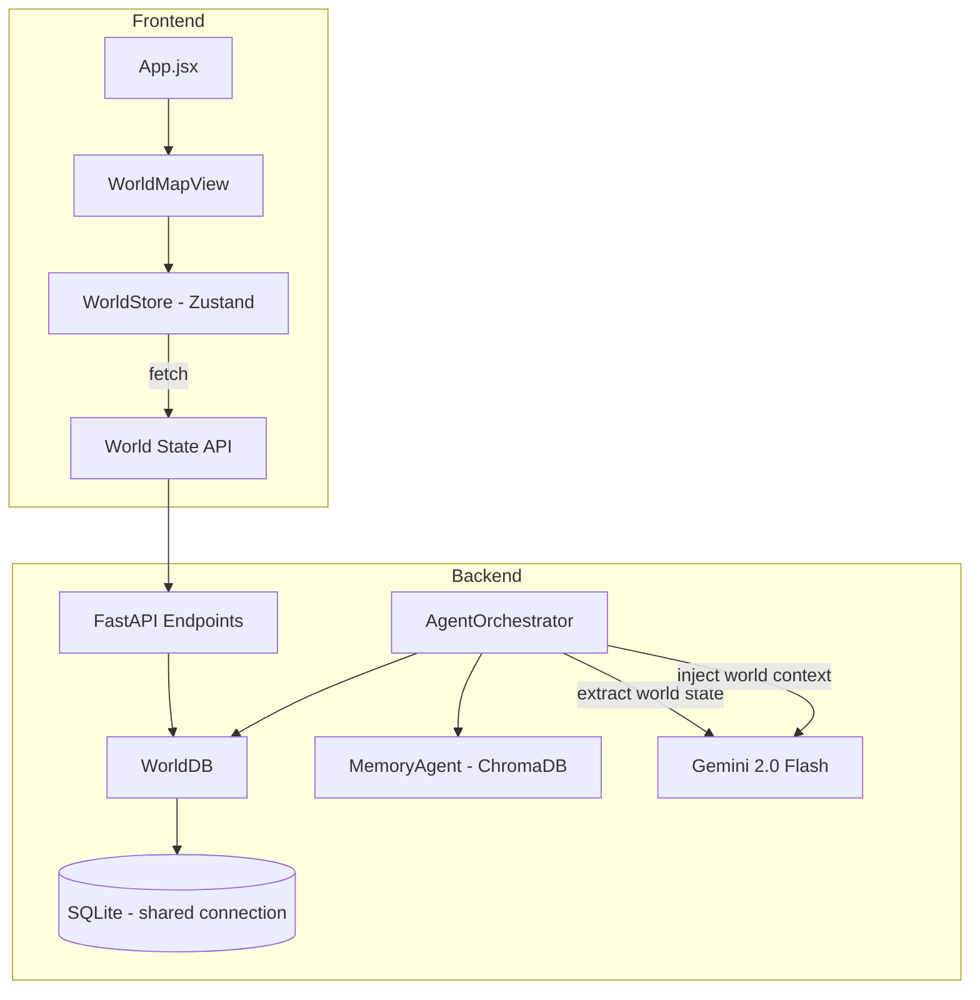
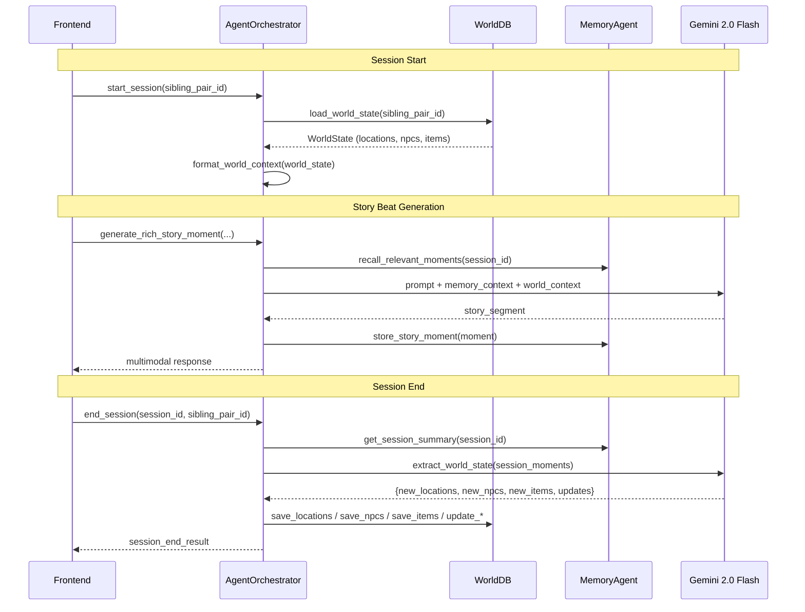
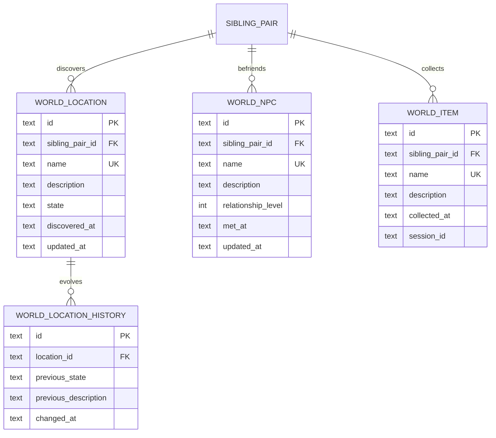

# Design Document: Persistent Story World

## Overview

This feature adds cross-session world state persistence to Twin Spark Chronicles. Currently, `MemoryAgent` (ChromaDB) handles within-session memory and `SiblingDB` (SQLite/aiosqlite) persists personality and relationship data — but the story world resets every session. Persistent Story World introduces a `WorldDB` layer that stores discovered locations, befriended NPCs, and collected items in SQLite, and injects that world context into Gemini prompts so the story feels continuous across sessions.

### Key Design Decisions

1. **WorldDB as a separate class reusing SiblingDB's connection** — Rather than subclassing `SiblingDB`, `WorldDB` accepts an `aiosqlite.Connection` from `SiblingDB._get_db()`. This avoids dual-connection issues and follows the existing lazy-init pattern while keeping world concerns isolated.
2. **Gemini-driven extraction** — World state extraction (parsing story moments for new locations/NPCs/items) uses a structured Gemini call with JSON output, not regex. This is more robust for creative narrative text.
3. **Capped context injection** — World context injected into prompts is limited to 5 relevant entries per beat (Req 6.4) and 10 per category at session start (Req 3.2) to avoid prompt bloat.
4. **Graceful degradation** — All world state operations are wrapped in try/except. If WorldDB is unavailable, story generation continues without world context (Req 9.5).

## Architecture

### System Context



### Integration Flow



### Component Responsibilities

| Component | Responsibility |
|---|---|
| `WorldDB` | CRUD for locations, NPCs, items in SQLite. Shares connection with `SiblingDB`. |
| `AgentOrchestrator` | Loads world state at session start, injects context into prompts, extracts and persists new discoveries at session end. |
| `WorldStateExtractor` | Utility that builds the Gemini extraction prompt and parses the structured JSON response. |
| `World State API` | FastAPI GET endpoints for frontend to read world state. |
| `WorldStore` (Zustand) | Frontend state management for world data. |
| `WorldMapView` | Visual display of locations, NPCs, items for children. |

## Components and Interfaces

### WorldDB (backend/app/services/world_db.py)

```python
class WorldDB:
    """Async SQLite persistence for world state.
    
    Reuses the aiosqlite connection from SiblingDB to avoid
    opening a second connection to the same database file.
    """

    def __init__(self, sibling_db: SiblingDB) -> None:
        self._sibling_db = sibling_db

    async def initialize(self) -> None:
        """Create world state tables if they don't exist."""
        ...

    # ── Locations ──
    async def save_location(self, sibling_pair_id: str, name: str,
                            description: str, state: str) -> str:
        """Upsert a location. Returns the location id."""
        ...

    async def load_locations(self, sibling_pair_id: str,
                             limit: int = 100) -> list[dict]:
        """Load locations for a sibling pair, newest first."""
        ...

    async def update_location_state(self, location_id: str,
                                     new_state: str,
                                     new_description: str) -> None:
        """Update a location's state, archiving the prior state."""
        ...

    # ── NPCs ──
    async def save_npc(self, sibling_pair_id: str, name: str,
                       description: str,
                       relationship_level: int = 1) -> str:
        """Upsert an NPC. Returns the npc id."""
        ...

    async def load_npcs(self, sibling_pair_id: str,
                        limit: int = 100) -> list[dict]:
        """Load NPCs for a sibling pair, newest first."""
        ...

    async def update_npc_relationship(self, npc_id: str,
                                       relationship_level: int) -> None:
        """Update an NPC's relationship level."""
        ...

    # ── Items ──
    async def save_item(self, sibling_pair_id: str, name: str,
                        description: str, session_id: str) -> str:
        """Upsert an item. Returns the item id."""
        ...

    async def load_items(self, sibling_pair_id: str,
                         limit: int = 100) -> list[dict]:
        """Load items for a sibling pair, newest first."""
        ...

    # ── Aggregate ──
    async def load_world_state(self, sibling_pair_id: str) -> dict:
        """Load full world state: locations, npcs, items."""
        ...

    async def close(self) -> None:
        """No-op — connection lifecycle owned by SiblingDB."""
        pass
```

### WorldStateExtractor (backend/app/services/world_state_extractor.py)

```python
class WorldStateExtractor:
    """Extracts world state changes from session story moments using Gemini."""

    EXTRACTION_PROMPT_TEMPLATE: str  # Gemini prompt for structured extraction

    async def extract(self, session_moments: list[dict]) -> dict:
        """Parse story moments and return structured world changes.
        
        Returns:
            {
                "new_locations": [{"name": str, "description": str, "state": str}],
                "new_npcs": [{"name": str, "description": str, "relationship_level": int}],
                "new_items": [{"name": str, "description": str}],
                "location_updates": [{"name": str, "new_state": str, "new_description": str}],
                "npc_updates": [{"name": str, "relationship_level": int}]
            }
        """
        ...

    def build_extraction_prompt(self, moments: list[dict]) -> str:
        """Build the Gemini prompt for world state extraction."""
        ...

    def parse_extraction_response(self, response_text: str) -> dict:
        """Parse Gemini's JSON response into structured world changes."""
        ...
```

### WorldContextFormatter (backend/app/services/world_context_formatter.py)

```python
class WorldContextFormatter:
    """Formats world state into prompt-injectable context strings."""

    def format_session_start_context(self, world_state: dict) -> str:
        """Format full world context for session start prompt.
        
        Includes up to 10 locations, 10 NPCs, 10 items.
        Returns empty string if world_state is empty.
        """
        ...

    def format_beat_context(self, world_state: dict,
                            current_scene: str) -> str:
        """Format relevant world context for a single story beat.
        
        Selects up to 5 entries most relevant to current_scene
        using keyword matching against location/NPC/item names
        and descriptions.
        """
        ...
```

### Orchestrator Integration Points

The `AgentOrchestrator` gains three new responsibilities:

1. **`__init__`** — Instantiate `WorldDB(self._sibling_db)` and `WorldStateExtractor()` and `WorldContextFormatter()`.
2. **`generate_rich_story_moment`** — After STEP 1 (memory recall), add a new step that calls `self._world_context_formatter.format_beat_context(...)` and merges the result into `story_context`.
3. **`end_session`** — After persisting the session summary, call `WorldStateExtractor.extract(...)` on session moments, then persist results via `WorldDB`.

```python
# In AgentOrchestrator.__init__:
from app.services.world_db import WorldDB
from app.services.world_state_extractor import WorldStateExtractor
from app.services.world_context_formatter import WorldContextFormatter

self._world_db = WorldDB(self._sibling_db)
self._world_extractor = WorldStateExtractor()
self._world_context_formatter = WorldContextFormatter()
self._world_state_cache: dict[str, dict] = {}  # keyed by sibling_pair_id
```

### World State API Endpoints (backend/app/main.py additions)

| Method | Path | Response | Description |
|--------|------|----------|-------------|
| GET | `/api/world/{sibling_pair_id}` | `WorldStateResponse` | Full world state (locations + NPCs + items) |
| GET | `/api/world/{sibling_pair_id}/locations` | `list[LocationResponse]` | All locations for the pair |
| GET | `/api/world/{sibling_pair_id}/npcs` | `list[NpcResponse]` | All NPCs for the pair |
| GET | `/api/world/{sibling_pair_id}/items` | `list[ItemResponse]` | All items for the pair |

All endpoints return HTTP 200 with empty collections if no data exists. HTTP 500 with `{"detail": "..."}` on internal errors.

```python
# Response models (Pydantic)
class LocationResponse(BaseModel):
    id: str
    name: str
    description: str
    state: str
    discovered_at: str
    updated_at: str

class NpcResponse(BaseModel):
    id: str
    name: str
    description: str
    relationship_level: int
    met_at: str
    updated_at: str

class ItemResponse(BaseModel):
    id: str
    name: str
    description: str
    collected_at: str
    session_id: str

class WorldStateResponse(BaseModel):
    sibling_pair_id: str
    locations: list[LocationResponse]
    npcs: list[NpcResponse]
    items: list[ItemResponse]
```

### Frontend Components

#### WorldStore (frontend/src/stores/worldStore.js)

```javascript
// Zustand store following existing pattern (devtools middleware)
export const useWorldStore = create(
  devtools(
    (set, get) => ({
      // State
      locations: [],
      npcs: [],
      items: [],
      isLoading: false,
      error: null,

      // Actions
      fetchWorldState: async (siblingPairId) => { ... },
      setLocations: (locations) => set({ locations }),
      setNpcs: (npcs) => set({ npcs }),
      setItems: (items) => set({ items }),
      setLoading: (isLoading) => set({ isLoading }),
      setError: (error) => set({ error }),
      reset: () => set({ locations: [], npcs: [], items: [],
                         isLoading: false, error: null }),

      // Selectors
      getLocationCount: () => get().locations.length,
      getNpcCount: () => get().npcs.length,
      getItemCount: () => get().items.length,
      isEmpty: () => {
        const s = get();
        return s.locations.length === 0 &&
               s.npcs.length === 0 &&
               s.items.length === 0;
      },
    }),
    { name: 'WorldStore' }
  )
);
```

#### WorldMapView (frontend/src/features/world/components/WorldMapView.jsx)

A child-friendly visual display with three sections:
- **Map** — Discovered locations as colorful icons on a stylized grid/map layout
- **Friends** — NPC character portraits in a horizontal scroll
- **Inventory** — Collected items as visual icons in a grid

Accessible via a navigation button ("My World 🗺️") from the main story screen. Uses minimal text, large icons, and bright colors suitable for age 6.

When world state is empty, displays an encouraging message: "Start an adventure to discover your world! 🌟"

## Data Models

### SQLite Schema (managed by WorldDB.initialize)

```sql
-- Locations discovered by a sibling pair
CREATE TABLE IF NOT EXISTS world_locations (
    id TEXT PRIMARY KEY,
    sibling_pair_id TEXT NOT NULL,
    name TEXT NOT NULL,
    description TEXT NOT NULL,
    state TEXT NOT NULL DEFAULT 'discovered',
    discovered_at TEXT NOT NULL,
    updated_at TEXT NOT NULL,
    UNIQUE(sibling_pair_id, name)
);

-- Archive of previous location states (Req 4.4)
CREATE TABLE IF NOT EXISTS world_location_history (
    id TEXT PRIMARY KEY,
    location_id TEXT NOT NULL,
    previous_state TEXT NOT NULL,
    previous_description TEXT NOT NULL,
    changed_at TEXT NOT NULL,
    FOREIGN KEY (location_id) REFERENCES world_locations(id)
);

-- NPCs befriended by a sibling pair
CREATE TABLE IF NOT EXISTS world_npcs (
    id TEXT PRIMARY KEY,
    sibling_pair_id TEXT NOT NULL,
    name TEXT NOT NULL,
    description TEXT NOT NULL,
    relationship_level INTEGER NOT NULL DEFAULT 1,
    met_at TEXT NOT NULL,
    updated_at TEXT NOT NULL,
    UNIQUE(sibling_pair_id, name)
);

-- Items collected by a sibling pair
CREATE TABLE IF NOT EXISTS world_items (
    id TEXT PRIMARY KEY,
    sibling_pair_id TEXT NOT NULL,
    name TEXT NOT NULL,
    description TEXT NOT NULL,
    collected_at TEXT NOT NULL,
    session_id TEXT NOT NULL,
    UNIQUE(sibling_pair_id, name)
);
```

### Entity Relationships



### Data Flow: World State Extraction

At session end, the orchestrator collects all story moments from `MemoryAgent.get_session_summary()` and passes them to `WorldStateExtractor.extract()`. The extractor sends a structured prompt to Gemini 2.0 Flash requesting JSON output:

```json
{
  "new_locations": [
    {"name": "Crystal Cave", "description": "A shimmering cave filled with glowing crystals", "state": "discovered"}
  ],
  "new_npcs": [
    {"name": "Luna the Fox", "description": "A friendly silver fox who guards the forest path", "relationship_level": 1}
  ],
  "new_items": [
    {"name": "Star Compass", "description": "A compass that points toward hidden treasures"}
  ],
  "location_updates": [
    {"name": "Dark Forest", "new_state": "enchanted", "new_description": "The once-dark forest now glows with fireflies"}
  ],
  "npc_updates": [
    {"name": "Old Owl", "relationship_level": 3}
  ]
}
```

The orchestrator then upserts each entity via `WorldDB`. For location updates, `WorldDB.update_location_state()` first archives the current state to `world_location_history` before overwriting.

### Data Flow: World Context Injection

At each story beat, `WorldContextFormatter.format_beat_context()` selects up to 5 relevant world entries by keyword-matching location/NPC/item names against the current scene text. The formatted context is appended to the Gemini prompt:

```
[WORLD CONTEXT]
Previously discovered locations:
- Crystal Cave (discovered): A shimmering cave filled with glowing crystals
Known friends:
- Luna the Fox (relationship: close): A friendly silver fox
Collected items:
- Star Compass: A compass that points toward hidden treasures
[END WORLD CONTEXT]
```


## Correctness Properties

*A property is a characteristic or behavior that should hold true across all valid executions of a system — essentially, a formal statement about what the system should do. Properties serve as the bridge between human-readable specifications and machine-verifiable correctness guarantees.*

### Property 1: World state DB round-trip

*For any* valid world state consisting of random locations, NPCs, and items associated with a sibling_pair_id, saving all entities to WorldDB then calling `load_world_state(sibling_pair_id)` should produce an equivalent world state where every entity's fields (id, name, description, state/relationship_level, timestamps, session_id) match the originals.

**Validates: Requirements 1.1, 1.2, 1.3, 2.2, 2.3, 2.4, 2.6, 5.1, 5.2, 5.3, 5.4, 5.5**

### Property 2: Entity name uniqueness per sibling pair

*For any* sibling_pair_id, entity type (location, NPC, or item), and entity name, saving two entities with the same (sibling_pair_id, name) pair should result in exactly one record when loading — the second save upserts over the first.

**Validates: Requirements 1.4, 1.5, 1.6**

### Property 3: Session start context capped at 10 per category

*For any* world state containing N locations, M NPCs, and K items (where N, M, K may exceed 10), `format_session_start_context(world_state)` should include at most 10 locations, at most 10 NPCs, and at most 10 items in the formatted output.

**Validates: Requirements 3.2**

### Property 4: Location state update reflected on load

*For any* existing location and any new (state, description) pair, calling `update_location_state(location_id, new_state, new_description)` then `load_locations(sibling_pair_id)` should return the location with the new state, new description, and an `updated_at` timestamp that is >= the original `updated_at`.

**Validates: Requirements 4.1, 4.2**

### Property 5: Location history preserved on update

*For any* location that undergoes N state updates (N >= 1), the `world_location_history` table should contain exactly N records for that location_id, each recording the prior state and description before the update.

**Validates: Requirements 4.4**

### Property 6: Context contains only current location state

*For any* location that has been updated at least once, `format_session_start_context` and `format_beat_context` should include only the location's current state and description, never any historical states from `world_location_history`.

**Validates: Requirements 4.5**

### Property 7: NPC relationship update reflected on load

*For any* existing NPC and any new relationship_level value, calling `update_npc_relationship(npc_id, new_level)` then `load_npcs(sibling_pair_id)` should return the NPC with the updated relationship_level and an `updated_at` timestamp >= the original.

**Validates: Requirements 4.3**

### Property 8: Beat context relevance matching

*For any* world state and scene text that contains the name of at least one known location, NPC, or item, `format_beat_context(world_state, scene_text)` should return a non-empty context that includes at least one entry whose name appears in the scene text.

**Validates: Requirements 6.1, 6.2, 6.3**

### Property 9: Beat context capped at 5 entries

*For any* world state of any size and any scene text, the total number of entries (locations + NPCs + items) returned by `format_beat_context(world_state, scene_text)` should be at most 5.

**Validates: Requirements 6.4**

### Property 10: World state JSON serialization round-trip

*For any* valid `WorldStateResponse` object, serializing it to JSON via Pydantic's `.model_dump_json()` then deserializing via `WorldStateResponse.model_validate_json()` should produce an object equal to the original.

**Validates: Requirements 7.7**

### Property 11: Extraction response parsing round-trip

*For any* valid extraction result dict (containing new_locations, new_npcs, new_items, location_updates, npc_updates), serializing it to a JSON string then passing it through `WorldStateExtractor.parse_extraction_response()` should produce an equivalent dict.

**Validates: Requirements 2.1**

## Error Handling

### Strategy: Graceful Degradation

All world state operations are non-critical to core story generation. The system follows a "best effort" pattern where failures are logged but never block the user experience.

| Scenario | Behavior | Requirement |
|---|---|---|
| WorldDB fails during `end_session` | Log error, continue session-end flow, return result without world data | 2.5 |
| WorldDB fails during `generate_rich_story_moment` | Log warning, generate story without world context | 9.5 |
| WorldDB fails during session initialization | Log warning, proceed with empty world context | 9.5 |
| WorldStateExtractor returns malformed JSON | Log error, skip world state persistence for this session | 2.5 |
| World State API internal error | Return HTTP 500 with `{"detail": "Internal server error"}` | 7.6 |
| Nonexistent sibling_pair_id on API | Return HTTP 200 with empty WorldStateResponse | 7.5 |
| WorldDB table creation fails | Log error at startup, all subsequent world operations return empty/no-op | 9.5 |

### Error Handling Pattern

```python
# All world operations in the orchestrator follow this pattern:
try:
    world_context = self._world_context_formatter.format_beat_context(
        self._world_state_cache.get(sibling_pair_id, {}),
        current_scene
    )
except Exception as e:
    logger.warning("World context injection failed: %s", e)
    world_context = ""  # Graceful fallback — story continues without world context
```

### Logging

- `logger.error(...)` for persistence failures (data loss risk)
- `logger.warning(...)` for context injection failures (degraded experience, no data loss)
- `logger.info(...)` for successful world state operations (audit trail)

## Testing Strategy

### Dual Testing Approach

This feature requires both unit tests and property-based tests for comprehensive coverage.

### Property-Based Tests (using Hypothesis)

The project uses Python 3.11, so **Hypothesis** is the property-based testing library. Each property test must:
- Run a minimum of 100 iterations (`@settings(max_examples=100)`)
- Reference its design property in a comment tag
- Use `@given(...)` with appropriate strategies for generating random world state data

**Generators needed:**
- `st_sibling_pair_id()` — random non-empty strings for pair IDs
- `st_location()` — random Location dicts with valid fields
- `st_npc()` — random NPC dicts with valid fields and relationship_level 1-10
- `st_item()` — random Item dicts with valid fields
- `st_world_state()` — composite of random lists of locations, NPCs, items
- `st_scene_text()` — random text that may or may not contain known entity names

**Property test files:**
- `backend/tests/test_world_db_properties.py` — Properties 1, 2, 4, 5, 7
- `backend/tests/test_world_context_properties.py` — Properties 3, 6, 8, 9
- `backend/tests/test_world_serialization_properties.py` — Properties 10, 11

Each test tagged as:
```python
# Feature: persistent-story-world, Property 1: World state DB round-trip
```

### Unit Tests

Unit tests focus on specific examples, edge cases, and integration points:

- **WorldDB unit tests** (`backend/tests/test_world_db.py`):
  - Save and load a specific location/NPC/item (example)
  - Empty world state returns empty collections (edge case, Req 3.4)
  - DB failure during save raises and is catchable (error condition)

- **WorldContextFormatter unit tests** (`backend/tests/test_world_context_formatter.py`):
  - Empty world state produces empty string (edge case, Req 6.5)
  - Known location name in scene text appears in output (example)

- **WorldStateExtractor unit tests** (`backend/tests/test_world_state_extractor.py`):
  - Malformed JSON response returns empty result (error condition)
  - Valid extraction response parses correctly (example)

- **API endpoint tests** (`backend/tests/test_world_api.py`):
  - GET /api/world/{pair_id} returns 200 with valid JSON (example, Req 7.1-7.4)
  - Nonexistent pair_id returns 200 with empty state (edge case, Req 7.5)
  - Internal error returns 500 (error condition, Req 7.6)

- **Orchestrator integration tests** (`backend/tests/test_orchestrator_world.py`):
  - end_session persists world state after summary (example, Req 9.1)
  - generate_rich_story_moment includes world context (example, Req 9.2)
  - WorldDB failure doesn't block story generation (example, Req 9.5)

- **Frontend tests** (`frontend/src/features/world/__tests__/`):
  - WorldMapView renders empty state message when no data (example, Req 8.6)
  - WorldMapView navigation button is accessible (example, Req 8.8)
  - WorldStore.fetchWorldState populates state correctly (example)
