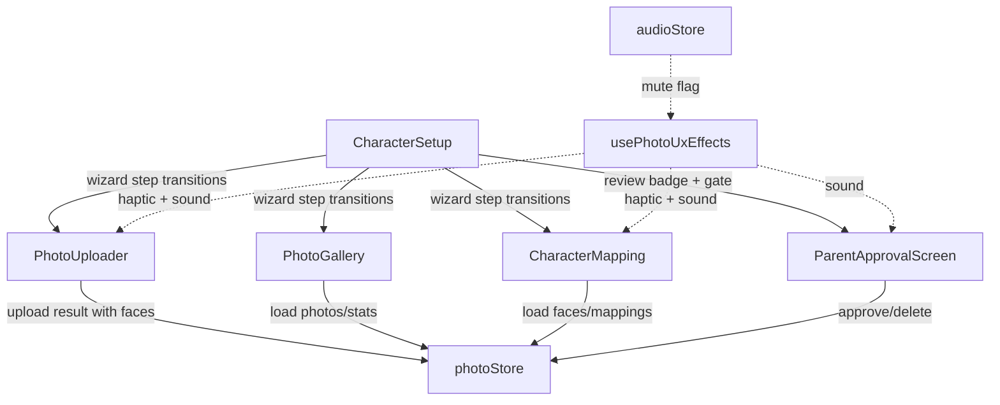

# Design Document: Photo UX Polish

## Overview

This design upgrades the family photo integration flow from functional placeholders to a premium, immersive experience for 6-year-old users. The work spans five existing files (`PhotoUploader.jsx`, `PhotoGallery.jsx`, `CharacterMapping.jsx`, `CharacterSetup.jsx`, `photoStore.js`) plus one new component (`ParentApprovalScreen.jsx`) and a shared utility module (`usePhotoUxEffects.js`).

Key changes:
- Replace all emoji placeholders (👤, 🖼️, ⏳) with real `` elements sourced from backend `file_path` and `crop_path`
- Add animated upload progress (CSS keyframe circular spinner → checkmark/error)
- Add confetti celebration overlay with face crop thumbnails on face detection
- Add CSS slide/fade transitions between CharacterSetup wizard steps and PhotoGallery grid↔detail
- Add haptic feedback (`navigator.vibrate`) on camera capture, drag-drop, and save
- Build a new `ParentApprovalScreen` with long-press parent gate, approve/reject actions
- Enhance drag-and-drop in CharacterMapping with elevation, glow targets, snap animation, and return-to-pool
- Add illustrated SVG empty states for PhotoGallery and CharacterMapping
- Overlay scaled bounding boxes on the photo detail view
- Integrate sound effects via the existing `audioFeedbackService` and `useAudioFeedback` hook, respecting the existing `audioFeedbackEnabled` mute toggle in `audioStore`

All changes are frontend-only. No backend modifications are needed — all required endpoints and data fields already exist.

## Architecture

### High-Level Component Interaction



### Design Decisions

1. **CSS-only animations**: All transitions use CSS `@keyframes` and `transition` properties — no JS frame-by-frame animation. This keeps 60fps on mobile and aligns with the existing `CharacterSetup.css` pattern.

2. **Shared effects hook (`usePhotoUxEffects`)**: A single custom hook encapsulates haptic pulse, sound effect playback, and mute-awareness. Components call `effects.haptic(ms)`, `effects.playShutter()`, etc. This avoids duplicating `navigator.vibrate` checks and `audioFeedbackEnabled` reads across four components.

3. **Existing audio infrastructure**: Sound effects route through the existing `audioFeedbackService` (Web Audio API oscillator-based). We extend it with new methods (`playShutter`, `playWhoosh`, `playSnap`, `playChime`) using distinct frequency/duration sequences. The existing `audioStore.audioFeedbackEnabled` flag serves as the global mute setting — no new store field needed.

4. **Image loading with fallback**: Every `` for face crops and photo thumbnails uses an `onError` handler that swaps to the original emoji placeholder. This satisfies the graceful degradation requirements without a separate error state.

5. **Parent gate via long-press**: The `ParentApprovalScreen` uses a 3-second `onPointerDown`/`onPointerUp` timer. No PIN, no math problem — just a hold gesture that a 6-year-old won't accidentally trigger but a parent can easily perform.

6. **Bounding box scaling**: The detail view renders face bounding boxes as absolutely positioned `<div>` overlays. Coordinates are converted from original image pixels to percentages (`left: bbox_x / naturalWidth * 100%`), so they scale automatically with the displayed image size.

7. **Inline styles preserved**: The existing components use inline style objects. We continue this pattern for consistency rather than introducing CSS modules or styled-components mid-feature.

## Components and Interfaces

### Modified Components

#### PhotoGallery.jsx

**New behavior:**
- Grid view: `` with `object-fit: cover`, 1:1 aspect ratio, `border-radius: 12px`, `onError` fallback to 🖼️
- Grid view: photos with `status === 'review'` get a semi-transparent amber overlay (`rgba(251,191,36,0.25)`)
- Detail view: `` for each face crop from `crop_path` instead of 👤 emoji, circular, min 48×48px, `onError` fallback to 👤
- Detail view: bounding box overlays as absolutely positioned divs using percentage-based coordinates
- Detail view: tapping a bounding box opens the face labeling form for that face
- Empty state: SVG illustration (camera with sparkles), min 120×120px, single-line prompt
- Grid↔detail transition: CSS scale-up/fade animation (300ms)

**New props:** none (data already available from existing fetch)

#### PhotoUploader.jsx

**New behavior:**
- Upload progress: animated CSS circular spinner replacing ⏳, transitions to ✓ on success or ✕ on error
- Celebration: confetti CSS animation (2s) with face crop thumbnails shown inside the overlay
- Haptic: short pulse on camera capture button tap; pattern pulse (100-50-100ms) on celebration
- Sound: shutter sound on camera tap; chime on celebration
- Buttons disabled during upload (confirm + retake)

**New props:** none

#### CharacterMapping.jsx

**New behavior:**
- Face chips: circular `` from `crop_path` (min 40×40px) instead of 👤, `onError` fallback
- Role slots: circular `` for assigned faces instead of text name
- Drag feedback: dragged chip scales 1.1× with drop shadow; valid target slot gets glowing border + scale-up
- Drop animation: spring ease-out snap (250ms) into slot
- Drop outside: chip animates back to pool position
- Haptic: pulse on drop onto slot (≤100ms); pulse on save tap (≤50ms)
- Sound: whoosh on drag start; snap on successful drop
- Empty state: SVG illustration (faces with arrows), min 120×120px, single-line prompt

**New props:** none (face `crop_path` already in photo data from API)

#### CharacterSetup.jsx

**New behavior:**
- Wizard step transitions: CSS slide-out/slide-in (350ms) replacing instant swap. Uses CSS class toggling with `animation-fade-in` extended to include directional variants.
- Review badge: notification dot on photos step when `review` count > 0 (fetched from stats endpoint)
- Parent approval access: long-press gate button visible when review photos exist

**New props:** none

#### photoStore.js

**New state fields:**
- `soundMuted`: removed — uses existing `audioStore.audioFeedbackEnabled` instead
- No new fields needed. The store already has `photos`, `stats`, `uploadResult`, `loading`, `error`.

**New actions:**
- `approvePhoto(photoId)`: calls `POST /api/photos/{photo_id}/approve`, updates local photo status to `safe`
- `deletePhoto(photoId)`: calls `DELETE /api/photos/{photo_id}`, removes photo from local array

### New Components

#### ParentApprovalScreen.jsx

**Purpose:** Dedicated screen for parents to review and approve/reject photos with `status === 'review'`.

**Props:**
- `siblingPairId: string` — identifies the sibling pair
- `onComplete: () => void` — callback when all reviews are done

**Behavior:**
- Parent gate: 3-second long-press button to enter. Visual progress ring fills during hold.
- Shows each pending photo as full-width preview with approve (✅) and reject (🗑️) buttons, each ≥ 48×48px
- Approve calls `POST /api/photos/{photo_id}/approve`, updates UI optimistically
- Reject calls `DELETE /api/photos/{photo_id}`, removes from UI
- When no pending photos remain, shows completion message with "Done" button calling `onComplete`

#### usePhotoUxEffects.js (custom hook)

**Purpose:** Shared hook for haptic and sound effects across photo components.

**Interface:**
```js
const effects = usePhotoUxEffects();

effects.haptic(durationMs)        // navigator.vibrate if supported
effects.hapticPattern([100,50,100]) // pattern vibration
effects.playShutter()             // camera click sound
effects.playChime()               // success celebration sound
effects.playWhoosh()              // drag pick-up sound
effects.playSnap()                // drop success sound
```

**Implementation:** Reads `audioStore.audioFeedbackEnabled` to gate sound playback. Calls `audioFeedbackService.playSequence()` with tuned frequency/duration configs. Haptic calls are independent of mute (vibration is not audio).

## Data Models

No new data models are introduced. All data comes from existing backend responses:

### Photo (from `GET /api/photos/{sibling_pair_id}`)
```
{
  photo_id: string,
  file_path: string,          // → 
  status: "safe" | "review" | "blocked",
  faces: [
    {
      face_id: string,
      crop_path: string,       // → 
      bbox_x: number,          // pixels in original image
      bbox_y: number,
      bbox_width: number,
      bbox_height: number,
      family_member_name: string | null
    }
  ]
}
```

### Image URL Construction
- Photo thumbnail: `${API_BASE}/photo_storage/${photo.file_path}`
- Face crop: `${API_BASE}/photo_storage/${face.crop_path}`

### Bounding Box Coordinate Mapping
The backend stores bounding boxes in original image pixel coordinates. The frontend converts to percentages for responsive overlay positioning:
```
left:   (bbox_x / imageNaturalWidth) * 100 + '%'
top:    (bbox_y / imageNaturalHeight) * 100 + '%'
width:  (bbox_width / imageNaturalWidth) * 100 + '%'
height: (bbox_height / imageNaturalHeight) * 100 + '%'
```
The `naturalWidth` and `naturalHeight` are read from the `` element's `onLoad` event.


## Correctness Properties

*A property is a characteristic or behavior that should hold true across all valid executions of a system — essentially, a formal statement about what the system should do. Properties serve as the bridge between human-readable specifications and machine-verifiable correctness guarantees.*

### Property 1: Real image src construction

*For any* photo with a `file_path` or face with a `crop_path`, the rendered `` element's `src` attribute SHALL equal `${API_BASE}/photo_storage/${path}`. This applies to gallery grid thumbnails (from `file_path`), face cards in the detail view (from `crop_path`), face chips in the Character_Mapper pool (from `crop_path`), and assigned faces in role slots (from `crop_path`).

**Validates: Requirements 1.1, 1.2, 1.3, 2.1**

### Property 2: Image load failure falls back to emoji

*For any* image element (photo thumbnail or face crop) that triggers an `onError` event, the component SHALL replace the broken image with the corresponding emoji placeholder (👤 for face crops, 🖼️ for photo thumbnails). The fallback SHALL be deterministic: face crops always fall back to 👤, photo thumbnails always fall back to 🖼️.

**Validates: Requirements 1.4, 1.5, 2.3**

### Property 3: Review photos display amber overlay

*For any* photo in the gallery grid with `status === 'review'`, the rendered thumbnail container SHALL include a semi-transparent amber tint overlay. *For any* photo with `status === 'safe'`, the thumbnail SHALL NOT include the amber overlay.

**Validates: Requirements 2.4**

### Property 4: Buttons disabled during upload

*For any* upload state where `uploading === true`, both the confirm button and the retake button SHALL have their `disabled` attribute set to `true`.

**Validates: Requirements 3.3**

### Property 5: Celebration overlay shows detected face crops

*For any* upload result containing N detected faces (N ≥ 1), the celebration overlay SHALL render exactly N `` elements, each with a `src` constructed from the corresponding face's `crop_path`.

**Validates: Requirements 4.2**

### Property 6: Haptic graceful degradation

*For any* component calling the haptic function, if `navigator.vibrate` is undefined, the call SHALL complete without throwing an error and without side effects.

**Validates: Requirements 6.4**

### Property 7: Review badge count matches pending photos

*For any* set of photos where K photos have `status === 'review'` (K >= 1), the notification badge on the photos wizard step SHALL display the number K. When K === 0, no badge SHALL be displayed.

**Validates: Requirements 7.1**

### Property 8: Approve and reject update local state

*For any* photo with `status === 'review'`, approving it SHALL change its local status to `'safe'` and it SHALL remain in the photo list. Rejecting it SHALL remove it from the local photo list entirely. In both cases, the UI SHALL update without a full page reload.

**Validates: Requirements 7.3, 7.4**

### Property 9: Bounding box overlay count matches face count

*For any* photo displayed in the detail view with N detected faces, the detail view SHALL render exactly N bounding box overlay elements.

**Validates: Requirements 10.1**

### Property 10: Bounding box percentage scaling

*For any* face bounding box with pixel coordinates (bbox_x, bbox_y, bbox_width, bbox_height) and any image with natural dimensions (naturalWidth, naturalHeight) where both are positive, the overlay's CSS position SHALL be computed as: `left = bbox_x / naturalWidth * 100%`, `top = bbox_y / naturalHeight * 100%`, `width = bbox_width / naturalWidth * 100%`, `height = bbox_height / naturalHeight * 100%`. This ensures overlays remain aligned at any display size.

**Validates: Requirements 10.4**

### Property 11: Tapping bounding box opens correct face label form

*For any* bounding box overlay corresponding to a face with `face_id` F, tapping that overlay SHALL open the face labeling form for face F. If face F has an existing `family_member_name`, the form input SHALL be pre-filled with that name.

**Validates: Requirements 10.3**

### Property 12: Mute suppresses all sound effects

*For any* sound effect invocation (shutter, chime, whoosh, snap) across all photo components, if `audioStore.audioFeedbackEnabled === false`, the sound SHALL NOT play. If `audioFeedbackEnabled === true`, the sound SHALL play.

**Validates: Requirements 11.5**

### Property 13: Drag elevation styling

*For any* Face_Chip that is currently being dragged (`draggedFace` is set to that face's ID), the chip element SHALL have elevated visual styles (increased scale and drop shadow) applied. *For any* Face_Chip not being dragged, the elevated styles SHALL NOT be applied.

**Validates: Requirements 8.1**

### Property 14: Invalid drop returns chip to pool

*For any* Face_Chip dropped outside all valid role slots, the chip SHALL not be assigned to any role, and the mappings state SHALL remain unchanged from before the drag began.

**Validates: Requirements 8.5**

### Property 15: Upload progress indicator shown during upload

*For any* upload state where `uploading === true`, the Photo_Uploader SHALL render an animated progress indicator element. When `uploading === false`, the progress indicator SHALL NOT be rendered.

**Validates: Requirements 3.1**

## Error Handling

| Scenario | Component | Behavior |
|---|---|---|
| Face crop image fails to load | PhotoGallery, CharacterMapping | `onError` handler hides ``, shows emoji fallback |
| Photo thumbnail fails to load | PhotoGallery | `onError` handler hides ``, shows emoji fallback |
| Upload network failure | PhotoUploader | Progress indicator transitions to error state, error bubble displayed, buttons re-enabled |
| Approve/reject API failure | ParentApprovalScreen | Optimistic update rolled back, error toast shown briefly |
| `navigator.vibrate` unsupported | usePhotoUxEffects | Feature-detect before calling; skip silently if absent |
| `AudioContext` creation fails | audioFeedbackService | Existing service sets `isEnabled = false`, all sound calls become no-ops |
| Bounding box coords invalid | PhotoGallery | Clamp percentages to 0-100% range to prevent overlays outside the image |
| Zero faces detected after upload | PhotoUploader | Skip celebration, show voice prompt, return to capture UI |
| Photo with `status === 'blocked'` | PhotoGallery | Filter out blocked photos client-side, do not render in grid |

## Testing Strategy

### Property-Based Testing

Library: **fast-check** (JavaScript property-based testing library for React/Vite projects)

Each correctness property above maps to a single property-based test. Tests run with a minimum of 100 iterations to cover diverse generated inputs.

Tag format for each test: `Feature: photo-ux-polish, Property {N}: {title}`

Property tests focus on:
- Generating random photo/face data objects with varying `file_path`, `crop_path`, `status`, `bbox_*` values, and `family_member_name`
- Generating random sets of photos with mixed statuses to test filtering and badge counts
- Generating random bounding box coordinates and image dimensions to test percentage scaling math
- Generating random drag-drop sequences to test mapping state invariants
- Generating random mute/unmute states to test sound suppression

### Unit Testing

Unit tests complement property tests by covering specific examples, edge cases, and integration points:

- **Edge cases**: empty photo list renders empty state SVG; single face detection triggers celebration; all photos approved shows completion message; bounding box at image edge (bbox_x + bbox_width === naturalWidth)
- **Integration**: approve button calls correct API endpoint with correct photo_id; reject button calls DELETE; parent gate timer fires after exactly 3 seconds
- **Specific examples**: camera button tap triggers haptic of 50ms or less; drop onto slot triggers haptic of 100ms or less; celebration triggers haptic pattern [100,50,100]; shutter sound plays on camera tap; chime plays on celebration
- **CSS verification**: grid thumbnails have `object-fit: cover` and `aspect-ratio: 1`; face crops are circular (border-radius 50%); touch targets at least 48x48px; empty state illustrations at least 120x120px

### Test Organization

```
frontend/src/features/setup/components/__tests__/
  PhotoGallery.property.test.jsx    -- Properties 1,2,3,9,10,11
  PhotoUploader.property.test.jsx   -- Properties 4,5,15
  CharacterMapping.property.test.jsx -- Properties 1,2,13,14
  ParentApproval.property.test.jsx  -- Properties 7,8
  usePhotoUxEffects.property.test.js -- Properties 6,12
  PhotoGallery.test.jsx             -- Unit tests for gallery
  PhotoUploader.test.jsx            -- Unit tests for uploader
  CharacterMapping.test.jsx         -- Unit tests for mapping
  ParentApprovalScreen.test.jsx     -- Unit tests for approval flow
```