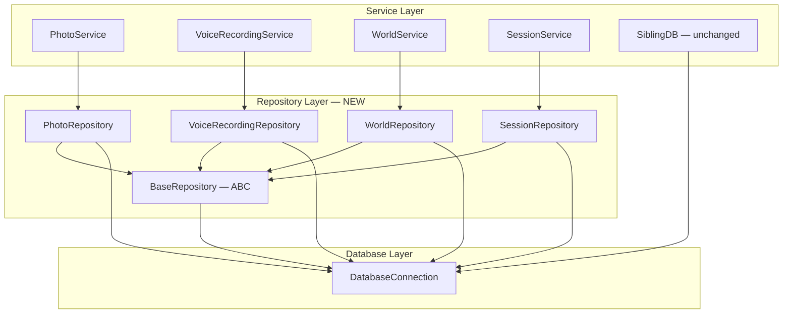
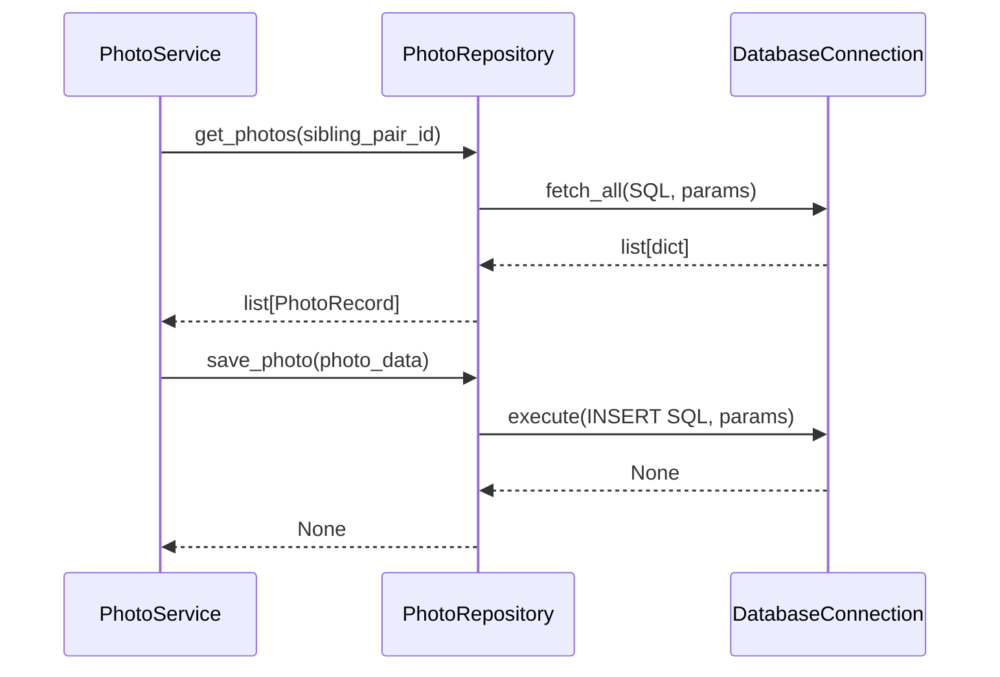
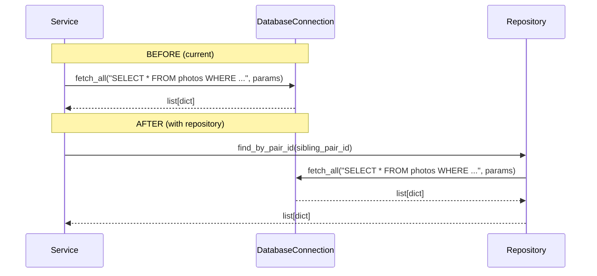

# Design Document: Repository Pattern

## Overview

The backend currently scatters raw SQL queries across service classes (PhotoService, VoiceRecordingService, WorldDB, SessionService). Each service directly calls `DatabaseConnection.fetch_all/execute`, mixing business logic with data access concerns. This makes testing harder, creates duplication, and couples services to SQL details.

This refactor introduces a Repository Pattern layer between services and the database. A base `Repository` abstract class provides common CRUD operations (`find_by_id`, `find_all`, `save`, `delete`). Concrete repositories (PhotoRepository, WorldRepository, VoiceRecordingRepository, SessionRepository) encapsulate all SQL for their respective tables. Services receive repositories via constructor injection instead of raw `DatabaseConnection`. SiblingDB is already well-structured and stays as-is.

This is a pure refactor — no new features, no schema changes, no new dependencies. All 610+ existing tests must continue to pass.

## Architecture



## Sequence Diagrams

### Service → Repository → Database Flow



### Migration Path — Before vs After



## Components and Interfaces

### Component 1: BaseRepository (Abstract Base Class)

**Purpose**: Defines the common CRUD contract all repositories implement. Holds the `DatabaseConnection` reference.

```python
from abc import ABC, abstractmethod
from typing import Any
from app.db.connection import DatabaseConnection


class BaseRepository(ABC):
    """Abstract base for all repositories. Receives DatabaseConnection via DI."""

    def __init__(self, db: DatabaseConnection) -> None:
        self._db = db

    @abstractmethod
    async def find_by_id(self, entity_id: str) -> dict | None:
        """Fetch a single entity by primary key."""
        ...

    @abstractmethod
    async def find_all(self, **filters: Any) -> list[dict]:
        """Fetch all entities, optionally filtered."""
        ...

    @abstractmethod
    async def save(self, entity: dict) -> None:
        """Insert or update an entity."""
        ...

    @abstractmethod
    async def delete(self, entity_id: str) -> bool:
        """Delete an entity by primary key. Returns True if deleted."""
        ...
```

**Responsibilities**:
- Hold `DatabaseConnection` reference
- Define CRUD contract
- Provide shared helper methods if needed (e.g., `_fetch_one`, `_fetch_all` wrappers)

### Component 2: PhotoRepository

**Purpose**: Encapsulates all SQL for `photos`, `face_portraits`, and `character_mappings` tables.

```python
class PhotoRepository(BaseRepository):
    """Data access for photos, face_portraits, and character_mappings tables."""

    # --- photos table ---
    async def find_by_id(self, photo_id: str) -> dict | None: ...
    async def find_all(self, sibling_pair_id: str | None = None, **filters) -> list[dict]: ...
    async def save(self, photo: dict) -> None: ...
    async def delete(self, photo_id: str) -> bool: ...
    async def update_status(self, photo_id: str, status: str) -> None: ...
    async def get_content_hash(self, photo_id: str) -> str | None: ...

    # --- face_portraits table ---
    async def find_faces_by_photo(self, photo_id: str) -> list[dict]: ...
    async def save_face(self, face: dict) -> None: ...
    async def delete_faces_by_photo(self, photo_id: str) -> None: ...
    async def update_face_label(self, face_id: str, name: str) -> None: ...
    async def find_face_with_pair(self, face_id: str) -> dict | None: ...
    async def get_face_content_hashes(self, photo_id: str) -> list[str]: ...

    # --- character_mappings table ---
    async def find_mappings(self, sibling_pair_id: str) -> list[dict]: ...
    async def find_mappings_by_face(self, face_id: str) -> list[dict]: ...
    async def save_mapping(self, mapping: dict) -> None: ...
    async def delete_mapping(self, sibling_pair_id: str, character_role: str) -> None: ...
    async def nullify_face_in_mappings(self, face_id: str) -> None: ...

    # --- style_transferred_portraits (read/delete only) ---
    async def find_style_portraits_by_face(self, face_id: str) -> list[dict]: ...
    async def delete_style_portraits_by_face(self, face_id: str) -> None: ...
    async def find_latest_style_portrait(self, face_id: str) -> dict | None: ...

    # --- aggregates ---
    async def get_storage_stats(self, sibling_pair_id: str) -> dict: ...
```

**Responsibilities**:
- All SQL for photo-related tables
- Row-to-dict conversion
- No business logic (no file I/O, no validation, no face extraction)

### Component 3: VoiceRecordingRepository

**Purpose**: Encapsulates all SQL for `voice_recordings` and `voice_recording_events` tables.

```python
class VoiceRecordingRepository(BaseRepository):
    """Data access for voice_recordings and voice_recording_events tables."""

    # --- voice_recordings table ---
    async def find_by_id(self, recording_id: str) -> dict | None: ...
    async def find_all(
        self,
        sibling_pair_id: str | None = None,
        message_type: str | None = None,
        recorder_name: str | None = None,
        **filters,
    ) -> list[dict]: ...
    async def save(self, recording: dict) -> None: ...
    async def delete(self, recording_id: str) -> bool: ...
    async def delete_all_by_pair(self, sibling_pair_id: str) -> None: ...
    async def count_by_pair(self, sibling_pair_id: str) -> int: ...
    async def count_by_type(self, sibling_pair_id: str, message_type: str) -> int: ...
    async def find_matching(
        self, sibling_pair_id: str, message_type: str, language: str
    ) -> dict | None: ...
    async def get_voice_commands(self, sibling_pair_id: str) -> list[dict]: ...
    async def get_cloning_stats(self, sibling_pair_id: str) -> list[dict]: ...

    # --- voice_recording_events table ---
    async def save_event(self, event: dict) -> None: ...
```

**Responsibilities**:
- All SQL for voice recording tables
- Dynamic query building for filtered listing
- No audio processing, no file I/O

### Component 4: WorldRepository

**Purpose**: Wraps existing WorldDB SQL behind the repository interface. WorldDB methods become thin delegates.

```python
class WorldRepository(BaseRepository):
    """Data access for world_locations, world_npcs, world_items tables."""

    # --- world_locations ---
    async def find_by_id(self, location_id: str) -> dict | None: ...
    async def find_all(self, sibling_pair_id: str | None = None, limit: int = 100, **filters) -> list[dict]: ...
    async def save(self, location: dict) -> None: ...
    async def delete(self, location_id: str) -> bool: ...
    async def save_location(self, sibling_pair_id: str, name: str, description: str, state: str = "discovered") -> str: ...
    async def update_location_state(self, location_id: str, new_state: str, new_description: str) -> None: ...

    # --- world_npcs ---
    async def save_npc(self, sibling_pair_id: str, name: str, description: str, relationship_level: int = 1) -> str: ...
    async def load_npcs(self, sibling_pair_id: str, limit: int = 100) -> list[dict]: ...
    async def update_npc_relationship(self, npc_id: str, relationship_level: int) -> None: ...

    # --- world_items ---
    async def save_item(self, sibling_pair_id: str, name: str, description: str, session_id: str) -> str: ...
    async def load_items(self, sibling_pair_id: str, limit: int = 100) -> list[dict]: ...

    # --- aggregate ---
    async def load_world_state(self, sibling_pair_id: str) -> dict: ...
```

**Responsibilities**:
- All SQL for world state tables (locations, NPCs, items)
- Location history tracking
- No game logic

### Component 5: SessionRepository

**Purpose**: Encapsulates all SQL for `session_snapshots` table.

```python
class SessionRepository(BaseRepository):
    """Data access for session_snapshots table."""

    async def find_by_id(self, snapshot_id: str) -> dict | None: ...
    async def find_all(self, sibling_pair_id: str | None = None, **filters) -> list[dict]: ...
    async def find_by_pair_id(self, sibling_pair_id: str) -> dict | None: ...
    async def save(self, snapshot: dict) -> None: ...
    async def delete(self, snapshot_id: str) -> bool: ...
    async def delete_by_pair_id(self, sibling_pair_id: str) -> bool: ...
    async def find_stale(self, threshold_iso: str) -> list[dict]: ...
    async def delete_stale(self, threshold_iso: str) -> int: ...
```

**Responsibilities**:
- All SQL for session snapshots
- No JSON serialization/deserialization (that stays in SessionService)

## Data Models

No new database tables or schema changes. The repositories operate on the existing tables:

| Repository | Tables |
|---|---|
| PhotoRepository | `photos`, `face_portraits`, `character_mappings`, `style_transferred_portraits` |
| VoiceRecordingRepository | `voice_recordings`, `voice_recording_events` |
| WorldRepository | `world_locations`, `world_location_history`, `world_npcs`, `world_items` |
| SessionRepository | `session_snapshots` |

Repositories accept and return plain `dict` objects — the same format `DatabaseConnection.fetch_all/fetch_one` already returns. Model conversion (dict → dataclass/Pydantic) stays in the service layer.

## Key Functions with Formal Specifications

### BaseRepository.find_by_id()

```python
async def find_by_id(self, entity_id: str) -> dict | None:
    """Fetch a single entity by primary key."""
```

**Preconditions:**
- `entity_id` is a non-empty string
- `self._db` is connected

**Postconditions:**
- Returns `dict` if entity exists, `None` otherwise
- No side effects on database state

### PhotoRepository.save()

```python
async def save(self, photo: dict) -> None:
    """Insert a photo record into the photos table."""
```

**Preconditions:**
- `photo` dict contains all required keys: `photo_id`, `sibling_pair_id`, `filename`, `file_path`, `file_size_bytes`, `width`, `height`, `status`, `uploaded_at`, `content_hash`
- `photo["photo_id"]` is unique

**Postconditions:**
- Row exists in `photos` table with matching values
- No other rows modified

### VoiceRecordingRepository.find_all()

```python
async def find_all(
    self,
    sibling_pair_id: str | None = None,
    message_type: str | None = None,
    recorder_name: str | None = None,
    **filters,
) -> list[dict]:
    """Fetch recordings with optional filters, ordered by recorder_name ASC, created_at ASC."""
```

**Preconditions:**
- At least `sibling_pair_id` should be provided for meaningful results
- Filter values are valid strings if provided

**Postconditions:**
- Returns list of dicts ordered by `recorder_name ASC, created_at ASC`
- Empty list if no matches
- No side effects

**Loop Invariants:**
- Dynamic SQL building: each filter appends exactly one `AND` clause and one param

## Algorithmic Pseudocode

### Service Migration Algorithm

```python
# BEFORE: PhotoService.get_photos() — SQL mixed into service
async def get_photos(self, sibling_pair_id: str) -> list[PhotoRecord]:
    rows = await self._db.fetch_all(
        "SELECT * FROM photos WHERE sibling_pair_id = ? ORDER BY uploaded_at ASC",
        (sibling_pair_id,),
    )
    # ... convert rows to PhotoRecord ...

# AFTER: PhotoService.get_photos() — delegates to repository
async def get_photos(self, sibling_pair_id: str) -> list[PhotoRecord]:
    rows = await self._photo_repo.find_all(sibling_pair_id=sibling_pair_id)
    # ... convert rows to PhotoRecord (same logic) ...
```

### Dynamic Filter Query Building (VoiceRecordingRepository)

```python
async def find_all(self, sibling_pair_id=None, message_type=None, recorder_name=None, **filters):
    sql = "SELECT * FROM voice_recordings WHERE 1=1"
    params: list = []

    if sibling_pair_id is not None:
        sql += " AND sibling_pair_id = ?"
        params.append(sibling_pair_id)
    if message_type is not None:
        sql += " AND message_type = ?"
        params.append(message_type)
    if recorder_name is not None:
        sql += " AND recorder_name = ?"
        params.append(recorder_name)

    sql += " ORDER BY recorder_name ASC, created_at ASC"
    return await self._db.fetch_all(sql, tuple(params))
```

## Example Usage

### Constructing services with repositories

```python
# In main.py or factory function
db = DatabaseConnection()
await db.connect()

photo_repo = PhotoRepository(db)
photo_service = PhotoService(
    photo_repo=photo_repo,
    content_scanner=scanner,
    face_extractor=extractor,
    storage_root="photo_storage",
)

voice_repo = VoiceRecordingRepository(db)
voice_service = VoiceRecordingService(
    voice_repo=voice_repo,
    audio_normalizer=normalizer,
    storage_root="voice_recordings",
)

world_repo = WorldRepository(db)
world_db = WorldDB(world_repo)  # WorldDB delegates to WorldRepository

session_repo = SessionRepository(db)
session_service = SessionService(session_repo)
```

### Testing with mock repository

```python
import pytest
from unittest.mock import AsyncMock

@pytest.fixture
def mock_photo_repo():
    repo = AsyncMock(spec=PhotoRepository)
    repo.find_all.return_value = [
        {"photo_id": "p1", "sibling_pair_id": "pair1", "filename": "test.jpg", ...}
    ]
    return repo

async def test_get_photos(mock_photo_repo):
    service = PhotoService(photo_repo=mock_photo_repo, ...)
    photos = await service.get_photos("pair1")
    mock_photo_repo.find_all.assert_called_once_with(sibling_pair_id="pair1")
    assert len(photos) == 1
```

## Correctness Properties

1. **Behavioral equivalence**: For every service method, the output before and after refactoring must be identical given the same database state and inputs.
2. **No SQL in services**: After migration, no service class (except SiblingDB) should contain raw SQL strings.
3. **Repository isolation**: Repositories only call `self._db` methods (`fetch_all`, `fetch_one`, `execute`). They never do file I/O, business validation, or call other services.
4. **Constructor injection**: Every repository receives `DatabaseConnection` in `__init__`. No repository creates its own connection.
5. **Test compatibility**: All 610+ existing tests pass without modification (or with minimal fixture updates for DI changes).

## Error Handling

### Error Scenario 1: Database Connection Failure

**Condition**: `DatabaseConnection` is not connected when repository method is called
**Response**: `DatabaseConnectionError` propagates up through repository to service to API handler
**Recovery**: Same as current behavior — FastAPI returns 500

### Error Scenario 2: Entity Not Found

**Condition**: `find_by_id` returns `None`
**Response**: Repository returns `None`; service raises domain-specific error (e.g., `PhotoNotFoundError`)
**Recovery**: API handler returns 404

### Error Scenario 3: Constraint Violation (duplicate key)

**Condition**: `save()` attempts to insert a row with duplicate primary key
**Response**: Database raises `IntegrityError`, propagates through repository
**Recovery**: Service handles via upsert pattern (ON CONFLICT) — same as current behavior

## Testing Strategy

### Unit Testing Approach

- Mock `DatabaseConnection` to test each repository method in isolation
- Verify correct SQL and params are passed to `fetch_all`/`fetch_one`/`execute`
- Test services with mocked repositories to verify delegation

### Property-Based Testing Approach

**Property Test Library**: Hypothesis (max_examples=20)

- **Round-trip property**: `save(entity)` then `find_by_id(entity.id)` returns equivalent data
- **Filter consistency**: `find_all(filter)` results all satisfy the filter predicate
- **Delete idempotency**: `delete(id)` then `delete(id)` — second call returns `False`

### Integration Testing Approach

- Existing 610+ tests serve as integration tests
- They exercise the full stack (service → repository → DatabaseConnection → SQLite)
- All must pass unchanged after refactoring

## Performance Considerations

- No performance impact expected — repositories add one function call layer with zero overhead
- SQL queries remain identical
- No new database connections or connection pooling changes
- No new allocations beyond the repository objects themselves (created once at startup)

## Security Considerations

- No new attack surface — repositories use parameterized queries (same `?` placeholders)
- No raw string interpolation in SQL
- Same input validation in service layer

## Dependencies

- No new external dependencies
- Uses only: `abc` (stdlib), `app.db.connection.DatabaseConnection` (existing)
- SiblingDB remains unchanged — no dependency on repository layer
