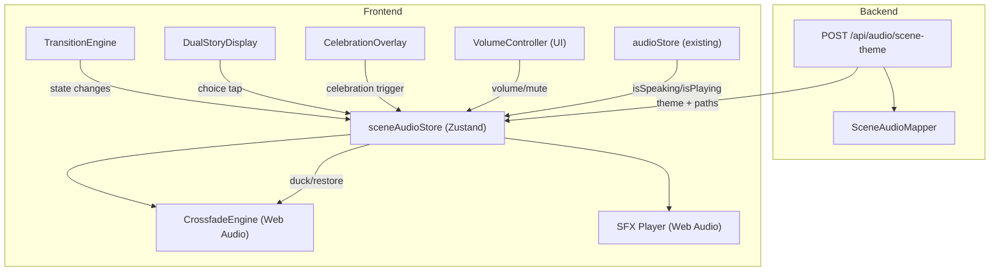

# Design Document: Scene Audio System

## Overview

The Scene Audio System adds immersive ambient soundscapes, UI sound effects, and smooth audio crossfades to Twin Spark Chronicles. It spans both the Python/FastAPI backend (keyword-based scene-to-audio mapping) and the React/Zustand frontend (Web Audio API playback, crossfade engine, volume controls, and integration with the existing TransitionEngine and audioStore).

The backend introduces a `SceneAudioMapper` service that analyzes scene description text via keyword matching and returns an `AudioTheme` identifier plus asset paths. The frontend introduces a `sceneAudioStore` (Zustand) that manages ambient loops and sound effects through the Web Audio API, a `CrossfadeEngine` module for smooth ambient transitions, and a `VolumeController` component embedded in the existing ParentControls panel.

Key design decisions:
- **Web Audio API** for ambient/SFX playback — enables precise gain control, mixing, and independence from the HTML `<audio>` elements used by `audioStore.js` for TTS/voice recordings.
- **Keyword matching** on the backend rather than LLM inference — keeps mapping latency under 50ms and avoids API costs per scene.
- **Zustand store** (`sceneAudioStore`) separate from the existing `audioStore` — clean separation of concerns; the two stores coordinate via subscription (ducking, reset).
- **CSS-first, no heavy audio libraries** — audio nodes are created directly via `AudioContext`; no Howler.js or Tone.js dependency.

## Architecture



### Data Flow

1. Backend generates a story beat → orchestrator calls `SceneAudioMapper.map_scene(description)` → returns `AudioThemeResult` with theme ID, ambient track path, and optional SFX paths.
2. The story beat response includes `audio_theme` data alongside narration/image.
3. Frontend `sceneAudioStore` receives the theme, preloads the ambient track via `fetch` + `AudioContext.decodeAudioData`.
4. `TransitionEngine` state changes (`preparing` → `animating` → `idle`) drive crossfade timing and SFX triggers.
5. `audioStore` subscription triggers ducking when TTS or voice recordings play.

## Components and Interfaces

### Backend

#### SceneAudioMapper (`backend/app/services/scene_audio_mapper.py`)

```python
class AudioThemeResult(BaseModel):
    theme: str                    # e.g. "forest", "ocean", "castle"
    ambient_track: str            # e.g. "/audio/ambient/forest.mp3"
    sound_effects: list[str]      # e.g. ["/audio/sfx/birds.mp3"]

class SceneAudioMapper:
    THEME_KEYWORDS: dict[str, list[str]]  # configurable mapping
    THEME_TRACKS: dict[str, str]          # theme → ambient path
    THEME_SFX: dict[str, list[str]]       # theme → supplementary SFX
    DEFAULT_THEME: str = "village"

    def map_scene(self, scene_description: str) -> AudioThemeResult:
        """Keyword-match scene_description to an AudioTheme.
        Returns default 'village' theme when no keywords match."""
```

The keyword dictionary maps theme names to lists of keywords:
```python
THEME_KEYWORDS = {
    "forest": ["forest", "tree", "wood", "jungle", "leaf", "branch", "grove"],
    "ocean": ["ocean", "sea", "wave", "beach", "water", "ship", "sail", "island"],
    "castle": ["castle", "throne", "knight", "tower", "dungeon", "king", "queen", "fortress"],
    "space": ["space", "star", "planet", "rocket", "galaxy", "moon", "asteroid", "cosmos"],
    "village": ["village", "town", "market", "house", "farm", "garden", "shop"],
    "cave": ["cave", "underground", "crystal", "tunnel", "mine", "dark", "echo"],
}
```

Matching algorithm: lowercase the description, count keyword hits per theme, return the theme with the highest count. Ties broken by order in the dictionary. No match → `"village"`.

#### API Endpoint (`POST /api/audio/scene-theme`)

Request:
```json
{ "scene_description": "The twins enter a dark crystal cave..." }
```

Response (200):
```json
{
  "theme": "cave",
  "ambient_track": "/audio/ambient/cave.mp3",
  "sound_effects": ["/audio/sfx/drip.mp3"]
}
```

Error (422 — missing/empty description):
```json
{ "detail": "scene_description is required and must be non-empty" }
```

### Frontend

#### sceneAudioStore (`frontend/src/stores/sceneAudioStore.js`)

Zustand store managing all scene audio state:

```javascript
{
  // State
  audioContext: AudioContext | null,
  ambientGainNode: GainNode | null,
  sfxGainNode: GainNode | null,
  currentTheme: string | null,
  isAmbientPlaying: boolean,
  ambientVolume: number,        // 0–100, persisted
  sfxVolume: number,            // 0–100, persisted
  isMuted: boolean,             // persisted
  audioUnlocked: boolean,       // browser autoplay gate
  isDucking: boolean,
  preloadCache: Map<string, AudioBuffer>,  // theme → decoded buffer

  // Actions
  initAudio: () => void,              // create AudioContext on user gesture
  unlockAudio: () => void,            // resume AudioContext after tap
  setAmbientVolume: (v: number) => void,
  setSfxVolume: (v: number) => void,
  toggleMute: () => void,
  playAmbient: (theme: string, trackUrl: string) => void,
  stopAmbient: () => void,
  crossfadeTo: (theme: string, trackUrl: string, durationMs?: number) => void,
  playSfx: (category: string) => void, // "choice_select" | "page_turn" | "celebration"
  preloadTrack: (theme: string, url: string) => void,
  preloadAllSfx: () => void,
  duckAmbient: (level: number) => void,   // 0.0–1.0
  restoreAmbient: (durationMs?: number) => void,
  reset: () => void,
}
```

Volume/mute settings persisted via Zustand `persist` middleware to `localStorage` key `"scene-audio-storage"`.

#### CrossfadeEngine (internal to sceneAudioStore)

Not a separate class — implemented as internal functions within the store using Web Audio API `GainNode.gain.linearRampToValueAtTime`:

- Two `AudioBufferSourceNode` instances: outgoing and incoming.
- Outgoing gain ramps from current → 0 over `durationMs` (default 2000ms).
- Incoming gain ramps from 0 → target over `durationMs`.
- Combined volume capped at configured ambient volume (no clipping).
- If interrupted by a new crossfade, the outgoing source is stopped immediately and the new crossfade begins from the incoming source.

#### SFX Player (internal to sceneAudioStore)

Sound effects are pre-decoded `AudioBuffer` objects played via one-shot `AudioBufferSourceNode` instances routed through `sfxGainNode`. Multiple SFX can overlap (fire-and-forget pattern).

Pre-bundled SFX categories:
- `choice_select` — short whoosh/sparkle (~200ms)
- `page_turn` — paper/magic sweep (~400ms)
- `celebration` — fanfare/chime (~800ms)

#### VolumeController (`frontend/src/components/VolumeController.jsx`)

Rendered inside the existing `ParentControls` panel as a new `<section>`:

```jsx
<section className="pc-section">
  <h3 className="pc-label">Scene Audio</h3>
  <label>Ambient Volume</label>
  <input type="range" min={0} max={100} step={5}
         aria-label="Ambient audio volume"
         aria-valuemin={0} aria-valuemax={100} />
  <label>Sound Effects Volume</label>
  <input type="range" min={0} max={100} step={5}
         aria-label="Sound effects volume"
         aria-valuemin={0} aria-valuemax={100} />
  <button aria-label="Mute all scene audio">
    {isMuted ? '🔇' : '🔊'} Mute Scene Audio
  </button>
</section>
```

- Sliders: `min-height: 56px` touch targets, keyboard operable (arrow keys increment by 5).
- Mute toggle: announces state to screen readers via `aria-pressed`.
- Does NOT affect TTS or voice recording volume in `audioStore`.

#### Integration Points

**TransitionEngine integration** — `TransitionEngine.jsx` will call `sceneAudioStore` actions at state transitions:
- `preparing` → `preloadTrack(theme, url)` + `duckAmbient(0.6)` (duck to 60%)
- `animating` → `crossfadeTo(theme, url)` + `playSfx('page_turn')`
- `idle` (after transition) → `restoreAmbient(500)`
- Reduced-motion instant swap → instant audio swap (no crossfade, no SFX)

**DualStoryDisplay integration** — choice card `onClick` calls `playSfx('choice_select')`.

**CelebrationOverlay integration** — when overlay mounts, calls `playSfx('celebration')`.

**audioStore coordination** — `sceneAudioStore` subscribes to `audioStore`:
- When `isSpeaking` or `isPlayingVoiceRecording` becomes `true` → `duckAmbient(0.3)` (30%)
- When both become `false` → `restoreAmbient(500)` (restore over 500ms)
- When `audioStore.reset()` is called → `sceneAudioStore.reset()` also fires.

**prefers-reduced-motion** — when active:
- No crossfades (instant swap)
- No transition SFX (`page_turn` skipped)
- Ambient audio still plays (it's not a motion animation)

**Browser autoplay** — `AudioContext` created in `suspended` state. On first user interaction (tap/click), `audioContext.resume()` is called. Until then, a "🔊 Tap to hear sounds" prompt is shown.

## Data Models

### Backend Models

```python
# Pydantic models in backend/app/models/audio_theme.py

class SceneThemeRequest(BaseModel):
    scene_description: str = Field(..., min_length=1)

class AudioThemeResult(BaseModel):
    theme: str
    ambient_track: str
    sound_effects: list[str] = []
```

### Frontend State Shape

```typescript
// sceneAudioStore state (TypeScript-style for clarity)
interface SceneAudioState {
  audioContext: AudioContext | null;
  ambientGainNode: GainNode | null;
  sfxGainNode: GainNode | null;
  currentTheme: string | null;
  currentSource: AudioBufferSourceNode | null;
  isAmbientPlaying: boolean;
  ambientVolume: number;       // 0–100
  sfxVolume: number;           // 0–100
  isMuted: boolean;
  audioUnlocked: boolean;
  isDucking: boolean;
  preloadCache: Record<string, AudioBuffer>;
}
```

### Audio Asset Paths

Static audio files served from `frontend/public/audio/`:

```
public/audio/
├── ambient/
│   ├── forest.mp3
│   ├── ocean.mp3
│   ├── castle.mp3
│   ├── space.mp3
│   ├── village.mp3
│   └── cave.mp3
└── sfx/
    ├── choice_select.mp3
    ├── page_turn.mp3
    └── celebration.mp3
```

Backend `THEME_TRACKS` maps theme → `/audio/ambient/{theme}.mp3`. These are relative URLs resolved by the frontend.


## Correctness Properties

*A property is a characteristic or behavior that should hold true across all valid executions of a system — essentially, a formal statement about what the system should do. Properties serve as the bridge between human-readable specifications and machine-verifiable correctness guarantees.*

### Property 1: Scene mapping always produces a valid result

*For any* non-empty string used as a scene description, `map_scene` shall return an `AudioThemeResult` where `theme` is one of the six known themes, `ambient_track` is a non-empty string, and `sound_effects` is a (possibly empty) list of strings.

**Validates: Requirements 2.1, 2.5, 8.2**

### Property 2: Keyword matching selects the correct theme

*For any* theme in the keyword dictionary and *for any* keyword belonging to that theme, a scene description consisting solely of that keyword shall map to that theme.

**Validates: Requirements 2.2**

### Property 3: No-match descriptions default to village

*For any* non-empty string that contains none of the keywords from any theme in the dictionary, `map_scene` shall return the theme `"village"`.

**Validates: Requirements 2.3**

### Property 4: Theme-to-track round-trip consistency

*For any* non-empty scene description, the `ambient_track` in the result of `map_scene(description)` shall equal `THEME_TRACKS[map_scene(description).theme]`. That is, the track path is always consistent with the resolved theme.

**Validates: Requirements 8.5**

### Property 5: Crossfade gain sum does not exceed configured volume

*For any* configured ambient volume `v` (0–100) and *for any* crossfade progress `t` in [0, 1], the sum of the outgoing gain `v * (1 - t)` and the incoming gain `v * t` shall not exceed `v`.

**Validates: Requirements 4.3**

### Property 6: Same theme produces no crossfade

*For any* theme string, if the current active theme equals the incoming theme, the crossfade engine shall not initiate a crossfade (the current source continues uninterrupted).

**Validates: Requirements 4.5**

### Property 7: Ducking calculation correctness

*For any* configured ambient volume `v` (0–100) and *for any* duck level `d` in (0, 1], the ducked volume shall equal `v * d`. After restoring, the volume shall return to `v`.

**Validates: Requirements 6.4, 10.1, 10.2, 10.3**

### Property 8: Volume settings persistence round-trip

*For any* ambient volume (0–100), SFX volume (0–100), and mute state (boolean), serializing these settings to the persistence format and deserializing them shall produce identical values.

**Validates: Requirements 5.4**

### Property 9: Audio cache is bounded

*For any* sequence of N distinct theme loads where N > 10, the cache size shall never exceed 10 entries. Additionally, the most recently loaded themes shall be present in the cache.

**Validates: Requirements 9.3, 9.5**

### Property 10: Reset clears all scene audio state

*For any* scene audio store state (with arbitrary volume, theme, mute, and cache values), calling `reset` shall return the store to its initial state with `currentTheme` null, `isAmbientPlaying` false, and `preloadCache` empty.

**Validates: Requirements 10.5**

### Property 11: Null description preserves current theme

*For any* active theme, if a new story beat arrives with a null or missing scene description, the `currentTheme` shall remain unchanged.

**Validates: Requirements 1.3**

### Property 12: Mute isolation from audioStore

*For any* scene audio mute toggle action, the `audioStore` state (ttsEnabled, ttsVolume, isPlayingVoiceRecording) shall remain unchanged.

**Validates: Requirements 5.3**

## Error Handling

| Scenario | Behavior |
|---|---|
| Ambient track fails to load (network/404) | Log warning, set `isAmbientPlaying: false`, continue story without ambient audio. No user-facing error. |
| SFX file fails to load | Skip silently. `playSfx` is fire-and-forget; failure does not block UI interaction. |
| `AudioContext` creation fails (unsupported browser) | Set `audioUnlocked: false`, log error. All `playSfx`/`playAmbient` calls become no-ops. Story continues without audio. |
| Browser blocks autoplay | `AudioContext` stays `suspended`. Show "🔊 Tap to hear sounds" prompt. On first user gesture, call `audioContext.resume()`. |
| Preload timeout (>5000ms) | `AbortController` cancels the fetch. Track is not cached. Playback proceeds without that track. |
| Backend `scene_description` empty/missing | Return 422 with `{"detail": "scene_description is required and must be non-empty"}`. |
| Backend keyword matching finds no match | Return default theme `"village"` — never an error. |
| Crossfade interrupted by rapid scene changes | Cancel in-progress crossfade (stop outgoing source immediately), begin new crossfade to latest theme. |
| `sceneAudioStore.reset()` called during active playback | Stop all sources, disconnect nodes, clear cache, reset state to initial values. |
| Cache eviction when at 10-track limit | Evict least-recently-used entry before inserting new track. |

## Testing Strategy

### Unit Tests

Unit tests cover specific examples, edge cases, and integration points:

- **SceneAudioMapper**: Test each of the 6 themes with a representative description. Test empty string returns 422. Test a description with no matching keywords returns "village". Test a description with keywords from multiple themes returns the one with the most hits.
- **AudioThemeResult Pydantic model**: Test serialization/deserialization. Test validation rejects missing fields.
- **API endpoint**: Integration test with FastAPI TestClient for 200 and 422 responses.
- **sceneAudioStore**: Test initial state has `audioUnlocked: false`, `currentTheme: null`. Test `toggleMute` flips `isMuted`. Test `reset` returns to initial state.
- **VolumeController**: Test sliders render with correct `aria-label` attributes. Test mute button has `aria-pressed`.
- **Cache eviction**: Test that loading 11 distinct themes results in cache size of 10 with the oldest evicted.

### Property-Based Tests

Property-based tests verify universal properties across randomized inputs. Each test references its design document property.

**Backend (Python — Hypothesis, max_examples=20):**

- **Property 1**: Generate arbitrary non-empty strings → verify `map_scene` returns valid `AudioThemeResult` with theme in known set.
  Tag: `Feature: scene-audio-system, Property 1: Scene mapping always produces a valid result`

- **Property 2**: Generate (theme, keyword) pairs from the dictionary → verify `map_scene(keyword)` returns that theme.
  Tag: `Feature: scene-audio-system, Property 2: Keyword matching selects the correct theme`

- **Property 3**: Generate strings from alphabet excluding all keyword characters → verify result theme is "village".
  Tag: `Feature: scene-audio-system, Property 3: No-match descriptions default to village`

- **Property 4**: Generate arbitrary non-empty strings → verify `result.ambient_track == THEME_TRACKS[result.theme]`.
  Tag: `Feature: scene-audio-system, Property 4: Theme-to-track round-trip consistency`

**Frontend (JavaScript — fast-check, numRuns: 20):**

- **Property 5**: Generate volume (0–100) and progress t (0–1) → verify `outGain + inGain <= volume`.
  Tag: `Feature: scene-audio-system, Property 5: Crossfade gain sum does not exceed configured volume`

- **Property 7**: Generate volume (0–100) and duck level (0–1) → verify ducked volume equals `volume * level`.
  Tag: `Feature: scene-audio-system, Property 7: Ducking calculation correctness`

- **Property 8**: Generate volume (0–100), sfxVolume (0–100), muted (boolean) → serialize → deserialize → verify equality.
  Tag: `Feature: scene-audio-system, Property 8: Volume settings persistence round-trip`

- **Property 9**: Generate sequence of 5–15 distinct theme strings → verify cache size ≤ 10 after all loads.
  Tag: `Feature: scene-audio-system, Property 9: Audio cache is bounded`

Each property-based test runs a minimum of 20 iterations (configured via `max_examples=20` for Hypothesis, `numRuns: 20` for fast-check). Each test file includes a comment tag referencing the design property it validates.

**Libraries:**
- Backend: `hypothesis` (already in use in the project)
- Frontend: `fast-check` (lightweight, zero-dependency PBT library for JS)
