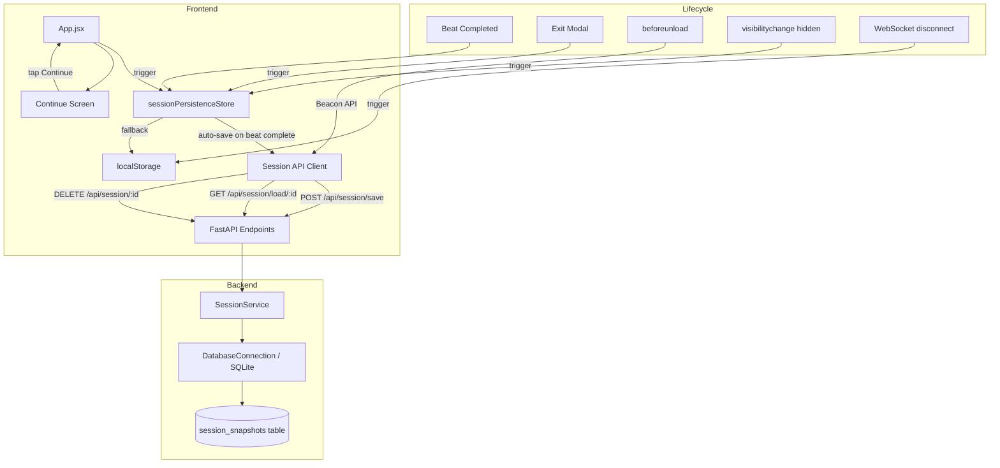

# Design Document: Session Resumption

## Overview

Session Resumption enables sibling pairs to save their story progress and return later to continue where they left off. Currently, closing the browser destroys all in-flight state — character profiles, story beats, scene images, and world context. This feature introduces a full-stack persistence layer: a `session_snapshots` SQLite table (via the existing migration runner), a `SessionService` backend service (following the `WorldDB` pattern), REST API endpoints, a frontend `sessionPersistenceStore` Zustand store, and a child-friendly "Continue Screen" UI that lets 6-year-old twins resume their adventure with a single tap.

The design prioritizes reliability over complexity: one active snapshot per sibling pair, upsert-on-save semantics, auto-save on beat completion, and graceful fallback to `localStorage` when the server is unreachable.

## Architecture



### Key Design Decisions

1. **One snapshot per sibling pair** — Simplifies the model. The `sibling_pair_id` column has a UNIQUE index; saves use INSERT ... ON CONFLICT UPDATE (upsert). No need for a "slot" picker UI for 6-year-olds.

2. **Follow the WorldDB pattern** — `SessionService` takes a `DatabaseConnection`, uses `?` placeholders, and delegates schema creation to the migration runner. This keeps the codebase consistent.

3. **JSON columns for nested state** — `character_profiles`, `story_history`, `current_beat`, and `session_metadata` are stored as JSON TEXT columns. This avoids schema coupling to the evolving story beat shape.

4. **Auto-save is fire-and-forget** — Save operations run asynchronously and never block story progression. The store tracks status (`idle` | `saving` | `saved` | `error`) for optional UI feedback.

5. **Beacon API for unload** — `navigator.sendBeacon` is the only reliable way to fire a request during `beforeunload`. The payload is a JSON blob sent to `/api/session/save`.

6. **localStorage as fallback, not primary** — Server is the source of truth. localStorage is only used when the server is unreachable, and is synced back on next successful connection.

7. **30-day TTL cleanup** — A background task on app startup deletes snapshots not updated in 30 days, preventing unbounded DB growth.

## Components and Interfaces

### Backend

#### `SessionService` (backend/app/services/session_service.py)

Follows the `WorldDB` pattern — constructor takes `DatabaseConnection`, all methods are async.

```python
class SessionService:
    def __init__(self, db: DatabaseConnection) -> None: ...

    async def save_snapshot(self, snapshot: dict) -> dict:
        """Upsert a session snapshot. Returns {id, updated_at}."""

    async def load_snapshot(self, sibling_pair_id: str) -> dict | None:
        """Load the active snapshot for a sibling pair, or None."""

    async def delete_snapshot(self, sibling_pair_id: str) -> bool:
        """Delete the active snapshot. Returns True if a row was deleted."""

    async def cleanup_stale(self, max_age_days: int = 30) -> int:
        """Delete snapshots older than max_age_days. Returns count deleted."""
```

#### FastAPI Endpoints (added to backend/app/main.py)

| Method | Path | Request Body | Response |
|--------|------|-------------|----------|
| POST | `/api/session/save` | `SessionSnapshot` JSON | `{id, updated_at}` 200 / 422 / 500 |
| GET | `/api/session/load/{sibling_pair_id}` | — | `SessionSnapshot` 200 / 404 |
| DELETE | `/api/session/{sibling_pair_id}` | — | `{deleted: true}` 200 / 404 |

#### Pydantic Models (validation)

```python
class SessionSnapshotPayload(BaseModel):
    sibling_pair_id: str
    character_profiles: dict
    story_history: list
    current_beat: dict | None = None
    session_metadata: dict

class SessionSnapshotResponse(BaseModel):
    id: str
    sibling_pair_id: str
    character_profiles: dict
    story_history: list
    current_beat: dict | None
    session_metadata: dict
    created_at: str
    updated_at: str
```

### Frontend

#### `sessionPersistenceStore` (frontend/src/stores/sessionPersistenceStore.js)

A new Zustand store dedicated to save/load lifecycle. Separate from the existing `sessionStore` (which manages WebSocket connection state).

```javascript
{
  // State
  saveStatus: 'idle',        // 'idle' | 'saving' | 'saved' | 'error'
  availableSession: null,    // loaded snapshot metadata or null
  isRestoring: false,
  lastSaveError: null,

  // Actions
  saveSnapshot: async () => {},       // reads from setup/story/session stores, POSTs to API
  loadSnapshot: async (siblingPairId) => {},  // GETs from API, sets availableSession
  restoreSession: async () => {},     // hydrates setup/story/session stores from availableSession
  deleteSession: async (siblingPairId) => {}, // DELETEs via API
  saveToLocalStorage: () => {},       // fallback persist
  restoreFromLocalStorage: () => {},  // fallback restore
  syncLocalToServer: async () => {},  // push localStorage snapshot to server
}
```

#### `ContinueScreen` (frontend/src/features/session/components/ContinueScreen.jsx)

Displayed on the landing screen (after privacy + language) when `availableSession` is non-null.

- Shows last scene image as background
- Sibling names + spirit animal icons
- Large animated "Continue Story" button (sparkle/glow CSS)
- Secondary "New Adventure" button with confirmation prompt
- Welcoming greeting: "Welcome back, {name1} & {name2}"
- Plays a short welcoming sound cue on mount
- Minimal text — visual-first for 6-year-olds

#### Auto-Save Integration (in App.jsx)

- On `story.completeBeat()` → trigger `sessionPersistenceStore.saveSnapshot()`
- On Exit Modal save → trigger `saveSnapshot()` before disconnect
- On `beforeunload` → `navigator.sendBeacon('/api/session/save', payload)`
- On `visibilitychange` (hidden) → trigger `saveSnapshot()`
- On WebSocket disconnect → `saveToLocalStorage()`

### Migration

#### `003_session_snapshots.sql` (backend/app/db/migrations/)

```sql
CREATE TABLE IF NOT EXISTS session_snapshots (
    id TEXT PRIMARY KEY,
    sibling_pair_id TEXT NOT NULL,
    character_profiles TEXT NOT NULL,
    story_history TEXT NOT NULL,
    current_beat TEXT,
    session_metadata TEXT NOT NULL,
    created_at TEXT NOT NULL,
    updated_at TEXT NOT NULL
);

CREATE UNIQUE INDEX IF NOT EXISTS idx_session_snapshots_pair
    ON session_snapshots(sibling_pair_id);
```

## Data Models

### Session Snapshot (database row)

| Column | Type | Constraints | Description |
|--------|------|-------------|-------------|
| `id` | TEXT | PRIMARY KEY | UUID v4 |
| `sibling_pair_id` | TEXT | NOT NULL, UNIQUE INDEX | Sorted pair ID, e.g. `"Ale:Sofi"` |
| `character_profiles` | TEXT (JSON) | NOT NULL | Serialized character data for both siblings |
| `story_history` | TEXT (JSON) | NOT NULL | Array of completed beats with narration, perspectives, scene image URLs, choices made |
| `current_beat` | TEXT (JSON) | nullable | The in-progress beat (if any) |
| `session_metadata` | TEXT (JSON) | NOT NULL | `{language, story_beat_count, last_choice_made, session_duration_seconds}` |
| `created_at` | TEXT | NOT NULL | ISO 8601 timestamp |
| `updated_at` | TEXT | NOT NULL | ISO 8601 timestamp |

### character_profiles JSON shape

```json
{
  "c1_name": "Ale",
  "c1_gender": "boy",
  "c1_personality": "brave",
  "c1_spirit": "Dragon",
  "c1_toy": "Bruno",
  "c2_name": "Sofi",
  "c2_gender": "girl",
  "c2_personality": "wise",
  "c2_spirit": "Owl",
  "c2_toy": "Book"
}
```

### story_history JSON shape

```json
[
  {
    "narration": "The forest whispered secrets...",
    "child1_perspective": "Ale saw a glowing path...",
    "child2_perspective": "Sofi heard a melody...",
    "scene_image_url": "/generated/scene_001.png",
    "choices": ["Follow the light", "Listen to the melody"],
    "choiceMade": "Follow the light",
    "timestamp": "2025-01-15T10:30:00Z"
  }
]
```

### session_metadata JSON shape

```json
{
  "language": "en",
  "story_beat_count": 5,
  "last_choice_made": "Follow the light",
  "session_duration_seconds": 1200
}
```

### Snapshot Assembly (frontend → API)

The snapshot is assembled by reading from three existing stores:

| Source Store | Data Extracted |
|-------------|---------------|
| `setupStore` | `child1`, `child2`, `language` → `character_profiles` + `session_metadata.language` |
| `storyStore` | `history`, `currentBeat`, `currentAssets` → `story_history`, `current_beat` |
| `sessionStore` | `profiles`, `sessionId` → cross-reference and `sibling_pair_id` derivation |

The `sibling_pair_id` is derived as: `[c1_name, c2_name].sort().join(':')`.


## Correctness Properties

*A property is a characteristic or behavior that should hold true across all valid executions of a system — essentially, a formal statement about what the system should do. Properties serve as the bridge between human-readable specifications and machine-verifiable correctness guarantees.*

### Property 1: Save/Load Round-Trip

*For any* valid `SessionSnapshot` object (with arbitrary character profiles, story history of 0–50 beats, optional current beat, and valid session metadata), saving it via `SessionService.save_snapshot()` then loading it via `SessionService.load_snapshot()` with the same `sibling_pair_id` shall produce an equivalent `SessionSnapshot` — all JSON fields (`character_profiles`, `story_history`, `current_beat`, `session_metadata`) shall be deeply equal, and `id`, `created_at`, `updated_at` shall be non-empty strings.

**Validates: Requirements 1.1, 1.2, 5.1, 5.2, 5.4, 5.8**

### Property 2: Upsert Preserves One Snapshot Per Pair

*For any* `sibling_pair_id` and any sequence of N valid snapshots (N ≥ 2) saved for that pair, after all saves complete, loading the snapshot for that `sibling_pair_id` shall return exactly the data from the last saved snapshot, and querying the database shall show exactly one row for that `sibling_pair_id`.

**Validates: Requirements 1.3, 1.4, 6.3**

### Property 3: Save Status State Machine

*For any* save operation (successful or failed), the `sessionPersistenceStore.saveStatus` shall transition from `'idle'` → `'saving'` → `'saved'` (on success) or `'idle'` → `'saving'` → `'error'` (on failure). At no point shall the status skip the `'saving'` intermediate state.

**Validates: Requirements 2.7**

### Property 4: Delete Then Load Returns Nothing

*For any* `sibling_pair_id` with a previously saved snapshot, calling `SessionService.delete_snapshot(sibling_pair_id)` then `SessionService.load_snapshot(sibling_pair_id)` shall return `None` (or HTTP 404 at the API level).

**Validates: Requirements 5.3**

### Property 5: Invalid Payload Rejection

*For any* JSON payload missing one or more required fields (`sibling_pair_id`, `character_profiles`, `story_history`, `session_metadata`), the save endpoint shall return HTTP 422 and the database shall remain unchanged (no partial writes).

**Validates: Requirements 5.6**

### Property 6: Continue Screen Displays Snapshot Preview Data

*For any* valid `SessionSnapshot` with non-empty `character_profiles` (containing `c1_name`, `c2_name`, `c1_spirit`, `c2_spirit`) and non-empty `story_history` (containing at least one beat with a `scene_image_url`), the Continue Screen component shall render output containing both sibling names, both spirit animal references, the last scene image URL from the story history, and a greeting string containing both names.

**Validates: Requirements 4.1, 4.2, 4.8**

### Property 7: Migration Idempotency

*For any* database state (empty or with existing data in `session_snapshots`), running the `003_session_snapshots.sql` migration shall not raise an error and shall not delete or modify existing rows in the table.

**Validates: Requirements 6.4**

### Property 8: Stale Session Cleanup Precision

*For any* set of session snapshots with varying `updated_at` timestamps, calling `SessionService.cleanup_stale(max_age_days=30)` shall delete exactly those snapshots whose `updated_at` is more than 30 days in the past, and shall leave all other snapshots untouched.

**Validates: Requirements 8.2**

### Property 9: Session-Ending Events Delete Snapshot

*For any* `sibling_pair_id` with an existing snapshot, when a session-ending event occurs (new adventure started or story completed), calling `SessionService.delete_snapshot(sibling_pair_id)` followed by `SessionService.load_snapshot(sibling_pair_id)` shall return `None`.

**Validates: Requirements 8.1, 8.3**

### Property 10: Frontend Store Round-Trip

*For any* valid combination of `SetupStore` state (child1, child2, language, isComplete=true), `StoryStore` state (history with 0–50 beats, currentBeat), and `SessionStore` state (profiles, sessionId), serializing these stores into a `SessionSnapshot`, then restoring from that snapshot shall produce equivalent state in all three stores — `SetupStore.isComplete` shall be `true`, `SetupStore.currentStep` shall be `"complete"`, `StoryStore.history` shall be deeply equal, and `SessionStore.profiles` shall be deeply equal.

**Validates: Requirements 9.1, 9.2, 9.3, 9.6**

## Error Handling

### Backend Errors

| Scenario | Handling | HTTP Code |
|----------|----------|-----------|
| Invalid/incomplete snapshot payload | Pydantic validation rejects, returns field-level errors | 422 |
| Database write failure | Catch exception, log, return generic error | 500 |
| Snapshot not found on load | Return `{error: "No session found"}` | 404 |
| Snapshot not found on delete | Return `{error: "No session found"}` | 404 |
| Corrupted JSON in database | Catch `json.JSONDecodeError`, log, delete corrupt row, return 404 | 404 |

### Frontend Errors

| Scenario | Handling |
|----------|----------|
| Save API fails | Retry once after 2s delay. If retry fails, fall back to `localStorage`. Update `saveStatus` to `'error'`. |
| Load API fails | Fall back to `localStorage` snapshot if available. If neither exists, proceed to normal setup flow. |
| Corrupted snapshot (unparseable JSON) | Discard snapshot, log error, present normal setup flow. |
| Both server and localStorage save fail | Display child-friendly warning icon (no text-heavy error). |
| WebSocket disconnect during session | Immediately save to `localStorage`. On reconnect, sync to server. |
| `beforeunload` fires | Use `navigator.sendBeacon()` — fire-and-forget, no retry possible. |
| `visibilitychange` to hidden | Trigger async save to server (best-effort). |

### Child-Friendly Error UX

All error states visible to children use icons/animations rather than text:
- Save error: subtle pulsing cloud icon with a small "?" — no text
- Connection lost: animated disconnected plug icon
- Restore failed: gentle redirect to character setup with a "Let's start a new adventure" animation

## Testing Strategy

### Property-Based Testing

Library: **Hypothesis** (Python, backend) and **fast-check** (JavaScript, frontend)

Each property test must:
- Run a minimum of 100 iterations
- Reference its design property in a comment tag
- Use the format: `# Feature: session-resumption, Property {N}: {title}`

#### Backend Property Tests (Hypothesis)

| Property | Test Description | Generator Strategy |
|----------|-----------------|-------------------|
| P1: Save/Load Round-Trip | Generate random valid snapshots, save, load, assert deep equality | `st.text()` for names, `st.lists()` for history beats, `st.dictionaries()` for metadata |
| P2: Upsert Invariant | Generate N snapshots for same pair, save all, load once, assert last wins | Fixed `sibling_pair_id`, `st.lists(min_size=2)` of snapshots |
| P4: Delete Then Load | Generate snapshot, save, delete, load, assert None | Same as P1 generator |
| P5: Invalid Payload Rejection | Generate payloads with random fields removed | `st.fixed_dictionaries()` with `st.one_of(st.just(None), st.text())` for optional removal |
| P7: Migration Idempotency | Run migration, insert data, run migration again, assert data unchanged | Pre-seeded rows + migration re-run |
| P8: Stale Cleanup Precision | Generate snapshots with random ages (1–60 days), run cleanup, assert correct partition | `st.datetimes()` for `updated_at` |
| P9: Session-Ending Delete | Generate snapshot, save, delete (simulating end event), load, assert None | Same as P4 — logically equivalent at the service layer |

Note: P9 is logically equivalent to P4 at the `SessionService` level (both test delete-then-load). The distinction matters at the integration level where the trigger differs. A single property test covers both.

#### Frontend Property Tests (fast-check)

| Property | Test Description | Generator Strategy |
|----------|-----------------|-------------------|
| P3: Save Status State Machine | Mock API (success/failure), trigger save, record status transitions, assert valid sequence | `fc.boolean()` for success/failure |
| P6: Continue Screen Preview | Generate random profiles + story history, render component, assert presence of names/spirits/image/greeting | `fc.record()` for profiles, `fc.array()` for beats |
| P10: Frontend Store Round-Trip | Generate random store states, serialize to snapshot, restore, assert deep equality | `fc.record()` for each store's shape |

### Unit Tests (Examples & Edge Cases)

#### Backend Unit Tests (pytest)

- Save with all fields populated → verify 200 response shape
- Load non-existent pair → verify 404
- Save with missing `sibling_pair_id` → verify 422
- Save with empty `story_history` (new session, no beats yet) → verify success
- Corrupted JSON in DB row → verify graceful handling
- Cleanup with no stale sessions → verify 0 deleted
- Migration run on fresh DB → verify table exists
- Migration run on DB with existing data → verify data preserved

#### Frontend Unit Tests (Vitest)

- `ContinueScreen` renders "Continue Story" button when session available
- `ContinueScreen` renders "New Adventure" button
- "New Adventure" shows confirmation dialog before delete
- `ContinueScreen` plays welcome sound on mount
- `beforeunload` handler calls `navigator.sendBeacon`
- WebSocket disconnect triggers `localStorage` save
- Restore from `localStorage` when server returns 404
- Auto-save triggers on `story.completeBeat()`
- Retry logic: first failure triggers retry, second failure triggers localStorage fallback
