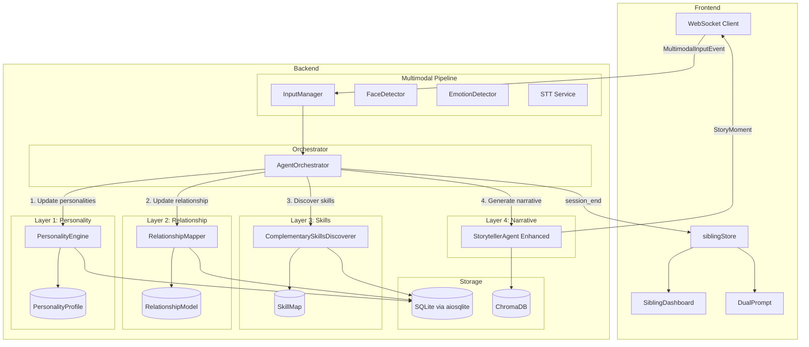

# Design Document: Sibling Dynamics Engine

## Overview

The Sibling Dynamics Engine adds a 4-layer intelligence system to TwinSpark Chronicles that models individual child personalities, maps sibling relationship dynamics, discovers complementary skills, and generates adaptive narratives informed by all three lower layers. It integrates into the existing FastAPI + WebSocket backend by extending the `AgentOrchestrator` pipeline and adding new Pydantic models, service classes, and a structured SQLite persistence layer alongside the existing ChromaDB memory store.

The engine processes `MultimodalInputEvent` data already flowing through the pipeline — emotions from MediaPipe, transcripts from Google Cloud STT — and routes it through the new layers before it reaches the `StorytellerAgent`. On the frontend, a new Zustand store (`siblingStore`) exposes sibling dynamics state, and updated components render dual-child prompts and parent insight summaries.

### Key Design Decisions

1. **SQLite for structured data, ChromaDB for memories**: Personality profiles, relationship models, and skill maps are relational and need exact-match queries (load by child ID, update specific fields). SQLite via `aiosqlite` handles this cleanly. ChromaDB continues to handle vector-similarity story memory retrieval.

2. **Service classes, not agents**: The Personality Engine, Relationship Mapper, and Complementary Skills Discoverer are stateless service classes (not LLM-backed agents). They apply deterministic logic to update structured data. Only the Narrative Generator layer enhances the existing LLM-backed `StorytellerAgent`.

3. **Orchestrator-driven pipeline**: The existing `AgentOrchestrator.process_multimodal_event` method is extended to call the new layers in sequence. No new WebSocket endpoints are needed — the data flows through the same `/ws/{session_id}` connection.

4. **Temporal decay via exponential weighting**: Personality trait updates use exponential moving average (EMA) with configurable alpha, satisfying the "weight recent observations higher" requirement without complex windowing.

## Architecture



### Pipeline Flow (per MultimodalInputEvent)

1. `InputManager.fuse()` produces a `MultimodalInputEvent` (unchanged)
2. `AgentOrchestrator.process_multimodal_event()` receives the event
3. **Layer 1**: `PersonalityEngine.update(event, child_id)` — updates each child's `PersonalityProfile` with emotion and transcript signals
4. **Layer 2**: `RelationshipMapper.update(event, profiles)` — updates `RelationshipModel` with leadership, cooperation, conflict, and synchrony metrics
5. **Layer 3**: `ComplementarySkillsDiscoverer.evaluate(profiles, relationship)` — re-evaluates `SkillMap` if threshold conditions are met
6. **Layer 4**: Enhanced `StorytellerAgent.generate_story_segment()` receives the enriched context (profiles + relationship + skill map) and produces a `StoryMoment`
7. Orchestrator sends the `StoryMoment` back via WebSocket

Steps 3–5 are skipped when the event has no usable data (Requirement 11.4).

## Components and Interfaces

### Backend Services (New)

#### PersonalityEngine (`backend/app/services/personality_engine.py`)

```python
class PersonalityEngine:
    def __init__(self, db: SiblingDB): ...

    async def update_from_event(
        self, child_id: str, event: MultimodalInputEvent
    ) -> PersonalityProfile:
        """Update a child's profile from a multimodal event. Returns updated profile."""

    async def record_choice(
        self, child_id: str, choice: str, theme: str
    ) -> PersonalityProfile:
        """Record a story choice and update preferred themes."""

    async def load_profile(self, child_id: str) -> PersonalityProfile:
        """Load from SQLite. Returns default 'emerging' profile if not found."""

    async def persist_profile(self, child_id: str, profile: PersonalityProfile) -> None:
        """Write profile to SQLite."""

    def _apply_temporal_decay(
        self, current: float, new_signal: float, alpha: float = 0.3
    ) -> float:
        """EMA update: result = alpha * new_signal + (1 - alpha) * current"""

    def _analyze_transcript(self, text: str) -> dict[str, float]:
        """Extract personality signals from transcript text.
        Returns dict of trait_name -> signal_strength."""
```

#### RelationshipMapper (`backend/app/services/relationship_mapper.py`)

```python
class RelationshipMapper:
    def __init__(self, db: SiblingDB): ...

    async def update_from_event(
        self,
        event: MultimodalInputEvent,
        profiles: tuple[PersonalityProfile, PersonalityProfile],
    ) -> RelationshipModel:
        """Update relationship metrics from a multimodal event."""

    async def record_shared_choice(
        self, initiator_child_id: str, follower_child_id: str, cooperative: bool
    ) -> RelationshipModel:
        """Record which child initiated a shared choice and whether it was cooperative."""

    async def record_conflict(self, session_id: str) -> RelationshipModel:
        """Record a conflict event (two consecutive disagreements)."""

    async def compute_session_score(self, session_id: str) -> float:
        """Compute Sibling_Dynamics_Score: mean(leadership_balance_centered, cooperation, synchrony)."""

    async def generate_summary(self, session_id: str) -> str:
        """Generate 2-3 sentence plain-language summary of session dynamics."""

    async def load_model(self, sibling_pair_id: str) -> RelationshipModel:
        """Load from SQLite. Returns default model if not found."""

    async def persist_model(self, sibling_pair_id: str, model: RelationshipModel) -> None:
        """Write model to SQLite."""

    def _apply_cross_session_decay(self, model: RelationshipModel, factor: float = 0.9) -> RelationshipModel:
        """Apply decay factor to historical metrics at session start."""
```

#### ComplementarySkillsDiscoverer (`backend/app/services/skills_discoverer.py`)

```python
class ComplementarySkillsDiscoverer:
    def __init__(self, db: SiblingDB): ...

    async def evaluate(
        self,
        profiles: tuple[PersonalityProfile, PersonalityProfile],
        interaction_count: int,
    ) -> SkillMap | None:
        """Re-evaluate skill map. Returns None if profiles lack sufficient confidence.
        Only re-evaluates every 10 interaction events."""

    def _find_complementary_pairs(
        self,
        profile_a: PersonalityProfile,
        profile_b: PersonalityProfile,
    ) -> list[ComplementaryPair]:
        """Identify pairs where one child's strength (>0.7) meets the other's growth area (<0.4)."""

    async def check_growth(
        self, child_id: str, current: PersonalityProfile
    ) -> list[str]:
        """Return trait names where score improved by >=0.2 since first observation."""

    async def load_skill_map(self, sibling_pair_id: str) -> SkillMap | None:
        """Load from SQLite."""

    async def persist_skill_map(self, sibling_pair_id: str, skill_map: SkillMap) -> None:
        """Write to SQLite."""
```

#### SiblingDB (`backend/app/services/sibling_db.py`)

```python
class SiblingDB:
    """Async SQLite wrapper for sibling dynamics structured data."""

    def __init__(self, db_path: str = "./sibling_data.db"): ...

    async def initialize(self) -> None:
        """Create tables if they don't exist."""

    async def save_profile(self, child_id: str, profile_json: str) -> None: ...
    async def load_profile(self, child_id: str) -> str | None: ...
    async def save_relationship(self, pair_id: str, model_json: str) -> None: ...
    async def load_relationship(self, pair_id: str) -> str | None: ...
    async def save_skill_map(self, pair_id: str, skill_map_json: str) -> None: ...
    async def load_skill_map(self, pair_id: str) -> str | None: ...
    async def save_session_summary(self, session_id: str, pair_id: str, score: float, summary: str) -> None: ...
    async def load_session_summaries(self, pair_id: str, limit: int = 10) -> list[dict]: ...
```

### Backend Models (New) — `backend/app/models/sibling.py`

See Data Models section below for full Pydantic definitions.

### Orchestrator Changes (`backend/app/agents/orchestrator.py`)

The `AgentOrchestrator.__init__` gains references to the three new services. `process_multimodal_event` is extended to call them in sequence before generating the story. A new method `end_session` handles persistence and score computation.

```python
# New methods on AgentOrchestrator
async def process_sibling_event(
    self, event: MultimodalInputEvent, child1_id: str, child2_id: str,
    characters: Dict, language: str = "en"
) -> Dict:
    """Extended pipeline: personality → relationship → skills → narrative."""

async def end_session(self, session_id: str, sibling_pair_id: str) -> dict:
    """Persist profiles, compute Sibling_Dynamics_Score, generate summary."""
```

### StorytellerAgent Enhancement

The existing `_build_prompt` method is extended to accept optional `personality_context`, `relationship_context`, and `skill_map_context` kwargs. These are injected into the Gemini prompt as structured sections so the LLM can adapt the narrative.

New prompt sections added:
- `PERSONALITY INSIGHTS:` — each child's dominant traits, fears, preferred themes
- `RELATIONSHIP DYNAMICS:` — leadership balance, cooperation score, recent conflicts
- `COMPLEMENTARY SKILLS:` — active complementary pairs and suggested scenario types
- `NARRATIVE DIRECTIVES:` — specific instructions (e.g., "let Child B lead", "introduce cooperative challenge")

### API Changes (`backend/app/main.py`)

New REST endpoints:
- `GET /api/sessions/{session_id}/sibling-summary` — returns `Sibling_Dynamics_Score` and plain-language summary
- `POST /api/sessions/{session_id}/end` — triggers `end_session` flow

The WebSocket handler is updated to call `process_sibling_event` instead of `process_multimodal_event` when sibling mode is active.

### Frontend Changes

#### New Store: `siblingStore.js`

```javascript
// State
siblingDynamicsScore: null,       // 0.0-1.0
sessionSummary: null,             // plain-language string
parentSuggestion: null,           // string or null
childRoles: { child1: null, child2: null }, // current prompt roles
waitingForChild: null,            // child ID if one hasn't responded

// Actions
setSiblingScore(score)
setSessionSummary(summary)
setParentSuggestion(suggestion)
setChildRoles(roles)
setWaitingForChild(childId)
reset()
```

#### Updated Components

- **DualPrompt** (new): Renders interactive prompts addressing both children by name with distinct roles. Shows a gentle nudge after 15s if one child hasn't responded.
- **SiblingDashboard** (new): Parent-facing panel showing `Sibling_Dynamics_Score` trend, session summary, and optional suggestions.
- **DualStoryDisplay** (updated): Integrates with `siblingStore` to show which child is the current protagonist and render role-specific prompt text.

## Data Models

### PersonalityProfile

```python
class TraitScore(BaseModel):
    value: float = Field(ge=0.0, le=1.0, default=0.5)
    confidence: float = Field(ge=0.0, le=1.0, default=0.0)
    observation_count: int = Field(ge=0, default=0)

class PersonalityProfile(BaseModel):
    child_id: str
    # Trait dimensions (Req 2.1)
    curiosity: TraitScore = Field(default_factory=TraitScore)
    boldness: TraitScore = Field(default_factory=TraitScore)
    empathy: TraitScore = Field(default_factory=TraitScore)
    creativity: TraitScore = Field(default_factory=TraitScore)
    patience: TraitScore = Field(default_factory=TraitScore)
    humor: TraitScore = Field(default_factory=TraitScore)

    # Preferences (Req 2.2, 2.3)
    preferred_themes: list[str] = Field(default_factory=list)
    fears: list[str] = Field(default_factory=list)

    # Meta
    status: str = Field(default="emerging")  # "emerging" | "established"
    total_interactions: int = Field(ge=0, default=0)
    first_observed: str = Field(default="")  # ISO 8601
    last_updated: str = Field(default="")    # ISO 8601
    created_at: str = Field(default="")      # ISO 8601

    def is_emerging(self) -> bool:
        return self.total_interactions < 5

    def trait_dict(self) -> dict[str, TraitScore]:
        return {
            "curiosity": self.curiosity,
            "boldness": self.boldness,
            "empathy": self.empathy,
            "creativity": self.creativity,
            "patience": self.patience,
            "humor": self.humor,
        }

    def high_confidence_count(self) -> int:
        return sum(1 for t in self.trait_dict().values() if t.confidence > 0.5)
```

### RelationshipModel

```python
class ConflictEvent(BaseModel):
    timestamp: str
    session_id: str
    description: str = ""

class RelationshipModel(BaseModel):
    sibling_pair_id: str
    child1_id: str
    child2_id: str

    # Metrics (Req 3.2, 3.4, 3.6)
    leadership_balance: float = Field(ge=0.0, le=1.0, default=0.5)
    cooperation_score: float = Field(ge=0.0, le=1.0, default=0.5)
    emotional_synchrony: float = Field(ge=0.0, le=1.0, default=0.5)

    # Tracking
    conflict_events: list[ConflictEvent] = Field(default_factory=list)
    total_shared_choices: int = Field(ge=0, default=0)
    consecutive_disagreements: int = Field(ge=0, default=0)

    # Meta
    last_updated: str = Field(default="")
    created_at: str = Field(default="")

    def is_leadership_imbalanced(self) -> bool:
        """Req 3.3: deviation > 0.3 from midpoint."""
        return abs(self.leadership_balance - 0.5) > 0.3

    def is_low_cooperation(self) -> bool:
        """Req 7.3: cooperation below 0.3."""
        return self.cooperation_score < 0.3

    def sibling_dynamics_score(self) -> float:
        """Req 9.1: equal-weighted composite."""
        centered_leadership = 1.0 - abs(self.leadership_balance - 0.5) * 2
        return (centered_leadership + self.cooperation_score + self.emotional_synchrony) / 3.0
```

### SkillMap

```python
class ComplementaryPair(BaseModel):
    strength_holder_id: str
    growth_area_holder_id: str
    trait_dimension: str
    strength_score: float = Field(ge=0.0, le=1.0)
    growth_score: float = Field(ge=0.0, le=1.0)
    suggested_scenario: str = ""

class SkillMap(BaseModel):
    sibling_pair_id: str
    complementary_pairs: list[ComplementaryPair] = Field(default_factory=list)
    last_evaluated_at: str = Field(default="")
    interaction_count_at_evaluation: int = Field(ge=0, default=0)

    def has_pairs(self) -> bool:
        return len(self.complementary_pairs) > 0
```

### StoryMoment (extended)

```python
class StoryMoment(BaseModel):
    text: str
    timestamp: str
    characters: dict
    interactive: dict
    # New fields for sibling dynamics
    protagonist_child_id: str | None = None
    child_roles: dict[str, str] = Field(default_factory=dict)  # child_id -> role description
    addresses_both: bool = False
    narrative_directives_used: list[str] = Field(default_factory=list)
```

### SQLite Schema

```sql
CREATE TABLE IF NOT EXISTS personality_profiles (
    child_id TEXT PRIMARY KEY,
    profile_json TEXT NOT NULL,
    created_at TEXT NOT NULL,
    updated_at TEXT NOT NULL
);

CREATE TABLE IF NOT EXISTS relationship_models (
    sibling_pair_id TEXT PRIMARY KEY,
    model_json TEXT NOT NULL,
    created_at TEXT NOT NULL,
    updated_at TEXT NOT NULL
);

CREATE TABLE IF NOT EXISTS skill_maps (
    sibling_pair_id TEXT PRIMARY KEY,
    skill_map_json TEXT NOT NULL,
    evaluated_at TEXT NOT NULL
);

CREATE TABLE IF NOT EXISTS session_summaries (
    session_id TEXT PRIMARY KEY,
    sibling_pair_id TEXT NOT NULL,
    score REAL NOT NULL,
    summary TEXT NOT NULL,
    suggestion TEXT,
    created_at TEXT NOT NULL
);

CREATE TABLE IF NOT EXISTS initial_profiles (
    child_id TEXT PRIMARY KEY,
    profile_json TEXT NOT NULL,
    created_at TEXT NOT NULL
);
```


## Correctness Properties

*A property is a characteristic or behavior that should hold true across all valid executions of a system — essentially, a formal statement about what the system should do. Properties serve as the bridge between human-readable specifications and machine-verifiable correctness guarantees.*

### Property 1: PersonalityProfile serialization round-trip

*For any* valid `PersonalityProfile`, serializing it to JSON and then deserializing the JSON back should produce an equivalent `PersonalityProfile` object.

**Validates: Requirements 10.1, 10.3, 10.5, 1.4**

### Property 2: RelationshipModel serialization round-trip

*For any* valid `RelationshipModel`, serializing it to JSON and then deserializing the JSON back should produce an equivalent `RelationshipModel` object.

**Validates: Requirements 10.2, 10.4, 10.6**

### Property 3: Model bounds invariant

*For any* valid `PersonalityProfile`, all trait `value` and `confidence` fields must be in [0.0, 1.0]. *For any* valid `RelationshipModel`, `leadership_balance`, `cooperation_score`, and `emotional_synchrony` must each be in [0.0, 1.0]. *For any* valid `TraitScore`, `observation_count` must be >= 0.

**Validates: Requirements 2.4, 3.2, 3.4**

### Property 4: Emerging profile threshold

*For any* `PersonalityProfile` with `total_interactions < 5`, `is_emerging()` should return `True` and `status` should be `"emerging"`. *For any* profile with `total_interactions >= 5`, `is_emerging()` should return `False`.

**Validates: Requirements 2.5**

### Property 5: Temporal decay weighting

*For any* sequence of trait signals applied via `_apply_temporal_decay`, the final value should be closer to the most recent signal than to the earliest signal. Specifically, for EMA with alpha in (0, 1), applying signal `s_new` to current value `v` yields `alpha * s_new + (1 - alpha) * v`, which is always between `v` and `s_new`.

**Validates: Requirements 1.5**

### Property 6: Profile independence

*For any* two distinct child IDs and any `MultimodalInputEvent`, updating child A's profile should not change child B's profile. The profile loaded for child B before and after child A's update should be identical.

**Validates: Requirements 1.3**

### Property 7: Personality update from events

*For any* `MultimodalInputEvent` containing emotion data and any existing `PersonalityProfile`, calling `update_from_event` should modify at least one trait score in the profile. The `total_interactions` count should increase by 1.

**Validates: Requirements 1.1, 1.2, 11.2**

### Property 8: Leadership balance shift from shared choices

*For any* `RelationshipModel` and any sequence of `record_shared_choice` calls where child A is always the initiator, the `leadership_balance` should shift toward the extreme (away from 0.5) in the direction of child A.

**Validates: Requirements 3.1**

### Property 9: Leadership imbalance detection

*For any* `leadership_balance` value in [0.0, 1.0], `is_leadership_imbalanced()` returns `True` if and only if `abs(leadership_balance - 0.5) > 0.3`.

**Validates: Requirements 3.3**

### Property 10: Conflict detection from consecutive disagreements

*For any* `RelationshipModel`, calling `record_shared_choice` with `cooperative=False` twice consecutively should result in a new `ConflictEvent` being appended to `conflict_events`. A single disagreement followed by a cooperative choice should not produce a conflict event.

**Validates: Requirements 3.5**

### Property 11: Emotional synchrony from emotion pairs

*For any* pair of simultaneous emotion readings, if both children exhibit the same emotion, `emotional_synchrony` should increase (or stay at 1.0). If they exhibit different emotions, it should decrease (or stay at 0.0).

**Validates: Requirements 3.6**

### Property 12: Skill map generation threshold

*For any* pair of `PersonalityProfile`s, `ComplementarySkillsDiscoverer.evaluate()` returns a non-None `SkillMap` if and only if both profiles have `high_confidence_count() >= 3`.

**Validates: Requirements 4.1**

### Property 13: Complementary pair identification

*For any* two `PersonalityProfile`s where at least one trait has child A's score > 0.7 and child B's score < 0.4 (or vice versa), `_find_complementary_pairs` should return at least one `ComplementaryPair` with the correct strength holder and growth area holder.

**Validates: Requirements 4.2**

### Property 14: Skill map re-evaluation interval

*For any* `SkillMap` with `interaction_count_at_evaluation = N`, calling `evaluate()` with `interaction_count < N + 10` should return the existing skill map unchanged. Calling with `interaction_count >= N + 10` should trigger re-evaluation.

**Validates: Requirements 4.4**

### Property 15: Complementary pair structure completeness

*For any* `ComplementaryPair` in a `SkillMap`, `strength_holder_id`, `growth_area_holder_id`, `trait_dimension`, and `suggested_scenario` must all be non-empty strings.

**Validates: Requirements 4.5**

### Property 16: Narrative directives reflect active conditions

*For any* combination of `RelationshipModel` state (imbalanced leadership, conflict events, low cooperation) and `SkillMap` (with complementary pairs) and `PersonalityProfile` (with fears), the generated narrative directives should include: (a) a "let less-active child lead" directive when leadership is imbalanced, (b) a "cooperative challenge" directive when conflict is detected or cooperation is low, (c) a "teaching scenario" directive when complementary pairs exist, (d) avoidance instructions for each known fear, and (e) a "soften tone" directive when either child's emotion is sad or scared.

**Validates: Requirements 5.2, 5.3, 5.4, 7.1, 7.2, 7.3**

### Property 17: Protagonist alternation

*For any* sequence of story moments generated for a sibling pair, the `protagonist_child_id` should alternate between child 1 and child 2 across consecutive moments.

**Validates: Requirements 5.5**

### Property 18: Dual-child prompt addressing with distinct roles

*For any* interactive prompt generated for a sibling pair with names N1 and N2, the prompt text should contain both N1 and N2, and the `child_roles` dict should map each child to a different role string.

**Validates: Requirements 6.1, 6.2**

### Property 19: Neglected child featuring

*For any* sequence of 3 or more consecutive story moments where a child's name does not appear as `protagonist_child_id`, the next generated directive should include an instruction to feature that child prominently.

**Validates: Requirements 7.5**

### Property 20: Cross-session metric decay

*For any* `RelationshipModel` with metrics `(l, c, s)`, applying `_apply_cross_session_decay` with factor 0.9 should produce metrics `(0.5 + 0.9*(l-0.5), 0.9*c, 0.9*s)` — leadership decays toward 0.5, cooperation and synchrony decay toward 0.

**Validates: Requirements 8.3**

### Property 21: Growth detection

*For any* child whose current trait score exceeds the initial trait score by 0.2 or more on any dimension, `check_growth` should return that trait dimension in its result list. If no trait improved by >= 0.2, the result should be empty.

**Validates: Requirements 8.4**

### Property 22: Sibling dynamics score formula

*For any* valid `RelationshipModel`, `sibling_dynamics_score()` should equal `((1.0 - abs(leadership_balance - 0.5) * 2) + cooperation_score + emotional_synchrony) / 3.0`, and the result should be in [0.0, 1.0].

**Validates: Requirements 9.1**

### Property 23: Score drop suggestion trigger

*For any* two consecutive session scores where the current score is more than 0.2 below the previous score, the session summary output should include a non-empty `suggestion` field. When the drop is <= 0.2, `suggestion` should be `None`.

**Validates: Requirements 9.4**

### Property 24: Transcript analysis produces signals

*For any* non-empty transcript string, `_analyze_transcript` should return a dict with at least one key from the set of trait dimensions (curiosity, boldness, empathy, creativity, patience, humor).

**Validates: Requirements 11.3**

### Property 25: Empty event skips pipeline

*For any* `MultimodalInputEvent` where `transcript.is_empty` is `True` and `emotions` is empty, the orchestrator should not call `PersonalityEngine.update_from_event` or `RelationshipMapper.update_from_event`.

**Validates: Requirements 11.4**

## Error Handling

### Layer 1 (PersonalityEngine)
- If SQLite is unavailable at startup, the engine operates in memory-only mode and logs a warning. Profiles are not persisted but the session still functions.
- If `_analyze_transcript` encounters unparseable text, it returns an empty signal dict and the profile update is skipped for transcript-derived traits.
- If emotion confidence is below 0.1, the emotion signal is discarded to avoid noise.

### Layer 2 (RelationshipMapper)
- If one child's profile is missing (e.g., new child mid-session), the mapper uses default metrics and logs a warning.
- Division-by-zero in score computations is guarded by checking `total_shared_choices > 0` before computing ratios.

### Layer 3 (ComplementarySkillsDiscoverer)
- If profiles don't meet the confidence threshold, `evaluate()` returns `None` gracefully — the narrative generator proceeds without skill map context.
- If the skill map has no complementary pairs (all traits are similar), the discoverer returns a `SkillMap` with an empty `complementary_pairs` list.

### Layer 4 (Narrative Generator / StorytellerAgent)
- If the Gemini API call fails, the existing `_fallback_story` method is used. Sibling dynamics context is simply omitted from the fallback.
- If narrative directive generation raises an exception, the story is generated without directives (degraded but functional).

### Orchestrator
- The `process_sibling_event` method wraps each layer call in a try/except. If any layer fails, it logs the error and continues with the remaining layers. The pipeline is resilient — a failure in Layer 1 doesn't block Layer 4.
- The `end_session` method persists whatever data is available even if score computation fails.

### API / WebSocket
- The `/api/sessions/{session_id}/sibling-summary` endpoint returns 404 if no summary exists for the session.
- The `POST /api/sessions/{session_id}/end` endpoint is idempotent — calling it twice for the same session returns the cached result.

## Testing Strategy

### Property-Based Testing

The project will use **Hypothesis** (Python) as the property-based testing library. Each correctness property from the design document maps to a single Hypothesis test.

Configuration:
- Minimum 100 examples per test (`@settings(max_examples=100)`)
- Each test is tagged with a comment: `# Feature: sibling-dynamics-engine, Property {N}: {title}`
- Custom Hypothesis strategies will generate valid `PersonalityProfile`, `RelationshipModel`, `SkillMap`, `MultimodalInputEvent`, and `TraitScore` instances

Key strategy definitions:
- `st_trait_score()`: generates `TraitScore` with value and confidence in [0.0, 1.0]
- `st_personality_profile()`: generates full profiles with random traits, themes, fears
- `st_relationship_model()`: generates models with metrics in valid ranges
- `st_multimodal_event()`: generates events with optional emotions and transcripts

### Unit Testing

Unit tests (pytest) cover:
- Specific examples for each service method (happy path)
- Edge cases: empty profiles, zero interactions, boundary metric values (0.0, 0.5, 1.0)
- Integration points: orchestrator calls layers in correct order, WebSocket message routing
- Error conditions: SQLite unavailable, malformed JSON, missing child IDs
- API endpoint responses: correct status codes, response shapes

### Test Organization

```
backend/tests/
├── test_personality_engine.py       # Unit + property tests for Layer 1
├── test_relationship_mapper.py      # Unit + property tests for Layer 2
├── test_skills_discoverer.py        # Unit + property tests for Layer 3
├── test_narrative_directives.py     # Unit + property tests for directive generation
├── test_sibling_models.py           # Property tests for serialization round-trips and invariants
├── test_sibling_db.py               # Unit tests for SQLite persistence
├── test_orchestrator_sibling.py     # Integration tests for the extended pipeline
└── conftest.py                      # Shared fixtures and Hypothesis strategies
```
