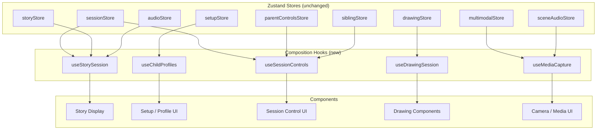
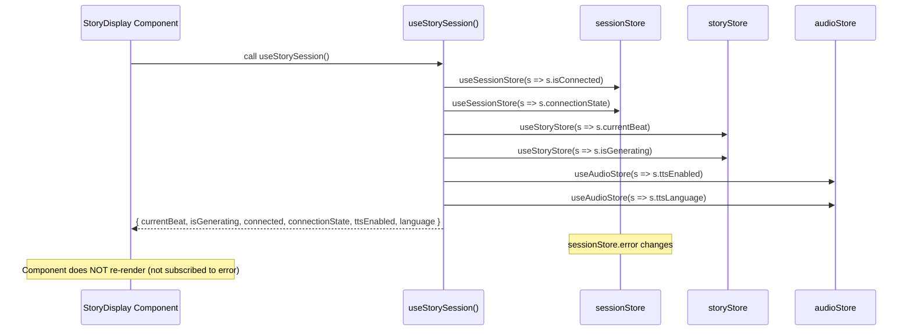
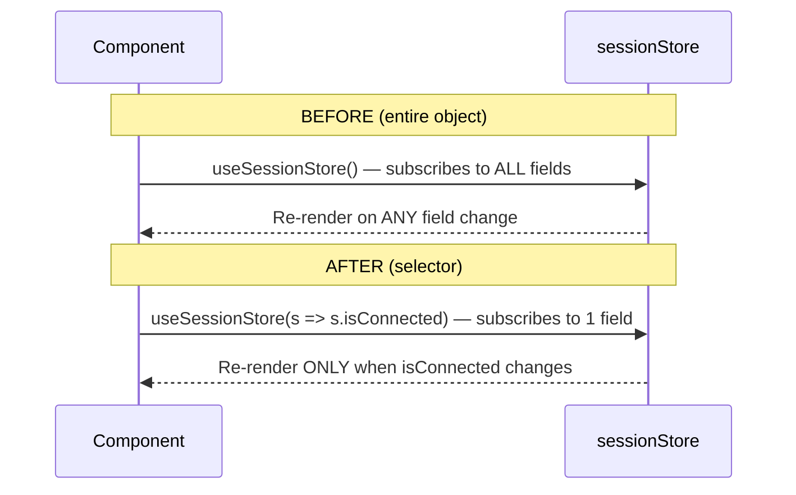

# Design Document: Store Composition Hooks

## Overview

The frontend currently has 15 Zustand stores, and components like `App.jsx` import 10+ stores directly, subscribing to entire store objects. This causes tight coupling and unnecessary re-renders when any field in a subscribed store changes — even fields the component doesn't use.

This design introduces 5 composition hooks that sit between stores and components. Each hook uses Zustand's selector pattern (`useStore(s => s.field)`) to subscribe only to the specific fields a component needs. The hooks are purely additive — existing stores remain unchanged, and components can migrate incrementally.

## Architecture



## Sequence Diagrams

### Component Render with Composition Hook



### Before vs After: Store Subscription



## Components and Interfaces

### Hook: useStorySession

**Purpose**: Composes sessionStore + storyStore + audioStore for story display components.

**Interface**:
```javascript
function useStorySession(): {
  currentBeat: StoryBeat | null,
  isGenerating: boolean,
  connected: boolean,
  connectionState: string,
  ttsEnabled: boolean,
  language: string
}
```

**Responsibilities**:
- Subscribe to `currentBeat` and `isGenerating` from storyStore
- Subscribe to `isConnected` and `connectionState` from sessionStore
- Subscribe to `ttsEnabled` and `ttsLanguage` from audioStore
- Each field uses an individual selector — component only re-renders when a subscribed field changes

### Hook: useChildProfiles

**Purpose**: Composes setupStore for profile access in setup and display components.

**Interface**:
```javascript
function useChildProfiles(): {
  child1: ChildProfile,
  child2: ChildProfile,
  profiles: ProfilesPayload,
  language: string,
  isComplete: boolean
}
```

**Responsibilities**:
- Subscribe to `child1`, `child2`, `language`, `isComplete` from setupStore
- Derive `profiles` via `setupStore.getProfiles()` using `useMemo`
- Provide stable references for child objects

### Hook: useSessionControls

**Purpose**: Composes sessionStore + parentControlsStore + siblingStore for session control UI.

**Interface**:
```javascript
function useSessionControls(): {
  sessionId: string,
  connected: boolean,
  reconnecting: boolean,
  siblingScore: number | null,
  sessionSummary: string | null,
  timeLimitMinutes: number
}
```

**Responsibilities**:
- Subscribe to `sessionId`, `isConnected`, `isReconnecting` from sessionStore
- Subscribe to `sessionTimeLimitMinutes` from parentControlsStore
- Subscribe to `siblingDynamicsScore`, `sessionSummary` from siblingStore

### Hook: useDrawingSession

**Purpose**: Composes drawingStore for drawing components.

**Interface**:
```javascript
function useDrawingSession(): {
  isActive: boolean,
  prompt: string,
  timeRemaining: number,
  strokes: Stroke[]
}
```

**Responsibilities**:
- Subscribe to `isActive`, `prompt`, `remainingTime`, `strokes` from drawingStore
- Each field individually selected

### Hook: useMediaCapture

**Purpose**: Composes multimodalStore + sceneAudioStore for media state.

**Interface**:
```javascript
function useMediaCapture(): {
  audioUnlocked: boolean,
  cameraActive: boolean,
  lastEmotion: EmotionData[]
}
```

**Responsibilities**:
- Subscribe to `audioUnlocked` from sceneAudioStore
- Subscribe to `cameraActive`, `currentEmotions` from multimodalStore
- Map `currentEmotions` to `lastEmotion` for consumer clarity

## Data Models

### StoryBeat (existing, from storyStore)

```javascript
/**
 * @typedef {Object} StoryBeat
 * @property {string} narration
 * @property {string} child1_perspective
 * @property {string} child2_perspective
 * @property {string|null} scene_image_url
 * @property {string[]} choices
 * @property {Object} metadata
 */
```

### ChildProfile (existing, from setupStore)

```javascript
/**
 * @typedef {Object} ChildProfile
 * @property {string} name
 * @property {string} gender
 * @property {string} personality
 * @property {string} spirit
 * @property {string} toy
 * @property {string} toyType
 * @property {string} toyImage
 */
```

### Composition Hook Return Types (new)

```javascript
/**
 * @typedef {Object} StorySessionState
 * @property {StoryBeat|null} currentBeat
 * @property {boolean} isGenerating
 * @property {boolean} connected
 * @property {string} connectionState
 * @property {boolean} ttsEnabled
 * @property {string} language
 */

/**
 * @typedef {Object} ChildProfilesState
 * @property {ChildProfile} child1
 * @property {ChildProfile} child2
 * @property {Object} profiles - getProfiles() payload
 * @property {string} language
 * @property {boolean} isComplete
 */

/**
 * @typedef {Object} SessionControlsState
 * @property {string} sessionId
 * @property {boolean} connected
 * @property {boolean} reconnecting
 * @property {number|null} siblingScore
 * @property {string|null} sessionSummary
 * @property {number} timeLimitMinutes
 */

/**
 * @typedef {Object} DrawingSessionState
 * @property {boolean} isActive
 * @property {string} prompt
 * @property {number} timeRemaining
 * @property {Array} strokes
 */

/**
 * @typedef {Object} MediaCaptureState
 * @property {boolean} audioUnlocked
 * @property {boolean} cameraActive
 * @property {Array} lastEmotion
 */
```


## Key Functions with Formal Specifications

### useStorySession()

```javascript
import { useSessionStore } from '../stores/sessionStore';
import { useStoryStore } from '../stores/storyStore';
import { useAudioStore } from '../stores/audioStore';

export function useStorySession() {
  const currentBeat = useStoryStore((s) => s.currentBeat);
  const isGenerating = useStoryStore((s) => s.isGenerating);
  const connected = useSessionStore((s) => s.isConnected);
  const connectionState = useSessionStore((s) => s.connectionState);
  const ttsEnabled = useAudioStore((s) => s.ttsEnabled);
  const language = useAudioStore((s) => s.ttsLanguage);

  return { currentBeat, isGenerating, connected, connectionState, ttsEnabled, language };
}
```

**Preconditions:**
- All three stores (sessionStore, storyStore, audioStore) are initialized via `create()`
- Hook is called within a React component or another hook

**Postconditions:**
- Returns an object with exactly 6 fields
- Each field reflects the current value from its source store
- Component re-renders only when one of the 6 selected fields changes
- No mutations to any store state

**Loop Invariants:** N/A

### useChildProfiles()

```javascript
import { useMemo } from 'react';
import { useSetupStore } from '../stores/setupStore';

export function useChildProfiles() {
  const child1 = useSetupStore((s) => s.child1);
  const child2 = useSetupStore((s) => s.child2);
  const language = useSetupStore((s) => s.language);
  const isComplete = useSetupStore((s) => s.isComplete);

  const profiles = useMemo(
    () => useSetupStore.getState().getProfiles(),
    [child1, child2, language]
  );

  return { child1, child2, profiles, language, isComplete };
}
```

**Preconditions:**
- setupStore is initialized
- Hook is called within a React component

**Postconditions:**
- `profiles` is recomputed only when child1, child2, or language changes
- `profiles` matches the shape returned by `setupStore.getProfiles()`
- `child1` and `child2` are the same object references as in the store (no cloning)

**Loop Invariants:** N/A

### useSessionControls()

```javascript
import { useSessionStore } from '../stores/sessionStore';
import { useParentControlsStore } from '../stores/parentControlsStore';
import { useSiblingStore } from '../stores/siblingStore';

export function useSessionControls() {
  const sessionId = useSessionStore((s) => s.sessionId);
  const connected = useSessionStore((s) => s.isConnected);
  const reconnecting = useSessionStore((s) => s.isReconnecting);
  const siblingScore = useSiblingStore((s) => s.siblingDynamicsScore);
  const sessionSummary = useSiblingStore((s) => s.sessionSummary);
  const timeLimitMinutes = useParentControlsStore((s) => s.sessionTimeLimitMinutes);

  return { sessionId, connected, reconnecting, siblingScore, sessionSummary, timeLimitMinutes };
}
```

**Preconditions:**
- sessionStore, parentControlsStore, siblingStore are initialized
- Hook is called within a React component

**Postconditions:**
- Returns object with exactly 6 fields
- `siblingScore` is `null` or a number in range [0.0, 1.0]
- `timeLimitMinutes` is a positive number (default 30)
- Component re-renders only when one of the 6 selected fields changes

**Loop Invariants:** N/A

### useDrawingSession()

```javascript
import { useDrawingStore } from '../stores/drawingStore';

export function useDrawingSession() {
  const isActive = useDrawingStore((s) => s.isActive);
  const prompt = useDrawingStore((s) => s.prompt);
  const timeRemaining = useDrawingStore((s) => s.remainingTime);
  const strokes = useDrawingStore((s) => s.strokes);

  return { isActive, prompt, timeRemaining, strokes };
}
```

**Preconditions:**
- drawingStore is initialized
- Hook is called within a React component

**Postconditions:**
- `timeRemaining` maps from store's `remainingTime` field
- `strokes` is the same array reference as in the store
- When `isActive` is false, `timeRemaining` equals `duration` (reset state)

**Loop Invariants:** N/A

### useMediaCapture()

```javascript
import { useMultimodalStore } from '../stores/multimodalStore';
import { useSceneAudioStore } from '../stores/sceneAudioStore';

export function useMediaCapture() {
  const audioUnlocked = useSceneAudioStore((s) => s.audioUnlocked);
  const cameraActive = useMultimodalStore((s) => s.cameraActive);
  const lastEmotion = useMultimodalStore((s) => s.currentEmotions);

  return { audioUnlocked, cameraActive, lastEmotion };
}
```

**Preconditions:**
- multimodalStore and sceneAudioStore are initialized
- Hook is called within a React component

**Postconditions:**
- `lastEmotion` maps from store's `currentEmotions` array
- `audioUnlocked` reflects whether Web Audio API context has been resumed
- Component re-renders only when one of the 3 selected fields changes

**Loop Invariants:** N/A

## Example Usage

### Before: Tight coupling in App.jsx

```javascript
// Component subscribes to ENTIRE store objects — re-renders on ANY change
function App() {
  const session = useSessionStore();       // all ~10 fields
  const story = useStoryStore();           // all ~8 fields
  const audio = useAudioStore();           // all ~15 fields
  const setup = useSetupStore();           // all ~8 fields
  const sibling = useSiblingStore();       // all ~5 fields
  const parentControls = useParentControlsStore(); // all ~5 fields

  // Uses only session.isConnected, story.currentBeat, audio.ttsEnabled...
  // but re-renders when session.reconnectAttempts, story.history, audio.ttsPitch change too
}
```

### After: Targeted subscriptions via composition hooks

```javascript
import { useStorySession } from './stores/compositionHooks';
import { useChildProfiles } from './stores/compositionHooks';
import { useSessionControls } from './stores/compositionHooks';

function StoryDisplay() {
  const { currentBeat, isGenerating, connected, ttsEnabled, language } = useStorySession();
  // Only re-renders when these 5 fields change — not when session.error or audio.ttsPitch changes
}

function ProfilePanel() {
  const { child1, child2, profiles, language, isComplete } = useChildProfiles();
  // Only re-renders when profile data changes
}

function SessionControlBar() {
  const { sessionId, connected, reconnecting, siblingScore, timeLimitMinutes } = useSessionControls();
  // Only re-renders when session control fields change
}
```

## Correctness Properties

1. **Selector Isolation**: For each composition hook, a change to a store field NOT included in the hook's return type MUST NOT trigger a re-render in the consuming component.

2. **Value Equivalence**: For every field `f` returned by a composition hook, `hook().f === sourceStore.getState().sourceField` at the time of render (referential equality for objects, value equality for primitives).

3. **Additive Only**: After introducing composition hooks, all existing direct store imports (`useSessionStore()`, `useStoryStore()`, etc.) continue to work identically. No store API is modified.

4. **Memoization Stability**: `useChildProfiles().profiles` returns the same object reference across renders when `child1`, `child2`, and `language` have not changed (verified via `useMemo` dependency array).

5. **Complete Coverage**: The union of all fields across all 5 composition hooks covers every field that `App.jsx` currently reads from the 9 stores it imports (sessionStore, storyStore, audioStore, setupStore, siblingStore, parentControlsStore, sceneAudioStore, drawingStore, multimodalStore).

## Error Handling

### Scenario: Store not yet initialized

**Condition**: A composition hook is called before its underlying store has been created (should not happen with Zustand's `create()` at module scope, but defensive).
**Response**: Zustand stores are created synchronously at import time. The hook will return the store's initial/default values.
**Recovery**: No recovery needed — this is the expected cold-start behavior.

### Scenario: Stale selector after hot module replacement

**Condition**: During development with Vite HMR, a store module is replaced but the composition hook still references the old store instance.
**Response**: Zustand's `create()` returns a new hook on HMR. The composition hook re-imports automatically since it's a function call, not a cached reference.
**Recovery**: Automatic via Vite HMR.

## Testing Strategy

### Unit Testing Approach

Each composition hook should be tested with `@testing-library/react` + `renderHook`:
- Verify returned shape matches the interface
- Verify values match underlying store state
- Verify re-render count when unrelated store fields change (should be 0)

### Property-Based Testing Approach

**Property Test Library**: fast-check

- Generate random store states and verify hook output always matches the selector contract
- Generate sequences of store mutations and verify hooks only trigger re-renders for subscribed fields

### Integration Testing Approach

- Render a component using a composition hook, mutate the underlying store, and assert the component reflects the change
- Render a component, mutate a store field NOT in the hook's return type, and assert the component does NOT re-render

## Performance Considerations

- Individual field selectors (`s => s.field`) use Zustand's built-in `Object.is` comparison — no custom equality function needed for primitives
- `useChildProfiles` uses `useMemo` for the derived `profiles` object to avoid recomputing on every render
- The `strokes` array in `useDrawingSession` is a reference — Zustand will only trigger re-render when the array reference changes (which it does on every `addStroke` call via spread). This is correct behavior since strokes are append-only during a session.

## Dependencies

- `zustand` (existing) — store infrastructure and selector subscriptions
- `react` (existing) — `useMemo` for derived state in `useChildProfiles`
- No new dependencies required
