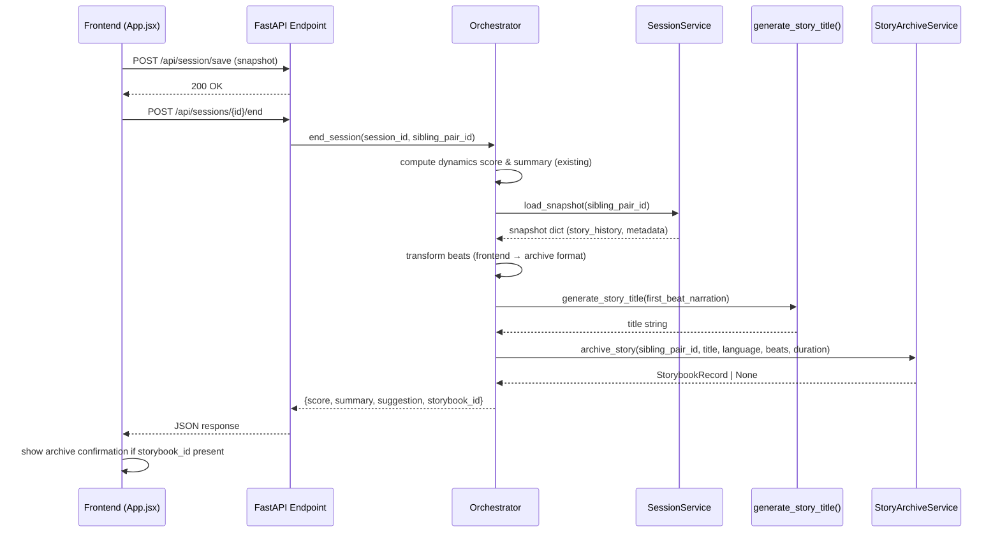

# Design Document: Story Archival Trigger

## Overview

This feature wires the existing `StoryArchiveService.archive_story()` into the session-end flow so completed stories are automatically persisted to the gallery. The integration touches three layers:

1. **Backend orchestrator** (`end_session()`) — retrieves the session snapshot, transforms beats, generates a title, and calls `archive_story()`
2. **Backend endpoint** (`POST /api/sessions/{session_id}/end`) — surfaces the `storybook_id` in the response
3. **Frontend** (`handleSaveAndExit()`) — reorders calls so `saveSnapshot()` completes before `end-session`, and shows a subtle archive confirmation

No new services or database tables are needed. The `StoryArchiveService`, `SessionService`, storybook models, and gallery API already exist and are tested.

## Architecture



## Components and Interfaces

### 1. `generate_story_title(narration: str) -> str`

A pure utility function in a new module `backend/app/utils/title_generator.py`.

- Takes the first beat's narration text
- Truncates to ≤60 characters at the nearest word boundary
- Appends `…` if truncated
- Returns `"Untitled Adventure"` when narration is empty/None

```python
def generate_story_title(narration: str | None) -> str:
    """Produce a ≤60-char title from the first beat's narration."""
```

### 2. `transform_beats(story_history: list[dict]) -> list[dict]`

A pure utility function in `backend/app/utils/beat_transformer.py`.

Maps frontend beat format → archive beat format:

| Frontend key | Archive key |
|---|---|
| `narration` | `narration` |
| `child1_perspective` | `child1_perspective` |
| `child2_perspective` | `child2_perspective` |
| `scene_image_url` | `scene_image_url` |
| `choiceMade` | `choice_made` |
| `choices` | `available_choices` |

```python
def transform_beats(story_history: list[dict]) -> list[dict]:
    """Convert frontend story_history entries to archive beat dicts."""
```

### 3. `AgentOrchestrator.end_session()` — modified

After the existing dynamics computation and world-state extraction, add an archival block:

1. Load snapshot via `SessionService.load_snapshot(sibling_pair_id)`
2. Guard: skip if snapshot is None or `story_history` is empty
3. Extract `language` and `session_duration_seconds` from `session_metadata`
4. Call `transform_beats()` on `story_history`
5. Call `generate_story_title()` on the first beat's narration
6. Call `StoryArchiveService.archive_story()`
7. Wrap in try/except — log errors, never raise
8. Return `storybook_id` (or `None`) in the response dict

### 4. `POST /api/sessions/{session_id}/end` — response shape change

Current response:
```json
{"session_id": "...", "sibling_pair_id": "...", "sibling_dynamics_score": 0.8, "summary": "...", "suggestion": "..."}
```

New response adds:
```json
{"storybook_id": "abc123" | null}
```

### 5. Frontend `handleSaveAndExit()` — reorder + feedback

Current flow: calls `end-session` first, then `saveSnapshot()`.
New flow:
1. `await persistence.saveSnapshot()` (already happens)
2. `await fetch(end-session endpoint)`
3. If response contains non-null `storybook_id`, set a transient state flag
4. Show a subtle "Saved to gallery ✨" toast/indicator before reset

Uses existing store patterns — no new store needed. A simple local state flag in `App.jsx` suffices.

## Data Models

### Beat Transformation (input → output)

**Input** (frontend `story_history` entry):
```python
{
    "narration": str,
    "child1_perspective": str,
    "child2_perspective": str,
    "scene_image_url": str | None,
    "choices": list[str],       # available choices
    "choiceMade": str | None,   # selected choice
    "timestamp": int
}
```

**Output** (archive beat dict for `archive_story()`):
```python
{
    "narration": str,
    "child1_perspective": str | None,
    "child2_perspective": str | None,
    "scene_image_url": str | None,
    "choice_made": str | None,
    "available_choices": list[str]
}
```

### End-Session Response Model

```python
{
    "session_id": str,
    "sibling_pair_id": str,
    "sibling_dynamics_score": float,
    "summary": str,
    "suggestion": str | None,
    "storybook_id": str | None       # NEW
}
```

### Existing Models (unchanged)

- `StorybookRecord` — returned by `archive_story()`, has `storybook_id`
- `StorybookSummary` / `StorybookDetail` — used by gallery API
- `StoryBeatRecord` — individual beat in a storybook


## Correctness Properties

*A property is a characteristic or behavior that should hold true across all valid executions of a system — essentially, a formal statement about what the system should do. Properties serve as the bridge between human-readable specifications and machine-verifiable correctness guarantees.*

### Property 1: Beat transformation preserves all fields

*For any* frontend story history beat with arbitrary narration, perspectives, image URL, choices list, and choiceMade value, `transform_beats()` should produce an archive beat where: `narration` equals the input narration, `child1_perspective` equals the input, `child2_perspective` equals the input, `scene_image_url` equals the input, `choice_made` equals the input `choiceMade`, and `available_choices` equals the input `choices`. The `timestamp` field should be dropped.

**Validates: Requirements 2.3**

### Property 2: Title length and word-boundary truncation

*For any* narration string, `generate_story_title()` should return a title of 60 characters or fewer. If the narration is longer than 60 characters, the title should end with the ellipsis character `…` and should not break mid-word (the last character before `…` should be a space or the end of a complete word). If the narration is 60 characters or fewer, the title should equal the narration unchanged.

**Validates: Requirements 3.2, 3.4**

### Property 3: Archival failure does not crash end_session

*For any* exception raised by `archive_story()`, calling `end_session()` should still return a valid response dict containing `session_id`, `sibling_pair_id`, `sibling_dynamics_score`, `summary`, and `suggestion` keys — the archival failure must not propagate to the caller.

**Validates: Requirements 1.3**

### Property 4: storybook_id reflects archival outcome

*For any* call to `end_session()`, the `storybook_id` field in the response should be non-null if and only if `archive_story()` returned a `StorybookRecord`. When archival is skipped (no snapshot, empty beats) or fails, `storybook_id` should be `None`.

**Validates: Requirements 1.4, 1.5**

### Property 5: Archive round-trip through gallery

*For any* valid story data (non-empty beats, valid sibling_pair_id), after `archive_story()` returns a `StorybookRecord`, calling `list_storybooks(sibling_pair_id)` should include a storybook whose `storybook_id` matches the archived record's `storybook_id`.

**Validates: Requirements 5.3**

## Error Handling

| Scenario | Behavior | Requirement |
|---|---|---|
| `SessionService.load_snapshot()` returns `None` | Log warning, skip archival, return `storybook_id: null` | 2.5, 1.5 |
| `story_history` is empty list | Log warning, skip archival, return `storybook_id: null` | 2.4, 1.5 |
| `archive_story()` raises any exception | Log error, continue, return `storybook_id: null` | 1.3, 1.5 |
| `archive_story()` returns `None` (empty beats) | Return `storybook_id: null` | 1.5 |
| `generate_story_title()` receives empty/None narration | Return `"Untitled Adventure"` | 3.3 |
| `saveSnapshot()` fails on frontend (after retry) | Still call end-session endpoint | 4.3 |
| End-session response has null `storybook_id` | Frontend shows no error | 5.2 |

All archival errors are swallowed in the orchestrator — the end-session flow must never fail due to archival issues. The existing dynamics score, summary, and world-state extraction continue to work independently.

## Testing Strategy

### Unit Tests

- `test_generate_story_title`: empty narration → fallback, short narration → unchanged, long narration → truncated with `…` at word boundary, exactly 60 chars → unchanged
- `test_transform_beats`: single beat mapping, multiple beats, missing optional fields default to `None`/`[]`
- `test_end_session_with_archival`: mock `SessionService` + `StoryArchiveService`, verify `archive_story` called with correct args, `storybook_id` in response
- `test_end_session_no_snapshot`: mock `load_snapshot` returning `None`, verify archival skipped, `storybook_id` is `null`
- `test_end_session_empty_history`: snapshot with empty `story_history`, verify archival skipped
- `test_end_session_archival_failure`: mock `archive_story` raising exception, verify response still returned with `storybook_id: null`
- `test_frontend_save_order`: verify `saveSnapshot()` is called before end-session endpoint

### Property-Based Tests (Hypothesis, max_examples=20)

Each property test uses the Hypothesis library and references its design property.

- **Property 1 test**: Generate random beat dicts with arbitrary strings/lists, run `transform_beats()`, assert field mapping is correct.
  Tag: `Feature: story-archival-trigger, Property 1: Beat transformation preserves all fields`

- **Property 2 test**: Generate random strings (including empty, short, long, unicode), run `generate_story_title()`, assert length ≤60, assert ellipsis presence iff truncated, assert no mid-word break.
  Tag: `Feature: story-archival-trigger, Property 2: Title length and word-boundary truncation`

Property tests 3–5 require database/service mocking and are better covered by the unit tests above. Properties 3 and 4 are validated through the unit test suite with specific mock scenarios. Property 5 is validated through an integration test using the real `StoryArchiveService` with an in-memory SQLite database.

### Test Configuration

- Library: **Hypothesis** (already in project)
- Iterations: `max_examples=20` (per project convention)
- Backend test command: `source venv/bin/activate && python3 -m pytest tests/ -x -q --tb=short`
- After pytest: `pkill -f "python.*pytest"`
