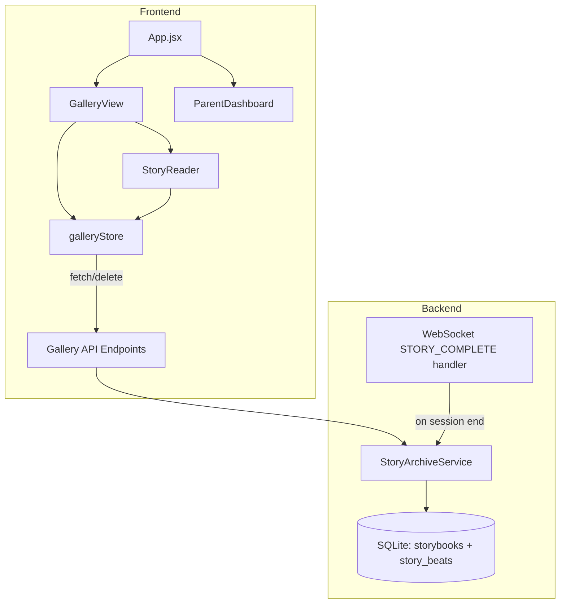

# Design Document: Storybook Gallery

## Overview

The Storybook Gallery adds a persistent "magical bookshelf" to Twin Spark Chronicles where Ale & Sofi can revisit completed adventures. When a story session ends, the full adventure — every beat, scene image, narration, perspective, and choice — is archived into a SQLite-backed storybook. Children browse a premium bookshelf UI, tap a book to open it, and re-read the story page by page with the same immersive transitions they experienced live.

The feature spans three layers:

1. **Backend**: A `StoryArchiveService` persists completed stories into two new SQLite tables (`storybooks` and `story_beats`). A set of FastAPI endpoints (`Gallery_API`) exposes list, detail, and delete operations.
2. **Frontend Store**: A dedicated Zustand `galleryStore` manages gallery state independently from the active story session.
3. **Frontend UI**: A `GalleryView` bookshelf component and a `StoryReader` page-by-page reader, integrated into `App.jsx` navigation.

The design follows existing codebase conventions: `DatabaseConnection` for all DB access, Pydantic models for API contracts, Zustand with devtools for state, and the Living Storybook CSS design system with glass panels, glow effects, and reduced-motion support.

## Architecture



### Key Design Decisions

1. **Two-table schema** (`storybooks` + `story_beats`): Keeps listing queries fast (only touch `storybooks`) while detail queries join beats. This mirrors the session_snapshots pattern but with normalized beat storage for efficient per-beat access in the reader.

2. **Archive at session end, not continuously**: Archival happens once when the story completes (or when the user explicitly saves & exits a completed story). This avoids partial storybooks and keeps the gallery clean.

3. **Cover image derived from first beat**: No separate image generation — the first beat's `scene_image_url` becomes the cover. Simple, reliable, and the first scene is always the most recognizable.

4. **Parent PIN reuse**: Deletion uses the same `X-Parent-Pin` header and `_verify_parent_pin()` helper already in `main.py` for voice recording deletion.

5. **Gallery overlay, not route**: The gallery opens as a full-screen overlay (like WorldMapView) rather than a separate route, preserving active story session state underneath.

## Components and Interfaces

### Backend Components

#### StoryArchiveService (`backend/app/services/story_archive_service.py`)

Stateless service following the `SessionService` / `VoiceRecordingService` pattern.

```python
class StoryArchiveService:
    def __init__(self, db: DatabaseConnection) -> None: ...

    async def archive_story(
        self,
        sibling_pair_id: str,
        title: str,
        language: str,
        beats: list[dict],
        duration_seconds: int,
    ) -> StorybookRecord:
        """Archive a completed story with all beats in a single transaction."""

    async def list_storybooks(self, sibling_pair_id: str) -> list[StorybookSummary]:
        """Return storybook summaries sorted by completed_at DESC."""

    async def get_storybook(self, storybook_id: str) -> StorybookDetail | None:
        """Return full storybook with all beats in order."""

    async def delete_storybook(self, storybook_id: str) -> bool:
        """Delete a storybook and its beats. Returns True if found."""

    async def delete_all_storybooks(self, sibling_pair_id: str) -> int:
        """Bulk delete all storybooks for a sibling pair. Returns count."""
```

#### Gallery API Endpoints (added to `backend/app/main.py`)

| Method | Path | Auth | Description |
|--------|------|------|-------------|
| `GET` | `/api/gallery/{sibling_pair_id}` | None | List storybook summaries |
| `GET` | `/api/gallery/detail/{storybook_id}` | None | Get full storybook with beats |
| `DELETE` | `/api/gallery/{storybook_id}` | `X-Parent-Pin` | Delete single storybook |
| `DELETE` | `/api/gallery/all/{sibling_pair_id}` | `X-Parent-Pin` | Bulk delete all storybooks |

### Frontend Components

#### galleryStore (`frontend/src/stores/galleryStore.js`)

```javascript
// State
{
  storybooks: [],          // StorybookSummary[]
  selectedStorybook: null, // StorybookDetail | null
  isLoading: false,
  error: null,
}

// Actions
fetchStorybooks(siblingPairId)   // GET /api/gallery/{id}
fetchStorybookDetail(storybookId) // GET /api/gallery/detail/{id}
deleteStorybook(storybookId, pin) // DELETE /api/gallery/{id}
removeStorybookLocally(storybookId) // Remove from local list
clearSelectedStorybook()
reset()
```

#### GalleryView (`frontend/src/features/gallery/components/GalleryView.jsx`)

Full-screen overlay component rendering the bookshelf. Receives `siblingPairId`, `onClose`, and optional `isParentMode` prop.

- Fetches storybooks on mount via `galleryStore.fetchStorybooks()`
- Renders book cover cards on horizontal shelf rows
- Shows shimmer skeleton during loading
- Shows empty state with CTA when no storybooks exist
- In parent mode, shows delete buttons on each card
- Deletion triggers confirmation dialog → API call → local removal with fade-out

#### StoryReader (`frontend/src/features/gallery/components/StoryReader.jsx`)

Full-screen reader for a single storybook. Receives `storybookId` and `onClose`.

- Fetches full storybook detail on mount
- Renders one beat at a time with scene image, narration, perspectives (tap-to-expand), and "You chose:" label
- Forward/backward navigation via arrow buttons and swipe gestures
- Page indicator: "3 / 8"
- Page-turn transition animation (reuses TransitionEngine CSS patterns)
- "The End" card on last beat with celebration sparkle and "Back to Gallery" button
- Close button always visible

### Navigation Integration

In `App.jsx`, a bookshelf icon button (📚) is added to the top navigation bar alongside the existing World Map and Settings buttons. It renders `GalleryView` as a full-screen overlay when toggled, identical to the `WorldMapView` pattern:

```jsx
{showGallery && (
  <GalleryView
    siblingPairId={siblingPairId}
    onClose={() => setShowGallery(false)}
  />
)}
```

The Parent Dashboard also gets a "Story Gallery" link that opens `GalleryView` with `isParentMode={true}`.

## Data Models

### SQLite Schema

```sql
CREATE TABLE IF NOT EXISTS storybooks (
    storybook_id   TEXT PRIMARY KEY,
    sibling_pair_id TEXT NOT NULL,
    title          TEXT NOT NULL,
    language       TEXT NOT NULL DEFAULT 'en',
    cover_image_url TEXT,
    beat_count     INTEGER NOT NULL DEFAULT 0,
    duration_seconds INTEGER NOT NULL DEFAULT 0,
    completed_at   TEXT NOT NULL,
    created_at     TEXT NOT NULL
);

CREATE INDEX IF NOT EXISTS idx_storybooks_pair
    ON storybooks(sibling_pair_id, completed_at DESC);

CREATE TABLE IF NOT EXISTS story_beats (
    beat_id        TEXT PRIMARY KEY,
    storybook_id   TEXT NOT NULL REFERENCES storybooks(storybook_id) ON DELETE CASCADE,
    beat_index     INTEGER NOT NULL,
    narration      TEXT NOT NULL,
    child1_perspective TEXT,
    child2_perspective TEXT,
    scene_image_url TEXT,
    choice_made    TEXT,
    available_choices TEXT,  -- JSON array
    created_at     TEXT NOT NULL
);

CREATE INDEX IF NOT EXISTS idx_beats_storybook
    ON story_beats(storybook_id, beat_index ASC);
```

### Pydantic Models (`backend/app/models/storybook.py`)

```python
from datetime import datetime
from pydantic import BaseModel


class StorybookSummary(BaseModel):
    """Lightweight storybook info for gallery listing."""
    storybook_id: str
    title: str
    cover_image_url: str | None
    beat_count: int
    duration_seconds: int
    completed_at: str


class StoryBeatRecord(BaseModel):
    """A single beat within a storybook."""
    beat_id: str
    beat_index: int
    narration: str
    child1_perspective: str | None
    child2_perspective: str | None
    scene_image_url: str | None
    choice_made: str | None
    available_choices: list[str]


class StorybookDetail(BaseModel):
    """Full storybook with all beats for the reader."""
    storybook_id: str
    sibling_pair_id: str
    title: str
    language: str
    cover_image_url: str | None
    beat_count: int
    duration_seconds: int
    completed_at: str
    beats: list[StoryBeatRecord]


class StorybookRecord(BaseModel):
    """Internal record returned after archival."""
    storybook_id: str
    sibling_pair_id: str
    title: str
    beat_count: int
    completed_at: str


class DeleteStorybookResult(BaseModel):
    """Response after deleting storybooks."""
    deleted_count: int
```

### API Response Contracts

**GET `/api/gallery/{sibling_pair_id}`** → `list[StorybookSummary]`

```json
[
  {
    "storybook_id": "abc-123",
    "title": "The Dragon's Secret Garden",
    "cover_image_url": "/assets/generated_images/scene_123.png",
    "beat_count": 8,
    "duration_seconds": 420,
    "completed_at": "2025-01-15T10:30:00Z"
  }
]
```

**GET `/api/gallery/detail/{storybook_id}`** → `StorybookDetail`

```json
{
  "storybook_id": "abc-123",
  "sibling_pair_id": "Ale:Sofi",
  "title": "The Dragon's Secret Garden",
  "language": "en",
  "cover_image_url": "/assets/generated_images/scene_123.png",
  "beat_count": 8,
  "duration_seconds": 420,
  "completed_at": "2025-01-15T10:30:00Z",
  "beats": [
    {
      "beat_id": "beat-001",
      "beat_index": 0,
      "narration": "Once upon a time...",
      "child1_perspective": "Ale sees a glowing door...",
      "child2_perspective": "Sofi hears a gentle melody...",
      "scene_image_url": "/assets/generated_images/scene_123.png",
      "choice_made": "Open the door",
      "available_choices": ["Open the door", "Listen to the melody", "Call for help"]
    }
  ]
}
```

**DELETE `/api/gallery/{storybook_id}`** (Header: `X-Parent-Pin`) → `{"deleted_count": 1}`

**DELETE `/api/gallery/all/{sibling_pair_id}`** (Header: `X-Parent-Pin`) → `{"deleted_count": 5}`


## Correctness Properties

*A property is a characteristic or behavior that should hold true across all valid executions of a system — essentially, a formal statement about what the system should do. Properties serve as the bridge between human-readable specifications and machine-verifiable correctness guarantees.*

### Property 1: Storybook round-trip preservation

*For any* valid list of story beats (with narration, child1 perspective, child2 perspective, scene image URL, choice made, and available choices), archiving the story via `StoryArchiveService.archive_story()` and then retrieving it via `StoryArchiveService.get_storybook()` should produce a response where every beat's narration, child1_perspective, child2_perspective, scene_image_url, choice_made, available_choices, and beat_index are identical to the original input, and the beats are in the same order.

**Validates: Requirements 1.1, 1.2, 3.1, 3.2, 11.1, 11.2**

### Property 2: Archive metadata invariants

*For any* valid list of story beats and duration value, after archiving, the resulting storybook record's `beat_count` should equal the number of input beats, the `duration_seconds` should equal the input duration, and the `cover_image_url` should equal the `scene_image_url` of the first beat in the input list.

**Validates: Requirements 1.3, 1.4**

### Property 3: Gallery listing order

*For any* set of archived storybooks belonging to the same sibling pair, the list returned by `StoryArchiveService.list_storybooks()` should be sorted by `completed_at` in descending order (newest first), and every archived storybook for that pair should appear in the list.

**Validates: Requirements 2.1, 2.2**

### Property 4: Deletion completeness

*For any* archived storybook, after deleting it via `StoryArchiveService.delete_storybook()`, querying for that storybook should return `None`, and no story_beat records with that storybook_id should exist in the database. For bulk deletion, *for any* sibling pair with N archived storybooks, `delete_all_storybooks()` should return N and leave zero storybooks for that pair.

**Validates: Requirements 4.1, 4.4**

### Property 5: Page indicator correctness

*For any* storybook with N beats, when the StoryReader is at beat index i (0-based), the page indicator should display `(i + 1) / N`.

**Validates: Requirements 6.4**

### Property 6: Local store deletion consistency

*For any* gallery store containing a list of storybook summaries, calling `removeStorybookLocally(id)` for a storybook in the list should reduce the list length by exactly one and the removed storybook ID should no longer appear in the list.

**Validates: Requirements 9.3**

## Error Handling

### Backend Errors

| Scenario | Behavior |
|----------|----------|
| Archive with empty beats list | Skip archival, log warning, return `None` |
| DB write failure during archive | Transaction rollback — no partial storybook or beats persisted. Raise exception. |
| GET detail for nonexistent storybook_id | Return HTTP 404 with `{"detail": "Storybook not found"}` |
| DELETE with missing/invalid Parent PIN | Return HTTP 401 with `{"detail": "Parent PIN required"}` |
| DELETE for nonexistent storybook_id | Return HTTP 404 with `{"detail": "Storybook not found"}` |
| Malformed sibling_pair_id | Return empty list (200) — no special validation needed, just no matches |
| Internal DB error on any endpoint | Return HTTP 500 with generic error message, log full traceback |

### Frontend Errors

| Scenario | Behavior |
|----------|----------|
| Gallery fetch fails (network error) | Set `error` state in galleryStore, show child-friendly message: "Oops, the bookshelf is hiding! Try again." with retry button |
| Storybook detail fetch fails | Show error in StoryReader with "Back to Gallery" button |
| Delete API returns 401 | Show "Wrong PIN — ask a grown-up for help!" |
| Delete API returns 500 | Show "Something went wrong — the book is still safe!" and keep book on shelf |
| Image fails to load in gallery/reader | Show placeholder illustration (book emoji or sparkle) via `onError` handler |

## Testing Strategy

### Unit Tests

Unit tests cover specific examples, edge cases, and error conditions:

**Backend unit tests** (`backend/tests/test_story_archive_service.py`):
- Archive a story with 3 beats and verify all fields are persisted correctly
- Archive with empty beats list returns `None` and logs warning
- List storybooks for a pair with no stories returns empty list
- Get detail for nonexistent ID returns `None`
- Delete nonexistent storybook returns `False`
- Transaction rollback on simulated DB failure leaves no partial data
- Bulk delete returns correct count and removes all records

**Backend API tests** (`backend/tests/test_gallery_api.py`):
- GET list endpoint returns 200 with correct JSON structure
- GET detail endpoint returns 404 for missing storybook
- DELETE endpoint returns 401 without PIN header
- DELETE endpoint returns 404 for missing storybook
- Bulk DELETE returns correct count

**Frontend store tests**:
- `galleryStore.reset()` clears all state to initial values
- `fetchStorybooks()` sets loading state during fetch
- `removeStorybookLocally()` removes the correct item

**Frontend component tests**:
- GalleryView renders shimmer skeleton during loading
- GalleryView renders empty state when storybooks list is empty
- GalleryView renders book cover cards with title and image
- StoryReader renders first beat on open
- StoryReader shows "The End" card on last beat
- StoryReader close button calls onClose
- Parent mode shows delete buttons on cards

### Property-Based Tests

Property-based tests use **Hypothesis** (Python backend) and verify universal properties across randomized inputs. Each test runs with `max_examples=20`.

**Backend property tests** (`backend/tests/test_story_archive_properties.py`):

- **Feature: storybook-gallery, Property 1: Storybook round-trip preservation** — Generate random beat lists with random narration, perspectives, image URLs, choices. Archive then retrieve. Assert all fields match.
- **Feature: storybook-gallery, Property 2: Archive metadata invariants** — Generate random beat lists and durations. Archive. Assert beat_count == len(beats), duration matches, cover_image == first beat's image.
- **Feature: storybook-gallery, Property 3: Gallery listing order** — Generate multiple storybooks with random timestamps. List them. Assert descending order by completed_at.
- **Feature: storybook-gallery, Property 4: Deletion completeness** — Archive random storybooks, delete one or all, verify complete removal.

**Frontend property tests** (if using fast-check):

- **Feature: storybook-gallery, Property 5: Page indicator correctness** — Generate random beat counts and current indices. Assert indicator text matches `"${i+1} / ${N}"`.
- **Feature: storybook-gallery, Property 6: Local store deletion consistency** — Generate random storybook lists, pick a random ID to remove. Assert list shrinks by 1 and ID is gone.

### Test Configuration

- Backend: `hypothesis` with `@settings(max_examples=20)`
- Frontend: `fast-check` with `fc.assert(property, { numRuns: 100 })`
- Each property test is tagged with a comment: `# Feature: storybook-gallery, Property N: <title>`
- Run backend tests: `source venv/bin/activate && python3 -m pytest tests/ -x -q --tb=short` (from `backend/` directory)
- Run frontend build: `npm run build` (from `frontend/` directory)
