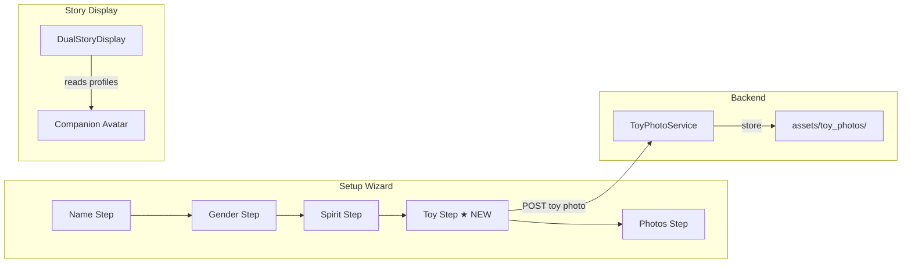

# Design Document: Toy Companion Visual

## Overview

This feature adds a toy companion setup step to the character creation wizard and renders toy companion avatars during story playback. The implementation spans three layers:

1. **Setup Wizard** — A new "toy" step inserted between spirit animal and photos, where each child names their toy and picks a preset emoji or photographs their real toy.
2. **Backend Service** — A lightweight `ToyPhotoService` that receives, validates, resizes, and stores toy photos, reusing existing image validation patterns from `PhotoService`.
3. **Story Display** — Companion avatar elements rendered alongside existing child avatars in `DualStoryDisplay`, showing either the toy photo or preset emoji with a themed glow and bobbing animation.

The design follows the CSS-first, minimal-dependency approach. No new npm packages are needed. The backend reuses PIL for image processing and FastAPI for endpoints.



## Architecture

### Frontend Flow

The `CharacterSetup.jsx` wizard gains a new `'toy'` step in its `stepOrder` array, positioned after `'spirit'` and before `'photos'`. The step renders:
- A name input (pre-populated with existing defaults "Bruno"/"Book")
- A 2×3 grid of preset toy cards (emoji + label)
- A photo capture button (HTML file input with `accept="image/*"`)
- A circular thumbnail preview when a photo is captured

State flows through the existing `formData` local state in `CharacterSetup`, then into `useSetupStore` on completion via `App.jsx`'s `handleSetupComplete`. Three new fields per child are added to the store: `toyType` (`'preset'` or `'photo'`), `toyImage` (URL or emoji identifier).

### Backend Flow

A new `ToyPhotoService` class handles toy photo uploads. It reuses the same validation logic as `PhotoService` (JPEG/PNG magic bytes, 10 MB limit) and resizes to 512px max dimension. Photos are stored under `assets/toy_photos/{sibling_pair_id}/child{1|2}.jpg`. A JSON sidecar file stores metadata.

Two new endpoints are added to `main.py`:
- `POST /api/toy-photo/{sibling_pair_id}/{child_number}` — upload
- `GET /api/toy-photo/{sibling_pair_id}/{child_number}` — retrieve metadata + URL

### Story Display Flow

`DualStoryDisplay.jsx` reads `profiles.c1_toy_image`, `c1_toy_type`, `c2_toy_image`, `c2_toy_type` from props. For each child, a `<span>` or `` element is rendered adjacent to the existing avatar pill, with a CSS bobbing animation offset by 0.5s and a themed glow border.

## Components and Interfaces

### Frontend Components

#### ToyStep (new section in CharacterSetup.jsx)

Rendered inline within `CharacterSetup.jsx` when `wizardStep === 'toy'`. Not a separate component file — follows the existing pattern where each step is a conditional block.

**Props** (via closure): `childNum`, `prefix`, `formData`, `set()`, `goToStep()`, `childColor`, `childEmoji`

**Internal state**:
- `toyPhotoPreview: string | null` — base64 data URL for the captured photo thumbnail
- `toyPhotoFile: File | null` — the raw file for upload

**Behavior**:
- Name input: controlled by `formData[prefix + 'toy_name']`, 1–20 chars
- Preset grid: 6 cards in a 3×2 grid, each sets `formData[prefix + 'toy_type']` to the preset value and clears any photo
- Photo capture: `<input type="file" accept="image/*" capture="environment">`, hidden, triggered by a styled button
- On valid photo: sets `toyPhotoPreview` to a FileReader data URL, sets `formData[prefix + 'toy_type']` to `'photo'`, clears preset selection
- File > 10 MB: shows inline error "Photo is too big! Try a smaller one 📸"
- Next button: enabled when name is non-empty AND (preset selected OR photo captured)

#### CompanionAvatar (CSS-only, inline in DualStoryDisplay.jsx)

A `<div>` rendered inside `.story-scene__avatar` for each child. Contains either:
- `` with `src={toyImageUrl}` for photo toys (40px circle, `object-fit: cover`)
- `<span>` with the preset emoji for preset toys

CSS class: `.companion-avatar` with `.companion-avatar--c1` / `.companion-avatar--c2` variants.

#### Perspective Card Companion (inline in DualStoryDisplay.jsx)

A smaller companion element in the `.story-card` header. 28px image or 1.2rem emoji.

### Backend Interfaces

#### ToyPhotoService

```python
class ToyPhotoService:
    def __init__(self, storage_root: str = "assets/toy_photos"):
        ...

    def validate_image(self, image_bytes: bytes, filename: str) -> None:
        """Validates format (JPEG/PNG) and size (≤10 MB). Raises ValidationError."""

    def resize_image(self, image_bytes: bytes, max_dimension: int = 512) -> bytes:
        """Resize preserving aspect ratio, returns JPEG bytes."""

    async def upload_toy_photo(
        self, sibling_pair_id: str, child_number: int, image_bytes: bytes, filename: str
    ) -> ToyPhotoResult:
        """Validate → resize → store image + JSON sidecar. Returns metadata."""

    async def get_toy_photo(
        self, sibling_pair_id: str, child_number: int
    ) -> ToyPhotoMetadata | None:
        """Read JSON sidecar and return metadata, or None if not found."""

    async def delete_toy_photo(
        self, sibling_pair_id: str, child_number: int
    ) -> bool:
        """Delete image + sidecar. Returns True if deleted."""
```

#### API Endpoints

```
POST /api/toy-photo/{sibling_pair_id}/{child_number}
  Body: multipart/form-data with `file` field
  Response: { "child_number": 1, "image_url": "/assets/toy_photos/.../child1.jpg", "uploaded_at": "..." }
  Errors: 400 (invalid image), 422 (validation)

GET /api/toy-photo/{sibling_pair_id}/{child_number}
  Response: { "child_number": 1, "image_url": "...", "original_filename": "...", "uploaded_at": "..." }
  Errors: 404 (no photo)
```

## Data Models

### Frontend — Setup Store Extensions

```javascript
// useSetupStore child object shape (extended)
{
  name: '',
  gender: '',
  personality: '',
  spirit: '',
  toy: '',          // existing — toy name
  toyType: '',      // NEW: 'preset' | 'photo' | ''
  toyImage: '',     // NEW: preset emoji key or photo URL
}
```

The `enrichedProfiles` object in `App.jsx` gains:
```javascript
{
  // ... existing fields ...
  c1_toy_type: profiles.c1_toy_type || 'preset',
  c1_toy_image: profiles.c1_toy_image || '',
  c2_toy_type: profiles.c2_toy_type || 'preset',
  c2_toy_image: profiles.c2_toy_image || '',
}
```

### Frontend — Preset Toy Registry

```javascript
const presetToys = [
  { value: 'teddy', emoji: '🧸', label: 'Teddy Bear' },
  { value: 'robot', emoji: '🤖', label: 'Robot' },
  { value: 'bunny', emoji: '🐰', label: 'Bunny' },
  { value: 'dino',  emoji: '🦕', label: 'Dinosaur' },
  { value: 'kitty', emoji: '🐱', label: 'Kitty' },
  { value: 'puppy', emoji: '🐶', label: 'Puppy' },
];
```

### Backend — ToyPhotoResult / ToyPhotoMetadata

```python
class ToyPhotoResult(BaseModel):
    child_number: int
    image_url: str
    uploaded_at: str

class ToyPhotoMetadata(BaseModel):
    child_number: int
    image_url: str
    original_filename: str
    uploaded_at: str
    file_path: str
```

### Backend — CharacterData Extension

```python
class CharacterData(BaseModel):
    name: str
    gender: str
    spirit_animal: str
    toy_name: Optional[str] = None
    toy_type: Optional[str] = None       # NEW: 'preset' | 'photo'
    toy_image_url: Optional[str] = None  # NEW: URL or preset key
    avatar_base64: Optional[str] = None
```

### JSON Sidecar Format (on disk)

```json
{
  "child_number": 1,
  "file_path": "assets/toy_photos/ale:sofi/child1.jpg",
  "original_filename": "IMG_1234.jpg",
  "uploaded_at": "2025-01-15T10:30:00Z"
}
```


## Correctness Properties

*A property is a characteristic or behavior that should hold true across all valid executions of a system — essentially, a formal statement about what the system should do. Properties serve as the bridge between human-readable specifications and machine-verifiable correctness guarantees.*

### Property 1: Toy name length validation

*For any* string, the toy name validation should accept it if and only if its trimmed length is between 1 and 20 characters inclusive. Empty strings and strings longer than 20 characters should be rejected.

**Validates: Requirements 1.3**

### Property 2: Toy step form completeness determines Next button

*For any* combination of toy name (string), toy type selection (preset value or none), and toy photo (present or absent), the Next button should be enabled if and only if the toy name is non-empty after trimming AND at least one of (preset selected, photo captured) is true.

**Validates: Requirements 1.8**

### Property 3: Toy photo file size validation

*For any* byte sequence representing a file, the frontend file size check should accept it if and only if its length is at most 10,485,760 bytes (10 MB). Files exceeding this limit should be rejected with the appropriate error message.

**Validates: Requirements 2.2**

### Property 4: Toy photo resize preserves aspect ratio and enforces max dimension

*For any* valid JPEG or PNG image, after resizing with max_dimension=512, the resulting image's longest side should be at most 512 pixels, and the aspect ratio (width/height) of the output should equal the aspect ratio of the input within a tolerance of ±1 pixel.

**Validates: Requirements 2.6**

### Property 5: Toy photo upload round-trip

*For any* valid image uploaded via `upload_toy_photo`, subsequently calling `get_toy_photo` with the same sibling_pair_id and child_number should return metadata containing the correct child_number, a non-empty image_url pointing to an existing file, and the original filename.

**Validates: Requirements 2.5, 2.7, 3.4**

### Property 6: Toy photo validation consistency with PhotoService

*For any* byte sequence and filename, `ToyPhotoService.validate_image` should accept the input if and only if `PhotoService.validate_image` would also accept it (same format and size rules). Invalid inputs should raise `ValidationError` in both services.

**Validates: Requirements 3.3, 3.6**

### Property 7: Re-upload replaces previous toy photo

*For any* two sequential toy photo uploads for the same sibling_pair_id and child_number, after the second upload completes, only one image file should exist in the storage directory for that child, and `get_toy_photo` should return metadata matching the second upload's filename.

**Validates: Requirements 3.5**

### Property 8: Companion avatar render logic

*For any* profiles object passed to DualStoryDisplay, when a scene image is present: if a child has `toy_type === 'photo'` and a non-empty `toy_image`, an `` element should be rendered; if a child has `toy_type === 'preset'` and no photo, a `<span>` with the preset emoji should be rendered; if no scene image is loaded, no companion avatar should be rendered for either child.

**Validates: Requirements 5.3, 5.6**

## Error Handling

### Frontend Errors

| Scenario | Handling |
|---|---|
| File > 10 MB selected | Show inline error "Photo is too big! Try a smaller one 📸", discard file, keep current state |
| Empty toy name on Next tap | Show inline validation "Please name your toy!", keep focus on name input |
| Photo upload network failure | Show inline error "Oops! Try again 🔄", keep photo preview, allow retry |
| Invalid file type selected | Browser's file picker filters via `accept="image/*"`, no additional handling needed |
| Backend returns 400/422 | Show generic "Something went wrong" toast, log error, allow retry |

### Backend Errors

| Scenario | HTTP Status | Response |
|---|---|---|
| Invalid image format (not JPEG/PNG) | 400 | `{"detail": "Please upload a JPEG or PNG photo"}` |
| File too large (>10 MB) | 400 | `{"detail": "Photo must be under 10 MB"}` |
| Invalid child_number (not 1 or 2) | 422 | `{"detail": "Child number must be 1 or 2"}` |
| File system write failure | 500 | `{"detail": "Failed to save photo"}` |
| GET for non-existent photo | 404 | `{"detail": "No toy photo found"}` |

### Graceful Degradation

- If toy photo upload fails, the child can still proceed with a preset toy selection
- If stored toy photo is missing at story time, fall back to the preset emoji (or a generic 🧸)
- If `toyType` and `toyImage` are missing from profiles (old sessions), companion avatars simply don't render

## Testing Strategy

### Unit Tests

- **ToyStep rendering**: Verify preset grid renders 6 cards, name input has correct defaults, photo button exists
- **ToyStep validation**: Empty name shows error, valid name + preset enables Next, valid name + photo enables Next
- **ToyPhotoService.validate_image**: JPEG accepted, PNG accepted, GIF rejected, oversized rejected, corrupt bytes rejected
- **ToyPhotoService.resize_image**: Large image resized to 512px max, small image not upscaled
- **ToyPhotoService.upload_toy_photo**: File stored, sidecar written, re-upload deletes old file
- **CompanionAvatar rendering**: Photo toy renders ``, preset toy renders emoji `<span>`, no scene hides avatar
- **CharacterData model**: New optional fields accepted, backward compatible with old data

### Property-Based Tests

Property-based tests use the **Hypothesis** library (Python backend) with `max_examples=20`.

Each property test must be tagged with a comment referencing the design property:
- **Feature: toy-companion-visual, Property 1: Toy name length validation**
- **Feature: toy-companion-visual, Property 4: Toy photo resize preserves aspect ratio and enforces max dimension**
- **Feature: toy-companion-visual, Property 5: Toy photo upload round-trip**
- **Feature: toy-companion-visual, Property 6: Toy photo validation consistency with PhotoService**
- **Feature: toy-companion-visual, Property 7: Re-upload replaces previous toy photo**

Frontend property tests (Properties 1, 2, 3, 8) use **fast-check** with `numRuns: 20`.

Each property-based test must:
- Run a minimum of 20 iterations (configured via `max_examples=20` / `numRuns: 20`)
- Reference its design document property in a comment tag
- Be implemented as a single test per property
- Generate random inputs appropriate to the property being tested

Property-based test tasks are optional (marked with `*` in the task list).
