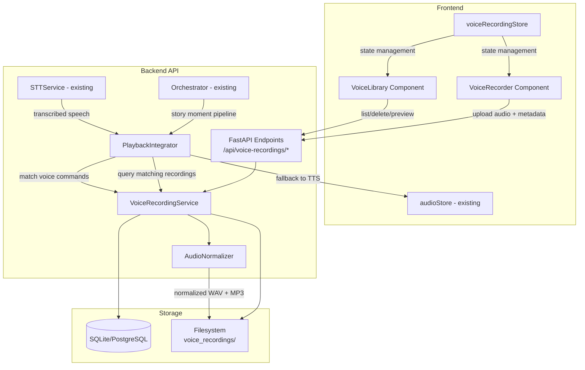
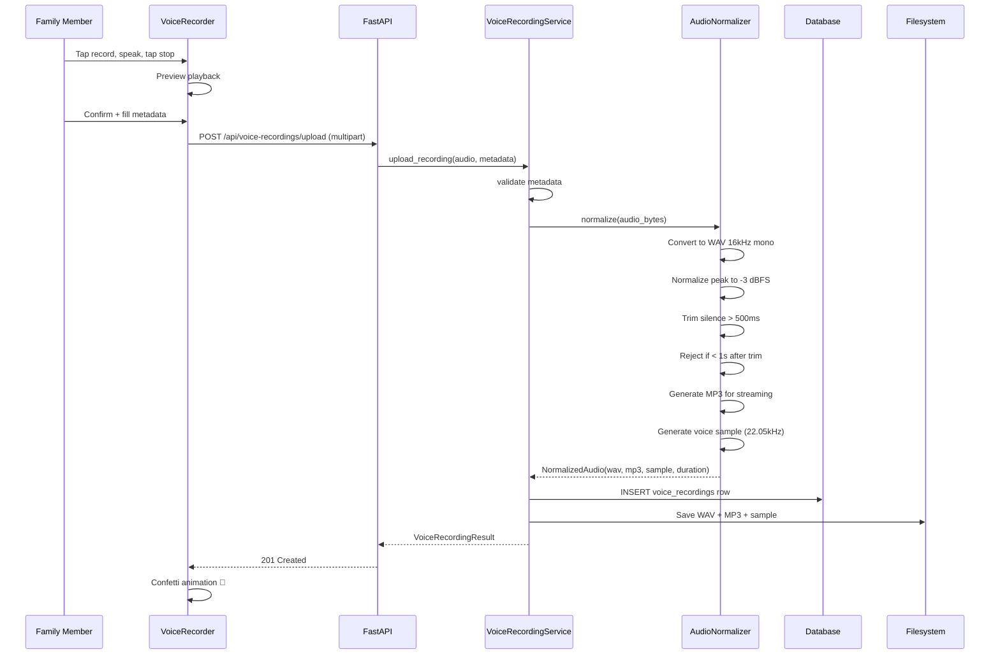
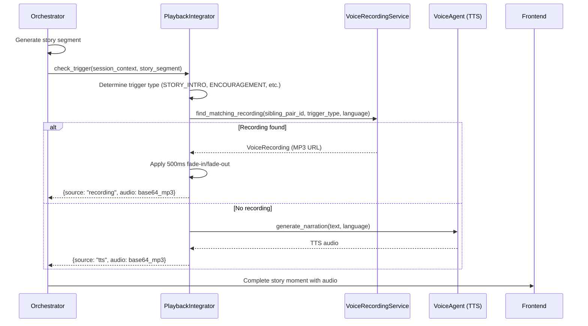

# Design Document: Voice Recording System

## Overview

The Voice Recording System adds real family voices to TwinSpark Chronicles story sessions. Instead of relying solely on Google Cloud TTS synthesis, stories can feature abuela's actual voice welcoming Ale and Sofi to an adventure, or papá cheering them on during a brave choice.

The system spans the full stack:
- **Frontend**: A `VoiceRecorder` React component captures audio via the Web Audio API, with child-friendly animated UI. A `VoiceLibrary` component lets parents browse, preview, and manage recordings.
- **Backend**: A `VoiceRecordingService` handles upload, validation, audio normalization (via pydub/ffmpeg), metadata persistence, and storage. A `PlaybackIntegrator` module inside the Orchestrator selects and delivers recordings at story trigger points.
- **Storage**: Audio files live on the local filesystem (dev) or cloud storage (prod). Metadata persists in SQLite/PostgreSQL via the existing `DatabaseConnection` abstraction.
- **Integration**: The Orchestrator's `generate_rich_story_moment` pipeline gains a new step between story generation and TTS that checks for matching voice recordings and substitutes them for synthesized audio when available.

### Key Design Decisions

1. **pydub + ffmpeg for audio processing** — pydub wraps ffmpeg with a clean Python API for normalization, silence trimming, and format conversion. ffmpeg is the industry standard and already handles WAV/MP3 conversion efficiently. No need to pull in heavyweight ML libraries for basic audio processing.

2. **Filesystem storage with DB metadata** — Follows the same pattern as `PhotoService`: audio files on disk, metadata rows in the DB. This keeps the DB lean and makes it easy to swap local filesystem for cloud storage in production.

3. **Playback integration as an Orchestrator step** — Rather than a separate service, the `PlaybackIntegrator` is a module called within `generate_rich_story_moment`. This keeps the pipeline linear and avoids adding another async coordination layer.

4. **Web Audio API + MediaRecorder for capture** — Browser-native APIs avoid external dependencies. MediaRecorder captures audio as webm/opus, which the backend converts to the canonical WAV format during normalization.

5. **Voice command matching via STT + string similarity** — Reuses the existing `STTService` for transcription, then applies simple Levenshtein/sequence-matcher similarity against registered command phrases. No additional ML model needed.

## Architecture



### Request Flow: Recording Upload



### Request Flow: Story Playback Integration



## Components and Interfaces

### Backend Components

#### 1. `VoiceRecordingService` (`backend/app/services/voice_recording_service.py`)

Core service following the same pattern as `PhotoService` and `SessionService`.

```python
class VoiceRecordingService:
    def __init__(self, db: DatabaseConnection, audio_normalizer: AudioNormalizer,
                 storage_root: str = "voice_recordings") -> None: ...

    async def upload_recording(self, sibling_pair_id: str, audio_bytes: bytes,
                                metadata: RecordingMetadata) -> VoiceRecordingResult: ...

    async def get_recordings(self, sibling_pair_id: str,
                              message_type: str | None = None,
                              recorder_name: str | None = None) -> list[VoiceRecordingRecord]: ...

    async def get_recording(self, recording_id: str) -> VoiceRecordingRecord | None: ...

    async def delete_recording(self, recording_id: str) -> DeleteRecordingResult: ...

    async def delete_all_recordings(self, sibling_pair_id: str) -> int: ...

    async def get_recording_count(self, sibling_pair_id: str) -> int: ...

    async def find_matching_recording(self, sibling_pair_id: str,
                                       message_type: str,
                                       language: str) -> VoiceRecordingRecord | None: ...

    async def get_voice_commands(self, sibling_pair_id: str) -> list[VoiceCommandRecord]: ...

    async def get_cloning_status(self, sibling_pair_id: str) -> dict[str, CloneStatus]: ...

    async def log_event(self, sibling_pair_id: str, event_type: str,
                         recording_id: str | None = None) -> None: ...
```

#### 2. `AudioNormalizer` (`backend/app/services/audio_normalizer.py`)

Stateless audio processing using pydub (wraps ffmpeg).

```python
class AudioNormalizer:
    CANONICAL_SAMPLE_RATE = 16000      # 16 kHz
    CANONICAL_CHANNELS = 1              # mono
    CANONICAL_SAMPLE_WIDTH = 2          # 16-bit
    PEAK_TARGET_DBFS = -3.0
    SILENCE_THRESHOLD_MS = 500
    MIN_DURATION_S = 1.0
    MAX_DURATION_S = 60.0
    VOICE_SAMPLE_RATE = 22050           # for cloning prep

    def normalize(self, audio_bytes: bytes) -> NormalizedAudio: ...
    def _trim_silence(self, audio: AudioSegment) -> AudioSegment: ...
    def _generate_voice_sample(self, audio: AudioSegment) -> bytes: ...
    def _apply_fade(self, audio_bytes: bytes, fade_ms: int = 500) -> bytes: ...
```

#### 3. `PlaybackIntegrator` (`backend/app/services/playback_integrator.py`)

Called by the Orchestrator during story moment generation.

```python
class PlaybackIntegrator:
    def __init__(self, voice_recording_service: VoiceRecordingService,
                 voice_agent: VoicePersonalityAgent,
                 audio_normalizer: AudioNormalizer) -> None: ...

    async def get_story_intro_audio(self, sibling_pair_id: str,
                                     language: str) -> PlaybackResult | None: ...

    async def get_encouragement_audio(self, sibling_pair_id: str,
                                       language: str) -> PlaybackResult | None: ...

    async def get_character_audio(self, sibling_pair_id: str,
                                   recorder_name: str,
                                   language: str) -> PlaybackResult | None: ...

    async def get_sound_effect(self, sibling_pair_id: str,
                                language: str) -> PlaybackResult | None: ...

    async def match_voice_command(self, sibling_pair_id: str,
                                   transcribed_text: str) -> VoiceCommandMatch | None: ...

    def _select_by_language(self, recordings: list[VoiceRecordingRecord],
                             preferred_lang: str) -> VoiceRecordingRecord | None: ...
```

#### 4. FastAPI Endpoints (`backend/app/main.py` additions)

```
POST   /api/voice-recordings/upload          — Upload recording (multipart: audio file + JSON metadata)
GET    /api/voice-recordings/{sibling_pair_id} — List recordings (query params: message_type, recorder_name)
GET    /api/voice-recordings/detail/{recording_id} — Get single recording with audio URL
DELETE /api/voice-recordings/{recording_id}   — Delete single recording
DELETE /api/voice-recordings/all/{sibling_pair_id} — Delete all recordings for a sibling pair
GET    /api/voice-recordings/stats/{sibling_pair_id} — Recording count and capacity
GET    /api/voice-recordings/commands/{sibling_pair_id} — List voice commands
```

### Frontend Components

#### 5. `VoiceRecorder` (`frontend/src/features/audio/components/VoiceRecorder.jsx`)

Recording capture component with child-friendly animated UI.

- Uses `navigator.mediaDevices.getUserMedia()` for mic access
- `MediaRecorder` API captures audio chunks
- Real-time waveform via `AnalyserNode` from Web Audio API
- 60-second max duration with auto-stop
- Large 48x48px touch targets, pulsing mic icon, bouncing waveform
- Animated avatar reacts to audio input level
- Confetti burst on successful save
- Max 3 actions visible at once: record / play / done

#### 6. `VoiceLibrary` (`frontend/src/features/audio/components/VoiceLibrary.jsx`)

Parent management view for browsing and managing recordings.

- Grouped by Family_Recorder, sorted by date within groups
- Inline MP3 preview playback
- Filter by Message_Type and Family_Recorder
- Shows count and remaining capacity (X/50)
- Language badges (🇺🇸 / 🇪🇸)
- Delete with confirmation; warns if trigger points affected
- Parent PIN required for management actions (uses existing parent auth)

#### 7. `voiceRecordingStore` (`frontend/src/stores/voiceRecordingStore.js`)

Zustand store managing voice recording state.

```javascript
{
  recordings: [],
  isRecording: false,
  isUploading: false,
  recordingCount: 0,
  maxRecordings: 50,
  filters: { messageType: null, recorderName: null },
  // Actions
  fetchRecordings, uploadRecording, deleteRecording,
  deleteAllRecordings, setFilter, startRecording, stopRecording
}
```

### Database Migration

#### 8. `005_voice_recordings.sql` (`backend/app/db/migrations/005_voice_recordings.sql`)

New migration following the existing numbered convention.

## Data Models

### Pydantic Models (`backend/app/models/voice_recording.py`)

```python
class MessageType(str, Enum):
    STORY_INTRO = "story_intro"
    ENCOURAGEMENT = "encouragement"
    SOUND_EFFECT = "sound_effect"
    VOICE_COMMAND = "voice_command"
    CUSTOM = "custom"

class RecordingMetadata(BaseModel):
    recorder_name: str                    # e.g. "Abuela María"
    relationship: str                     # grandparent | parent | sibling | other
    message_type: MessageType
    language: str = "en"                  # en | es
    sibling_pair_id: str
    command_phrase: str | None = None     # Only for VOICE_COMMAND type
    command_action: str | None = None     # Only for VOICE_COMMAND type

class VoiceRecordingRecord(BaseModel):
    recording_id: str
    sibling_pair_id: str
    recorder_name: str
    relationship: str
    message_type: MessageType
    language: str
    duration_seconds: float
    wav_path: str
    mp3_path: str
    sample_path: str | None = None
    command_phrase: str | None = None
    command_action: str | None = None
    created_at: datetime

class NormalizedAudio(BaseModel):
    wav_bytes: bytes
    mp3_bytes: bytes
    sample_bytes: bytes | None = None
    duration_seconds: float

class VoiceRecordingResult(BaseModel):
    recording_id: str
    duration_seconds: float
    message_type: MessageType
    message: str

class DeleteRecordingResult(BaseModel):
    deleted_recording_id: str
    had_trigger_assignments: bool
    affected_triggers: list[str]

class VoiceCommandRecord(BaseModel):
    recording_id: str
    command_phrase: str
    command_action: str
    recorder_name: str
    language: str

class VoiceCommandMatch(BaseModel):
    matched: bool
    command_action: str | None = None
    similarity_score: float = 0.0
    confirmation_audio_url: str | None = None

class PlaybackResult(BaseModel):
    source: str                           # "recording" | "tts"
    audio_base64: str
    recorder_name: str | None = None
    recording_id: str | None = None

class CloneStatus(BaseModel):
    recorder_name: str
    sample_count: int
    cloning_ready: bool                   # True when sample_count >= 5

class RecordingStats(BaseModel):
    recording_count: int
    max_recordings: int
    remaining: int
```

### Database Schema

```sql
CREATE TABLE IF NOT EXISTS voice_recordings (
    recording_id TEXT PRIMARY KEY,
    sibling_pair_id TEXT NOT NULL,
    recorder_name TEXT NOT NULL,
    relationship TEXT NOT NULL,
    message_type TEXT NOT NULL,
    language TEXT NOT NULL DEFAULT 'en',
    duration_seconds REAL NOT NULL,
    wav_path TEXT NOT NULL,
    mp3_path TEXT NOT NULL,
    sample_path TEXT,
    command_phrase TEXT,
    command_action TEXT,
    created_at TEXT NOT NULL
);

CREATE INDEX IF NOT EXISTS idx_vr_sibling_pair ON voice_recordings(sibling_pair_id);
CREATE INDEX IF NOT EXISTS idx_vr_message_type ON voice_recordings(sibling_pair_id, message_type);
CREATE INDEX IF NOT EXISTS idx_vr_recorder ON voice_recordings(sibling_pair_id, recorder_name);

CREATE TABLE IF NOT EXISTS voice_recording_events (
    event_id TEXT PRIMARY KEY,
    sibling_pair_id TEXT NOT NULL,
    recording_id TEXT,
    event_type TEXT NOT NULL,
    created_at TEXT NOT NULL
);

CREATE INDEX IF NOT EXISTS idx_vre_sibling_pair ON voice_recording_events(sibling_pair_id);
```

### Filesystem Layout

```
voice_recordings/
  {sibling_pair_id}/
    {recording_id}.wav          # Canonical 16kHz 16-bit mono
    {recording_id}.mp3          # Streaming playback
    samples/
      {recording_id}_sample.wav # 22.05kHz voice cloning prep
```


## Correctness Properties

*A property is a characteristic or behavior that should hold true across all valid executions of a system — essentially, a formal statement about what the system should do. Properties serve as the bridge between human-readable specifications and machine-verifiable correctness guarantees.*

### Property 1: Normalization output invariant

*For any* valid input audio (regardless of original format, sample rate, or channel count), the `AudioNormalizer.normalize()` output SHALL produce: (a) a WAV file at exactly 16 kHz, 16-bit, mono; (b) a peak amplitude within ±0.5 dB of -3 dBFS; (c) a valid decodable MP3 file; and (d) a voice sample WAV at exactly 22.05 kHz, 16-bit, mono.

**Validates: Requirements 1.6, 3.1, 3.2, 3.5, 8.1, 8.2**

### Property 2: Silence trimming

*For any* input audio with leading silence of L milliseconds and trailing silence of T milliseconds, after normalization the output audio SHALL have at most 500 ms of leading silence and at most 500 ms of trailing silence, while preserving all non-silent content.

**Validates: Requirements 3.3**

### Property 3: Recording store/load round-trip

*For any* valid voice recording (audio bytes + metadata), storing it via `upload_recording` and then loading it via `get_recording` with the returned recording_id SHALL produce a record with equivalent recorder_name, relationship, message_type, language, duration_seconds, command_phrase, and command_action. Both the WAV and MP3 files SHALL exist at the stored paths.

**Validates: Requirements 2.4, 4.3, 4.4, 4.7, 7.2**

### Property 4: Metadata validation rejects invalid inputs

*For any* `RecordingMetadata` where recorder_name is empty or consists entirely of whitespace, OR where message_type is not one of the five defined categories, `upload_recording` SHALL reject the submission and return a descriptive validation error. The recording count SHALL remain unchanged.

**Validates: Requirements 2.2, 2.3**

### Property 5: Sibling pair isolation

*For any* two distinct sibling_pair_ids A and B, recordings stored for A SHALL never appear in the results of `get_recordings(B)`, and vice versa. The recording counts for A and B SHALL be independent.

**Validates: Requirements 4.2**

### Property 6: Recording capacity limit

*For any* sibling pair with exactly 50 stored recordings, attempting to upload a 51st recording SHALL be rejected. The stats SHALL report recording_count=50 and remaining=0. For any sibling pair with N recordings (0 ≤ N ≤ 50), remaining SHALL equal 50 − N.

**Validates: Requirements 4.5, 4.6, 5.5**

### Property 7: Voice command capacity limit

*For any* sibling pair with exactly 10 stored VOICE_COMMAND recordings, attempting to upload an 11th VOICE_COMMAND recording SHALL be rejected, while uploading other message types SHALL still succeed (subject to the overall 50-recording limit).

**Validates: Requirements 7.6**

### Property 8: Single recording deletion cascade

*For any* stored recording, after calling `delete_recording(recording_id)`, `get_recording(recording_id)` SHALL return None, the WAV and MP3 files SHALL no longer exist on disk, and the recording count for that sibling pair SHALL decrease by exactly 1.

**Validates: Requirements 5.3**

### Property 9: Bulk deletion

*For any* sibling pair with N recordings (N ≥ 1), after calling `delete_all_recordings(sibling_pair_id)`, `get_recordings(sibling_pair_id)` SHALL return an empty list, and the recording count SHALL be 0.

**Validates: Requirements 10.2**

### Property 10: Trigger-based recording selection

*For any* sibling pair and message type (STORY_INTRO, ENCOURAGEMENT, SOUND_EFFECT, or CUSTOM), if at least one recording of that message type exists for the sibling pair, `find_matching_recording(sibling_pair_id, message_type, language)` SHALL return a recording whose message_type matches the requested type.

**Validates: Requirements 6.1, 6.2, 6.3, 6.4**

### Property 11: Language preference with fallback chain

*For any* sibling pair, trigger type, and session language L: (a) if a recording exists in language L, the integrator SHALL return it; (b) if no recording exists in L but one exists in the other language, the integrator SHALL return the other-language recording; (c) if no recording exists in either language, the integrator SHALL return a result with source="tts".

**Validates: Requirements 6.5, 11.1, 11.2, 11.3**

### Property 12: Voice command matching threshold

*For any* transcribed text and set of registered voice commands, `match_voice_command` SHALL return a match (with the correct command_action) if and only if the similarity score between the transcribed text and a registered command phrase exceeds 0.7. For similarity ≤ 0.7, the result SHALL have matched=False.

**Validates: Requirements 7.3, 7.4**

### Property 13: Listing grouping and sorting

*For any* list of recordings returned by `get_recordings(sibling_pair_id)`, the recordings SHALL be grouped by recorder_name, and within each group, recordings SHALL be sorted by created_at in ascending order.

**Validates: Requirements 5.1**

### Property 14: Listing filtering

*For any* filter criteria (message_type and/or recorder_name), all recordings returned by `get_recordings` with those filters SHALL match the specified criteria. No recording matching the criteria SHALL be omitted from the results.

**Validates: Requirements 5.6**

### Property 15: Cloning-ready flag

*For any* family recorder, `get_cloning_status` SHALL report cloning_ready=True if and only if that recorder has 5 or more voice samples stored. The sample_count SHALL equal the actual number of voice sample files for that recorder.

**Validates: Requirements 8.3**

### Property 16: Original recording preserved after sample generation

*For any* recording that has a voice sample generated, the original canonical WAV file SHALL remain byte-identical before and after sample generation. The voice sample SHALL be a separate file.

**Validates: Requirements 8.5**

### Property 17: Audit event logging

*For any* recording creation or deletion operation, the voice_recording_events table SHALL contain a corresponding event row with the correct event_type ("created" or "deleted"), a valid timestamp, and the correct sibling_pair_id.

**Validates: Requirements 10.4**

### Property 18: Bilingual recording coexistence

*For any* family recorder and message type, it SHALL be possible to store one recording in "en" and one in "es" as separate Voice_Recordings. Both SHALL appear in `get_recordings` and each SHALL have the correct language code.

**Validates: Requirements 11.5**

### Property 19: Fade-in/fade-out preserves duration

*For any* audio passed through `_apply_fade(audio_bytes, fade_ms=500)`, the output duration SHALL equal the input duration (within ±10ms tolerance).

**Validates: Requirements 6.6**

## Error Handling

### Backend Errors

| Error Condition | HTTP Status | Response | Recovery |
|---|---|---|---|
| Microphone audio too short (< 1s after trim) | 422 | `{"detail": "Recording too short — must be at least 1 second after silence trimming"}` | User re-records with more content |
| Audio too long (> 60s) | 422 | `{"detail": "Recording exceeds 60-second maximum"}` | Frontend enforces limit; backend is a safety net |
| Invalid/corrupt audio data | 422 | `{"detail": "Could not process audio — unsupported or corrupt format"}` | User re-records |
| Empty recorder name | 422 | `{"detail": "Recorder name is required"}` | User fills in the field |
| Invalid message type | 422 | `{"detail": "Invalid message type. Must be one of: story_intro, encouragement, sound_effect, voice_command, custom"}` | User selects valid type |
| Recording limit reached (50) | 409 | `{"detail": "Maximum of 50 recordings reached. Delete older recordings to make room."}` | User deletes from Voice Library |
| Voice command limit reached (10) | 409 | `{"detail": "Maximum of 10 voice commands reached."}` | User deletes existing commands |
| Recording not found | 404 | `{"detail": "Recording not found"}` | UI refreshes list |
| ffmpeg/pydub not available | 500 | `{"detail": "Audio processing unavailable"}` | Admin installs ffmpeg |
| Filesystem write failure | 500 | `{"detail": "Failed to save recording"}` | Retry; check disk space |

### Frontend Errors

| Error Condition | Behavior |
|---|---|
| Microphone permission denied | Show message with link to device settings (Req 1.5) |
| MediaRecorder not supported | Show "Browser not supported" message with suggestion to use Chrome/Safari |
| Network error during upload | Retry with exponential backoff (max 3 attempts); show "Upload failed, tap to retry" |
| Playback fails | Silently fall back to TTS; log warning |

### Graceful Degradation

- If `AudioNormalizer` fails (ffmpeg missing), the service rejects uploads but all other features (listing, deletion, playback of existing recordings) continue working.
- If no voice recordings exist for a sibling pair, the entire playback integration step is a no-op — the Orchestrator proceeds with TTS as before.
- If the voice recording DB table doesn't exist yet (migration not run), the service logs a warning and all voice recording endpoints return empty results rather than crashing.

## Testing Strategy

### Property-Based Testing

- **Library**: [Hypothesis](https://hypothesis.readthedocs.io/) (already used in the project — see `backend/.hypothesis/`)
- **Minimum iterations**: 100 per property test
- **Tag format**: `# Feature: voice-recording-system, Property {N}: {title}`
- Each correctness property (1–19) maps to exactly one Hypothesis test function
- Generators will produce random audio segments (via pydub's `AudioSegment.silent()` + tone generation), random metadata (recorder names, relationships, message types, languages), and random sibling pair IDs

### Unit Testing

Unit tests complement property tests by covering:
- Specific examples: uploading a known 5-second WAV, verifying exact output format
- Edge cases: empty audio, 0-byte file, exactly 1-second audio, exactly 60-second audio, exactly 50 recordings
- Error conditions: corrupt audio bytes, missing ffmpeg, DB connection failure
- Integration points: Orchestrator calling PlaybackIntegrator, WebSocket delivering voice recording audio
- API endpoint tests: HTTP status codes, response shapes, multipart upload handling

### Test Organization

```
backend/tests/
  test_audio_normalizer.py          # Properties 1, 2, 19 + unit tests
  test_voice_recording_service.py   # Properties 3-9, 13-18 + unit tests
  test_playback_integrator.py       # Properties 10, 11, 12 + unit tests
```

### Frontend Testing

- Component tests for VoiceRecorder (mock MediaRecorder API)
- Component tests for VoiceLibrary (mock API responses)
- Store tests for voiceRecordingStore (action/state verification)

### Test Execution

Backend tests run with:
```bash
source venv/bin/activate && python3 -m pytest tests/ -x -q --tb=short
```
from the `backend/` directory.
