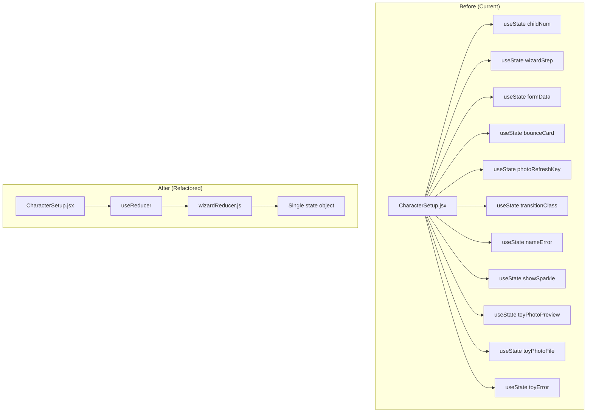
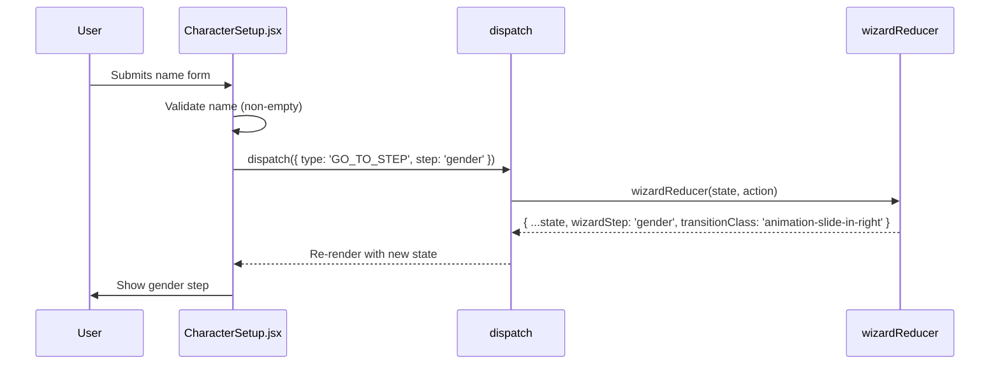
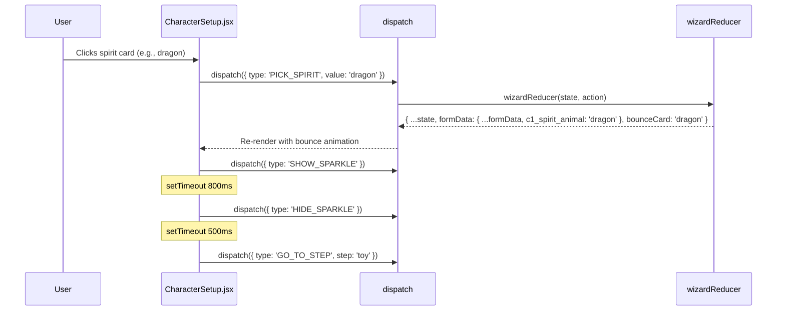
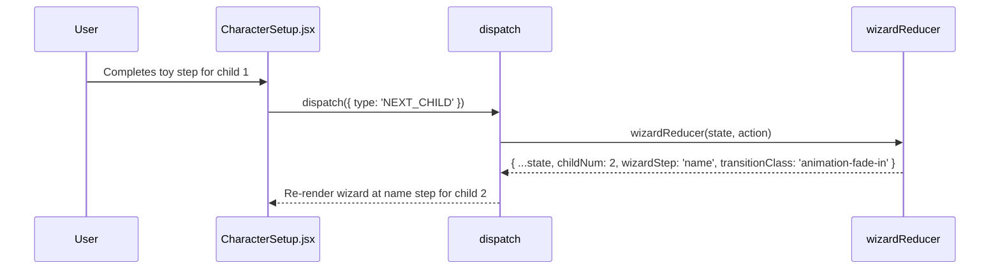

# Design Document: Wizard State Reducer

## Overview

CharacterSetup.jsx is a 5-step wizard (name → gender → spirit → toy → photos) that runs twice — once per child. It currently manages state through 12+ individual `useState` calls, making state transitions implicit and hard to test. This refactor extracts all wizard state into a single `useReducer(wizardReducer, initialState)` pattern, with the pure reducer function living in its own file (`wizardReducer.js`) for testability.

This is a pure refactor: all rendering logic, accessibility features (focus management, ARIA attributes), gamepad support, and visual behavior remain unchanged. Only the state management layer changes.

## Architecture



## Sequence Diagrams

### Step Transition Flow (e.g., Name → Gender)



### Card Selection Flow (e.g., Pick Spirit Animal)



### Child Transition Flow (Child 1 → Child 2)



## Components and Interfaces

### Component: wizardReducer (pure function)

**Purpose**: Single source of truth for all wizard state transitions. Pure function with no side effects.

**File**: `frontend/src/features/setup/reducers/wizardReducer.js`

**Responsibilities**:
- Compute next state for every wizard action
- Derive `prefix` (`c1_` or `c2_`) from `childNum`
- Compute directional transition class from step ordering
- Keep `formData` immutable via spread

### Component: CharacterSetup.jsx (modified)

**Purpose**: Renders the wizard UI. After refactor, reads state from `useReducer` and dispatches actions instead of calling individual setters.

**Responsibilities**:
- Call `useReducer(wizardReducer, initialState)` once
- Destructure `state` for rendering
- Replace all `setX(...)` calls with `dispatch({ type: ... })`
- Keep all side effects (focus management, fetch, timeouts) in the component via `useEffect` and event handlers
- Keep refs (`nameRef`, `stepHeadingRef`, `toyFileRef`) as-is — refs are not state

## Data Models

### State Shape

```javascript
/**
 * @typedef {Object} WizardState
 * @property {1|2} childNum - Which child is being configured
 * @property {'name'|'gender'|'spirit'|'toy'|'photos'} wizardStep - Current step
 * @property {Object} formData - All form fields for both children
 * @property {string|null} bounceCard - Card value currently bouncing (null = none)
 * @property {number} photoRefreshKey - Incrementing key to trigger photo reload
 * @property {string} transitionClass - CSS animation class for step transitions
 * @property {string} nameError - Error message for name validation
 * @property {boolean} showSparkle - Whether celebration overlay is visible
 * @property {string|null} toyPhotoPreview - Data URL of toy photo preview
 * @property {File|null} toyPhotoFile - Raw File object for toy photo upload
 * @property {string} toyError - Error message for toy validation
 */
```

### Initial State

```javascript
export const initialState = {
  childNum: 1,
  wizardStep: 'name',
  formData: {
    c1_name: '', c1_gender: '', c1_spirit_animal: '', c1_toy_name: '',
    c1_toy_type: '', c1_toy_image: '',
    c2_name: '', c2_gender: '', c2_spirit_animal: '', c2_toy_name: '',
    c2_toy_type: '', c2_toy_image: '',
  },
  bounceCard: null,
  photoRefreshKey: 0,
  transitionClass: 'animation-fade-in',
  nameError: '',
  showSparkle: false,
  toyPhotoPreview: null,
  toyPhotoFile: null,
  toyError: '',
};
```

**Validation Rules**:
- `childNum` must be 1 or 2
- `wizardStep` must be one of the 5 step keys
- `formData` keys follow `c{1|2}_{field}` naming convention
- `transitionClass` must be one of: `'animation-fade-in'`, `'animation-slide-in-right'`, `'animation-slide-in-left'`

## Key Functions with Formal Specifications

### Action Types

```javascript
export const ActionTypes = {
  GO_TO_STEP:       'GO_TO_STEP',       // { step: string }
  SET_FIELD:        'SET_FIELD',        // { field: string, value: any }
  SET_NAME_ERROR:   'SET_NAME_ERROR',   // { error: string }
  SET_TOY_ERROR:    'SET_TOY_ERROR',    // { error: string }
  PICK_GENDER:      'PICK_GENDER',      // { value: string }
  PICK_SPIRIT:      'PICK_SPIRIT',      // { value: string }
  PICK_PRESET_TOY:  'PICK_PRESET_TOY',  // { value: string }
  SET_TOY_PHOTO:    'SET_TOY_PHOTO',    // { preview: string, file: File }
  NEXT_CHILD:       'NEXT_CHILD',       // (no payload)
  CLEAR_BOUNCE:     'CLEAR_BOUNCE',     // (no payload)
  SHOW_SPARKLE:     'SHOW_SPARKLE',     // (no payload)
  HIDE_SPARKLE:     'HIDE_SPARKLE',     // (no payload)
  SET_PHOTO_REFRESH:'SET_PHOTO_REFRESH',// (no payload — increments key)
  SET_TRANSITION:   'SET_TRANSITION',   // { className: string }
};
```

### Function: wizardReducer(state, action)

```javascript
export function wizardReducer(state, action) { /* ... */ }
```

**Preconditions:**
- `state` conforms to `WizardState` shape
- `action` has a `type` property matching one of `ActionTypes`
- `action` payload fields match the documented shape for that type

**Postconditions:**
- Returns a new state object (never mutates input)
- Unknown action types return `state` unchanged
- `formData` is always a new object reference when any field changes
- `wizardStep` only changes via `GO_TO_STEP` or `NEXT_CHILD`
- `childNum` only changes via `NEXT_CHILD`

**Loop Invariants:** N/A (no loops in reducer)

## Algorithmic Pseudocode

### wizardReducer — Full Dispatch Logic

```javascript
const STEP_ORDER = ['name', 'gender', 'spirit', 'toy', 'photos'];

export function wizardReducer(state, action) {
  const prefix = `c${state.childNum}_`;

  switch (action.type) {
    case 'GO_TO_STEP': {
      const curIdx = STEP_ORDER.indexOf(state.wizardStep);
      const nextIdx = STEP_ORDER.indexOf(action.step);
      return {
        ...state,
        wizardStep: action.step,
        transitionClass: nextIdx >= curIdx
          ? 'animation-slide-in-right'
          : 'animation-slide-in-left',
      };
    }

    case 'SET_FIELD': {
      const newFormData = { ...state.formData, [action.field]: action.value };
      const clearNameError = action.field === `${prefix}name` ? '' : state.nameError;
      return {
        ...state,
        formData: newFormData,
        nameError: clearNameError,
        bounceCard: action.value,
      };
    }

    case 'SET_NAME_ERROR':
      return { ...state, nameError: action.error };

    case 'SET_TOY_ERROR':
      return { ...state, toyError: action.error };

    case 'PICK_GENDER':
      return {
        ...state,
        formData: { ...state.formData, [`${prefix}gender`]: action.value },
        bounceCard: action.value,
        showSparkle: true,
      };

    case 'PICK_SPIRIT':
      return {
        ...state,
        formData: { ...state.formData, [`${prefix}spirit_animal`]: action.value },
        bounceCard: action.value,
        showSparkle: true,
      };

    case 'PICK_PRESET_TOY':
      return {
        ...state,
        formData: {
          ...state.formData,
          [`${prefix}toy_type`]: 'preset',
          [`${prefix}toy_image`]: action.value,
        },
        bounceCard: action.value,
        toyPhotoPreview: null,
        toyPhotoFile: null,
        toyError: '',
      };

    case 'SET_TOY_PHOTO':
      return {
        ...state,
        formData: {
          ...state.formData,
          [`${prefix}toy_type`]: 'photo',
          [`${prefix}toy_image`]: '',
        },
        toyPhotoPreview: action.preview,
        toyPhotoFile: action.file,
        toyError: '',
        bounceCard: null,
      };

    case 'NEXT_CHILD':
      return {
        ...state,
        childNum: 2,
        wizardStep: 'name',
        transitionClass: 'animation-fade-in',
        toyPhotoPreview: null,
        toyPhotoFile: null,
        toyError: '',
      };

    case 'CLEAR_BOUNCE':
      return { ...state, bounceCard: null };

    case 'SHOW_SPARKLE':
      return { ...state, showSparkle: true };

    case 'HIDE_SPARKLE':
      return { ...state, showSparkle: false };

    case 'SET_PHOTO_REFRESH':
      return { ...state, photoRefreshKey: state.photoRefreshKey + 1 };

    case 'SET_TRANSITION':
      return { ...state, transitionClass: action.className };

    default:
      return state;
  }
}
```

**Preconditions:**
- `state` is a valid `WizardState`
- `action.type` is a string

**Postconditions:**
- Return value is a new object (referential inequality when state changes)
- `state` input is never mutated
- All `formData` updates produce a new `formData` object
- `NEXT_CHILD` always sets `childNum: 2`, `wizardStep: 'name'`, resets toy-photo state
- `GO_TO_STEP` computes transition direction from step index comparison

### Component Integration Pattern

```javascript
// In CharacterSetup.jsx — replacement pattern
import { useReducer } from 'react';
import { wizardReducer, initialState } from '../reducers/wizardReducer';

export default function CharacterSetup({ onComplete }) {
  const [state, dispatch] = useReducer(wizardReducer, initialState);
  const {
    childNum, wizardStep, formData, bounceCard,
    photoRefreshKey, transitionClass, nameError,
    showSparkle, toyPhotoPreview, toyPhotoFile, toyError,
  } = state;

  // Derived values (unchanged)
  const prefix = `c${childNum}_`;
  const childColor = childNum === 1 ? 'var(--color-child1)' : 'var(--color-child2)';
  const childEmoji = childNum === 1 ? '🌟' : '⭐';

  // Example: name submit handler
  const handleNameSubmit = (e) => {
    e.preventDefault();
    if (formData[`${prefix}name`].trim()) {
      dispatch({ type: 'SET_NAME_ERROR', error: '' });
      dispatch({ type: 'GO_TO_STEP', step: 'gender' });
    } else {
      dispatch({ type: 'SET_NAME_ERROR', error: 'Please enter a name' });
    }
  };

  // Example: gender pick handler
  const handleGenderPick = (val) => {
    dispatch({ type: 'PICK_GENDER', value: val });
    setTimeout(() => dispatch({ type: 'HIDE_SPARKLE' }), 800);
    setTimeout(() => dispatch({ type: 'GO_TO_STEP', step: 'spirit' }), 350);
  };

  // Example: spirit pick handler
  const handleSpiritPick = (val) => {
    dispatch({ type: 'PICK_SPIRIT', value: val });
    setTimeout(() => dispatch({ type: 'HIDE_SPARKLE' }), 800);
    setTimeout(() => dispatch({ type: 'GO_TO_STEP', step: 'toy' }), 500);
  };

  // Example: toy next (child transition)
  const handleToyNext = () => {
    if (childNum === 1) {
      dispatch({ type: 'NEXT_CHILD' });
    } else {
      dispatch({ type: 'GO_TO_STEP', step: 'photos' });
    }
  };

  // ... rest of rendering unchanged
}
```

## Example Usage

### Dispatching Actions

```javascript
// Set a form field
dispatch({ type: 'SET_FIELD', field: 'c1_name', value: 'Luna' });

// Navigate forward
dispatch({ type: 'GO_TO_STEP', step: 'gender' });

// Pick gender (sets field + triggers bounce + sparkle)
dispatch({ type: 'PICK_GENDER', value: 'girl' });

// Pick spirit animal
dispatch({ type: 'PICK_SPIRIT', value: 'dragon' });

// Pick preset toy
dispatch({ type: 'PICK_PRESET_TOY', value: 'teddy' });

// Set toy photo from file input
dispatch({ type: 'SET_TOY_PHOTO', preview: dataUrl, file: fileObj });

// Transition to child 2
dispatch({ type: 'NEXT_CHILD' });

// Clear bounce after animation timeout
dispatch({ type: 'CLEAR_BOUNCE' });

// Sparkle lifecycle
dispatch({ type: 'SHOW_SPARKLE' });
setTimeout(() => dispatch({ type: 'HIDE_SPARKLE' }), 800);

// Refresh photo gallery
dispatch({ type: 'SET_PHOTO_REFRESH' });
```

### Testing the Reducer (pure function)

```javascript
import { wizardReducer, initialState } from './wizardReducer';

// Test GO_TO_STEP computes correct transition direction
const s1 = wizardReducer(initialState, { type: 'GO_TO_STEP', step: 'gender' });
assert(s1.wizardStep === 'gender');
assert(s1.transitionClass === 'animation-slide-in-right');

// Test backward navigation
const s2 = wizardReducer(s1, { type: 'GO_TO_STEP', step: 'name' });
assert(s2.transitionClass === 'animation-slide-in-left');

// Test NEXT_CHILD resets wizard for child 2
const s3 = wizardReducer(initialState, { type: 'NEXT_CHILD' });
assert(s3.childNum === 2);
assert(s3.wizardStep === 'name');
assert(s3.transitionClass === 'animation-fade-in');

// Test PICK_GENDER sets field using correct prefix
const s4 = wizardReducer(initialState, { type: 'PICK_GENDER', value: 'girl' });
assert(s4.formData.c1_gender === 'girl');
assert(s4.bounceCard === 'girl');
assert(s4.showSparkle === true);

// Test unknown action returns state unchanged
const s5 = wizardReducer(initialState, { type: 'UNKNOWN' });
assert(s5 === initialState);
```

## Correctness Properties

The following properties must hold for all valid states and actions:

1. **Purity**: `wizardReducer(state, action)` produces the same output for the same inputs — no side effects, no randomness, no async.

2. **Immutability**: For any action, `wizardReducer(state, action)` never mutates `state`. The returned object is a new reference when state changes.

3. **Step validity**: `wizardStep` is always one of `['name', 'gender', 'spirit', 'toy', 'photos']` after any action.

4. **Child number bounds**: `childNum` is always 1 or 2 after any action.

5. **Transition direction correctness**: `GO_TO_STEP` produces `'animation-slide-in-right'` when moving forward in step order, `'animation-slide-in-left'` when moving backward.

6. **Prefix consistency**: All `PICK_GENDER`, `PICK_SPIRIT`, `PICK_PRESET_TOY`, `SET_TOY_PHOTO` actions write to `formData` keys prefixed with `c{childNum}_`.

7. **NEXT_CHILD reset**: `NEXT_CHILD` always sets `childNum: 2`, `wizardStep: 'name'`, `transitionClass: 'animation-fade-in'`, and clears toy photo state.

8. **Unknown action passthrough**: Unknown action types return the exact same state reference (referential equality).

9. **FormData isolation**: Changing a `c1_` field never affects any `c2_` field, and vice versa.

10. **Bounce lifecycle**: `bounceCard` is set by selection actions and cleared only by `CLEAR_BOUNCE`.

## Error Handling

### Error Scenario 1: Unknown Action Type

**Condition**: `action.type` does not match any case in the switch
**Response**: Return `state` unchanged (default case)
**Recovery**: No recovery needed — this is a no-op by design

### Error Scenario 2: Name Validation Failure

**Condition**: User submits empty name
**Response**: Component dispatches `SET_NAME_ERROR` with message; reducer sets `nameError`
**Recovery**: User types a name → `SET_FIELD` for name field clears `nameError`

### Error Scenario 3: Toy Validation Failure

**Condition**: User clicks next without naming toy, or photo upload exceeds 10MB
**Response**: Component dispatches `SET_TOY_ERROR` with message
**Recovery**: User corrects input → error cleared on next valid action

## Testing Strategy

### Unit Testing Approach

Test the reducer as a pure function with direct state-in/state-out assertions:
- Each action type gets at least one test
- Test state transitions for both `childNum: 1` and `childNum: 2`
- Test that unknown actions return state by reference
- Test that `formData` is a new object after field changes

### Property-Based Testing Approach

**Property Test Library**: fast-check

Properties to verify:
- For any sequence of valid actions, `wizardStep` remains in the valid set
- For any sequence of valid actions, `childNum` remains 1 or 2
- `wizardReducer` never mutates its input state (deep freeze + dispatch)
- `GO_TO_STEP` transition direction is consistent with step ordering
- `NEXT_CHILD` is idempotent on `childNum` (always produces 2)

### Integration Testing Approach

- Render `CharacterSetup` with React Testing Library
- Walk through the full wizard flow for both children
- Verify that all steps render correctly and transitions work
- Verify accessibility attributes remain intact after refactor

## Dependencies

- React `useReducer` (built-in, no new dependencies)
- fast-check (dev dependency, for property-based tests — optional)
- No changes to existing dependencies
- No new runtime dependencies
